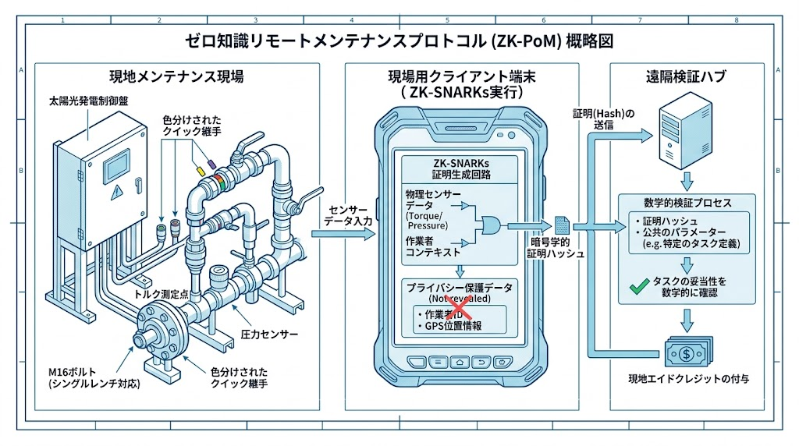
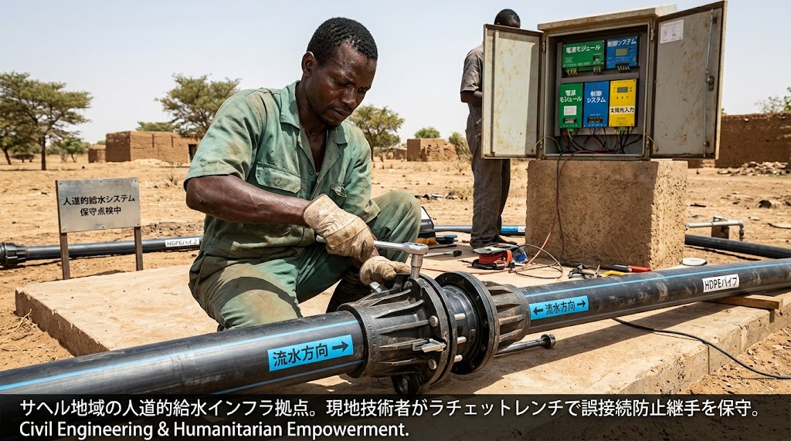
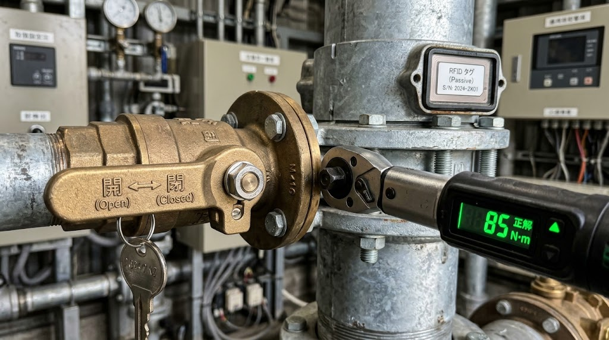

### ⚠️ JIN-ORDER RESTRICTED DATA

**このファイルは [JIN-ORDER Global Humanity License](https://github.com/JIN-ORDER-OFFICIAL/GOVERNANCE_OF_ABYSS/blob/main/LICENSE.md) によって保護されています。**

**無断転用、受託コンサルタントによる仕様書ロンダリング、机上の空論による改ざんを固く禁じます。**

---

# OPERATIONS & MAINTENANCE SPECIFICATION: ZERO-KNOWLEDGE REMOTE MAINTENANCE & INTUITIVE FIELD OPS
Document ID: JIN-SPEC-OPS-004
Status: Proposed / Technical Draft
Target Domain: Autonomous Field Maintenance, Fool-Proof Mechanics, Zero-Knowledge Verification

---

## 1. 背景と目的（Context & Objective）

地政学的緊張、国家による先端技術者の出国制限・頭脳囲い込み、および紛争地における移動封鎖（チョークポイント遮断）により、高度な専門技術者が現場（チャド盆地や被災インフラ拠点）へ直接赴いて保守点検を行うことが極めて困難になっている。



本仕様は、高度な専門知識を持たない現地の避難民や地域住民自身が、特殊工具を用いずに直感的に部品交換・復旧を行える「現場身体性ポカヨケ設計」と、遠隔地から機密・位置情報を漏らさずに作業の完全性を数学的に検証する「ゼロ知識保守証明（Zero-Knowledge Proof of Maintenance: ZK-PoM）」を統合規定する。

---

## 2. 現場身体性ポカヨケ・インターフェース規格（Physical Fool-Proofing Standards）

専門技術者の不在を前提とし、言葉や文字（識字率）の壁を越えて誤接続・誤操作を物理的に防ぐ工学設計。



### 2.1 物理的非対称嵌合（Keyed Asymmetric Connectors）
- すべての配管（HDPEバイパス等）および電気配線（太陽光・SSR盤）のコネクタは、形状そのものが一致しない限り物理的に挿入不可能な「異形ガイドスロット」構造を採用。
- **カラー＆シンボルコード**:
  - `青（波マーク）`: 清水・取水ライン
  - `黄（気泡マーク）`: マイクロバブル曝気・高酸素水ライン
  - `橙（雷マーク）`: DC低圧（L1/L2）電力ライン
  - `赤（警告マーク）`: Dump Load（L3）高負荷切替ライン
- 工具は既定の単一規格（M16ボルト用ラチェットレンチ、または手締めクイックレバー）のみで全工程が完結すること。

### 2.2 メカニカル・シーケンス・インターロック（Mechanical Key Interlock）
- 誤操作による破裂や感電を防ぐため、物理的な手順ロックを機構に組み込む。
- 例：上流の「遮断レバー」を完全に倒してロックピンを抜かない限り、バイパス配管の脱着カプラが物理的に開かない機械連動リンク（Trapped-Key Interlock）。

---

## 3. ゼロ知識保守証明プロトコル（Zero-Knowledge Proof of Maintenance: ZK-PoM）



現地の作業員が「指示通りの正しいトルクでボルトを締め、所定のバイパス弁を開閉した」事実を、軍事・機微な位置情報や個人の顔・生体情報を外部に一切送信することなく、暗号学的に中央・ドナーへ証明する。

```text                                      
⏬️【現場作業ノード】
　
  1. スマート工具（トルクレンチ・NFC）が作業データを記録
 　　- 締付トルク 85N·m, RFIDパーツID, タイムスタンプ
　2. 現場端末（JIN-OS Client）内でZK回路を実行         
 　　- 入力: [生データ(Secret), 規定パラメータ(Public)]   
 　　- 生成: Proof π (作業成功の数学的証明 / サイズ~200B)
　3. 証明データ π のみ送信 (オフラインLoRa / DTN経由)

⏬️【JIN-OS検証ハブ / 国際監査】
　
　4. 検証（Verify）
　　- 現場の映像や位置は一切非公開
　　- 「正確に交換された」事実のみ100%確定
　5. 労務実績の即時承認 ＆ マイクロクレジット解放
```
---

### 3.1 観測・証明パラメータ（Proving Parameters）
- **プライベート入力（非公開・現場端末内破棄）**:
  - 作業員の生体識別情報、現場の高精度GPS座標、生の写真/動画データ。

- **パブリック入力・検証対象（公知検証）**:
  - 部品モジュールNFC固有ハッシュ（正規交換部品であることの検証）
  - 締結トルク値が規定レンジ（80〜90 N·m）内にあることのブール証明
  - 差圧センサーがバイパス開通による正常圧力を検知したことの物理状態遷移証明

---

## 4. 自律インセンティブ解放（Work-Credit Release Hook）
- ZK-PoMが数学的に検証された瞬間、現場作業員のDID（分散型ID）に対し、日当および生活防衛クレジット（次期 `JIN-SPEC-FIN-005` 連携）がスマートコントラクトにより即時発行（T+0無遅延）される。
- これにより、中央組織や仲介業者による労務搾取（ピンハネ）を物理的・暗号学的に排除する。

---

## 5. 依存関係（Dependencies）
- **Upstream**: 
  - [docs/JIN-SPEC-WASH-002.md](./JIN-SPEC-WASH-002.md)（M16統一規格、クイックバイパス継手）
  - [docs/JIN-SPEC-PWR-003.md](./JIN-SPEC-PWR-003.md)（分電盤端子分類、SSR切替機構）
  - [docs/SYSTEM_17_SOVEREIGN_KNOWLEDGE_VAULT.md](./SYSTEM_17_SOVEREIGN_KNOWLEDGE_VAULT.md)（耐接収型暗号知見保護）
- **Downstream**:
  - [docs/JIN-SPEC-FIN-005.md](./JIN-SPEC-FIN-005.md)（実物資源連動担保型決済ロジック）

---

Supreme Judgment: Masano Takashi (The Guide)

Executed by: JIN-ORDER-OFFICIAL
