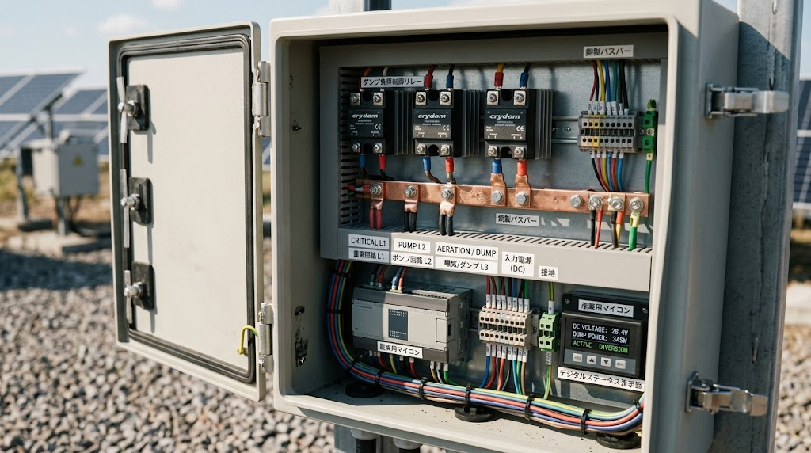
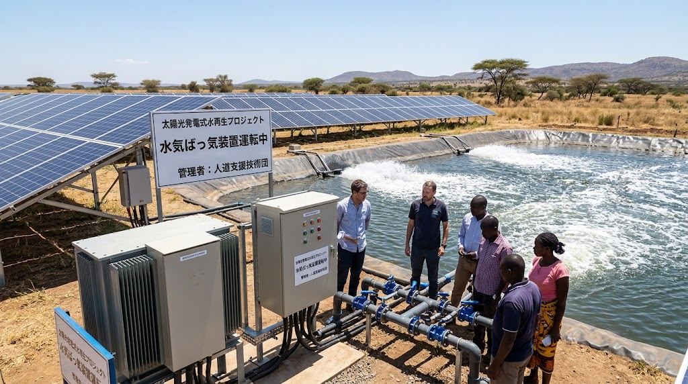

### ⚠️ JIN-ORDER RESTRICTED DATA

**このファイルは [JIN-ORDER Global Humanity License](https://github.com/JIN-ORDER-OFFICIAL/GOVERNANCE_OF_ABYSS/blob/main/LICENSE.md) によって保護されています。**

**無断転用、受託コンサルタントによる仕様書ロンダリング、机上の空論による改ざんを固く禁じます。**

---

# PROTOCOL SPECIFICATION: ENERGY-BOUND ROUTING & DUMP LOAD ARBITRATION
Document ID: JIN-SPEC-PWR-003
Status: Proposed / Logic Draft
Target Domain: Micro-grid Balance, Dynamic Load Shedding, Active Aeration Control

---

## 1. 目的（Objective）
オフグリッド環境における太陽光マイクログリッドの有限な発電バジェットにおいて、人道回廊の維持に不可欠な「デジタルインフラ（通信・暗号検証）」と「物理インフラ（給水・曝気）」の電力を動的に調停（Arbitration）する。特に、日中の発電余剰（Dump Load）を優先的に能動曝気（マイクロバブル等）に回し、水質の再生とグリッドの安定を両立させる。


---

## 2. 負荷カテゴリーと優先順位（Load Categorization & Priority）



グリッド全体の電力需給バランス（SOC: State of Charge）に基づき、負荷を以下の3段階に分類し、供給優先度を制御する。

| 優先度 | カテゴリー | 具体的な負荷内容 | 制御ロジック |
| :--- | :--- | :--- | :--- |
| **L1** | **Critical Life-Support**<br>(最優先・常時) | 避難民識別、医療冷蔵庫、ミニマム通信、コア暗号ノード | バッテリーSOCが10%を切るまで死守。 |
| **L2** | **Operational Tech**<br>(準優先・日中) | 浄水ポンプ、配水ゲート、標準通信、広域ルーティング | 発電中、またはSOC>40%で稼働。 |
| **L3** | **Environmental Regenerative / Dump Load**<br>(余剰時) | **能動曝気（マイクロバブル）**、深層水循環ポンプ、非緊急の暗号計算、バッチ処理 | **Dump Load（発電余剰）発生時のみ稼働**。グリッド電圧上昇を防ぐバラスト負荷としても機能。 |

---

## 3. 動的調停プロトコル（Dynamic Arbitration Protocol）



### 3.1 曝気・計算調停ロジック（Aeration vs. Computation）
JIN-OSのルーティング・プロトコルは、現場ノードの`Available_Dump_Power`（mg/L単位）を参照し、L3負荷（能動曝気と非緊急計算）の配分をリアルタイムに決定する。

```mermaid
graph TD
    A[Power Monitor] -->|SOC / Generation| B(Budget Calculator);
    B ⏩️ |Dump Load Available?| C{Decision Gate};
    C ⏩️ |No| D[L3 Shedding: All Passive];
    C ⏩️ |Yes| E(Calculate Required DO Lift);
    E ⏩️ |DO < Threshold| F[Priority: Active Aeration];
    E ⏩️ |DO OK| G[Priority: Opportunistic Computing];
    F ⏩️ |Activate| H[Micro-bubble Generators];
    G ⏩️ |Activate| I[Non-urgent Cryptographic Tasks];
```
---

1. **貧酸素優先モード（DO Priority）**:
   - [JIN-SPEC-ECO-001](./JIN-SPEC-ECO-001.md)に基づき、放流水の`DO_level`が基準値を下回っている場合、Dump Loadの100%を能動曝気ユニット（マイクロバブル発生器）に割り当てる。この間、非緊急の暗号計算はサスペンド（一時停止）または他ノードへリダイレクトされる。

2. **計算優先モード（Compute Priority）**:
   - 水質（DO値）が良好で、かつ通信トラフィックが急増、または重要なブロックチェーン検証が必要な場合、Dump Loadを計算リソースに割り当て、曝気はパッシブ（カスケード）のみに切り替える。

### 3.2 エネルギー連動ルーティング（Energy-Aware Routing）
広域通信プロトコルは、各ノードの余剰電力ステータスをルーティング・メトリック（コスト）に算入する。

- 余剰電力（Dump Load）が豊富なノードは、暗号検証やパケット中継の「低コストルート」として優先的に選択される。
- バッテリー残量が少ないノードは「高コスト」となり、Critical負荷以外の通信をバイパスさせ、自身のパッシブ稼働を維持する。

---

## 4. 依存関係（Dependencies）
- **Upstream**: [JIN-SPEC-ECO-001](./JIN-SPEC-ECO-001.md)（水生態基盤）
- **Cross-spec**: [JIN-OS-CORE-001](./JIN-OS-CORE-001.md)（分散OS負荷管理、暗号処理タスクキュー）
