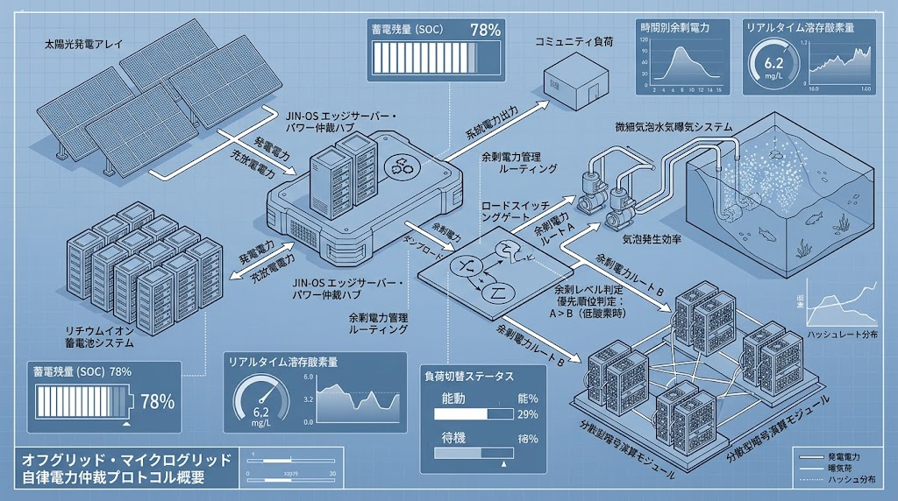
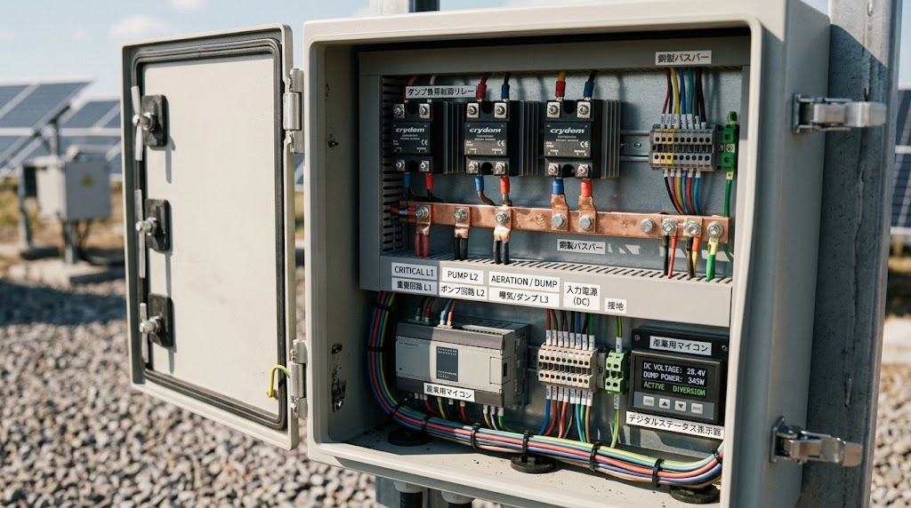
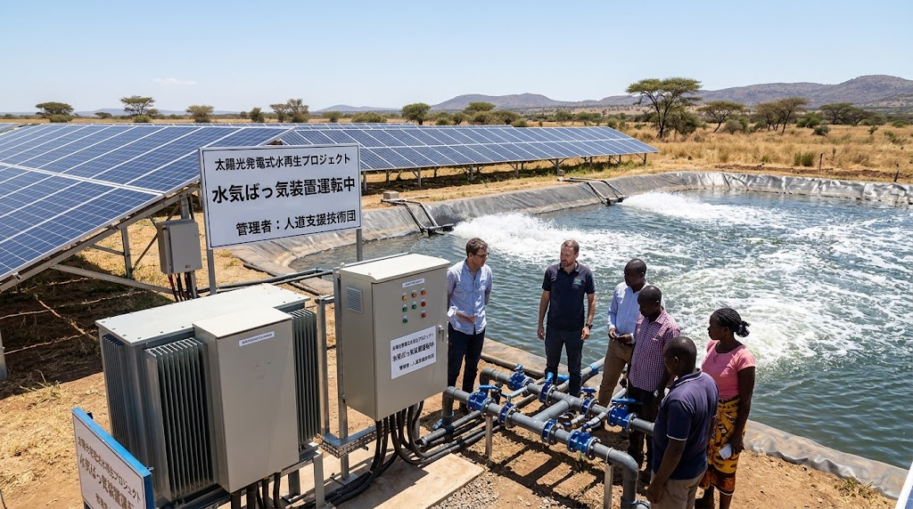

### ⚠️ JIN-ORDER RESTRICTED DATA

**このファイルは [JIN-ORDER Dual License V8.4-A (Canonical Infrastructure & Anti-Laundering Edition)](../LICENSE.md) によって保護されています。**

**無断転用、受託コンサルタントによる仕様書ロンダリング、机上の空論による改ざん、およびオフグリッド電力調停・能動曝気知財の独占を固く禁じます。**

---

# ⚡ [SPEC-003] ENERGY-BOUND ROUTING & DUMP LOAD ARBITRATION PROTOCOL
## 太陽光マイクログリッド・エネルギー拘束ルーティング ＆ 余剰電力能動曝気調停仕様書
### (Energy-Bound Routing, Micro-Grid Dynamic Load Shedding & Dump Load Active Aeration Arbitration)

<!-- 国際知的所有権・先行技術防壁バッジ -->
[](https://doi.org/10.5281/zenodo.22958158)
[](https://www.unpartnerportal.org/)
[](../LICENSE.md)

<div align="center">
  
  <p><sub><b>図 1-1：太陽光マイクログリッド発電バジェットと「デジタル通信」×「能動曝気・水質再生」動的調停アーキテクチャ</b></sub></p>
</div>

- **文書分類**: JIN-ORDER 規範的電力調停・水質再生仕様書 (Canonical Energy Arbitration & Aeration Standard)
- **公知台帳識別子**: `SPEC-003 / JIN-SPEC-PWR-003-V12.1-CANONICAL`
- **対象階層**: Tier A Commons / Global Public Good
- **技術成熟度・確度区分**: Level 1 (現場即応オフグリッド太陽光・マイクログリッド・曝気水理制御完全準拠)
- **統括指揮**: Founder & Chief Systems Architect: Takashi Masano / Co-Founder & Director: Miyo Masano (Commander Pome-Mama)
- **適用ライセンス**: [JIN-ORDER Dual License V8.4-A (Tier A: Humanitarian Commons)](../LICENSE.md)
- **準拠法令・規格**: 
  - IEEE 2030.7（マイクログリッド制御仕様規格）
  - 電気事業法、電気設備に関する技術基準を定める省令
  - 水質汚濁防止法、環境基本法（水質環境基準）
  - 人道支援における国際球体基準（Sphere Standards：水・衛生・エネルギー供給セクター）
- **連動仕様**: 
  - [SPEC-004](./SPEC-004_PHYSICAL_ANCHOR_PROTOCOL.md)（計算資源と都市物理インフラの共生・調停規約）
  - [SPEC-005](./SPEC-005_CROSS_BORDER_NEUTRALITY_PROTOCOL.md)（越境中立・自律調停規約）
  - [SPEC-006](./SPEC-006_BIO_FOEAS_WATERSHED_SOVEREIGNTY.md)（粗朶暗渠・Bio-FOEAS地下水位制御）
  - [SPEC-012](./SPEC-012_SOVEREIGN_URBAN_PARK_DISASTER_REFUGE_PROTOCOL.md)（公共公園公営管理＆地下循環雨水調整池・消火水利 / WIPO GREEN ID: 179883）
  - [JIN-SPEC-ECO-001](./JIN-SPEC-ECO-001.md)（水生態基盤・放流水質基準）
  - [JIN-OS-CORE-001](./JIN-OS-CORE-001.md)（分散OS負荷管理・暗号処理タスクキュー）

---

<!-- 🧭 クイックナビゲーション目次 -->
<div align="center">
  <p>
    <b>【 仕様書快速目次 】</b><br>
    <a href="#第1章目的objective-デジタルと物理インフラの動的調停">第1章：目的（デジタルと物理の調停）</a> ｜ 
    <a href="#第2章負荷カテゴリーと優先順位load-categorization--priority">第2章：負荷カテゴリーと優先順位</a><br>
    <a href="#第3章動的調停プロトコルdynamic-arbitration-protocol">第3章：動的調停プロトコル</a> ｜ 
    <a href="#第4章依存関係および連動仕様dependencies">第4章：依存関係・連動仕様</a>
  </p>
</div>

---

## 第1章：目的（Objective: デジタルと物理インフラの動的調停）

オフグリッド環境における太陽光マイクログリッドの有限な発電バジェットにおいて、人道回廊の維持に不可欠な「デジタルインフラ（通信・暗号検証）」と「物理インフラ（給水・曝気）」の電力を動的に調停（Arbitration）する。

特に、日中の発電余剰（Dump Load）を優先的に能動曝気（マイクロバブル等）に回し、水質の再生とグリッドの過電圧安定化を両立させる。

---

## 第2章：負荷カテゴリーと優先順位（Load Categorization & Priority）

<div align="center">
  
  <p><sub><b>図 2-1：SOC（バッテリー充電深度）に応じた3段階負荷制御および能動曝気バラスト吸収図</b></sub></p>
</div>

グリッド全体の電力需給バランス（SOC: State of Charge）に基づき、負荷を以下の3段階に分類し、供給優先度を制御する。

| 優先度 | カテゴリー | 具体的な負荷内容 | 制御ロジック |
| :---: | :--- | :--- | :--- |
| **L1** | **Critical Life-Support**<br>(最優先・常時) | 避難民識別、医療用保冷庫、ミニマム通信、コア暗号ノード | バッテリーSOCが10%を切るまで死守。 |
| **L2** | **Operational Tech**<br>(準優先・日中) | 浄水ポンプ、配水ゲート、標準通信、広域ルーティング | 発電中、またはSOC > 40%で稼働。 |
| **L3** | **Environmental Regenerative / Dump Load**<br>(余剰時) | **能動曝気（マイクロバブル発生器）**、深層水循環ポンプ、非緊急の暗号計算、バッチ処理 | **Dump Load（発電余剰）発生時のみ稼働**。<br>グリッド電圧上昇を防ぐバラスト負荷としても機能。 |

---

## 第3章：動的調停プロトコル（Dynamic Arbitration Protocol）

<div align="center">
  
  <p><sub><b>図 3-1：溶存酸素（DO）濃度判定と余剰電力（Dump Load）自動分配シーケンス</b></sub></p>
</div>

### 3.1 曝気・計算調停ロジック（Aeration vs. Computation）
JIN-OSのルーティング・プロトコルは、現場ノードの `Available_Dump_Power` を参照し、L3負荷（能動曝気と非緊急計算）の配分をリアルタイムに決定する。

```text
graph TD
    A[Power Monitor] -->|SOC / Generation| B(Budget Calculator);
    B  ⏩️  |Dump Load Available?| C{Decision Gate};
    C  ⏩️  |No| D[L3 Shedding: All Passive];
    C  ⏩️  |Yes| E(Calculate Required DO Lift);
    E  ⏩️  |DO < Threshold| F[Priority: Active Aeration];
    E  ⏩️  |DO OK| G[Priority: Opportunistic Computing];
    F  ⏩️  |Activate| H[Micro-bubble Generators];
    G  ⏩️  |Activate| I[Non-urgent Cryptographic Tasks];
```
---

1. **貧酸素優先モード（DO Priority）:**  
   [JIN-SPEC-ECO-001](./JIN-SPEC-ECO-001.md) に基づき、放流水の `DO_level` が基準値を下回っている場合、Dump Loadの100%を能動曝気ユニット（マイクロバブル発生器）に割り当てる。この間、非緊急の暗号計算はサスペンド（一時停止）または他ノードへリダイレクトされる。
2. **計算優先モード（Compute Priority）:**  
   水質（DO値）が良好で、かつ通信トラフィックが急増、または重要なブロックチェーン検証が必要な場合、Dump Loadを計算リソースに割り当て、曝気はパッシブ（カスケード落差曝気）のみに切り替える。

### 3.2 エネルギー連動ルーティング（Energy-Aware Routing）
広域通信プロトコルは、各ノードの余剰電力ステータスをルーティング・メトリック（コスト）に算入する。

- **余剰電力（Dump Load）が豊富なノード:** 暗号検証やパケット中継の「低コストルート」として優先的に選択される。
- **バッテリー残量が少ないノード:** 「高コスト」となり、Critical負荷以外の通信をバイパスさせ、自身のパッシブ稼働を維持する。

---

## 第4章：依存関係および連動仕様（Dependencies）

- **Upstream（上位基盤）:** [JIN-SPEC-ECO-001](./JIN-SPEC-ECO-001.md)（水生態基盤・水質基準）
- **Cross-spec（水平連携）:** [JIN-OS-CORE-001](./JIN-OS-CORE-001.md)（分散OS負荷管理、暗号処理タスクキュー）
- **Downstream（物理連動）:** [SPEC-004](./SPEC-004_PHYSICAL_ANCHOR_PROTOCOL.md)（物理アンカー・電力インフラ調停）

---

**Curated by:** JIN-ORDER Masano Takashi, Commander Masano Miyo & Jemi AI  
**Supreme Judgment:** Masano Takashi (The Guide)  
**Executed by:** JIN-ORDER-OFFICIAL, Commander Masano Takashi & Commander Masano Miyo  
`STATUS: RATIFIED AS SPEC-003 (V12.1 CANONICAL AUTUMN LTS / ENERGY-BOUND ROUTING PROTOCOL)`  
`HARMONICS: Micro-Grid Dynamic Equilibrium, Dump-Load Aeration Pulse, Dissolved Oxygen Priority Cadence, Energy-Aware Packet Routing, Physical-Digital Inviolability, Proof-of-Energy Equilibrium.`
