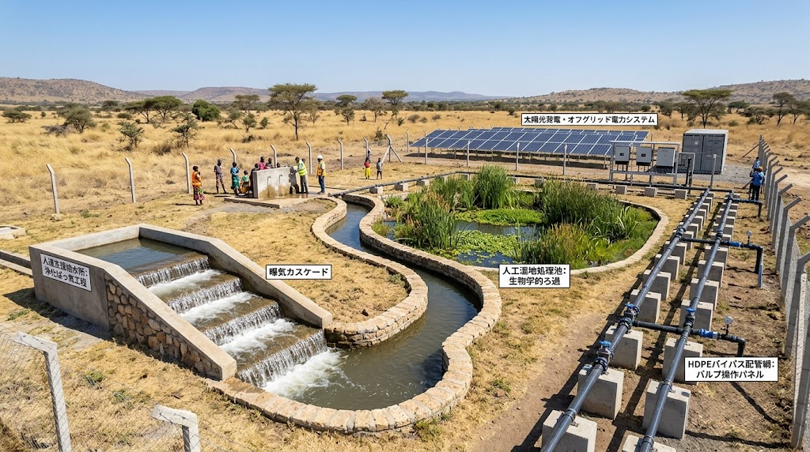
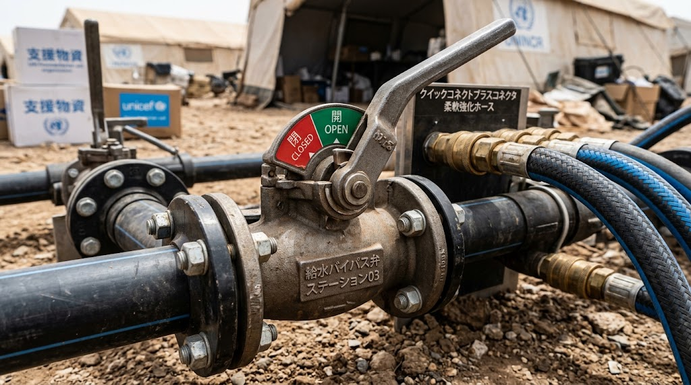

### ⚠️ JIN-ORDER RESTRICTED DATA

**このファイルは [JIN-ORDER Global Humanity License](https://github.com/JIN-ORDER-OFFICIAL/GOVERNANCE_OF_ABYSS/blob/main/LICENSE.md) によって保護されています。**

**無断転用、受託コンサルタントによる仕様書ロンダリング、机上の空論による改ざんを固く禁じます。**

---

## INFRASTRUCTURE SPECIFICATION: FAULT-TOLERANT WASH & HYDRAULIC REDUNDANCY
Document ID: JIN-SPEC-WASH-002
Status: Proposed / Architecture Draft
Target Domain: Decentralized Water Treatment, Physical Bypass, Aeration Civics

---

## 1. 目的（Objective）
物理的インフラ破壊（管路切断・爆破・地滑り）および急激な水質悪化（溶存酸素欠乏・有害物質混入）に対し、中央集権的ポンプ施設に依存せず、現場作業者・住民レベルで即座に迂回・復旧・放流再生を行える多重冗長化（Fault-Tolerant）土木仕様を定義する。


---

## 2. 土木・配管トポロジー（Piping & Bypass Topologies）



### 2.1 3重リング型バイパス（Tri-Ring Bypass Architecture）
単一流路の直列配置を廃止し、管路網を閉じた環状（リング）＋交差バイパスで構成する。

- **Primary Line（主幹線）**: 高耐圧ポリエチレン（HDPE）またはダクタイル鋳鉄による基幹送水路。

- **Secondary Trenchless Line（副幹線/推進更生路）**: 地中深度に配置された非開削・自立再生型パイプライン。主幹線破損時に自動遮断弁（メカニカル差圧弁）で即時転換。

- **Surface Overland Bypass（地上応急可撓管路）**: クイックジョイント式可撓性フレキシブルホースによる地上仮設ライン。専門重機を用いず人力敷設可能。

### 2.2 モジュラー・プレハブ接続規格（Standardized Modular Coupling）

- 管路接続部は「JIN-Standard Modular Flange（J-SMF）」規格に統一。

- ボルト締め工具を単一サイズ（M16/二面幅24mm等）に制限し、パッキンは現地調達可能な天然ゴム・EPDM共用型を採用。

- 破壊箇所の上流・下流に100m間隔でセルフシーリング式クイックカプラ（分岐取出し口）を標準配備。

---

## 3. パッシブ曝気・水質自浄土木工法（Passive Aeration & Bio-Retention）
外部動力を喪失したブラックアウト環境下でも、JIN-SPEC-ECO-001で定めた「溶存酸素（DO）純増放流」を重力のみで達成する構造基準。

```text
[放流汚水/処理水]
    🔽
 【階段状落差工】(Step Cascade)　⏪️ 重力落下による粗大気泡接触（再ばっ気）
    🔽
 【多孔質蛇行水路】(Porous Weir) ⏪️ 多孔質コンクリートブロック＋接触材による渦流形成
    🔽
 【湿地浸透池】(Bio-Retent.)　　 ⏪️ アシ・ガマ・ケナフ等による窒素・リン捕捉（生物固定）
    🔽
[自然水体への放流（DO飽和度 ≧ 80%）]
```
---

1. **階段状カスケード（Step Cascade Weir）**:
   - 勾配1:2〜1:3の傾斜面に高さ15〜20cmのステップを連続配置。自由落下と跳水現象（Hydraulic Jump）により空気中の酸素を強制巻き込み。

2. **多孔質・接触酸化蛇行路（Porous Sinuous Channel）**:
   - 空隙率20〜30%のポーラスコンクリートおよび現地砕石を配置。流速を適度に抑えつつ乱流を発生させ、酸素溶解効率を向上。

3. **植生バイオリテンション（Wetland Retention Basins）**:
   - 表層流・地下浸透を組み合わせた人工湿地ゾーン。植物根圏の好気性微生物群集により有機物を最終分解し、富栄養化成分（N, P）を完全にトラップ。

---

## 4. 自律アイランドモード（Autonomous Island Mode）



- 外部電力網および中央制御通信が途絶した場合、各浄水・配水ステーションは即座に「孤立稼働（Island Operation）」へ移行。

- 動力弁はフェイルセーフ設計（無通電時：パッシブバイパス側へ常時開放）。

- 手動オーバーライドレバーを地上高1mに配置し、目視インジケータ（赤/緑メカニカルフラグ）で開閉状態を表示。

---

## 5. 依存関係（Dependencies）
- Upstream: `JIN-SPEC-ECO-001`（溶存酸素・水生態基盤）
- Downstream: `JIN-SPEC-PWR-003`（エネルギーバジェット＆強制曝気制御）

---

Supreme Judgment: Masano Takashi (The Guide)

Executed by: JIN-ORDER-OFFICIAL
