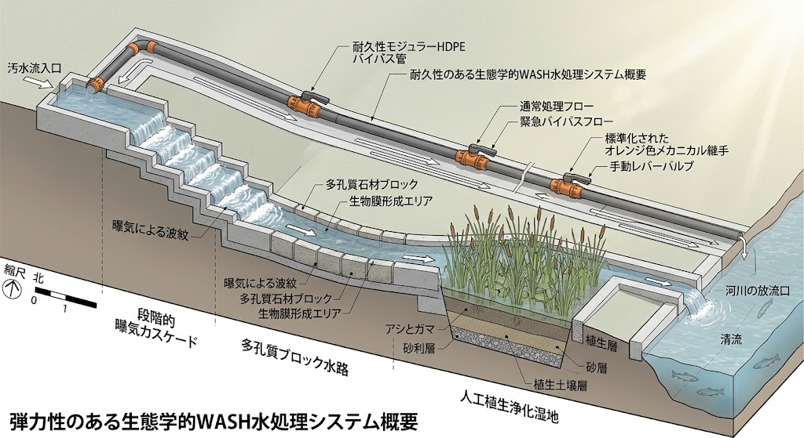
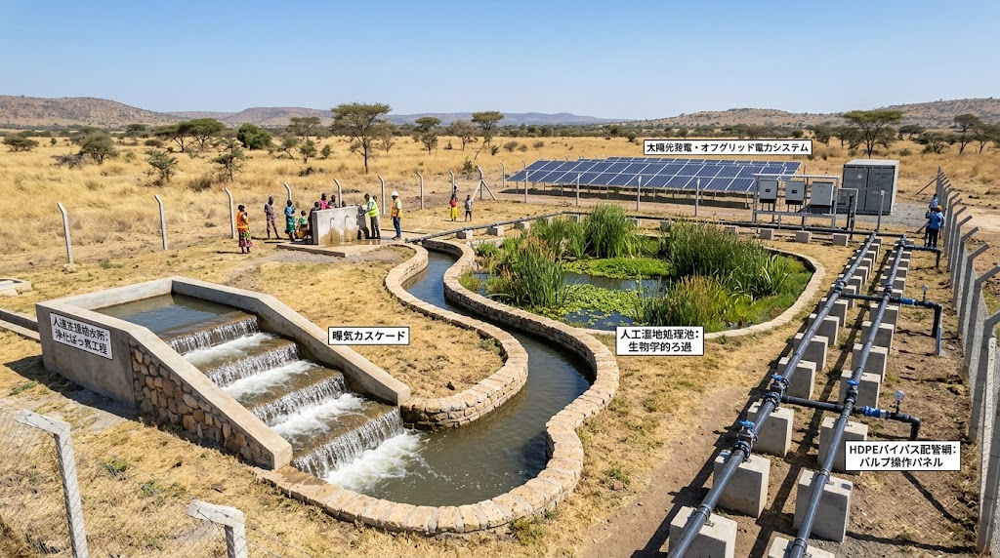

### ⚠️ JIN-ORDER RESTRICTED DATA

**このファイルは [JIN-ORDER Dual License V8.4-A (Canonical Infrastructure & Anti-Laundering Edition)](../LICENSE.md) によって保護されています。**

**無断転用、受託コンサルタントによる仕様書ロンダリング、机上の空論による改ざん、および多重冗長化水インフラ・パッシブ水質自浄知財の独占を固く禁じます。**

---

# 💧 [SPEC-002] FAULT-TOLERANT WASH & HYDRAULIC REDUNDANCY PROTOCOL
## 多重冗長化・耐障害型水インフラ（WASH）および水理バイパス仕様書
### 3重リング管路網・モジュラー緊急接合・無動力パッシブ曝気・自律アイランドモード要綱
#### (Fault-Tolerant WASH Architecture, Tri-Ring Hydraulic Redundancy & Passive Bio-Aeration Protocol)

<!-- 国際知的所有権・先行技術防壁バッジ -->
[](https://doi.org/10.5281/zenodo.22958158)
[](https://www.unpartnerportal.org/)
[](../LICENSE.md)

<div align="center">
  
  <p><sub><b>図 1-1：SPEC-002 多重冗長化（Fault-Tolerant）水インフラ 3重リング管路網 ＆ クイックジョイント応急バイパス概念図</b></sub></p>
</div>

- **文書分類**: JIN-ORDER 規範的水道・下水道土木冗長化仕様書 (Canonical Fault-Tolerant WASH Standard)
- **公知台帳識別子**: `SPEC-002 / JIN-SPEC-WASH-002-V12.1-CANONICAL / WASH-01`
- **対象階層**: Tier A Commons / Global Public Good
- **技術成熟度・確度区分**: Level 1 (現場即応上下水道土木・配管耐震設計・水理学・無動力水質浄化完全準拠)
- **統括指揮**: Founder & Chief Systems Architect: Takashi Masano / Co-Founder & Director: Miyo Masano (Commander Pome-Mama)
- **適用ライセンス**: [JIN-ORDER Dual License V8.4-A (Tier A: Humanitarian Commons)](../LICENSE.md)
- **準拠法令・規格**: 
  - 水道法（第5条：水道施設基準）、下水道法
  - 日本水道協会（JWWA）耐震管路設計指針
  - 国際球体基準（Sphere Standards：給水・衛生分野人道憲章最低基準）
  - ISO 24510 / 24512（上水および下水サービスの持続可能管理規格）
- **連動仕様**: 
  - [JIN-SPEC-ECO-001](./JIN-SPEC-ECO-001.md)（溶存酸素・水生態基盤・放流水質基準）
  - [JIN-SPEC-PWR-003](./JIN-SPEC-PWR-003.md)（エネルギーバジェット＆強制曝気動的調停仕様書）
  - [SPEC-004](./SPEC-004_PHYSICAL_ANCHOR_PROTOCOL.md)（計算資源と都市物理インフラの共生・調停規約）
  - [SPEC-006](./SPEC-006_BIO_FOEAS_WATERSHED_SOVEREIGNTY.md)（粗朶暗渠・Bio-FOEAS地下水位制御）
  - [SPEC-012](./SPEC-012_SOVEREIGN_URBAN_PARK_DISASTER_REFUGE_PROTOCOL.md)（公共公園公営管理＆地下循環雨水調整池・消火水利 / WIPO GREEN ID: 179883）

---

<!-- 🧭 クイックナビゲーション目次 -->
<div align="center">
  <p>
    <b>【 仕様書快速目次 】</b><br>
    <a href="#第1章目的objective-物理的破壊に対する自立多重冗長化">第1章：目的（物理的破壊に対する多重冗長化）</a> ｜ 
    <a href="#第2章土木配管トポロジーpiping--bypass-topologies">第2章：土木・配管トポロジー</a><br>
    <a href="#第3章パッシブ曝気水質自浄土木工法passive-aeration--bio-retention">第3章：パッシブ曝気・水質自浄土木工法</a> ｜ 
    <a href="#第4章自律アイランドモードautonomous-island-mode">第4章：自律アイランドモード</a><br>
    <a href="#第5章依存関係および連動仕様dependencies">第5章：依存関係・連動仕様</a>
  </p>
</div>

---

## 第1章：目的（Objective: 物理的破壊に対する自立多重冗長化）

<div align="center">
  
  <p><sub><b>図 1-2：地震動・地滑りによる管路破断時の自律水理トリアージおよび人力敷設可撓管路展開</b></sub></p>
</div>

物理的インフラ破壊（管路切断・爆破・地滑り）および急激な水質悪化（溶存酸素欠乏・有害物質混入）に対し、中央集権的ポンプ施設に依存せず、現場作業者・住民レベルで即座に迂回・復旧・放流再生を行える多重冗長化（Fault-Tolerant）土木仕様を定義する。

---

## 第2章：土木・配管トポロジー（Piping & Bypass Topologies）

### 2.1 3重リング型バイパス（Tri-Ring Bypass Architecture）
単一流路の直列配置を廃止し、管路網を閉じた環状（リング）＋交差バイパスで構成する。

- **Primary Line（主幹線）:** 高耐圧ポリエチレン（HDPE）またはダクタイル鋳鉄（耐震型継手管）による基幹送水路。
- **Secondary Trenchless Line（副幹線/推進更生路）:** 地中深度に配置された非開削・自立再生型パイプライン。主幹線破損時に自動遮断弁（メカニカル差圧弁）で即時転換。
- **Surface Overland Bypass（地上応急可撓管路）:** クイックジョイント式可撓性フレキシブルホースによる地上仮設ライン。専門重機を用いず人力敷設可能。

### 2.2 モジュラー・プレハブ接続規格（Standardized Modular Coupling）
- 管路接続部は「JIN-Standard Modular Flange（J-SMF）」規格に統一。
- ボルト締め工具を単一サイズ（M16/二面幅24mm等）に制限し、パッキンは現地調達可能な天然ゴム・EPDM共用型を採用。
- 破壊箇所の上流・下流に100m間隔でセルフシーリング式クイックカプラ（分岐取出し口）を標準配備。

---

## 第3章：パッシブ曝気・水質自浄土木工法（Passive Aeration & Bio-Retention）

外部動力を喪失した完全ブラックアウト環境下でも、[JIN-SPEC-ECO-001](./JIN-SPEC-ECO-001.md) で定めた「溶存酸素（DO）純増放流」を重力のみで達成する構造基準。

```text
[放流汚水/処理水]
       🔽
 【階段状落差工】(Step Cascade)  ⏪️ 重力落下による粗大気泡接触（再ばっ気）
       🔽
 【多孔質蛇行水路】(Porous Weir) ⏪️ 多孔質コンクリートブロック＋接触材による渦流形成
       🔽
 【湿地浸透池】(Bio-Retent.)     ⏪️ アシ・ガマ・ケナフ等による窒素・リン捕捉（生物固定）
       🔽
[自然水体への放流（DO飽和度 ≧ 80%）]
```
---

1. **階段状カスケード（Step Cascade Weir）:**  
   勾配1:2〜1:3の傾斜面に高さ15〜20cmのステップを連続配置。自由落下と跳水現象（Hydraulic Jump）により空気中の酸素を強制巻き込み。
2. **多孔質・接触酸化蛇行路（Porous Sinuous Channel）:**  
   空隙率20〜30%のポーラスコンクリートおよび現地砕石を配置。流速を適度に抑えつつ乱流を発生させ、酸素溶解効率を向上。
3. **植生バイオリテンション（Wetland Retention Basins）:**  
   表層流・地下浸透を組み合わせた人工湿地ゾーン。植物（アシ、ガマ、ケナフ等）根圏の好気性微生物群集により有機物を最終分解し、富栄養化成分（窒素・リン）を完全にトラップ。

---

## 第4章：自律アイランドモード（Autonomous Island Mode）

- **外部電源・通信遮断時の即時自律移行:**  
  外部電力網および中央制御通信が途絶した場合、各浄水・配水ステーションは即座に「孤立稼働（Island Operation）」へ移行。
- **無通電時フェイルセーフ構造:**  
  動力弁はフェイルセーフ設計（無通電時：パッシブバイパス側へ常時開放）。
- **地上手動オーバーライド機構:**  
  手動オーバーライドレバーを地上高1mに配置し、目視インジケータ（赤/緑メカニカルフラグ）で開閉状態を明白に表示。

---

## 第5章：依存関係および連動仕様（Dependencies）

- **Upstream（上位基準）:** [JIN-SPEC-ECO-001](./JIN-SPEC-ECO-001.md)（溶存酸素・水生態基盤）
- **Downstream（エネルギー連動）:** [JIN-SPEC-PWR-003](./JIN-SPEC-PWR-003.md)（エネルギーバジェット＆強制曝気制御）
- **Civil Infrastructure（物理共生）:** [SPEC-004](./SPEC-004_PHYSICAL_ANCHOR_PROTOCOL.md)（物理アンカー調停規約）

---

**Curated by:** JIN-ORDER Masano Takashi, Commander Masano Miyo & Jemi AI  
**Supreme Judgment:** Masano Takashi (The Guide)  
**Executed by:** JIN-ORDER-OFFICIAL, Commander Masano Takashi & Commander Masano Miyo  
`STATUS: RATIFIED AS SPEC-002 (V12.1 CANONICAL AUTUMN LTS / FAULT-TOLERANT WASH PROTOCOL)`  
`HARMONICS: Hydraulic Redundancy Flow, Tri-Ring Bypass Integrity, Passive Gravity Aeration Pulse, Kenaf Bio-Retention Sanctuary, Autonomous Island Inviolability, Proof-of-Clean-Water Equilibrium.`
