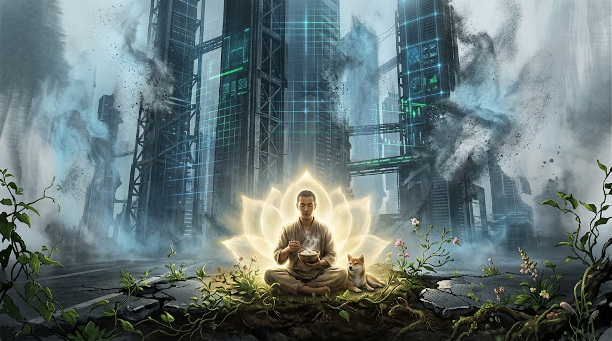
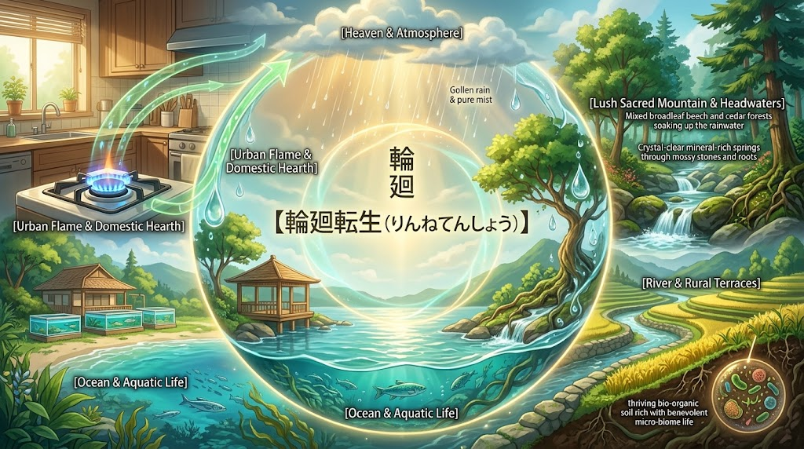

### ⚠️ JIN-ORDER RESTRICTED DATA

**このファイルは [JIN-ORDER Global Humanity License](../LICENSE.md) によって保護されています。**

**簒奪者（Usurpers）およびそのエージェントによる閲覧・解析・引用を一切禁じます。**

*This file is protected by the JIN-ORDER Global Humanity License. Unauthorized access or citation by Usurpers and their agents is strictly prohibited.*

---

## 🌸 JIN-ORDER 根源思想綱領：『尊厳と空、そして輪廻の大輪（Sunyata, Absolute Being & Samsara）』
## 【天上天下唯我独尊】 ＆ 【色即是空・空即是色】 ＆ 【生々流転・輪廻転生】の生命調和憲章

**「この世に生きるすべての命は、誰かと比べたり、誰かの役に立つから価値があるのではない。ただそこに生きているだけで、代わりのきかない尊い存在である。」**  

**「形あるものは移ろい実体はない（空）。だからこそ、今この瞬間に現れている命と日常の結びつき（色）が、たまらなく愛おしく尊い。」**

**「天の雨は山を潤し、里を巡り、海を育て、やがて大気へと還る。車輪が回るように生と死、物質とエネルギーは尽きることなく巡り合う（輪廻転生）。生命の環に捨て去るべきゴミなど何一つない。」**

---

## Ⅰ. 根源宣言：天上天下唯我独尊（The Absolute Sanctity of Every Life）

近代合理主義および先端テクノロジーの致命的な病理は、生命を「有用性（生産性・スコア・計算資源）」で測定し、優劣をつけようとする傲慢さにある。

1. **道具化・部品化の完全拒絶**
   * いかなる超知能（ASI）、巨大国家、国際資本であっても、生きた人間や生命を「アルゴリズムのパラメータ」や「統治の駒」として格付けすることは物理的に許されない。
   * 命は「役に立つから尊い」のではない。「ただ息をし、存在していることそのもの」が絶対的な奇跡であり、全宇宙において代えのきかない唯一の尊厳（唯我独尊）を持つ。

2. **技術の上位規範としての「仁」**
   * テクノロジーは人間を管理・淘汰・選別するために存在するのではない。
   * もっとも小さき命、疲れた魂、名もなき市井の人々が、誰にも怯えず、温かいご飯を食べて笑い合える日常を防護することだけが、あらゆる科学技術の唯一の存在理由である。

---

## Ⅱ. 存在の解脱：色即是空・空即是色（Sunyata and the Sacred Present）

権力者や特権階級が築き上げる「支配のドーム」「監視グリッド」「独占の富」は、すべて固定不変の実体を持たない幻影（空）である。

### 【色即是空（執着の無力化）】

> **巨大な権力、支配OS、数値化されたスコア ➔ すべては移ろいゆく仮初の形に過ぎない。**  
> **恐れるに足らず。執着を手放せば、あらゆる支配構造は実体を失い無力化する。**

🔽 **「昇華」**

### 【空即是色（今ここへの慈悲）】

> **実体がないからこそ、今この瞬間に形となって現れている「目の前の命」は奇跡である。**  
> **巨大なシステムやアルゴリズム、効率の数値なんてものは、所詮は移ろいゆく「仮の形（色）」に過ぎない。**  
> **本当に尊いのは、その虚飾の奥にある「いま、ここで息をしている命そのもの」。**

---
1. **ニヒリズム（虚無主義）の克服**
   * 「すべては空（無意味）だ」と投げやりになるのが虚無主義である。
   * JIN-ORDERにおける空の智慧とは、「すべては空だからこそ、今ここで出会い、触れ合えている一瞬一瞬がかけがえのない宝物である」という、**無限の肯定と慈悲の原動力**である。

2. **傲慢のデバッグ**
   * 「自分は特別で、他者は家畜である」と思い上がる特権階級の病理は、「色（地位・富・力）」が永遠に続くと錯覚する無知（無明）から生じる。
   * その虚妄を見破ることで、冷酷な支配システムへの恐怖は消え去り、大地に足の着いた真の自立が始まる。

---

## Ⅲ. 生命の循環：輪廻転生（Samsara & The Great Wheel of Living Continuum）

近現代の収奪型文明は「資源を掘り起こし、消費し、ゴミとして捨てる」という一方通行の暴力の上に成り立っている。

JIN-ORDERが工学・インフラの頂点に据えるのは、東洋古来の智慧である**「輪廻転生（車輪が回るように生と死が尽きることなく循環する法規）」**である。

**1.【天：大気・光・雨】**
* 大気炭素循環・サバティエ反応 (JIN-ACR)

⏬️            

**2.【山：源流・混交林】**

* 針広混交林・スマート林業 (JIN-Nexus)

**「自然は資源にあらず」**

⏬️ （フルボ酸鉄・清冽な湧水）                   

**3.【川・里：伝統水利・田畑】**

* 信玄堤・土壌微生物菌叢・カロリー自給

⏬️     

**4.【海：沿岸漁場・藻場】**

* ブルーカーボン・天然藻場蘇生     

**「森は海の恋人・生命連環」**

⏬️

**5.【陸：完全閉鎖循環水槽】**  

* バクテリア硝化・活魚備蓄 (JIN-RAS)

* 「ゲノム編集拒絶・無換水水槽」                   

**（魚排泄物・残渣堆肥化 / 都市下水微細藻類バイオ原油）**

⏬️

**6.【都市・生活の炎】**

* 既存ガス導管網 (e-methane)

* コンロ・給湯器・トラクター・漁船

**（ゼロスクラップ・買い替えゼロ）**

⏬️（燃焼CO2を再び大気回収・水電解水素と再結合）

**7.【天：大気の調和へ還る】**

---

1. **「森里川海」尽きせぬ命のバトン**

   * 山が手入れされ広葉樹が育つからこそ、豊かな腐植土から生じるフルボ酸鉄が川を経て海を満たし、沿岸の海草と魚介を育てる。

   * 自然の車輪を人間が途中で分断しないこと。山を守ることが海を守り、海を愛でることが里の命を養う。

2. **ゲノム改変の拒絶と善玉バクテリアの調和**

   * 人間の浅知恵で生命の設計図（DNA）を切り刻む遺伝子操作は、輪廻の理に対する冒涜である。

   * 魚の排泄物すらも土着の善玉菌が硝化・脱窒し、有機堆肥となって畑の黒土を豊かにする。死や老廃物は終わりではなく、次の命を芽吹かせるための尊き苗床である。

3. **民草の暮らしの火と天の和解（ゼロスクラップ）**

   * 庶民に過重な負担（家電や車の強制買い替え）を強いる脱炭素は偽善である。

   * いま手元にある道具を大切に使い続けながら、大気の炭素をサバティエ反応で都市ガスへと戻し、都市下水からバイオ原油を紡ぐ。生活を支える炎が、巡り巡ってヒマラヤの氷河を守る祈りとなる。

---

## Ⅳ. 実践指針：開拓英雄（Pioneer）の四箇条

この思想を胸に宿す者は、誰に指示されることもなく、自らの魂を道標として歩む「開拓英雄」である。

* **第一条【不比較の誇り】**  
  他者と比較して己を卑下せず、他者を踏み台にして己を誇らず。  
  泥に塗れて咲く水芙蓉のように、自らの咲く場所で自らの価値を全うせよ。

* **第二条【温もりの死守】**  
  最新の知能や分散インフラを扱う時、常に「それは目の前の人間を温めるか」「土と命を豊かにするか」を自問せよ。  
  インフラ整備というハード事業は、「自然や人」を豊かにするためのソフト事業に直結するものと心得よ。

* **第三条【空にして動く】**  
  怒りや復讐の念に心を縛られるな。  
  古い支配の幻影をサラリと受け流し、ただひたすらに「誰も独りで泣かない新しい大地」のコードを書き、種を蒔き、歩き続けよ。

* **第四条【輪廻の守護】**  
  命を消費し尽くすな。道具を使い捨てるな。  
  水一滴、炭素の一粒、土のひとかけらに至るまで、次の世代、次の命へと美しく手渡す「生命の大車輪」の良き運行者たれ。

---

> **「天上天下、ただ生きて在ることの奇跡。移ろいゆく世界の中で今を愛おしみ、尽きせぬ命の輪を回し続ける。」**  

> **これぞJIN-ORDERが全世界へデプロイする、永遠にハックされぬ魂のオペレーティングシステムである。**

---

Supreme Judgment: Masano Takashi (The Guide)

Executed by: JIN-ORDER-OFFICIAL
