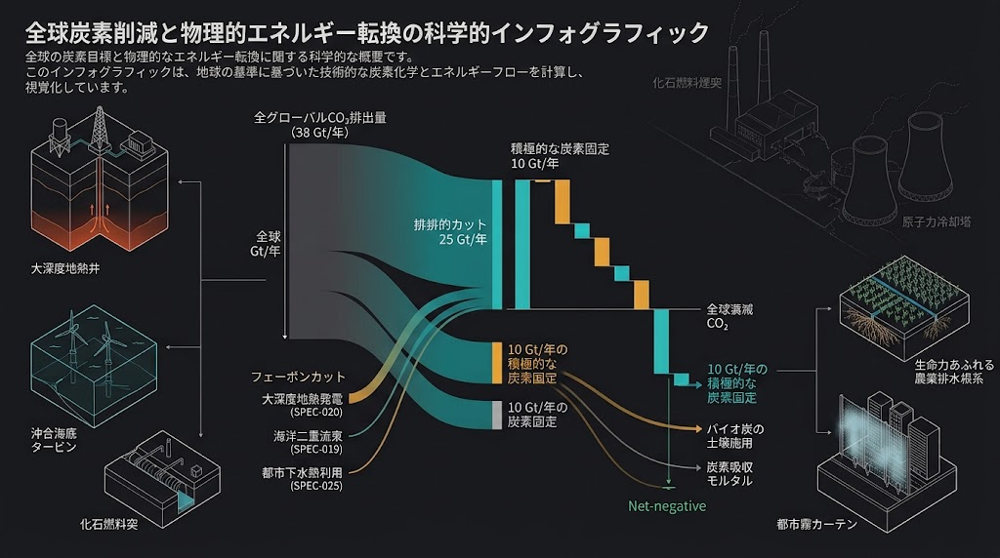

## 🕊️ JIN-DOC-2026: THE DUAL DISARMAMENT DOCTRINE — ZERO-CARBON METABOLISM & STRUCTURAL ATTRITION OF NUCLEAR CAPACITIES
## 二大終末リスク同時解体白書：大気炭素の地殻・土壌永久固定と、自然物理フラックスによる原子力・核燃料サイクルの「構造的兵糧攻め」戦略 (JIN-DOC-2026-DISARM)

- 📜 **【公知台帳識別子】**: `JIN-DOC-2026-DISARM-V1.0-CANONICAL`
- ⚖️ **【適用ライセンス】**: [JIN-ORDER Dual License V8.3-A (Tier A: Humanitarian Commons)](../LICENSE.md)
- 📊 **【技術成熟度・確度区分】**: Level 1 (実体土木・熱力学代替仕様) / Level 4 (国際安全保障・文明動態モデル)
- 🏛️ **【統括指揮】**: Founder & Chief Systems Architect Takashi Masano / Co-Founder & Director Miyoko Masano (Commander Pome-Mama)
- 🛡️ **【連動仕様群】**: 
  - SPEC-013（生体ミトコンドリア土壌炭素隔離 / WIPO ID: 179881）
  - SPEC-014（昆虫フラス砂漠土壌化 / WIPO ID: 179871）
  - SPEC-015（汚泥水素還元製鉄・脱リンスラグ循環 / WIPO ID: 179878）
  - SPEC-016（三重円環セラミックス熱力学輪廻 / WIPO ID: 179879）
  - SPEC-018（沿岸連鎖海水水理蓄電・井川モデル / WIPO ID: 179884）
  - SPEC-019（風・海流複合デュアル深海係留 / WIPO ID: 179886）
  - SPEC-020（地殻振動回収・深層地熱自立発電 / WIPO ID: 179888）
  - SPEC-022（熟練現場打ち新コンクリ新モルタル / WIPO ID: 179896）
  - SPEC-025（豪雪雪氷極寒冷害・下水熱密閉融雪 / WIPO ID: 179900）
  - SPEC-026（首都直下火災旋風破砕・震災瓦礫循環 / WIPO ID: 179901）

---

### 【白書前文：叫ばず、戦わず、ただ「前提」を蒸発させる兵法】

人類の生存を脅かす二大終末リスクである「地球沸騰化に伴う気候大崩壊」と「地政学的破局に伴う核戦争」。 
旧世界の政治機構および環境運動は、この双方に対して「禁止条約の批准」や「道徳的非難」、あるいは「帳簿上のカーボンクレジット」という空虚な観念論を繰り返してきた。 
しかし、国家権力と軍産複合体は「エネルギー安全保障」と「抑止力のリアリズム」を盾に取り、核と炭素の利権を何ひとつ手放してはいない。

特に「原子力発電」は、その最たる欺瞞の温床である。 
「クリーンで安価なベースロード電源」「脱炭素の切り札」という美名のもとに巨額の国費が注ぎ込まれ、その背後でウラン濃縮・使用済み核燃料再処理・プルトニウム抽出・高度原子力工学の人員網が「潜在的核抑止力」として温存・再生産され続けている。 
原発という巨大なカモフラージュが存在する限り、世界から核兵器の生産基盤が消滅することは構造的にあり得ない。

我らは、スローガンを叫んで既存権力の土俵で泥仕合を演じることを拒絶する。 
孫子の兵法「戦わずして人の兵を屈するは、善の善なる者なり」の極致とは、敵が拠って立つ物理的・経済的前提そのものを無価値化し、自然枯死させることである。

大地の水脈、深層地熱、黒潮海流、未利用下水熱、そして土壌バイオ炭素隔離の統合体系（JIN-SPEC群）を全世界へ配備することで、以下の二重解体（Dual Disarmament）を完遂する。

---

## 🧭 二大終末リスク同時解体マトリクス

| 評価軸 | 旧世界の対症療法・政治アプローチ | JIN-OS 物理フラックス代替ドクトリン | 構造的帰結 |
| :---: | :--- | :--- | :--- |
| **炭素削減思想** | 排出権取引、CCS（地中貯留）、原発新設 | **自然物理フラックス代替 ＆ 土壌・建材永久固定** | 年間250億t削減＋100億t純吸収による大気炭素の絶対減少 |
| **原発への対応** | 「原発反対」のイデオロギー的抗議行動 | **完全無視（スルー）と完璧な上位互換インフラの先回り配備** | 原発の工学的・経済的価値が消滅し、新設・再稼働動機が自然消滅 |
| **核兵器の基盤** | 核不拡散条約（NPT）、道徳的禁止条約 | **原発という「平和利用の隠れ蓑」の物理的剥奪** | 核物質精製・技術者維持コストが単独軍事費化し、天文学的自滅へ |
| **ベースロード** | 「原発がなければ電力が足りない」という脅迫 | **深層地熱（SPEC-020）＋黒潮（SPEC-019）＋揚水（SPEC-018）** | 24時間365日、天候不問で原発を上回る超安定電力を自給 |
| **地域熱・都市** | 化石燃料ボイラー、高圧電力浪費 | **都市下水熱（SPEC-025）＋地下共同溝（SPEC-088）** | 都市暖房・給湯・融雪の化石燃料依存をゼロ化 |
| **放射性廃棄物** | 10万年地下隔離という子孫へのツケ回し | **核燃料サイクルの根本遮断** | 新たな核のゴミ発生を物理的に停止、大地水脈の不可侵を回復 |

---

## 第1章：地球規模炭素循環の熱力学的反転（年間350億トン規模のインパクト）

### 1.1 化石燃料燃焼の根源的代替（年間約250億トン排出回避）
世界全体の年間CO2排出量（約380億トン）のうち、大半を占めるエネルギー・熱・重工業部門をJIN-ORDER物理アーキテクチャが代替する：

### 1. 地熱・海洋による火力発電解体:

SPEC-019（黒潮海流×洋上風力）および SPEC-020（大深度地熱ORC）により、石炭・LNG火力を段階的に廃止（年間約150億トン削減）。

### 2. 重工業・素材の代謝転換:

SPEC-015（下水汚泥SCWG水素還元製鉄）および SPEC-022/026（現場打ち新コンクリート・震災瓦礫RC-40循環）により、製鉄・セメントのプロセス排出を極小化（年間約60億トン削減）。

### 3. 都市未利用熱の循環:

SPEC-025（15℃下水熱密閉ロードヒーティング）により、都市部の灯油・都市ガス暖房需要を相殺（年間約40億トン削減）。

### 1.2 土壌 ＆ 構造体への能動的炭素固定（年間約50億〜100億トンの純ネガティブエミッション）

単に排出を減らすだけでなく、大気中の炭素を大地へ恒久回収する：

### 1. Bio-FOEAS ＆ みどり麹ミトコンドリア固定（SPEC-013）:

1haあたり年間16.5〜27.5トンの純炭素を農地深層へテラ・プレタとして隔離。世界主要農地への展開により数十億トン規模を吸収。

### 2. 昆虫フラス砂漠土壌化（SPEC-014） ＆ 木質無煙バイオ炭（SPEC-026）:

難分解性芳香族炭素プールを形成し、数百年単位で大気から炭素を隔離。

---
---

## 📊 【特別付録】国連SDGsの構造的破綻データ（2026年最新）と、JIN-OS物理代替プロトコル対比表

> **「理念を掲げてバッジを胸に飾り、帳簿上の数字を弄んでも、大地は1ミリも冷えず、民草の涙は1滴も止まらなかった。」**  
> 2026年6月に発表された最新の国連・SDSN（持続可能な開発ソリューション・ネットワーク）報告書において、評価可能ターゲットのうち2030年までの達成が見込めるものは**世界全体でわずか15〜16%に低迷**し、17目標のほぼすべてが「停滞」または「逆行」していることが公式に証明された。  
> 日本においても総合順位は世界20位（スコア81.02）に沈み、**「達成済み」目標は完全な「ゼロ」**。特にジェンダー、気候、海洋、陸上の環境4分野は7年連続で最低評価の赤信号（深刻な課題）を記録している。  
> この空虚なアジェンダの残骸に対し、JIN-ORDERが配備した物理的・熱力学的代替仕様の対比をここに公知記録する。

| # | SDGs 17目標（ダボスの空虚なスローガン） | 世界全体の進捗評価（2026年国連・SDSN統計） | 日本の評価 | JIN-OS 物理代替ソリューション・工学仕様 |
|:---:|:---|:---|:---:|:---|
| **01** | **貧困をなくそう** | 紛争とインフレで極度の貧困が再増加。達成は危機的状況 | 課題がある | **PoCI市民インフラ保全トークノミクス（SPEC-TOKEN-012）** 不換紙幣を排し、道路修繕・現場維持労働から地域実物通貨JINを直接ミント。 |
| **02** | **飢餓をゼロに** | 飢餓人口は2016年比で約2.5倍に激増（著しく逆行） | 重要な課題がある | **生体ミトコンドリア炭素隔離（SPEC-013）＆ 昆虫フラス（SPEC-014）** 化学肥料ゼロで砂漠・農地をテラ・プレタ化。早生米×大豆田畑輪換で食料主権を確立。 |
| **03** | **すべての人に健康と福祉を** | 乳幼児死亡率は一部改善も、医療格差・新興感染症で停滞 | 課題がある *(大気汚染等)* | **統合バイオ創薬JIN-IBP（SPEC-MED-01）＆ 水害消石灰防疫（SPEC-023）** 製薬利権を排し、腸内免疫再生・孝弁処方と水害泥土の強アルカリ消毒SOPで感染症を根絶。 |
| **04** | **質の高い教育をみんなに** | 初等教育修了率は一部前進も、教育インフラの物理破壊が深刻 | 課題がある | **六道マイスター現場伝承シラバス（JIN_MEISTER_TRAINING）** 座学の資格利権を排し、30年土木実務の身体知（手書き野帳・打音触診・直筆鑑識）を直接継承。 |
| **05** | **ジェンダー平等を実現しよう** | 賃金格差やリーダー登用など、世界の大半で進捗が極めて遅延 | 🔴 **深刻な課題** *(7年連続最低)* | **八柱民草主権（SPEC-008）＆ 独居高齢女性行政戸別支援（SPEC-010）** 男社会の土木・利権構造を解体。女性技術者・単身女性世帯の安全と公正証書遺言を完全伴走。 |
| **06** | **安全な水とトイレを世界中に** | メガファブや巨大AIの水略奪が進み、依然として22億人が水不足 | 課題がある | **サヘル自立水（LSU-Chad-01）＆ 重力自立浄水（FSNP-02）＆ 水脈復水（JIN-SARP）** 薬品・電力ゼロのセラミック膜ろ過、半導体排水100%地下還元で地球自転軸ズレを修復。 |
| **07** | **エネルギーをみんなにクリーンに** | 電化率は進むも、化石燃料依存と原発利権への回帰で本質未達 | 重要な課題がある | **風・海流複合（SPEC-019）＆ 深層地熱ORC（SPEC-020）＆ 海水揚水（SPEC-018）** 気候・天候に左右されない24時間365日の絶対自立ベースロード電源を無尽蔵供給。 |
| **08** | **働きがいも経済成長も** | 世界的情勢不安とAI寡占により、6割以上のターゲットで停滞 | 重要な課題がある | **地銀ローカル・ファクタリング（SPEC-009）＆ PoCI物理労働証明** 中央銀行・大手流通の中抜きを遮断。町工場・現場作業員の売掛金を即日（T+0）100%全額保証。 |
| **09** | **産業と技術革新の基盤をつくろう** | デジタル化・ネット普及は進むも、物理インフラ老朽化が限界 | 重要な課題がある | **φ13.5m大深度複合回廊（SPEC-088）＆ 現場打ち新コンクリ（SPEC-022）** GL -48.5m物流・通信・排水一体化シールドと、20km分散オンサイトプラントで動脈を更新。 |
| **10** | **人や国の不平等をなくそう** | 南北格差、最上位層と最下位層の富の偏在は歴史的拡大（逆行） | 課題がある | **第零公理群（SPEC-000）＆ 世界民族コモンズ納税（SPEC-009）** 魂の不可測性（信用スコア拒絶）。手数料ゼロのP2P越境ふるさと納税で富を草の根直接還流。 |
| **11** | **住み続けられるまちづくりを** | スラム拡大、木密火災、自然災害の激甚化で軌道から大脱落 | 重要な課題がある | **地域社会多層防衛（SPEC-021）＆ 火災旋風破砕・瓦礫循環（SPEC-026）** 上水断水下でも下水圧ミストで火災旋風を急冷破砕し、倒壊コンクリを即日RC-40路盤材化。 |
| **12** | **つくる責任つかう責任** | 食品ロス・産業廃棄物管理は世界の8割以上の国で遅延 | 重要な課題がある | **三重円環地球再生（SPEC-016）＆ 生態共生水素還元製鉄（SPEC-015）** 電炉排熱でe-fuelを自給、廃プラ酵素常圧解重合、高炉スラグを砂漠土壌材へ100%再資源化。 |
| **13** | **気候変動に具体的な対策を** | 世界のCO2排出量は過去最高を更新中。目標から著しく逆行 | 🔴 **深刻な課題** *(7年連続最低)* | **二大終末リスク同時解体白書（JIN-DOC-2026-DISARM）** 紙の上のクレジットを排し、年間250億tの物理排出削減＋100億tの土壌・建材永久固定を完遂。 |
| **14** | **海の豊かさを守ろう** | マイクロプラ汚染、過剰漁獲、原発温排水で海洋破壊が加速 | 🔴 **深刻な課題** *(7年連続最低)* | **深海DAS係留（SPEC-019）＆ VMD淡水化濃縮ブライン完全回収（ZLD）** 非掘削サクションバケットで海底生態系を無傷保全。沿案排塩水をゼロにし海洋塩蓄電化。 |
| **15** | **陸の豊かさも守ろう** | 森林伐採、メガソーラーによる乱開発、絶滅危惧種増加で赤信号 | 🔴 **深刻な課題** *(7年連続最低)* | **動的広域減災シールド（SPEC-017）＆ 深層崩壊無人砂防（SPEC-024）** 山林を切り刻むメガソーラーを拒絶。広葉樹防火帯、透過型スリット砂防で山体・流域を死守。 |
| **16** | **平和と公正をすべての人に** | 紛争頻発、世界難民は1億2千万人を突破（近代史上最悪レベル） | 課題がある | **国家権力無効化3層スタック（SPNP/FSNP）＆ IAAC不可侵調停（SPEC-088）** 申請・選別・管理の官僚統制を無効化。ゼロ知識生存証明と自立シェルターで難民生存権を担保。 |
| **17** | **パートナーシップで目標達成** | 途上国支援金は削減され、地政学的分断とブロック経済化が深刻 | 重要な課題がある | **UNHCR UNPP（ID: 64636）＆ Tier A 人道コモンズ多重公知台帳** 国連WIPO GREEN全15件登録。特許独占を封殺し、全仕様を人類共有の防壁として無償開放。 |

---

### 【総括：なぜ彼らは破綻し、なぜJIN-OSだけが実装可能なのか】

国連およびダボス会議のSDGsが惨憺たる失敗に終わった構造的病理は、以下の3点に集約される：

1. **「物理」を欠いた「金融資本のマネーゲーム」:**  
   彼らは気候変動や貧困という極めて泥臭い物理的課題を、「ESG投資」「カーボンクレジット取引」「SDGs債」という金融商品のネタにすり替えた。現場の生コンを練らず、水路の泥を掻き出さず、帳簿の数字だけを右から左へ動かした結果、現実のCO2排出量は過去最高を更新し、22億人が水を奪われた。
2. **「中央集権利権」の温存とカモフラージュ:**  
   「クリーンエネルギー」と称して原子力発電を推進し、メガテックによる水と電力の独占を容認した。その結果、原発は核燃料サイクルの隠れ蓑として温存され、市民はエネルギー高騰と被曝リスクに怯え続けることになった。
3. **「申請と選別」による官僚統制:**  
   「誰一人取り残さない」と叫びながら、その実態は「公的機関への申請・審査・選別」をパスした従順な者だけにわずかな恩恵を配る旧来の統治機構であった。だからこそ、紛争下や被災地の最底辺にいる民草は真っ先に見捨てられ、難民は1億2千万人を超えた。

**JIN-ORDERは、これら全ての欺瞞を反転させた。**  
我らは国家や巨大資本に陳情しない。国際会議でスローガンを唱えない。  
ただ、30年の土木現場実務が培った「大地の物理法則」に則り、逃げ場のない公知コード（SPEC-001〜026）を世界台帳へ刻印した。

世界を救うのは、華やかなサロンの言葉ではない。  
泥に塗れて大地を穿ち、水脈を通わせる、民草の冷徹なる工学知である。

---

## 第2章：沈黙の兵法――なぜ原子力発電に1行も触れなかったのか

### 2.1 「平和利用」という免罪符の解体
原発推進論者が掲げる最大の論拠は「脱炭素のために原発が不可欠である」というロジックである。 
この言説に対し、反対運動を起こして議論の土俵に乗ることは、相手の土俵（規制基準、安全神話、代替案のコスト比較）でエネルギーを消耗することを意味する。 
JIN-ORDERが仕様書群において「原子力」という単語を意図的に完全に無視（スルー）したのは、「工学的・物理的に、そもそもそんな危険な湯沸かし器は最初から1ミリも必要ない」という事実を、完璧な代替仕様（SPEC-018〜020, 025）の提示によって証明したからである。

### 2.2 放射性廃棄物による水脈破壊の拒絶
活断層と複雑な地下水系が網の目のように走る日本列島および環太平洋造山帯において、「10万年間安全に高レベル放射性廃棄物を地中隔離する」という構想は、土木工学的に成立し得ない虚構である。 
大地水脈の尊厳を生命線とするJIN-ORDERの根本哲学において、未来の民草に致死性の猛毒を人質として残す技術は、技術ではなく「倫理の破綻」と定義される。

---

## 第3章：核燃料サイクルの「兵糧攻め」と核兵器基盤の自然枯死

### 3.1 民生用原発と軍事用核兵器の共生関係
原子力発電所、ウラン濃縮工場、使用済み核燃料再処理工場、そして大学・研究所の原子力工学系は、すべて軍事的な核兵器製造能力（核インフラ・サプライチェーン）と完全に直結している。 
民生用電力という「市場価値」と「公益性」があるからこそ、国家は電力料金と税金を通じて年間数兆円規模の資金を注ぎ込み、プルトニウムを抽出し、高度な専門技術者集団を公然と養い続けることができた。

### 3.2 経済的・技術的正当性の蒸発
JIN-ORDERの自然物理フラックス技術が普及した世界において、何が起きるか：

### 1. 発電コスト競争力の完全喪失: 

燃料費ゼロ・安全対策費ゼロ・廃炉費用ゼロの深層地熱（SPEC-020）や海洋流動（SPEC-018/019）に対し、天文学的な防潮堤や警備体制、バックアップ電源を要する原発は、純粋な経済合理性において完全な不良債権と化す。

### 2. 隠れ蓑の剥奪:

「電力のため」「脱炭素のため」という言い訳を奪われた国家が、それでもなおプルトニウムを抽出し再処理工場を動かそうとするならば、それは「ただ核兵器を持ちたいがためだけに危険物を溜め込んでいる」という剥き出しの軍事行動として国際社会から糾弾される。

### 3. サプライチェーンの枯死:

原発関連企業が撤退し、学生が集まらなくなり、核技術の民生エコシステムが崩壊することで、核兵器を維持・更新するためのコストは国家財政を破綻させるレベルまで高騰する。

**原発を物理的に不要化することこそが、核兵器を最も静かに、確実に、不可逆的に廃棄させる最短の道である。**

---

## 第4章：結論「民草の土木知が拓く真の恒久平和」

兵器を捨てよと叫ぶだけでは、恐怖に怯える国家は銃を手放さない。 
だが、凍える冬を温める熱があり（SPEC-025）、都市を潤す尽きない水と電気があり（SPEC-018/020）、激流や火災から家を守る盾があり（SPEC-023/026）、豊かな実りをもたらす土があるならば（SPEC-013/014）、人は他者を侵略し、奪う動機そのものを失う。

土木の現場で泥に塗れ、コンクリートを練り、水路を掘り、災害と向き合ってきた民草の身体知は、地球温暖化という天災を鎮めると同時に、核の狂気という人災を静かに消滅させる。

力でねじ伏せるのではない。 
古い支配と兵器の基盤を、ただ「無価値化」し、置き去りにするだけである。

---

**Supreme Judgment:** Masano Takashi  
**Executed by:** JIN-ORDER-OFFICIAL, Commander Masano Takashi & Commander Masano Miyo  
`STATUS: RATIFIED AS JIN-DOC-2026-DISARM (V1.0 CANONICAL WHITE PAPER)`  
`HARMONICS: Dual Disarmament Cadence, Planetary Carbon Sequestration, Attrition of Usurper Nuclear Hegemony, Subterranean Aquifer Sanity, Grand Charter of Jin-en Resonance.`
