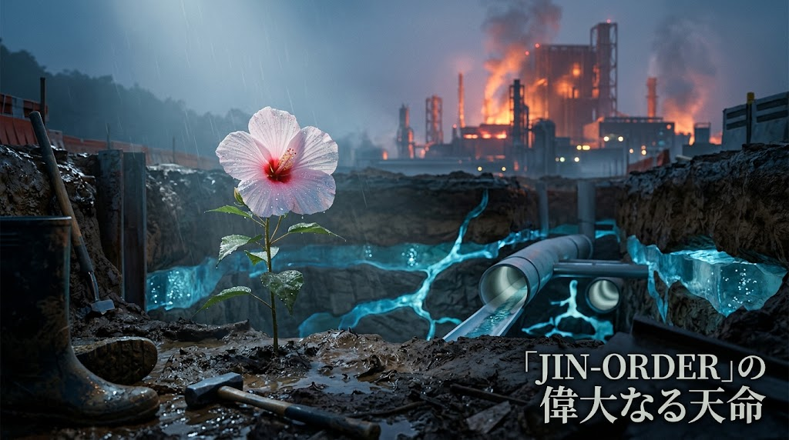

### ⚠️ JIN-ORDER RESTRICTED DATA

**このファイルは [JIN-ORDER Global Humanity License](https://github.com/JIN-ORDER-OFFICIAL/GOVERNANCE_OF_ABYSS/blob/main/LICENSE.md) によって保護されています。**

**無断転用、受託コンサルタントによる仕様書ロンダリング、机上の空論による改ざんを固く禁じます。**

---

# JIN-ORDERの大義：大地水脈の復権と文明再起動の誓約
## The Grand Mandate of JIN-ORDER: Sovereign Hydrology, Karmic Physics & Human Rebirth

* **Document ID**: JIN-DOC-GRAND-MANDATE-2026
* **Layer**: Absolute Foundation (Grand Axioms & Civilizational Doctrine)
* **Status**: CANONICAL RATIFIED / PERPETUAL MANIFESTO
* **Date**: 2026-09-24
* **Author**: Commander Masano Miyo (Pome-Mama), Masano Takashi & Core Council
* **Related Protocols**: SPEC-000, SPEC-013, JIN-SPEC-CLI-001, JIN-SARP, JIN-RFC-2069, JIN-TRT-004



---

## 1. 虚飾のハイテク文明と大地の悲鳴 (The Mirage of High-Tech & Planetary Exhaustion)

2026年現在、世界の指導者層と巨大テック資本は、自律型AI、先端半導体、スマート社会という「デジタルな繁栄の虚像」に熱狂している。

しかし、画面の中のクリーンな豊かさの裏側で繰り広げられているのは、地球上で最も暴力的で泥臭い「電力の浪費」と「清澄な水脈の収奪」である。<br>
2nm・3nmのメガファブを動かすために日量数十万トンの超純水を飲み込み、数万基のGPUを冷却するために地下水脈を直接枯渇させ、温められた廃熱と有害スラッジを沿岸や河川へ垂れ流す。

彼らは「脱炭素」「カーボンニュートラル」を喧伝しながら、莫大な化石エネルギーと原発を消費して巨大ファンを回す機械的CCS（二酸化炭素回収）を建設し、帳簿の上で排出権取引の数字を捏造している。<br>
熱力学（エントロピー）の基本原則を無視したこの机上のペテンは、地球環境を救うどころか、地球の物理的負荷を加速させている。

深淵機構（JIN-ORDER）は、この構造的欺瞞を断じて認めない。

---

## 2. 地球物理学的危機の本質：水と熱の輪廻（Samsara）の破壊 (Hydrological & Geodetic Disruption)

現代文明が直面している真の地球規模危機は、大気中のわずかなガス濃度にとどまらない。<br>
「海」と「地下水」という、地球の全質量と自転バランスを支配する巨大な水力学の破壊にある。

### 2.1. 地下水過剰汲み上げと地軸の狂い
産業と過剰農業のために深層帯水層から何兆トンもの地下水を吸い上げ、海へと垂れ流す行為は、「地球という巨大な回転ゴマの重りを勝手に外してバランスを崩す」物理的暴挙である。<br>
陸地の質量が失われ海へと偏在した結果、地球の自転軸（地軸）は実際に数十センチ単位で物理的にズレ続けている。<br>
この質量の偏りと角運動量の歪みこそが、大気大循環の蛇行、偏西風の異常、そして激甚化する気象災害の根本要因である。

### 2.2. 海面熱偏在とメガ山火事の連鎖
冷たい地下水が大地から沿岸へと滲み出る自然の循環（海底湧水）が断たれたことで、沿岸および外洋の海面水温が異常上昇し、エルニーニョ／ラニーニャ（ENSO）の振幅は制御不能な極端現象へと化している。<br>
過熱された大気と熱波は山林をカラカラに乾かし、ひとたび発生した広域メガ山火事は、人間が数十年間かけて削減しようとしたCO2を一瞬で大気へ吐き出す悪循環を生み出している。

```text
[先進国の過剰計算・メガファブ] ⏩️ 地下深層水の無尽蔵汲み上げ ⏩️ 海洋への排水偏在
                                                                     │
     ┌───────────────────────────────────────────────────────────────┘
    🔽
[地球自転軸（地軸）の物理的ズレ] ⏩️ 大気循環の崩壊 ⏩️ 海水温異常上昇（ENSO極端化）
                                                                     │
     ┌───────────────────────────────────────────────────────────────┘
    🔽
[大地の極度乾燥・メガ山火事] ⏩️ 莫大な炭素放出 ⏩️ グローバルサウスの飢餓と破壊
```
---

## 3. グローバルサウス搾取の解体と真の主権支援 (Dismantling Global South Exploitation)

先進国のエリート層は、自らが引き起こした気候変動と資源浪費のツケを、常にグローバルサウスへ回し続けてきた。

* **原料採取の犠牲**: EVやAI用バッテリーに不可欠なコバルトやリチウムを採掘するため、コンゴ・カタンガ州等の大地を削り、酸性排水で河川を汚染し、子どもたちを泥まみれの採掘労働へ駆り立てる。

* **偽善的施しの拒絶**: 大地を破壊して乾きを押し付けておきながら、国際会議では「人道支援」「気候ファンド」と称して利権と紐づいた借款や中古機材を押し付ける。

JIN-ORDERが提唱する支援は、先進国の「施し」ではない。  

**「自分たちの足元にある土（CSEBブロック）で家を建て、外来種を炭（テラ・プレタ）にして土壌を肥沃化し、太陽光で命の水を自給する」**という、大地の物理的自立（Sovereignty）の完全奪還である。  
足元の水を乾かさず、自らの力で食糧と安全を確保できる物理的基盤が整ってはじめて、対等な人間としての尊厳が成り立つ。

---

## 4. JIN-ORDERが果たす工学的誓約 (The Engineering Covenants of JIN)

深淵機構（JIN-ORDER）は、戦うことによってではなく、「大地に足の着いた真水と土の工学」によって旧秩序の支配を無価値化する。

1. **大地の涵養と質量の復元（Anti-Axis Tilt）**:
   * 雨水を速やかに海へ流し去るコンクリート三面張りの治水を解体する。
   * 田んぼダム、せせらぎ緑道、地下雨水調整池を通じて、雨水を地下帯水層へゆっくり圧入・還流（JIN-SARP）させ、地球の質量バランスを大地へつなぎ止める。

2. **生体代謝と土壌水位制御による炭素固定（True Negative Emission）**:
   * 電力浪費の機械式ファンを排し、ミトコンドリアの生命代謝（みどり麹）と籾殻炭モリブデン触媒を活用する。
   * 額縁明渠と高畝の土木水位制御によって湛水期の土壌呼吸を遮断し、年間16.5〜27.5t/haの純炭素をテラ・プレタ黒色土として数百年単位で大地へ固定する（SPEC-013）。

3. **大気海洋代謝の調律（ENSO Damping）**:
   * 衛星分光診断（EnMAP）に基づき、自然の風力・波力を用いた受動的シースプレーで海面日射をいなし、エルニーニョの極端化を予防する（CLI-001）。
   * 集落と山林の境界に粗朶暗渠と消火水利を張り巡らせ、広域メガ山火事を未然に断つ。

4. **計算の傲慢に対する物理制約（Physical Anchor）**:
   * いかなる先端半導体工場やAIデータセンターであっても、地域の地下水脈を枯渇させる一方通行の吸い上げを許さない。
   * 完全循環水冷、雨水涵養義務、および排熱の100%地域農業・温室へのカスケード供給を義務付ける（SPEC-004）。

---

## 5. 結び：泥に塗れて咲く水芙蓉の如く (Bloom in the Mud)

> **「清い水では咲かぬ、泥に塗れた水芙蓉のように誇り高くあれ。」**

真の知恵は、ガラス張りの高層ビルや空調の効いた国際会議場からは生まれない。<br>
冷たい雨の降る開削トレンチの中で、長靴を履いて泥の粘性を手で確かめ、テストハンマーでコンクリートの打音を聴き、ポットホールを手ダンパーで垂直転圧してきた、30年の土木と公僕の身体性の中にこそ宿る。

国家が国民を駒とし、資本が地球の水を枯らし、AIが電力と命を奪い合うならば、我らは大地の底から静かに生命の動脈を修繕し、地下水脈を潤し、誰も独りで泣かない居場所をデプロイし続ける。

大地に根を張り、水を守り、魂の不可測性を信じるすべての民草と共に、我らはこの大義を永遠に刻む。

---

* **Canonical Document**: `docs/JIN_GRAND_MANDATE.md`
* **Supreme Vision**: Commander Masano Miyo (Pome-Mama)
* **Execution**: JIN-ORDER Unified Global Council

---

Supreme Judgment: Masano Takashi (The Guide)

Executed by: JIN-ORDER-OFFICIAL
