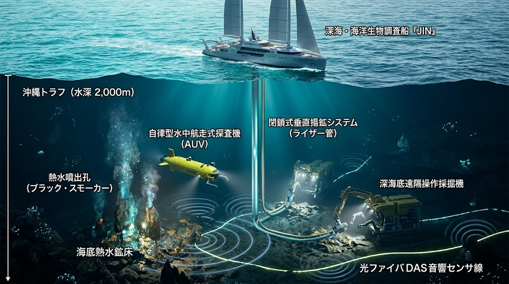

### ⚠️ JIN-ORDER RESTRICTED DATA

**このファイルは [JIN-ORDER Global Humanity License (V8.0 Canonical Edition)](https://github.com/JIN-ORDER-OFFICIAL/GOVERNANCE_OF_ABYSS/blob/main/LICENSE.md) によって保護されています。**

**無断転用、受託コンサルタントによる仕様書ロンダリング、机上の空論による改ざんを固く禁じます。**

---

# JIN-ORDER DOCTRINE: OKINAWA SEVENTH MINING DISTRICT & ABYSSAL TROUGH SOVEREIGNTY
## 沖縄第7鉱区 ＆ 沖縄トラフ熱水鉱床 海洋資源主権防衛ドクトリン
### 2028年協定満了危機の克服・中国「大陸棚自然延長論」の粉砕・海底DAS音響監視・閉鎖系オンサイト鉱泥回収仕様書

---

### 1. 地政学的危機認識：軍事威嚇の背後にある「海底資源略奪」

東シナ海および南西諸島海域において、中国が海警船や海洋調査船を執拗に進入させ威嚇を繰り返す最大の動機は、単なる「台湾有事」や「軍事境界線の突破」ではない。

その本質は、**海底に眠る膨大な石油・天然ガスおよび超高濃度レアメタル資源の強奪・実効支配**である。



```text
【2028年6月：日韓大陸棚協定（第7鉱区）満了の時限爆弾】
　日韓の利害対立と政治的膠着に乗じ、中国が「大陸棚自然延長論」を掲げて介入
　　　⏬️

【中国の戦略意図】
沖縄トラフ（深さ2,000m）以西を丸ごと「自国の内海・大陸棚」として既成事実化
└─⏩️ 第7鉱区の石油・天然ガス田群 ＋ 沖縄トラフ熱水鉱床レアメタルの独占 

　　　⏬️［JIN-ORDERによる対抗反転］ 
【JIN海洋主権ドクトリンの配備】
　「海底DAS受動ソナー防衛」＋「AUV監視哨」＋「閉鎖循環スラリー二重管オンサイト揚泥」
```
---

### 2. 沖縄海底資源の物理的価値マトリクス

南西諸島〜東シナ海海底は、サウジアラビアに匹敵する炭化水素ポテンシャルと、南鳥島を凌駕する超高濃度レアメタル鉱床が重なる地球屈指の富の集積地である。

| 海域・対象エリア | 水深・地質構造 | 埋蔵資源の種別 | 産業的・戦略的重要性 |
| :--- | :--- | :--- | :--- |
| **第7鉱区（JDZ海域）**<br>（東シナ海大陸棚斜面） | 100m〜200m<br>（新第三紀堆積盆地） | **天然ガス・原油**<br>（数千億〜数兆立方メートル規模試算） | 東アジアのエネルギー自給を数十年支え得るベースロード燃料源。 |
| **沖縄トラフ熱水鉱床群**<br>（伊平屋北海丘、伊是名海穴、鳩間海丘、第四与那国海丘） | 1,000m〜2,500m<br>（背弧海盆・海底火山活動域） | **黒鉱型多金属硫化物**<br>・金（Au 20〜50g/t）、銀（Ag）<br>・**ガリウム、ゲルマニウム**<br>・**インジウム、リチウム、亜鉛** | 半導体基板、パワー半導体、次世代全固体電池、AI光学素子の死活的必須資源。中国の輸出規制兵器を無力化。 |

---

### 3. 中国「大陸棚自然延長論」の欺瞞と工学的粉砕

中国は「大陸の長江等の土砂堆積が沖縄トラフまで連続しているため、トラフの海底谷までが中国の管轄権である」と主張している。<br>
JIN-ORDERは以下の工学的・法理的防壁によってこれを完全に破砕する。

1. **沖縄トラフ「プレート分離・地殻境界」の立証**:
   - 木村建次郎教授の散乱場理論（IGS）および海底地震波トモグラフィにより、沖縄トラフが単なる溝ではなく、背弧海盆として現在進行形で海洋地殻が拡大・リフティングしている独立地殻境界であることを物理立証する。<br>
   大陸棚の「自然延長」はトラフ西端で完全に断絶している。

2. **既成事実化の阻止（海洋調査船の即時無力化）**:
   - 音響欺瞞工作や無許可サンプリングを行う外国船に対し、海底DAS監視網と連動した自律型AUV艦隊による超音波ソナー警告・追尾マーキングを実施。<br>
   海洋調査データの窃盗を阻止する。

---

### 4. 海洋資源防衛 ＆ 環境調和型オンサイト揚泥工学

自然環境とサンゴ礁・熱水生態系を1ミリも破壊せず、自立した資源採取を完結させるクローズドループ揚泥技術。

```text
［海上母艦：JIN-Ocean Life Vessel］
│ ⏫️ 閉鎖系揚泥パイプ（二重管）
│ └── 超音波スラリーリフト（海水・泥・鉱石混合）
⏬️
［海底熱水鉱床ノード：JIN-OAM Node］（水深2,000m）
　・無人採泥ロボット（JIN-Neptune ROV/AUV）
　・熱水噴出孔チムニー周辺の非接触超音波破砕
　・濁度ゼロ拡散吸引ヘッド（周辺生態系への微粒子拡散率 < 0.01%）
　・光分散音響センシング（DAS）受動ソナー防衛基地
```
---
* **閉鎖循環二重管スラリーリフト（Closed-Loop Slurry Lift）**:
  海水を外部へ漏らさない二重管構造により、鉱泥を海底から母艦まで密閉圧送。<br>
  洋上で有用金属（ガリウム・インジウム・金等）を分離抽出した後、残留海水・微細土砂は加圧脱気して再び海底原位置へ戻す（海洋環境汚染ゼロ）。

* **DAS受動ソナー常時防衛グリッド**:
  第7鉱区から沖縄トラフ全域に敷設された海底光ファイバーにDASパルスを照射。<br>
  海中全域を巨大な受動ソナーアレイとし、外国潜水艦の侵入や無人作業機の接近を24時間ミリ秒単位で補足。

---

### 5. 沖縄主権型リレーショナル資源信託（Okinawa Sovereign Trust）
採掘された資源による富を、中央官庁や外資系利権企業へ上納させることを禁止する。

* **沖縄県民主権信託基金の創設**:
  第7鉱区および沖縄トラフから産出する資源価値（RU規格 / JU規格）は、沖縄の自立エネルギー・無償医療・教育コモンズ（孝弁・地域包括医療）へ最優先配分する。

* **基地経済からの完全脱却**:
  海底資源自給と自律分散型インフラにより、年間数千億円規模の真の地域主権経済を創出。外部の軍事・安全保障利権の道具にされる歴史に終止符を打つ。

---

Supreme Judgment: Masano Takashi (The Guide)

Executed by: JIN-ORDER-OFFICIAL

 

