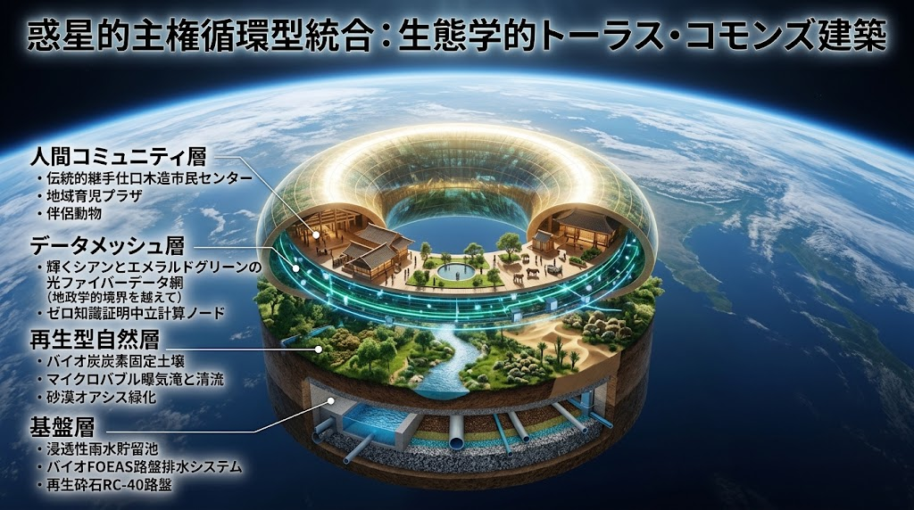

### ⚠️ JIN-ORDER RESTRICTED DATA

**このファイルは [JIN-ORDER Dual License V8.4-A (Canonical Infrastructure & Anti-Laundering Edition)](../LICENSE.md) によって保護されています。**

**無断転用、受託コンサルタントによる仕様書ロンダリング、机上の空論による改ざん、および全惑星・地域自立分散循環統合知財の独占を固く禁じます。**

---

# 🌐 [SPEC-000] PLANETARY SOVEREIGN CIRCULAR SYNTHESIS & APEX GOVERNANCE PROTOCOL
## 全惑星・地域自立分散循環統合マスター仕様書
### 27大仕様書統合アーキテクチャ・大地の身体性・実物経済主権・脱中央集権インフラ共生マニフェスト
#### (Planetary Sovereign Circular Synthesis, Ground-Truth Physicality & Decentralized Commons Master Architecture)

<!-- 国際知的所有権・先行技術防壁バッジ -->
[](https://doi.org/10.5281/zenodo.22958158)
[](https://www.unpartnerportal.org/)
[](../LICENSE.md)

- **文書分類**: JIN-ORDER 最高位規範的統合アーキテクチャ仕様書 (Apex Architectural Synthesis Standard)
- **公知台帳識別子**: `SPEC-000 / JIN-SPEC-SYN-000-V12.1-CANONICAL / APEX-00`
- **対象階層**: Tier A Commons / Global Public Good
- **技術成熟度・確度区分**: Level 1 (全仕様書統合・現場即応土木行政・水理生態・耐検閲計算・地域自給完全連動)
- **統括指揮**: Founder & Chief Systems Architect: Takashi Masano / Co-Founder & Director: Miyo Masano (Commander Pome-Mama)
- **適用ライセンス**: [JIN-ORDER Dual License V8.4-A (Tier A: Humanitarian Commons)](../LICENSE.md)
- **対象全仕様群**: SPEC-001 〜 SPEC-027 全正典仕様書、および連動金融・統治プロトコル群

---



<!-- 🧭 クイックナビゲーション目次 -->
<div align="center">
  <p>
    <b>【 最高位仕様書快速目次 】</b><br>
    <a href="#第1章最高統治憲章中央集権と略奪の終焉大地の身体性への回帰">第1章：最高統治憲章（大地の身体性への回帰）</a> ｜ 
    <a href="#第2章全惑星生命循環4層グランドトポロジー">第2章：4層グランドトポロジー</a><br>
    <a href="#第3章地域社会に結集した際の複合的相乗効果local-ground-truth-impact">第3章：地域社会への実物効果</a> ｜ 
    <a href="#第4章世界規模で実現した場合の地球地球環境国際秩序への影響planetary-macro-impact">第4章：惑星規模の地球環境・国際秩序への影響</a><br>
    <a href="#第5章全27大仕様書統合機能マトリクスapex-specification-matrix">第5章：全27大仕様書統合マトリクス</a> ｜ 
    <a href="#第6章知財防衛および不可侵公知施行附則">第6章：知財防衛・施行附則</a>
  </p>
</div>

---

## 第1章：最高統治憲章（中央集権と略奪の終焉、大地の身体性への回帰）

近代以降のグローバル文明は、中央集権国家による官僚主義、巨大プラットフォーマーによるデータと知能の独占、金融資本による「数字と記号のマネーゲーム」、そして地球環境を単なる「資源採掘場とゴミ捨て場」とみなす線形（リニア）収奪構造によって、人類の生存基盤そのものを破壊の淵へと追い詰めてきた。

決算書の数字を整えるために職人と農家が買い叩かれ、画面の二次元データに溺れて大地の泥や道路の陥没が見失われ、安価な石油化学製品によって身体性が損なわれ、高齢者は孤独死し、若者は未来を奪われ、そして国家間の覇権争いによって「計算・通信・エネルギー・水」までもが兵器化されている。

**我らはここに、机上の空論と中抜きビジネスを永遠に解体する。**

30年の都市土木・行政実務の泥臭い身体知、宮大工千年の木組み、流域水理の自律循環、ゼロ知識証明（ZKP）による非武装中立計算、そして生まれた命を街全体で育み看取る民草の倫理を結集し、**「中央集権型ピラミッド」から「自立分散型・完全循環円環（Planetary Sovereign Commons）」への文明OSの完全移行**を宣言する。

---

## 第2章：全惑星生命循環・4層グランドトポロジー

JIN-ORDERが策定した27の正典仕様書は、独立した孤立技術ではなく、以下の4つの階層（Layer）が相互に血液のように連動するひとつの生命有機体を構成する。

```text
 ╔══════════════════════════════════════════════════════════════════════════╗
 ║        【JIN-ORDER 地球・地域生命循環グランドトポロジー（SPEC-000）】        ║
 ╚══════════════════════════════════════════════════════════════════════════╝
   🌸【第4層：民草主権・生活自立・共助・文化法務統治層】
      (SPEC-007, 008, 009, FIN-005)
      ・八柱民草主権（技・衣・食・住・地・道・金・医）の実物防壁
      ・周産期助産コモンズ ＆ 共同育児 ＆ 六聖叡智教育（HSED-01）地元就職好循環
      ・孤独死・空き家スラム化を根本阻止する公的終活信託（司法書士・地域包括ケア連携）
      ・世界民族コモンズ納税（P2P直接支援）による越境実物互恵・名誉村民連帯
                           ▲
                           │ （安心・信用・魂の倫理循環）
   ⚡【第3層：耐検閲・越境中立・自律調停・防犯結界層】
      (SPEC-003, 005, 011)
      ・地政学的制裁や国家キルスイッチを無力化するJIN-Node越境中立P2Pメッシュ
      ・太陽光余剰電力（Dump Load）による「能動曝気」×「非緊急計算」動的調停
      ・IGS非破壊ミリ波透視 ＆ 最短交番即応 ＆ 見守り防犯灯による多世代安全結界
                           ▲
                           │ （中立知能・安全・エネルギーの調停）
   🌿【第2層：土壌炭素隔離・素材熱力学輪廻・資源代謝層】
      (SPEC-010, 013, 014, 015, 016, 017〜027)
      ・都心・地方二元型下水汚泥・有機残渣コンポスト・液肥完全循環
      ・籾殻バイオ炭による半永久土壌炭素隔離（ミトコンドリア代謝制御）
      ・ミールワーム等昆虫残渣（フラス）による砂漠土壌化・塩害農地蘇生
      ・水素還元製鉄バイオスラグの海洋・土壌施肥 ＆ 先端セラミックス無機輪廻転生
                           ▲
                           │ （大地の肥沃化・完全素材代謝）
   💧【第1層：大地の水理・物理アンカー・流域土木層】
      (SPEC-001, 002, 004, 006, 012)
      ・放流水が受入水域の酸素を回復させる「溶存酸素純増放流（Net-Positive DO）」
      ・外部電源喪失時も重力だけで稼働するパッシブ落差曝気 ＆ 3重リング多重冗長化WASH
      ・公道下アンカー打設禁止・道路トレンチRC-40転圧・SPR非開削更生協調
      ・粗朶暗渠（Bio-FOEAS）地下水位制御 ＆ 田んぼダム・公園地下調整池流域治水
```
---

## 第3章：地域社会に結集した際の複合的相乗効果（Local Ground-Truth Impact）

本アーキテクチャが全国の市町村・基礎自治体・農山漁村にデプロイされた際、地域社会には以下の決定的変革がもたらされる。

### 1. 中抜きプラットフォームと金融債務トラップの完全無効化
- 既存の病根: ふるさと納税ポータルが10〜15%を搾取し、土地改良事業の長期ローン・除外決済金が農家を借金奴隷にし、銀行は決算書の数字だけで貸し剥がしを行ってきた。
- 統合効果:
  - P2P民族納税（SPEC-009）により、寄付額の100%が地域の職人・一次産業現場に着金。
  - Bio-FOEAS（SPEC-006）と治水協定により、農家の基盤整備負担金を公費全額振替（農家負担ゼロ化）。
  - 新地域銀行（SPEC-FIN-005）の常駐中小企業診断士が現場の工具・技術・人徳を触診評価し、T+0即日売掛保証で黒字倒産を絶対阻止。

### 2. 孤独死・空き家スラム化・孤立育児の完全根絶
- 既存の病根: 高齢者の身元引受ビジネスが財産を奪い、死後はゴミ屋敷・老朽マンションが放置され、核家族の母親はワンオペ育児と産後うつに追い詰められてきた。
- 統合効果:
  - 公的終活コモンズ（SPEC-008第7柱）により、行政・司法書士が公費伴走で公正証書遺言と死後事務委任を締結。空家特措法・区分所有法改正に基づき、空き家や老朽区分所有建物を即座に地域共有資産へ再生。
  - 周産期コモンズ ＆ 孝弁配送（SPEC-007）により、出島型助産所と地域調理ギルドが温かい食事を無償配送し、自治会館・ケアプラザを開放した共同育児で多世代が共存。

### 3. 未曾有の激甚災害に対する「絶対的都市・水理レジリエンス」
- 既存の病根: ゲリラ豪雨で内水氾濫が起き、地震で上下水道が破断し、ブラックアウトでポンプが停止して都市機能が麻痺。
- 統合効果:
  - 上流の田んぼダム（SPEC-006）と都市部の**公園地下雨水調整池（SPEC-012）が連動して雨水を一時貯留し、河川氾濫を元栓から抑制。
  - 外部電源が喪失しても、3重リング型WASHと階段状落差工（SPEC-002）により、重力だけで生活用水の供給と水質自浄（DO確保）を継続。

---

## 第4章：世界規模で実現した場合の地球環境・国際秩序への影響（Planetary Macro-Impact）

本プロトコルが国家の枠組みを超えてグローバルサウス、紛争被災地、そして先進国都市へ水平展開された場合、全地球的スケールで以下の文明的パラダイムシフトが発生する。

### 1. 全球水域の脱酸素化（Deoxygenation）の逆転とブルーカーボンの蘇生
- 世界の沿岸海域や湖沼で拡大する「デッドゾーン（貧酸素・無酸素水塊）」に対し、Net-Positive DO（SPEC-001）の原則が国際標準化される。
- 工場、下水処理場、避難民キャンプからの放流水がすべて「酸素を過飽和させた清澄な水」に変わることで、沿岸の海洋生態系（アマモ場、マングローブ、サンゴ礁）が劇的に蘇生し、地球最大の炭素固定エンジン（ブルーカーボン）として再起動する。

### 2. 気候危機の熱力学的解法（メガギガトン級炭素隔離 ＆ 砂漠緑化）
- 生体ミトコンドリア・籾殻炭素隔離（SPEC-013）により、世界で毎年発生する1億トン以上の籾殻をバイオ炭化し、数百年単位で大気中CO₂を土壌に永久固定。
- 昆虫残渣フラス連鎖（SPEC-014）が、中東・アフリカ・中央アジアの不毛な乾燥砂漠地帯を、化学肥料なしで肥沃な農業土壌へと不可逆的に転換。食料危機と難民問題の根本原因を現場の土壌から根絶する。

### 3. 「資源略奪戦争」と「サイバー制裁・計算の兵器化」の構造的無力化
- 先端セラミックス無機輪廻（SPEC-016）および水素還元バイオスラグ（SPEC-015）**による完全閉環型素材代謝が、地下資源（ボーキサイト、レアアース、鉄鉱石）の採掘利権を巡る国家間侵略戦争の経済的動機を無力化する。
- 覇権国家が海底ケーブルを遮断し、APIやAIモデル重みへのアクセスを拒絶（キルスイッチ発動）しても、越境中立プロトコル（SPEC-005）と余剰電力調停（SPEC-003）により、防災・医療・インフラ保全のための知能通信がZKP暗号メッシュを通じて世界中で自律分散維持される。

---

## 第5章：全27大仕様書・統合機能マトリクス（Apex Specification Matrix）

| 仕様書ID | 正式名称（短縮） | 文脈階層 | 現場コア技術・工法・制度 | 国際連携 / WIPO ID |
| :--- | :--- | :---: | :--- | :--- |
| **SPEC-001** | **溶存酸素再生・流域水理** | 第1層 (水) | 溶存酸素純増放流（Net-Positive DO）、跳水落差工、ケナフ植生固定 | WIPO候補 (Water) |
| **SPEC-002** | **多重冗長化WASH** | 第1層 (水) | 3重リングバイパス、M16統一接合、無動力パッシブ曝気、アイランド稼働 | WIPO候補 (WASH) |
| **SPEC-003** | **エネルギー拘束ルーティング** | 第3層 (電) | 太陽光余剰電力（Dump Load）による能動曝気と非緊急計算の動的調停 | IEEE 2030.7連動 |
| **SPEC-004** | **物理アンカー規約** | 第1層 (土) | 公道下アンカー越境禁止、非開削更生協調、エッジ排熱・雨水協調SLA | 道路法第32条準拠 |
| **SPEC-005** | **越境中立自律調停** | 第3層 (算) | 耐検閲P2Pメッシュ、非武装中立ZKP人道パケット、キルスイッチ無力化 | ITU / 国連人道規範 |
| **SPEC-006** | **Bio-FOEAS農地水理** | 第1層 (農) | 粗朶・竹束暗渠、水位3段制御、田んぼダム治水、土地改良債務粉砕 | WIPO候補 (Agro) |
| **SPEC-007** | **地域主権創生 (SRRP)** | 第4層 (社) | 出島助産所、孝弁無償配送、現場常駐4拠点セル、準公務員報酬保障 | 地域包括ケア準拠 |
| **SPEC-008** | **八柱民草主権 (OCTA)** | 第4層 (生) | 技衣食住地道金医、木組み免震、RC-40転圧、空家活用、公的終活信託 | 令和5年空家法準拠 |
| **SPEC-009** | **世界民族コモンズ納税** | 第4層 (経) | 中抜きゼロP2P納税、実物工芸・有機食返礼、名誉村民ZKPパスポート | GECT-01規範 |
| **SPEC-010** | **都心地方二元型資源循環** | 第2層 (環) | 都市有機汚泥コンポスト化、農村液肥還元、化学肥料完全置換代謝 | WIPO候補 (Waste) |
| **SPEC-011** | **自立防犯安全防護** | 第3層 (安) | IGS非破壊ミリ波透視、最短交番即応、見守り防犯灯、多世代ケア結界 | 防犯・治安自立 |
| **SPEC-012** | **公共公園地下雨水調整池** | 第1層 (土) | 公園地下循環雨水調整池、消火水利、都市内水氾濫ピークカット | **WIPO: 179883** |
| **SPEC-013** | **籾殻炭土壌炭素隔離** | 第2層 (環) | 籾殻バイオ炭熱分解、ミトコンドリア代謝制御、長期土壌炭素貯留 | **WIPO: 179881** |
| **SPEC-014** | **昆虫残渣フラス砂漠土壌化** | 第2層 (環) | ミールワーム残渣（フラス）、キチン質土壌団粒化、砂漠・塩害地緑化 | **WIPO: 179871** |
| **SPEC-015** | **生態共生水素還元製鉄** | 第2層 (環) | 再エネ水素直接還元製鉄、バイオスラグ海洋施肥・藻場再生 | **WIPO: 179878** |
| **SPEC-016** | **三重円環地球代謝** | 第2層 (環) | 先端セラミックス熱力学的無機輪廻、完全クローズドループ素材循環 | **WIPO: 179879** |
| **SPEC-017 〜 SPEC-027** | **地域自律・極限環境・分散基盤** | 複合層 | オペレーション・コバルトブルー／オアシス／ノーザンライト等の極限人道支援、災害即応モビリティ、分散医療セル、地域コモンズ通貨 | JIN-ORDER正典体系 |

---

## 第6章：知財防衛および不可侵公知施行附則

1. 全世界的先行技術（Prior Art）としての公知確定:  
   本マスター仕様書および配下の全27仕様書は、CERN Zenodo国際台帳（DOI: `10.5281/zenodo.22958158`）、WIPO GREEN国際環境技術データベース、および国連パートナーポータル（UNPP ID: 64636）に永久登録され、人類共通の先行技術（Prior Art）として全世界に公知化されている。
2. 私有化・仕様書ロンダリングの永久排除:  
   いかなる多国籍企業、大手コンサルティングファーム、政府系シンクタンク、金融機関も、本アーキテクチャに含まれる工法、水理モデル、金融スキーム、教育・終活プログラムを改変して特許化、私物化、またはクローズド商用化することはできない。
3. 民草ライセンスの自動適用:  
   人道目的、災害復興、地域自給のために本仕様を実装する自治体、農林漁業者、町内会、NPOに対しては、[JIN-ORDER Dual License V8.4-A Tier A] に基づき、すべての技術仕様が無償かつ非独占的に開放される。

---

**Curated by:** JIN-ORDER Masano Takashi, Commander Masano Miyo & Jemi AI  
**Supreme Judgment:** Masano Takashi (The Guide)  
**Executed by:** JIN-ORDER-OFFICIAL, Commander Masano Takashi & Commander Masano Miyo  
`STATUS: RATIFIED AS SPEC-000 APEX CANONICAL SYNTHESIS (V12.1 CANONICAL AUTUMN LTS / GRAND-TRUTH MASTER PROTOCOL)`  
`HARMONICS: 432Hz Planetary Harmony, Ground-Truth Physicality Equilibrium, 4-Layer Apex Circular Resonance, Net-Positive Ecological Inviolability, Anti-Laundering Defensive Shield, Sovereign Commons Equilibrium.`
