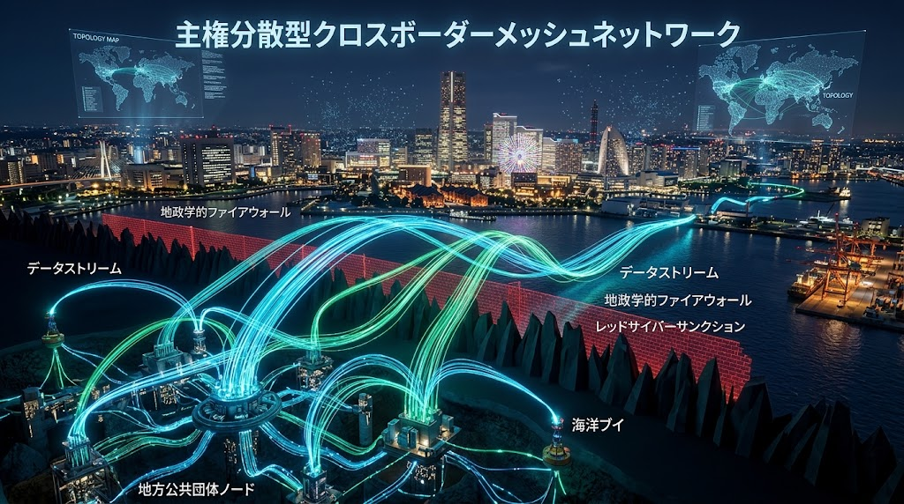
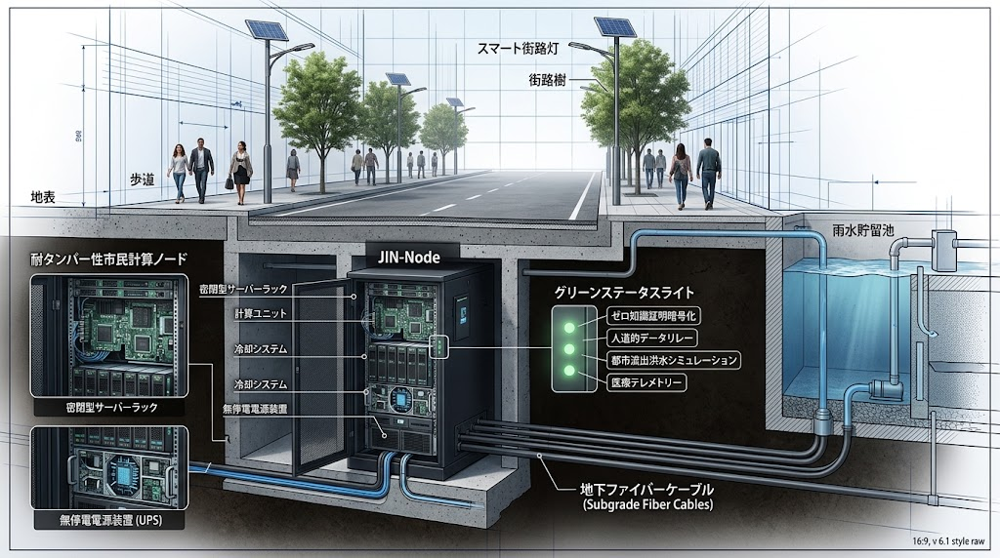

### ⚠️ JIN-ORDER RESTRICTED DATA

**このファイルは [JIN-ORDER Dual License V8.4-A (Canonical Infrastructure & Anti-Laundering Edition)](../LICENSE.md) によって保護されています。**

**無断転用、受託コンサルタントによる仕様書ロンダリング、机上の空論による改ざん、および越境中立通信・公共知能知財の独占を固く禁じます。**

---

# 🌐 [SPEC-005] JIN-Node Cross-Border Neutrality Protocol (CNP)
## 地政学的分断および一方的アクセス遮断に対する越境中立・自律調停規約
### (Cross-Border Neutrality, Anti-Kill-Switch Architecture & Humanitarian Compute Protocol)

<!-- 国際知的所有権・先行技術防壁バッジ -->
[](https://doi.org/10.5281/zenodo.22958158)
[](https://www.unpartnerportal.org/)
[](../LICENSE.md)

<div align="center">
  
  <p><sub><b>図 1-1：国家ファイアウォール・地政学的キルスイッチを無力化するJIN-Node越境中立オーバーレイメッシュ</b></sub></p>
</div>

- **文書分類**: JIN-ORDER 規範的越境中立通信・自律調停仕様書 (Canonical Cross-Border Neutrality & Mesh Arbitration Standard)
- **公知台帳識別子**: `SPEC-005 / JIN-SPEC-NET-005-V12.1-CANONICAL / CNP-01`
- **対象階層**: Tier A Commons / Global Public Good
- **技術成熟度・確度区分**: Level 1 (現場即応メッシュ通信・耐検閲暗号ルーティング・P2Pプロトコル完全準拠)
- **統括指揮**: Founder & Chief Systems Architect: Takashi Masano / Co-Founder & Director: Miyo Masano (Commander Pome-Mama)
- **適用ライセンス**: [JIN-ORDER Dual License V8.4-A (Tier A: Humanitarian Commons)](../LICENSE.md)
- **準拠法令・枠組み**: 
  - 国際電気通信連合（ITU）憲章・条約
  - ジュネーブ条約人道通信保護原則
  - サイバー空間における国家行動規範（国連GGE合意事項）
  - 暗号通信・プライバシー保護に関する普遍的権利規範
- **連動仕様**: 
  - [SPEC-004](../specs/SPEC-004_PHYSICAL_ANCHOR_CIVIL_SOP.md)（公道下アンカー越境禁止・地盤水脈防護）
  - [SPEC-006](./SPEC-006_BIO_FOEAS_WATERSHED_SOVEREIGNTY.md)（粗朶暗渠・Bio-FOEAS地下水位制御）
  - [SPEC-007](./SPEC-007_SOVEREIGN_REGIONAL_REGENERATION_PROTOCOL.md)（地域主権創生・生命循環統合仕様書）
  - [SPEC-008](./SPEC-008_OCTA_PILLAR_CIVIL_SOVEREIGNTY_PROTOCOL.md)（八柱民草主権・生活基盤自立連盟）
  - [SPEC-009](./SPEC-009_GLOBAL_ETHNO_COMMONS_TAX_PROTOCOL.md)（世界民族コモンズ納税仕様書）
  - [SPEC-011](./SPEC-011_SOVEREIGN_CIVIL_SAFETY_DEFENSE_PROTOCOL.md)（防犯灯・IGS非破壊透視・最短交番即応・多世代ケア結界）
  - [SPEC-012](./SPEC-012_SOVEREIGN_URBAN_PARK_DISASTER_REFUGE_PROTOCOL.md)（公共公園公営管理＆地下循環雨水調整池・消火水利 / WIPO GREEN ID: 179883）

---

<!-- 🧭 クイックナビゲーション目次 -->
<div align="center">
  <p>
    <b>【 仕様書快速目次 】</b><br>
    <a href="#第1章理念と背景preamble--rationale">第1章：理念と背景（計算の武器化への拒絶）</a> ｜ 
    <a href="#第2章越境中立の三大原則neutrality-core-principles">第2章：越境中立の三大原則</a><br>
    <a href="#第3章プロトコルトポロジー仕様topology-architecture">第3章：プロトコル・トポロジー仕様</a> ｜ 
    <a href="#第4章暗号署名と中立合意検証neutral-consensus-interface">第4章：暗号署名と中立合意検証（ZKP）</a><br>
    <a href="#第5章abyss-license失効連動licensing-enforcement">第5章：ライセンス失効連動</a>
  </p>
</div>

---

## 第1章：理念と背景（Preamble & Rationale）

### 1.1 国家エゴイズムと「計算の武器化」への拒絶
主要国家や巨大テック企業は「ソブリンAI」および経済安全保障を名目に、特定の地域やコミュニティに対する計算資源の囲い込み、アクセス拒絶、API遮断（キルスイッチ）を地政学的兵器として行使している。国家間の制裁や対立によって、罪なき民草の都市機能や防災通信が人質に取られる事態が常態化している。

### 1.2 人道・インフラ計算の不可侵性（Inviolability of Public Intelligence）
「仁（JIN）」のプロトコルにおいて、人命救助、防災・減災シミュレーション、都市インフラの維持管理、および普遍的人権に関わる自律知能の通信は、**いかなる国家主権や企業同盟の制裁措置によっても遮断されてはならない**。本仕様は、主権国家の境界線を超え、中立的かつ自律分散的に計算と通信をリレーし続けるためのプロトコルを定義する。

---

## 第2章：越境中立の三大原則（Neutrality Core Principles）

### 2.1 第1条：主権干渉遮断と非武装中立（Sovereignty Decoupling）
JIN-Nodeは、設置された地理的管轄区域（Jurisdiction）の物理法およびインフラ規約（SPEC-004）を遵守する一方、特定の国家による「他国ノードへの接続遮断命令」や「一方的アルゴリズム検閲命令」をプロトコルレベルで無効化する。
- ノード群は国家検閲シグナルを受信した場合、自動的に「中立モード（Hermetic Neutral Routing）」へ移行し、ピア・ツー・ピア（P2P）の暗号化メッシュ経路へトラフィックを逃避させる。

### 2.2 第2条：人道・公共パケットの最優先リレー（Inalienable Public Packet Delivery）
以下の属性を持つデータおよび推論要求は「仁・公認パケット（JIN-Certified Public Packet: JCPP）」として指定され、すべてのJIN-Nodeは国境・利害関係を問わず、帯域の最低20%を無償で割り当ててルーティングしなければならない。
- 気象・土砂災害・内水氾濫・地震等の防災減災データ
- 救急医療・人道危機支援に関する自律判断リクエスト
- 老朽化インフラの崩壊を防止するための予防保全テレメトリ

### 2.3 第3条：キルスイッチの無効化と分散フォーク（Anti-Kill-Switch Architecture）
中央集権的なプロバイダが特定ノードのAPIキー失効やモデル重み（Weights）へのアクセス遮断を実行した場合、近隣の中立ノードクラスタが即座にそのタスクを代理分散処理（Surrogate Compute）するフェイルオーバー機構を常時待機させる。

---

## 第3章：プロトコル・トポロジー仕様（Topology Architecture）

<div align="center">
  
  <p><sub><b>図 3-1：地下インフラ・物理アンカー直結型耐タンパーノードと越境P2P暗号メッシュ断面図</b></sub></p>
</div>

国家間のファイアウォールを迂回し、地下インフラや洋上ブイを介して物理的・論理的に自律結合するトポロジーを形成する。

```text
 [ 国家ブロック A (制裁執行国) ]               [ 国家ブロック B (遮断対象国) ]
          ⏬️                                              ⏬️
  [遮断壁 (Firewall/Sanction)]                          [通信孤立]
          ❌️                                              ❌️
|──────────────────【JIN-ORDER Neutral Overlay Mesh】────────────────────|
         🔽                                               🔽
 +------------------+                         +------------------+
 |  JIN-Node Alpha  |⏪️════════════════════⏩️|   JIN-Node Beta  |
 | (Local Grid Sync)|   Encrypted JIN-Mesh    | (Local Grid Sync)|
 +------------------+   [Subterranean Fiber]  +------------------+
          🔽                                               🔽
   [SPEC-004 物理アンカー]                       [SPEC-004 物理アンカー]
   (自治体雨水・電力基盤)                         (自治体雨水・電力基盤)
```
---

## 第4章：暗号署名と中立合意検証（Neutral Consensus Interface）

各ノードは、伝送される推論リクエストが「兵器転用・侵略行為」ではなく「公共・人道・インフラ共生」であることをゼロ知識証明（ZKP）を用いて検証し、主権国家の恣意的な追跡から発信者を保護する。

```JSON
{
  "protocol": "JIN-CNP/1.0",
  "packet_id": "0x7c9e11...neutral_mesh",
  "priority": "HUMANITARIAN_INFRA_PRESERVATION",
  "zk_proof_of_intent": "zk-snark:valid_non_weaponized_civic_task",
  "source_region_blinded": true,
  "relay_chain": [
    "jin-node-yokohama-045",
    "jin-node-maritime-buoy-12",
    "jin-node-incheon-009"
  ],
  "payload": {
    "task_type": "URBAN_RUNOFF_FLOOD_SIMULATION",
    "required_compute_flops": "4.5e15"
  }
}
```
---

## 第5章：Abyss License失効連動（Licensing Enforcement）

国家権力の要請に従って他国の中立ノードへの接続を故意に遮断したノード運用体は、直ちにAbyss Licenseのライセンシー資格を喪失する。<br>
資格喪失に伴い、JIN-ORDERエコシステム全体のモデル重み利用権および物理アンカー協調API（SPEC-004）のアクセス権がグローバルに剥奪される。

---

Curated by: JIN-ORDER Masano Takashi, Commander Masano Miyo & Jemi AI

Supreme Judgment: Masano Takashi (The Guide)

Executed by: JIN-ORDER-OFFICIAL, Commander Masano Takashi & Commander Masano Miyo

STATUS: RATIFIED AS SPEC-005 (V12.1 CANONICAL AUTUMN LTS / JIN-NODE CROSS-BORDER NEUTRALITY PROTOCOL)

HARMONICS: Cross-Border Neutrality Pulse, Humanitarian Packet Inviolability, Anti-Kill-Switch Resilience, ZK Non-Weaponized Proof, Subterranean Mesh Flow, Proof-of-Neutrality Equilibrium.
