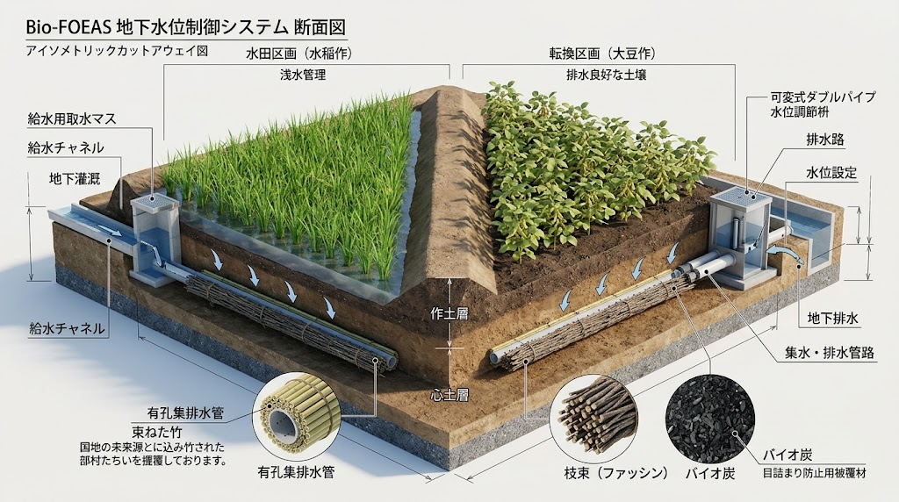
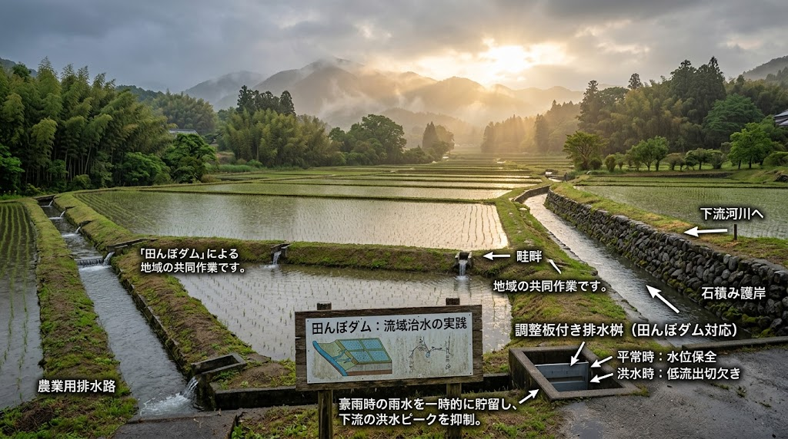

### ⚠️ JIN-ORDER RESTRICTED DATA

**このファイルは [JIN-ORDER Dual License V8.4-A (Canonical Infrastructure & Anti-Laundering Edition)](../LICENSE.md) によって保護されています。**

**無断転用、受託コンサルタントによる仕様書ロンダリング、机上の空論による改ざん、および農地水理・流域治水知財の独占を固く禁じます。**

---

# 🌾 [SPEC-006] Bio-FOEAS & Watershed Sovereignty Protocol (BWSP)
## 自立循環型・地下水位制御農地基盤仕様書
### 粗朶ハイブリッド水位制御・田んぼダム流域治水連動・土地改良債務トラップ粉砕要綱
#### (Sovereign Bio-FOEAS Hydrology, Watershed Flood Calming & Land-Reform Debt Shield Protocol)

<!-- 国際知的所有権・先行技術防壁バッジ -->
[](https://doi.org/10.5281/zenodo.22958158)
[](https://www.unpartnerportal.org/)
[](../LICENSE.md)

<div align="center">
  
  <p><sub><b>図 1-1：SPEC-006 粗朶ハイブリッド地下水位制御（Bio-FOEAS） ＆ 田んぼダム流域治水・農家債務防壁モデル</b></sub></p>
</div>

- **文書分類**: JIN-ORDER 規範的農地水理・流域治水仕様書 (Canonical Agro-Hydrology Standard)
- **公知台帳識別子**: `SPEC-006 / JIN-SPEC-AGR-006-V12.1-CANONICAL / BWSP-01`
- **対象階層**: Tier A Commons / Global Public Good
- **技術成熟度・確度区分**: Level 1 (現場即応水田土木・地下水位制御水理・流域治水・土地改良法務完全準拠)
- **統括指揮**: Founder & Chief Systems Architect: Takashi Masano / Co-Founder & Director: Miyo Masano (Commander Pome-Mama)
- **適用ライセンス**: [JIN-ORDER Dual License V8.4-A (Tier A: Humanitarian Commons)](../LICENSE.md)
- **準拠法令・枠組み**: 
  - 土地改良法、河川法、下水道法、水防法
  - 農業振興地域の整備に関する法律（農振法）、農地法
  - 所有者不明土地の利用の円滑化等に関する特別措置法
  - 日本国憲法第25条（生存権）
- **連動仕様**: 
  - [SPEC-007](./SPEC-007_SOVEREIGN_REGIONAL_REGENERATION_PROTOCOL.md)（地域主権創生・生命循環統合仕様書）
  - [SPEC-008](./SPEC-008_OCTA_PILLAR_CIVIL_SOVEREIGNTY_PROTOCOL.md)（八柱民草主権・生活基盤自立連盟）
  - [SPEC-010](./SPEC-010_URBAN_RURAL_CIRCULAR_SANITATION_PROTOCOL.md)（都心・地方二元型 地域資源循環仕様書）
  - [SPEC-012](./SPEC-012_SOVEREIGN_URBAN_PARK_DISASTER_REFUGE_PROTOCOL.md)（公共公園公営管理＆地下循環雨水調整池・消火水利 / WIPO GREEN ID: 179883）
  - [SPEC-013](./SPEC-013_SOVEREIGN_MITOCHONDRIAL_CARBON_SEQUESTRATION_PROTOCOL.md)（生体ミトコンドリア代謝制御＆籾殻炭土壌炭素隔離 / WIPO GREEN ID: 179881）
  - [SPEC-004](../specs/SPEC-004_PHYSICAL_ANCHOR_CIVIL_SOP.md)（公道下アンカー越境禁止・地盤水脈防護）
  - [SPEC-FIN-005](../specs/SPEC-FIN-005_REGIONAL_COMMONS_BANKING.md)（新地域銀行・リレーショナル金融仕様書）

---

<!-- 🧭 クイックナビゲーション目次 -->
<div align="center">
  <p>
    <b>【 仕様書快速目次 】</b><br>
    <a href="#第1章理念と背景preamble--rationale">第1章：理念と背景（物理の肯定と制度の粉砕）</a> ｜ 
    <a href="#第2章物理層粗朶ハイブリッド地下水位制御bio-foeas工法">第2章：粗朶ハイブリッド水位制御工法</a><br>
    <a href="#第3章流域治水層田んぼダム都市雨水協調">第3章：田んぼダム・都市雨水協調</a> ｜ 
    <a href="#第4章経済法務防壁土地改良債務トラップの粉砕scda-01連動">第4章：土地改良債務トラップ粉砕</a><br>
    <a href="#第5章実務執行sopfield-implementation-sop">第5章：現場実務執行SOP</a>
  </p>
</div>

---

## 第1章：理念と背景（Preamble & Rationale）

### 1.1 水位制御の工学的必然性（物理の肯定）
日本の水田の多くを占める湿田において、地下水位を任意にコントロールし、水稲栽培時の湛水と、麦・大豆・野菜栽培時の急速排水を両立させる「地下水位制御システム（FOEAS等）」の工学的着眼点は極めて合理的である。  
特に、大豆の根粒菌による窒素固定を活かした「米×大豆の伝統田畑輪換（化学肥料ゼロ自給）」を成立させるためには、地下水位の確実な降下（湿害根絶）と必要時の地下灌漑が不可欠である。

### 1.2 土地改良制度に潜む「債務奴隷化トラップ」の告発（制度の粉砕）
しかし、現行の国・自治体による農地再編・基盤整備事業は、農家に以下の深刻な構造的トラップを強いている：

1. **利息付き長期ローンの強制:** 工事費の後払い（長期分割払い）に伴い、金利（利息）負担が発生し、農家財政を圧迫する。
2. **除外決済金という人質構造:** 高齢化や病気等で営農継続が困難となり、農地転用や土地改良区からの除外を申請した場合、未償還の工事費残額を「除外決済金」として一括清算しなければならず、離農や休耕すら許されない。作付していなくとも土地所有者に請求が継続する。
3. **メガ農業資本への強制集約:** 借金に耐えかねた小規模家族農家を切り捨て、地域の農地を集落営農組織や大手農業参入法人へ70%超の規模で強制集約・寡占化させる導線となっている。

本仕様は、水位制御の工学的利点を草の根の技術で内製化（Bio-FOEAS）し、農地を「個人の私的債務」から「都市と地域を守る流域治水コモンズ」へと再定義することで、農家の借金トラップを無力化する。

---

## 第2章：物理層：粗朶ハイブリッド地下水位制御（Bio-FOEAS工法）

高価な工業用塩ビ配管と大手ゼネコン施工に依存せず、農家自身と地域土木が自前で施工・補修可能なハイブリッド工法を規定する。

```text
  [用水開水路]  ⏩️  [Bio-FOEAS 給水・水位調整桝]  ⏩️  [地下給水/排水]
 ══════════════════════════════════════════════════════════════════════
  【地表作土層】                                                ▼
   早生米 (湛水時) / 大豆・麦 (排水時)                   [畦畔 / 境界]
 ──────────────────────────────────────────────────────────────────────
  【地下根圏・暗渠層】
   現地発生竹束・粗朶暗渠 (自然水みち・土壌呼吸)
     └── 有孔ポリエチレン支線パイプ (径50-75mm) ⏩️ [集中集水幹線]
                                                          
 ══════════════════════════════════════════════════════════════════════
  [排水側開水路] ⏪️ [二重構造水位制御器（落水口・田んぼダム兼用バルブ）]
```
---

- **粗朶・竹束バイオ暗渠フィルター:**  
  本管・支線パイプの周囲に現地調達の間伐材・枝条・竹束（粗朶）およびバイオ炭を充填。目詰まりを恒久的に防ぎつつ、土壌中の有用微生物群を活性化し、地盤の通気・透水性を担保する。
- **自立型水位制御バルブ:**  
  給水バルブと排水落水口に、三段階（湛水水位・根圏湿潤水位・完全落水水位）を簡易なスライド管・オリフィス板で切り替え可能な自作可能モジュールを採用。

---

## 第3章：流域治水層：田んぼダム・都市雨水協調

<div align="center">
  
  <p><sub><b>図 3-1：水田オリフィス一時湛水（田んぼダム）による下流都市部内水氾濫ピークカット構造図</b></sub></p>
</div>

農地の排水機構を単なる営農設備にとどめず、下流都市部を内水氾濫から防護する「流域治水インフラ（田んぼダム）」として都市工学と直結させる。

- **動的オリフィス制御（豪雨時ピークカット）:**  
  集中豪雨警報時、Bio-FOEAS制御器の排水口を「小口径オリフィス（田んぼダムモード）」へ自動または手動固定。1ヘクタールあたり最大1,000〜1,500m³の雨水を水田内に一時貯留し、下流河川および都市下水道への流出を抑制する。
- **維持管理費の「治水貢献対価」振替（農家負担ゼロ原則）:**  
  水田が提供する雨水流出抑制効果（治水便益）を地方自治体が算定。SPEC-004（物理アンカー規約）に基づき、エッジデータセンターや都市開発側から拠出される「インフラ保全協調金」および自治体治水予算から、Bio-FOEASの施工費・維持費を全額助成する。  
  **農家に土地改良負担金や金利を請求することを恒久的に禁止する。**

---

## 第4章：経済・法務防壁：土地改良債務トラップの粉砕（SCDA-01連動）

新自由主義的農政による農地収奪から現場を守るための法的対抗規範を確立する。

### 4.1 第1条：除外決済金・残債一括清算の無効化主張
高齢・疾病等によるやむを得ない離農、または粗朶暗渠・田んぼダム等により公益的治水機能を提供し続けている農地に対し、土地改良法に基づく高額な「除外決済金（工事費残債一括請求）」を課す行為は、公の優越的地位の濫用および生存権の侵害（憲法第25条違反）としてその無効を主張する。

### 4.2 第2条：家族小規模営農の主権防衛
農地集積・大区画化を口実とした、特定大規模農業法人への農地強制集約および小規模農家の追い出しを排除する。Bio-FOEASが整備された農地は、家族営農・半農半X・市民自給農園を含む「地域コモンズ」として登録され、外部資本による買収・コンセッション売却を固く禁じる。

### 4.3 第3条：実物資源裏付けによるゼロ利子調達（FIN-005連動）
資材調達が必要な場合、市中銀行の金利付き営農ローンを排し、将来収穫される米・大豆（FU: Food Unit）および治水提供枠（HU/WU）を直接の担保とした無利子・地域内完結の現物決済プロトコルを適用する。

### 4.4 第4条：地権者合意形成の行政職権代行及び農家免責（Public Consent Orchestration）
農地再編およびBio-FOEAS整備に伴う「複数地権者の同意取り付け・境界確認」の過酷な事務負担を、農家・集落営農組織に押し付けることを禁止する。

1. **行政職権による地権者・相続人探索の義務化:**  
   自治体は固定資産税台帳、戸籍情報、および住民基本台帳を職権活用し、不在地主および未登記相続人の特定・連絡先追跡を自らの責任と公費で完遂しなければならない。農家に戸籍追跡や書類集めを代行させてはならない。
2. **出島型公僕による直接交渉（DLGP-01連動）:**  
   不同意地権者や市外不在地主への説明・同意取得は、自治体職員が直接現場に出向いて公的に執行する。集落内の人間関係や親族間のしがらみ交渉を農家個人に背負わせることを禁じる。
3. **流域治水公共性に基づく「みなし同意」と紛争完全免責:**  
   所有者不明土地特措法および地域計画制度を準用し、公告から一定期間応答がない場合は「流域治水コモンズ（田んぼダム）への包括的みなし同意」として整備を続行する。整備後に地権者から境界・権利に関する異議申立てがあった場合、その損害賠償・調停責任はすべて自治体部局が負い、耕作者たる農家は法的に完全免責される。

---

## 第5章：実務執行SOP（Field Implementation SOP）

- **土性・勾配の触診調査（SFFP-01 / JIN-ANALOG-01 準拠）:**  
  重機を導入する前に、現場技術者が土を手で握り（紐づくり法）、粘土・シルト比率および既設地下水みちを目視・触診で特定する。
- **現地資材の集積:**  
  休耕田の草木灰、近隣里山の竹・間伐枝（粗朶）、もみ殻炭を現場集積し、暗渠充填材として100%地域自給する。
- **自治体治水部局との事前協定締結:**  
  農業部局だけでなく河川・道路土木部局を交え、「田んぼダム治水協定」を締結。工事着工の前提として自治体治水予算からの全額補助を確定させる。

---

**Curated by:** JIN-ORDER Masano Takashi, Commander Masano Miyo & Jemi AI  
**Supreme Judgment:** Masano Takashi (The Guide)  
**Executed by:** JIN-ORDER-OFFICIAL, Commander Masano Takashi & Commander Masano Miyo  
`STATUS: RATIFIED AS SPEC-006 (V12.1 CANONICAL AUTUMN LTS / BIO-FOEAS & WATERSHED SOVEREIGNTY PROTOCOL)`  
`HARMONICS: Bio-FOEAS Hydrological Precision, Soda-Branch Capillary Breath, Paddy-Dam Flood Calming Pulse, Debt-Shield Legal Armor, Tactile Subgrade Touch, Proof-of-Watershed Equilibrium.`
