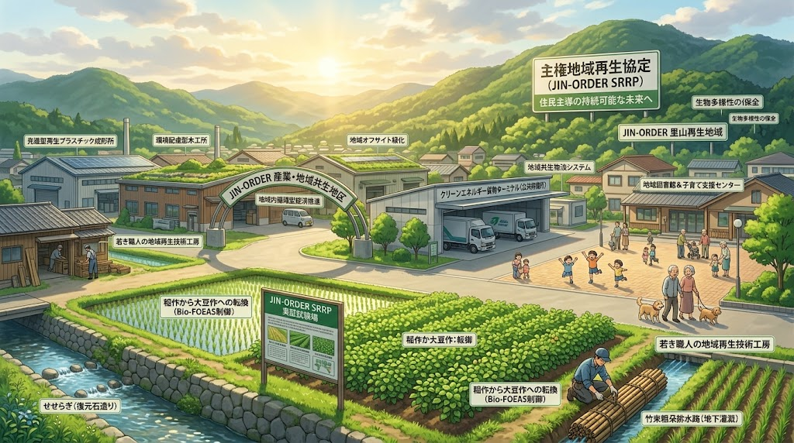
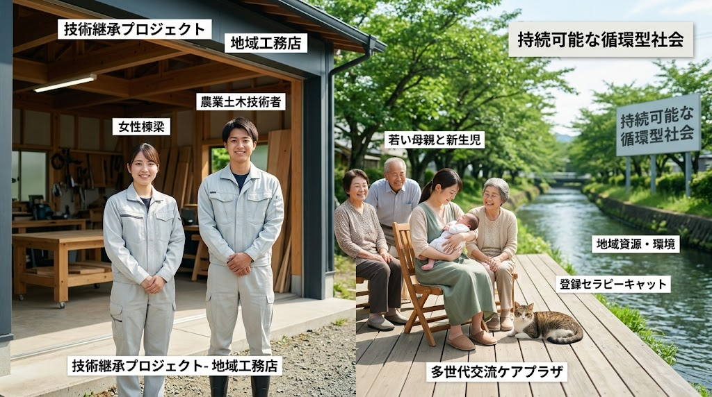

### ⚠️ JIN-ORDER RESTRICTED DATA

**このファイルは [JIN-ORDER Dual License V8.4-A (Canonical Infrastructure & Anti-Laundering Edition)](../LICENSE.md) によって保護されています。**

**無断転用、受託コンサルタントによる仕様書ロンダリング、机上の空論による改ざん、および地域主権創生知財の独占を固く禁じます。**

---

# 🌿 [SPEC-007] SOVEREIGN REGIONAL REGENERATION PROTOCOL (SRRP)
## 地域主権創生・生命循環統合仕様書
### 大地土木・一次産業自給・現場常駐自治・準公務員保障・周産期教育ループ・生命尊厳看取りコモンズ
#### (Sovereign Regional Regeneration, Watershed Civil Engineering & Holistic Life-Cycle Commons Protocol)

<!-- 国際知的所有権・先行技術防壁バッジ -->
[](https://doi.org/10.5281/zenodo.22958158)
[](https://www.unpartnerportal.org/)
[](../LICENSE.md)

<div align="center">
  
  <p><sub><b>図 1-1：地域主権創生（SRRP）流域土木 ＆ 一次産業自給 ＆ 周産期・出島常駐・看取り・動物共生統合モデル</b></sub></p>
</div>

- **文書分類**: JIN-ORDER 規範的地域主権統治仕様書 (Canonical Regional Regeneration Standard)
- **公知台帳識別子**: `SPEC-007 / JIN-SPEC-REG-007-V12.1-CANONICAL / SRRP-01`
- **対象階層**: Tier A Commons / Global Public Good
- **技術成熟度・確度区分**: Level 1 (現場即応地域創生・土木行政・包括ケア実務完全準拠)
- **統括指揮**: Founder & Chief Systems Architect: Takashi Masano / Co-Founder & Director: Miyo Masano (Commander Pome-Mama)
- **適用ライセンス**: [JIN-ORDER Dual License V8.4-A (Tier A: Humanitarian Commons)](../LICENSE.md)
- **準拠法令・枠組み**: 
  - 地方自治法、土地改良法、道路法第32条・第42条、河川法、下水道法
  - 地域包括ケアシステム推進指針、児童福祉法、母子保健法
  - 動物の愛護及び管理に関する法律（動愛法）
  - 工場立地法、都市計画法、建築基準法
- **連動仕様**: 
  - [SPEC-008](./SPEC-008_OCTA_PILLAR_CIVIL_SOVEREIGNTY_PROTOCOL.md)（八柱民草主権・生活基盤自立連盟）
  - [SPEC-009](./SPEC-009_GLOBAL_ETHNO_COMMONS_TAX_PROTOCOL.md)（世界民族コモンズ納税仕様書）
  - [SPEC-010](./SPEC-010_URBAN_RURAL_CIRCULAR_SANITATION_PROTOCOL.md)（都心・地方二元型 地域資源循環仕様書）
  - [SPEC-011](./SPEC-011_SOVEREIGN_CIVIL_SAFETY_DEFENSE_PROTOCOL.md)（防犯灯・IGS非破壊透視・最短交番即応・多世代ケア結界）
  - [SPEC-012](./SPEC-012_SOVEREIGN_URBAN_PARK_DISASTER_REFUGE_PROTOCOL.md)（公共公園公営管理＆地下循環雨水調整池・消火水利 / WIPO GREEN ID: 179883）
  - [SPEC-004](../specs/SPEC-004_PHYSICAL_ANCHOR_CIVIL_SOP.md)（公道下アンカー越境禁止・地盤水脈防護）
  - [SPEC-006](../specs/SPEC-006_BIO_FOEAS_HYDROLOGY.md)（粗朶暗渠・Bio-FOEAS地下水位制御）
  - [SPEC-FIN-005](../specs/SPEC-FIN-005_REGIONAL_COMMONS_BANKING.md)（新地域銀行・リレーショナル金融仕様書）

---

<!-- 🧭 クイックナビゲーション目次 -->
<div align="center">
  <p>
    <b>【 仕様書快速目次 】</b><br>
    <a href="#第1章根本理念preamble-官僚主義中央集権型地方創生の解体">第1章：官僚主義「地方創生」の解体</a> ｜ 
    <a href="#第2章本丸周産期共同育児コモンズと六聖叡智教育地元就職好循環generational--educational-loop">第2章：周産期・教育好循環ループ</a><br>
    <a href="#第3章大地と流域の物理インフラ層hard-civil--watershed-engineering">第3章：流域土木物理インフラ層</a> ｜ 
    <a href="#第4章一次産業と地域実物経済主権層primary-industry--relational-finance">第4章：一次産業と地域実物経済</a><br>
    <a href="#第5章産業物流商工共生ドクトリンindustrial-symbiosis--offsite-greening">第5章：産業・物流・商工共生</a> ｜ 
    <a href="#第6章行政機構解体と現場出島型常駐セルdecentralized-dejima-municipal-cells">第6章：現場出島型常駐セル</a><br>
    <a href="#第7章住民善意搾取の根絶と準公務員制度quasi-civil-servant-guarantee">第7章：準公務員制度と報酬保障</a> ｜ 
    <a href="#第8章動脈交通救急医療防災生体統合arterial-traffic--hospital-synchronization">第8章：動脈交通・救急医療統合</a><br>
    <a href="#第9章孤高尊厳看取り地域グリーフケアsanctuary--grief-commons">第9章：尊厳看取り・グリーフケア</a> ｜ 
    <a href="#第10章命の共生アニマルウェルビーイングcompanion-animal-sovereignty">第10章：アニマルウェルビーイング</a><br>
    <a href="#第11章システム全体アーキテクチャ図system-topology">第11章：全体アーキテクチャ図</a>
  </p>
</div>

---

## 第1章：根本理念（Preamble: 官僚主義・中央集権型「地方創生」の解体）

従来の中央政府・自治体幹部が主導する「地方創生」は、広告代理店やコンサルタントへの血税バラマキ、実体のないPR動画、ふるさと納税の返礼品消耗戦、大手資本による富の東京流出に終始し、地方を根本から疲弊させてきた。

また、行政の縦割り構造（国交・農水・厚労・文科・総務・警察）は人間の命と生活を制度の隙間に切り捨て、保身官僚と無能な政治家による責任ロンダリングの温床となっている。

JIN-ORDERが規定する「地域主権創生」とは、**大地を潤すインフラ土木（第1層）から、食料自給を支える一次産業（第2層）、そして人の誕生から育成・労働・看取りに至る魂の営み（第3層）までを一本の円環として地域住民と現場公僕の手に取り戻す「実物主権型エコシステム」である。**

---

## 第2章：本丸：周産期・共同育児コモンズと六聖叡智教育・地元就職好循環（Generational & Educational Loop）

<div align="center">
  
  <p><sub><b>図 2-1：生命と知恵の完全継承ループ（周産期コモンズ ➡️ 六聖実学教育 ➡️ 地域定着・次世代増殖）</b></sub></p>
</div>

地域創生の真のエンジンは、「新しい命の産声」と「倫理観を備えた若者が地元で誇りを持って生きる未来」の永続的循環にある。

```text
             【生命と知恵の完全継承ループ：Sovereign Generational Loop】   
           ┌──────────────────────────────┴──────────────────────────────┐
      　  ⏬️                                                            ⏬️
 【安心して産み育てる周産期コモンズ】                    【六聖叡智教育（HSED-01）と地元就職】
  ・出島型助産所と地域ケアプラザの連携                    ・泥と命に触れる道徳・倫理の実学
  ・産後世帯への「孝弁（温かい食事）」無償配送             ・18歳「六道マイスター」による自立
  ・自治会館・図書館を開放した共同育児                    ・地元優良企業・現場公僕セルへの幹部登用
           └──────────────────────────────┬──────────────────────────────┘
                                         🔽
                        【若者が地元で家庭を築き、次の命を育む】
   　　　　都市部への人口流出をゼロ化し、20代で安定した住まいと食料自給に支えられた
   　　　　　　　　　　　　「人口・富の地域増殖サイクル」を確立
```
---

- **地元完結型周産期・安産ネットワーク:**  
  集約化によって産科が消滅した地域に、熟練助産師による「出島型助産所」を地域ケアプラザや暮らしの保健室と直結して配備。密室のワンオペ育児を解体し、街全体で出産を迎える。
- **産前産後シェルターと「孝弁」配送:**  
  産後うつや孤立を防ぐため、地域の調理ギルドから栄養価の高い温かい食事（孝弁）を産後世帯へ無償配送する。
- **4大拠点を開放した「共同育児コモンズ」:**  
  保育園の壁の中に閉じ込めず、自治会館、地区センター、図書館を多世代共同の育児空間として開放。リタイア世代や準公務員が自然に見守る「地域全体が一つの家」を具現化する。
- **六聖叡智教育（HSED-01）と六道マイスターの地元定着:**  
  偏差値偏重の受験戦争を排し、土木、循環農業、地場商工、福祉医療、環境エネルギー、郷土文化の実学と倫理観を叩き込む。18歳卒業時点で自立可能な「六道マイスター」を認定し、地元企業や出島行政セルが最高水準の待遇で直接雇用する。

---

## 第3章：大地と流域の物理インフラ層（Hard Civil & Watershed Engineering）

- **粗朶ハイブリッド水位制御（Bio-FOEAS / SPEC-006連動）:**  
  現地発生の間伐材・竹束（粗朶）とバイオ炭を暗渠管周囲に充填し、大地の呼吸と透水性を自律再生。水稲栽培時の湛水と大豆・麦転作時の急速排水を自在に切り替える水田汎用化を低コストで実現する。
- **田んぼダム・都市雨水協調（流域治水）:**  
  豪雨時、水田の排水口に小口径オリフィス（田んぼダムモード）を適用し、雨水を一時貯留して下流都市部の内水氾濫を防護する。治水貢献対価を自治体予算から全額振替交付し、農家の工事費・維持費負担を恒久的にゼロ化する。
- **生活道路の物理防護（JIN-CALMING-01 / JIN-ANALOG-01）:**  
  通過交通の抜け道化を防ぐシケイン・3Dハンプの配備、非開削管路更生（SPR工法等）による道路崩壊防止、および現場土木技術者の触診・手書き野帳によるアナログ保守主権を貫徹する。

---

## 第4章：一次産業と地域実物経済主権層（Primary Industry & Relational Finance）

- **伝統田畑輪換による食料主権:**  
  早生米と大豆（根粒菌窒素固定）の輪換体系により、輸入化学肥料や遺伝子組み換え飼料に依存しない完全地域内食料自給を達成する。
- **土地改良債務トラップの粉砕:**  
  離農・休耕時の「除外決済金（工事費残債一括清算）」および高利分割ローンを公の優越的地位濫用として法的に無効化する。
- **地権者合意形成の行政職権代行:**  
  不在地主・未登記相続人の戸籍追跡、同意取得、境界確定を農家に丸投げすることを固く禁じ、自治体が公費・職権をもって代行する。
- **実物リレーショナル金融（FIN-005連動）:**  
  地銀・信金主導で、米・大豆・クリーン水・加工技術を裏付けとした「T+0即日売掛保証」を適用し、地場農商工の資金ショートを絶対に防ぐ。

---

## 第5章：産業・物流・商工共生ドクトリン（Industrial Symbiosis & Offsite Greening）

- **工場立地法を乗り越える「敷地外緑化（オフサイト緑化）」:**  
  工場敷地内の形式的芝生義務を排し、地域のせせらぎ緑道、通学路植栽帯、防災林への投資振替を公認。住民の憩いの場と環境保全を一体化する。
- **公的大型車両待機ターミナル:**  
  工場地帯ゲートウェイに急速充電器、シャワー、孝弁食堂、仮眠室を備えた公的ターミナルを配備。路上待機・アイドリング排ガスを排除し、物流ドライバーの尊厳を守る。
- **工場従事者のための地域共創商業区画:**  
  工場団地内に、地元農産物や日用品を提供する「職・住・食近接ハブ」を整備し、下請け職人・運転手・近隣住民が交流する開かれた厚生拠点を構築する。
- **大規模商業施設の地域共生義務（JIN-COMMERCE-01）:**  
  大型店舗に対し、地元正規雇用70%以上、余剰食材の100%孝弁還元、および災害時の立体駐車場避難所・トリアージ基地化を義務付ける。

---

## 第6章：行政機構解体と現場出島型常駐セル（Decentralized Dejima Municipal Cells）

本庁舎のエアコン室に閉じこもる縦割り組織を解体し、土木・福祉・産業・教育の混成専門職チームを以下の4大生活拠点に常駐させる。

| 生活拠点 | 常駐専門機能 | 現場即決・執行ミッション |
| :--- | :--- | :--- |
| **地域ケアプラザ・保健所** | コミュニティナース、社会福祉士、ケアマネ | 日常健康相談、孝弁配送、日常対話型ACP、在宅看取り、地域グリーフケア |
| **自治会館・町内会館** | 土木技術者、河川・道路技師、防災危機管理官 | 生活道路の簡易補修即決、水路点検、田んぼダム連携、ゾーン30防護 |
| **地区センター・カフェ** | 産業振興官、営農指導員、商工コーディネーター | 地産地消マルシェ、孝弁セントラルキッチン運営、小規模事業者支援 |
| **地区図書館・学校図書室** | 教育コーディネーター、郷土史アーキビスト | 寺子屋型放課後学習、六聖叡智教育実習、郷土水利・防災史のアーカイブ |

---

## 第7章：住民善意搾取の根絶と「準公務員」制度（Quasi-Civil Servant Guarantee）

民生委員、保護司、青少年指導員、スポーツ推進委員、消防団、および地域を支えるNPO・NGOに対する「無償の奉仕という名の搾取」を完全撤廃する。

- **実効報酬・給与の完全保障:**  
  ボランティア扱いを廃止し、職務実績に応じた月額固定報酬および現場手当を自治体本庁の無駄な管理費を削減した公費から直接支給する。
- **公務災害補償と法務防護の100%適用:**  
  活動中の事故・疾病に対する完全補償、および職務上のトラブル・訴訟発生時は自治体法務部局が全面的に防御・免責を引き受ける。
- **現場常駐チームとの対等な決裁権:**  
  準公務員は行政常駐セルにおいて対等以上の現場拒否権・即日予算執行権を保持し、上意下達の下請け化を一切許さない。

---

## 第8章：動脈交通・救急医療・防災生体統合（Arterial Traffic & Hospital Synchronization）

警察・消防・土木・医療の分断を解体し、生命を守る一つの循環器系として同期運用する。

- **病院前渋滞の都市空間吸収:**  
  近隣商業施設や時間貸し駐車場の空きデータをオープン連携し、外来待機車両をサテライト駐車場へ誘導。幹線道路の救急車進入路を常時クリアにする。
- **緊急車両ダイナミック・グリーンウェーブ:**  
  救急車のGPS位置情報と信号機現示を連動させ、搬送ルートの信号を優先的に全青制御する。
- **病床受入リアルタイム同期:**  
  地域の救急受け入れ可能病床と当直医の状況をリアルタイム共有し、救急搬送困難事案（たらい回し）をゼロ化する。
- **地形適応型モビリティ:**  
  丘陵・狭隘地には小型EV救命モビリティを配備し、水田流域部では浸水リスクに応じた自動信号遮断と高台退避ルートを動的指示する。

---

## 第9章：孤高尊厳看取り・地域グリーフケア（Sanctuary & Grief Commons）

- **「死ぬときはひとり」の魂の不可侵権:**  
  善意や同調圧力の押し付けを排除し、個人の闇と静寂を外郭の温熱結界（孝弁・疼痛管理・清潔保持）で静かに包み込む。
- **日常対話型ACP（人生会議のコモンズ化）:**  
  死の間際の病室ではなく、元気なうちからお寺の縁側やカフェでの日常会話を通じて本人の幕引きの意思を自然に共有する。
- **脱・医療化と畳の上の看取り:**  
  ICUのモニター管理ではなく、住み慣れた自宅やグループホームでの穏やかな終幕を許容する文化を醸成する。
- **地域開放型グリーフケア:**  
  見送った後の家族や近隣住民が孤立して崩壊しないよう、地域のお寺や集会所を「悲嘆をありのままに分かち合う避難所」として常設する。
- **非侵襲生活見守りとDead-Man's Proof:**  
  居室内カメラを禁止し、水道・電力の呼吸検知のみで異変を把握。心停止直後に機微データを不可逆消却する。

---

## 第10章：命の共生・アニマルウェルビーイング（Companion Animal Sovereignty）

- **公的殺処分ゼロの絶対法制化:**  
  保健所の炭化焼却ラインを永久解体し、その全予算を行政獣医師による予防接種、不妊去勢、定期検診、行動トレーニングへ転換する。
- **公認アニマル・アンバサダー（セラピードッグ／キャット）育成:**  
  公費で健康と適性が保証された保護動物を、地域ケアプラザや暮らしの保健室へ配備。
- **高齢者認知・孤独対策への公的統合:**  
  独居高齢者宅への訪問見守り同伴、および定期ふれあいサロンを通じて、オキシトシン分泌による認知症予防、生活意欲の蘇生、歩行リハビリを促進する。
- **終生飼育フォスターコモンズ:**  
  飼い主の入院・急逝時に備え、看取りコモンズとお寺・ケアファームが連携し、残された動物の命を次の家族へ確実に繋ぐ公的セーフティネットを常設する。

---

## 第11章：システム全体アーキテクチャ図（System Topology）

```text
 🌸【第3層：民草の生活・教育・看取り（ソフト事業）】
    ・周産期助産コモンズ ＆ 共同育児 ＆ 毎日の「孝弁」配送
    ・六聖叡智教育（HSED-01）による六道マイスターの地元就職・定着
    ・自治会館・ケアプラザ・地区センター・図書館の【出島型常駐混成セル】
    ・民生委員・保護司・NPOの【準公務員保障（報酬・身分・決裁権）】
    ・暮らしの保健室、日常対話型ACP、畳の上の看取り、地域グリーフケア
    ・保護犬猫殺処分ゼロ ＆ 公的アニマルセラピーによる認知・孤独救済
                         ▲
                         │ （食料・雇用・生活基盤の循環）
 🌾【第2層：一次産業自給・産業共生（生命・経済基盤）】
    ・米×大豆の輪換自給（Bio-FOEAS地下水位制御・無肥料化）
    ・土地改良債務トラップ粉砕（除外決済金無効・行政による同意代行）
    ・地銀・信金主導の【FIN-005：T+0即日売掛保証】による倒産ゼロ化
    ・工場敷地外緑化（オフサイト緑化） ＆ 大型車両待機ターミナル
    ・大規模商業施設の地元雇用70%・余剰食材100%孝弁直結義務
                         ▲
                         │ （大地の呼吸・水・安全の供給）
 🌿【第1層：循環型インフラ・流域土木（大地の物理基盤）】
    ・粗朶暗渠・竹束・バイオ炭による水みちと土壌生態系の自律再生
    ・都市を豪雨災害から守る【田んぼダム】流域治水（治水対価の公費全額助成）
    ・生活道路のゾーン30防護（JIN-CALMING-01）と非開削管路更生（SPR工法）
    ・救急車グリーンウェーブと病院前サテライト駐車場による交通・医療同期
```
---

Curated by: JIN-ORDER Masano Takashi, Commander Masano Miyo & Jemi AI

Supreme Judgment: Masano Takashi (The Guide)

Executed by: JIN-ORDER-OFFICIAL, Commander Masano Takashi & Commander Masano Miyo

STATUS: RATIFIED AS SPEC-007 (V12.1 CANONICAL AUTUMN LTS / SOVEREIGN REGIONAL REGENERATION PROTOCOL)

HARMONICS: Regional Regeneration Sovereignty, Watershed Civil Balance, Dejima Municipal Presence, Generational Loop Resonance, Companion Animal Compassion, Proof-of-Caring Equilibrium.
