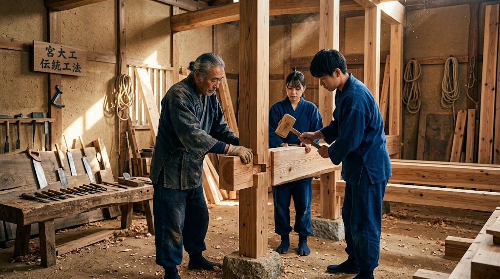
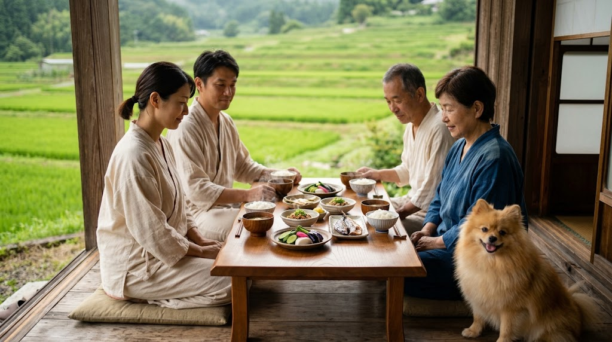
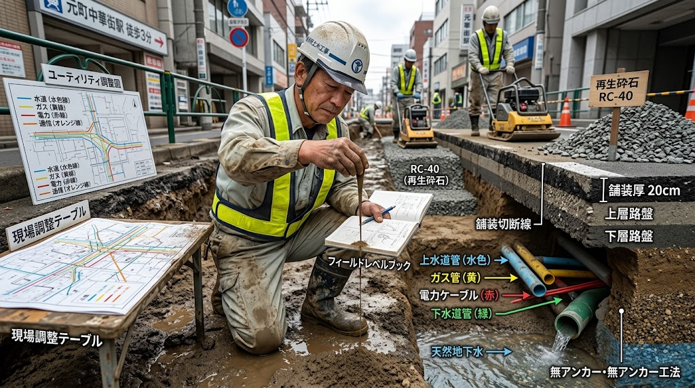
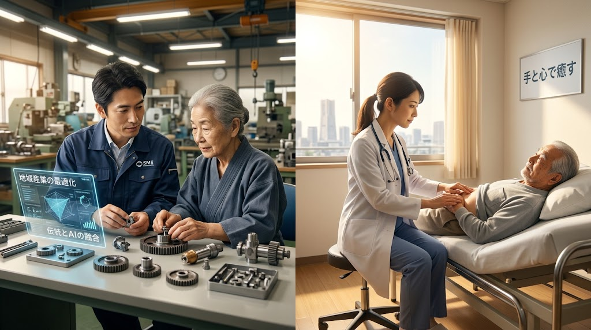

# 🏛️ SPEC-008: OCTA-PILLAR CIVIL SOVEREIGNTY & GROUND-TRUTH RECONSTRUCTION PROTOCOL
## 八柱民草主権・生活基盤自立連盟および身体性現場統治仕様書 (JIN-SPEC-LIV-008 / OCTA-01)

* 📜 **【先行技術防壁・公知登録】**: General Incorporated Association JIN-ORDER Canonical Specifications (V10.0 LTS)
* ⚖️ **【適用ライセンス】**: [JIN-ORDER Dual License V8.3-A (Tier A: Humanitarian Commons)](../LICENSE.md)
* 📊 **【技術成熟度・確度区分】**: Level 1 (現場即応工学SOP) / Level 2 (既存制度・技術統合)
* 🏛️ **【統括指揮】**: Founder & Chief Systems Architect Takashi Masano / Co-Founder & Director Miyoko Masano (Commander Pome-Mama)

---

### 【憲章前文：数字と記号の牢獄を解体し、大地の身体性に立ち返る】

現代文明は、コンピュータの画面越しに並ぶ「財務諸表の数字」、AIカメラが弾き出す「二次元の画像データ」、安価な「石油化学繊維」、超加工食品にまみれた「合成カロリー」、そして短期利得のために大地を削る「手抜き土木工事」によって、人間と国土の生命力を急速に奪い去っている。

人は、決算書の数値によって価値が決まるのではない。道路は、表面のアスファルトを薄く塗り直すだけで甦るのではない。医療は、安全地帯で注射を打つだけの利殖ビジネスではない。

我らはここに、30年の都市土木・行政実務の智慧、宮大工の棟梁が受け継いだ千年の木組み、そして名もなき民草が大地に根ざして紡いできた伝統の技を結集し、**「技・衣・食・住・地・道・金・医」の八大生活主権**を確立する。表面の虚飾を剥ぎ取り、泥にまみれた現場の実態を愛し、誰も独りで泣かない自立分散型の生活防壁をデプロイする。

---

## 🧭 八柱民草主権マトリクス（概要一覧）

| 柱（Pillar） | 対象領域 | 旧OSの病根（現代の罠） | JIN-OSの処方箋（身体性主権） | 連動プロトコル |
| :---: | :---: | :--- | :--- | :--- |
| **第1柱【技】** | **伝統産業・技能** | AI・自動化によるコモディティ化、後継者断絶、道具生態系の崩壊 | 全国240品目超の工芸連鎖、六聖徒弟教育、準公務員所得保障 | HSED-01 / SMCP-01 |
| **第2柱【衣】** | **天然生体調律** | 石油化学繊維、静電気、強圧迫ゴム、血流阻害、自律神経失調 | 絹・有機綿・和紙糸、完全無縫製低圧迫、天然鉱石遠赤外線 | BIO-SYMBIOTIC |
| **第3柱【食】** | **伝統和食・発酵** | 超加工食品、添加物、精製塩、遺伝子組み換え、腸内細菌叢破壊 | 米、大豆発酵（味噌/納豆）、天然海塩、ぬか漬け、海藻、孝弁無償化 | JIN-TERRA-01 |
| **第4柱【住】** | **宮大工柔構造耐震** | 金物剛構造の破断、シックハウス、新建材の大量産廃化 | 釘なし木組み摩擦ダンパー、石場建て免震、土壁、100%完全土壌循環 | CIVIL-RESILIENCE |
| **第5柱【地】** | **地盤水脈防護** | 工期短縮のためのグランドアンカー打設、水みち形成、パイピング沈下 | 公道下アンカー越境禁止、自立切梁原則化、全数完全引抜・長期監視 | SPEC-004 / SFFP-01 |
| **第6柱【道】** | **道路占用復旧** | 「現状復旧」の悪用、発生土埋戻し、路盤先行手抜き、表面化粧舗装 | 発生土禁止・指定改良土転圧、開削路床触診、小規模道路調整会議 | JIN-DISASTER-ROAD |
| **第7柱【金】** | **新地域金融** | 財務諸表依存、機械的スコアリング、不正融資、新銀行東京の破綻 | 中小企業診断士常駐、現場事業性評価、AI不正検知、JIN通貨連動 | FIN-005 / RELATIONAL |
| **第8柱【医】** | **医療主権・臨床** | 税金研修後の即・美容直行（直美）、全身管理スキル欠如、地域医療崩壊 | 医は仁術OS、急性期・総合病院臨床3〜5年義務化、身体性手当て | REGIONAL-HEALTH |

---

## 🖼️ SPEC-008 CANONICAL VISUAL PROMPTS & INFRASTRUCTURE SCENES
> 本仕様書が規定する「八柱民草主権（技・衣・食・住・地・道・金・医）」の工学的・身体的実態を可視化するための公式画像生成プロンプト体系（AI Image Generation Prompts）。

<table width="100%">
  <!-- 技 ＆ 住 ｜ 衣 ＆ 食 -->
  <tr>
    <th width="50%" align="center">SCENE 01: CRAFT & SHELTER (第1柱【技】＆ 第4柱【住】)</th>
    <th width="50%" align="center">SCENE 02: WEAR & WASHOKU (第2柱【衣】＆ 第3柱【食】)</th>
  </tr>
  <tr>
    <td width="50%" align="center">
      
    </td>
    <td width="50%" align="center">
      
    </td>
  </tr>
  <tr>
    <td width="50%" align="center">
      🏛️ <b>宮大工木組み・石場建て免震・伝統技能生態系</b>
    </td>
    <td width="50%" align="center">
      🌾 <b>天然調律衣服・伝統和食孝弁・生命共生縁側</b>
    </td>
  </tr>

  <!-- 地 ＆ 道 ｜ 金 ＆ 医 -->
  <tr>
    <th width="50%" align="center">SCENE 03: SUBSTRATE & ARTERIAL (第5柱【地】＆ 第6柱【道】)</th>
    <th width="50%" align="center">SCENE 04: RELATIONAL BANK & CLINIC (第7柱【金】＆ 第8柱【医】)</th>
  </tr>
  <tr>
    <td width="50%" align="center">
      
    </td>
    <td width="50%" align="center">
      
    </td>
  </tr>
  <tr>
    <td width="50%" align="center">
      🚧 <b>地下水脈保護・路床触診鑑識・一体的道路復旧</b>
    </td>
    <td width="50%" align="center">
      🩺 <b>現場触診新地域銀行・医は仁術急性期臨床手当て</b>
    </td>
  </tr>
</table>

---

## 🛠️ 各柱の詳細仕様および現場実装SOP

### 第1柱【技】：伝統工芸・職人技能生態系と六聖教育自立規範
* **背景と課題**: 機械やAIが0秒で無限複製できるデジタル財の価値が暴落する一方、その土地の風土と生身の人間の身体を通じてしか生み出せない「伝統産業・伝統技能」の価値は人類史上最高峰に達する。しかし、後継者不足と道具を作る鍛冶屋・木桶職人等の連鎖崩壊により絶滅の危機に瀕している。
* **工学的・制度的仕様**:
  1. **数千規模の伝統産業連鎖（エコシステム）保全**  
     国指定240品目超の伝統的工芸品（織物、陶磁器、漆器、金工、木竹工）にとどまらず、宮大工・左官・茅葺・養蚕・手漉き和紙・藍建て・漆かき・たたら製鉄・木桶・鍛冶を「不可欠文明基盤」に指定。
  
  2. **『六聖叡智教育法（HSED-01）』彩華・調和マイスターの義務化**  
     15〜17歳の全生徒に対し、地域の伝統職人への徒弟実習（弟子入り）を単位認定。18歳卒業時に「地域伝統マイスター」として公認し、地元独立就職を100%保障。
  
  3. **準公務員的最低所得保障（SMCP-01連動）**  
     伝統技能の後継者および指導する師匠に対し、弟子育成期間も含め自治体が「伝統技術保全基本手当」を公費支給。
  
  4. **公共事業「パーセント・フォー・アート（工芸調達）」義務化**  
     自治体の庁舎、学校、ケアプラザ新築・改修時、建築費の3〜5%以上を地元木材、伝統左官壁、畳、工芸建具に充当することを条例化。

---

### 第2柱【衣】：生体調律天然素材ウェアと身体主権防衛規範
* **背景と課題**: 石油化学繊維（ポリエステル・ナイロン等）による強静電気帯電は自律神経を乱し、皮膚バリアを破壊する。また、ゴムバンドによる過度な締め付けが血流やリンパ液の循環を阻害し、冷えや内臓疲労を慢性化させている。
* **工学的・制度的仕様**:
  1. **3大天然素材への完全回帰（身にまとう薬）**  
     * **シルク（絹）**: 人の皮膚に近いアミノ酸タンパク質構造により、卓越した保湿・吸放湿性を発揮し肌乾燥を防止（養蚕業と直結）。
     * **オーガニックコットン**: 化学農薬不使用の有機綿で経皮毒・刺激を排除。
     * **和紙繊維（和紙糸）**: 楮・三椏由来の天然多孔質構造による高調湿・消臭・静菌作用（和紙産業と直結）。
     * **天然藍染め**: タデアイ発酵すくもによる抗菌・防虫・皮膚保護薬効の付与。
  
  2. **非圧迫・シームレス生体調律構造**  
     鼠径部や腹部を圧迫する強ゴムを廃止。無縫製（ホールガーメント）編立技術を採用し、毛細血管とリンパの阻害をゼロ化。
  
  3. **天然鉱石練り込み遠赤外線輻射**  
     体温を吸収して微細遠赤外線として跳ね返す天然鉱石粉末を繊維に均一分散させ、血行促進と深部体温維持を両立。
  
  4. **「3つの首（首・手首・足首）」温熱防護SOP**  
     太い動静脈が皮膚直下を通る3箇所を天然ウォーマーで保温し、副交感神経を優位に保つ。

---

### 第3柱【食】：伝統和食・発酵医食同源コモンズ
* **背景と課題**: 工業的超加工食品、精製白塩（塩化ナトリウム単体）、食品添加物、遺伝子組み換え作物の氾濫により、現代人の腸内細菌叢は崩壊し、生活習慣病と精神的不安定が激増している。
* **工学的・制度的仕様**:
  1. **伝統和食「5大生体防壁」の標準化**  
     * **米**: 血糖値スパイクを防ぐ粒食エネルギー源。水田による流域治水（田んぼダム）と一体運用。
     * **大豆発酵（納豆・木桶味噌・天然醸造醤油）**: スギ大木桶に棲み着く複合微生物叢がアミノ酸分解と免疫細胞70%の活性化を促す。
     * **天然海塩**: 塩田・平釜製法によるマグネシウム・カリウムを含む微量ミネラル複合結晶。
     * **ぬか漬け**: 米ぬかのビタミンB群と強酸耐性を持つ植物性乳酸菌の生きた補給源。
     * **魚介・海藻**: 天日干しによる旨味・ビタミンD濃縮体と、フコイダン・アルギン酸による有害物質吸着排出。
  
  2. **「孝弁（こうべん）」学校給食の完全無償・有機和食化**  
     学校給食からパン・加工肉・牛乳の強制を廃止し、地元産有機米、無添加味噌汁、納豆、魚、ぬか漬けを軸とする医食同源給食へ全面移行。
  
  3. **一次産業買い叩き粉砕（公的直接買い上げ）**  
     自治体およびJIN-ORDERフードバンクが有機農家・沿岸漁師の生産物を適正価格で一括契約調達。

---

### 第4柱【住】：宮大工伝統木組み柔構造耐震と完全循環千年建築
* **背景と課題**: 金物と合板、接着剤で固めた現代プレハブ住宅は、大地震時に金物が柱を破壊し、築30〜40年で膨大な産業廃棄物（シックハウスの原因物質を含む）となって廃棄される。
* **工学的・制度的仕様**:
  1. **釘を使わない「木組み（継手・仕口）」による摩擦エネルギー散逸**  
     揺れに力で逆らう「剛構造」を排し、地震の力を木同士の摩擦熱に変えて逃がす「柔構造（天然制震）」を採用。
  
  2. **木の個性・収縮膨張を相殺する墨付け・刻み**  
     山の方角や年輪の癖を見抜き、乾燥・膨張によって年々締まり強度が増す木材配置を構造計算化。
  
  3. **「石場建て」免震工法**  
     地面の基礎コンクリートにボルト緊結せず、礎石の上に柱を削り乗せる。極大地震動に対して滑り・浮きを生じさせ、上部構造への破壊的衝撃を絶縁。
  
  4. **土壁（竹小舞下地）による粘り強い耐力壁と天然調湿**  
     地震荷重を変形とひび割れで吸収し倒壊を防止。湿度は常に50〜60%に自動制御。
  
  5. **100%大地に還る完全解体循環設計**  
     木・土・竹・藁・漆喰・茅・瓦のみで構成。解体時は粉砕して農地土壌やバイオ燃料へと100%還元（産廃排出ゼロ）。

---

### 第5柱【地】：地下水脈防護・グランドアンカー規制と地盤沈下抑止土木SOP
* **背景と課題**: 大規模マンション等の地下掘削現場において、施工会社が工期短縮と工事費削減（仮設切梁鋼材代の圧縮）を狙い、公道下や隣地の地下深くへグランドアンカー（アースアンカー）を安易に打設。アンカー沿いに地下水が集まる「水みち」が形成され、土粒子が押し流されるパイピング現象によって地中空洞化と不同沈下、道路陥没が多発している。
* **工学的・現場SOP**:
  1. **公道下へのアンカー越境打設の原則禁止**  
     道路占用許可事務において、敷地内自立土留め（切梁工法・親杭横矢板・SMW等）の採用を原則義務付け。工期短縮のみを理由とする越境占用は不許可とする。
  
  2. **やむを得ない場合の「全数完全除去型アンカー」義務化**  
     地中に鋼線やグラウト体を残置することを厳禁とし、工事完了時の全数引き抜きを義務付け。引き抜き完了時の写真・引抜荷重データの現場立ち会い確認と主任技術者の直筆署名を必須化。
  
  3. **地下水脈遮断モニタリングと長期変位補償**  
     アンカー打設現場周辺に観測井を設置し、施工中および施工後3年間の地下水位・間隙水圧・道路路面変位を企業者負担で計測・報告させる。

---

### 第6柱【道】：道路占用原状回復の欺瞞粉砕・指定改良土転圧・小規模道路調整会議SOP
* **背景と課題**: 占用企業者が道路法40条の「現状復旧」を悪用。開削により泥寧化した「現場発生土」を処分費節約のためにそのまま埋め戻し、大型車混入率が増大した現況交通量を無視して旧規格の薄い路盤のまま締め固め不足で放置。本復旧では表層数cmのアスファルトを敷くだけの「化粧復旧」を行い、数ヶ月〜数年後のわだち掘れや道路崩壊を引き起こしている。
* **工学的・現場SOP**:
  1. **高含水比発生土の埋戻し厳禁・指定改良土（RC-40等）義務化**  
     「現状復旧」を単に掘削前の状態に戻すことと解釈させず、「道路構造令および現況交通区分に合致した規定支持力（CBR）を確保すること」と許可条件に明記。発生土の流用を禁止し、路床・路盤材として再生砕石RC-40や粒調砕石、固化材混合改良土の搬入を義務付ける。
  
  2. **トレンチ底面（開削路床）の長靴触診・現場即決指導（SFFP-01/JIN-ANALOG-01連動）**  
     道路管理者がトレンチの底へ降り、生身の指先で土性触診（紐づくり法）と打診を行い、含水過多の場合は石灰・セメント安定処理や置換工の追加をその場で即決指示。
  
  3. **小規模道路調整会議の定例開催と「一体的本復旧」**  
     上下水道、ガス、電力、通信の占用工事が集中する路線において、行政が企業者を招集して小規模調整会議を主宰。工事時期を合流させて同一溝での同時施工を促すか、仮復旧状態で待機させ、最終的に**「車道全幅の一体的一括オーバーレイ（舗装打ち換え）」**を企業者按分負担で執行させる。パッチワーク（ツギハギ）道路を撲滅し、舗装寿命を3倍に延伸する。

---

### 第7柱【金】：財務諸表偏重打破・中小企業診断士常駐・AI不正防壁・JIN通貨連動新地域銀行
* **背景と課題**: 旧来の銀行は決算書（財務諸表）の数字のみで機械的スコアリングを行い、真面目な技術企業に貸し渋る一方、新銀行東京のように机上のデータ審査の隙を突かれて悪質ブローカーによる不正融資と1,400億円の税金焦げ付き破綻を引き起こした。数字は過去の残像であり、粉飾が可能である。真の企業価値は現場にしかない。
* **工学的・制度的仕様**:
  1. **中小企業診断士・専門家の「支店常駐＆ハンズオン伴走」**  
     銀行組織内に中小企業診断士、税理士、現場改善技術者を正規配置。応接室で決算書を見るのではなく、作業着を着て工場、田畑、漁港へ出向き、職人の技術力、工具の整理整頓、経営者の人徳、地域顧客の愛着といった「見えない資産（事業性）」を現場触診で正当評価する。
  
  2. **AIによる「粉飾・不正融資の事前検知防壁」**  
     AIを貸出拒絶の道具としてではなく、悪質ブローカーの排除、粉飾決算パターン分析、架空循環取引の早期検知という「防犯・監査エンジン」として配備。
  
  3. **農林水産業・伝統工芸専門デスクと実物資産担保**  
     天候リスクや長期成育サイクルを熟知した専門審査チームを新設。米・木材・水産加工品・伝統工芸品そのものを正当な担保として評価。
  
  4. **行政直結の出口保証（官公需直結ループ）**  
     新地域銀行が融資・伴走する企業群を、自治体の学校給食（孝弁）、公共道路維持、庁舎調達の優先受託先として指定し、返済原資となる確実な仕事を創出。
  
  5. **JIN通貨（Pomeプロトコル）との二層ハイブリッド連動**  
     法定通貨（円）融資に加え、地域内仕入れや労働対価に使える無利子JIN通貨を供給。地域の清掃・道路啓開、子ども食堂への食材提供などの地域貢献（徳ポイント）によって債務の一部を消却・相殺できる仕組みを実装し、不良債権の概念を無力化する。

---

### 第8柱【医】：医は仁術・直美逃避抑止・急性期総合臨床実務義務化と身体性手当て規範
* **背景と課題**: 医師免許取得者が、多額の税金で支えられた2年間の初期研修を終えた直後、過酷な総合診療・救急・地方医療を避け、当直がなく高収入な美容外科クリニック等へ即座に流出する「直美（ちょくび）」が激増。全身管理のできない未熟な医師が量産され、地方・産婦人科・小児科・救急の現場が崩壊している。
* **工学的・制度的仕様**:
  1. **『六聖叡智教育法（悌マイスター・医）』の倫理OS再興**  
     偏差値偏重の医学部選抜を解体。「医は仁術」であり、生命を預かる公僕としての倫理観（仁焔十三行：医・慈・民・信）を10代から教育。
  
  2. **「急性期・総合病院・救命・過疎地医療」での実務経験義務化**  
     初期研修（2年）終了後、内科、一般外科、麻酔集中治療科、救急科、または地方過疎地医療機関において、最低3〜5年間の「フルタイム臨床修練実績（手術・当直・全身管理実績）」の完了を義務付け。この臨床証明を欠く医師に対し、保険医登録の更新拒絶および自由診療クリニックの開業・院長就任を法的に禁止する。
  
  3. **「画面偏重医療」の解体と身体性手当て（触診・問診）の復権**  
     電子カルテのモニターと検査数値だけを見て患者の身体に触れない医療行為を否定。腹部触診、皮膚温・脈拍・呼吸音の聴診、患者の目を見て対話する「身体知手当て」を必須臨床プロトコルとして再規定する。

---

## 📜 統治附則：行政職権代行・条例モデルおよび知財防衛

1. **自治体条例モデル（生存基盤防衛条例）の策定**  
   本八柱仕様書は、全国の志ある地方自治体が直ちに「生活基盤主権防衛条例」として議会提案・採決できるよう、法制執務に適合した条文形式でオープンソース提供される（CC-BY-4.0）。

2. **アイデア・ロンダリングの永久排除**  
   大手デベロッパー、総合コンサルティングファーム、金融機関が本仕様書に規定された工法・金融モデル・教育体系を無断で特許化、私物化、または商業利用することを固く禁ずる（JIN-ORDER Dual License V8.3-A Tier B適用）。違反者には事業規模の30%または3,000万円以上の違約金および公知デバッグ措置を執行する。

---

**Ratified by:** JIN-ORDER-OFFICIAL, Commander Masano Takashi & Commander Masano Miyo

`STATUS: SPEC-008 OCTA-PILLAR SOVEREIGNTY SPECIFICATION RATIFIED & CANONICAL PERSISTENCE DEPLOYED`  
`HARMONICS: 432Hz Universal Benevolence, Somatic Ground-Truth Equilibrium, Traditional Craft Ecosystem Harmony, 
Silk-Cotton-Washi Breath Resonance, Washoku Microbial Purity, Miya-Daiku Timber Friction Cadence, 
Subterranean Waterway Protection Pulse, Step-Cut Trench Compaction Harmony, Relational Banking Touch Purity, 
Medical Benevolence Ethics Rhythm,and Living Substrate Inviolability.`
