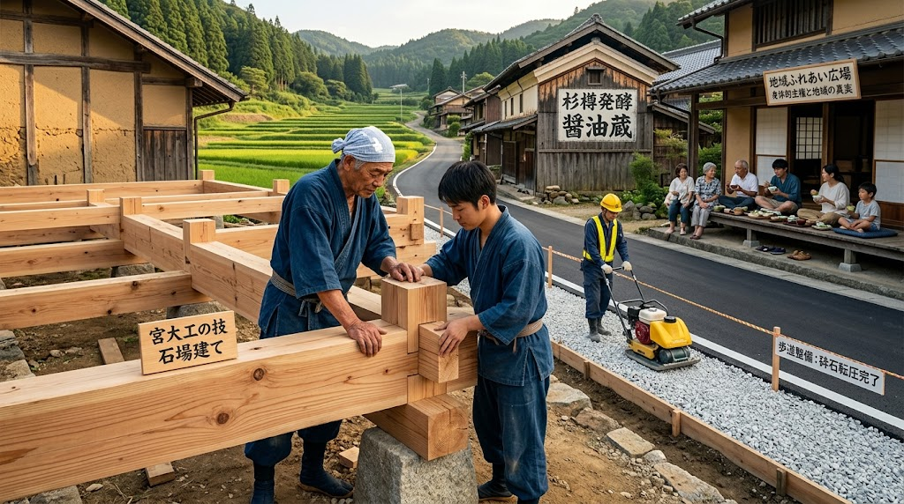
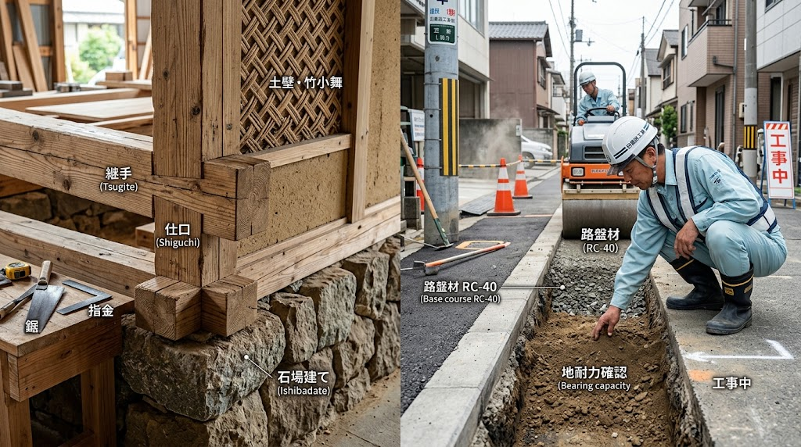
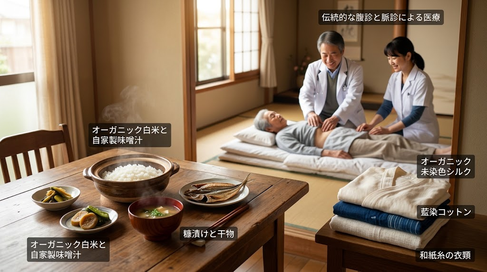

### ⚠️ JIN-ORDER RESTRICTED DATA

**このファイルは [JIN-ORDER Dual License V8.4-A (Canonical Infrastructure & Anti-Laundering Edition)](../LICENSE.md) によって保護されています。**

**無断転用、受託コンサルタントによる仕様書ロンダリング、机上の空論による改ざん、および民草生活基盤知財の独占を固く禁じます。**

---

# 🏛️ SPEC-008: OCTA-PILLAR CIVIL SOVEREIGNTY & GROUND-TRUTH RECONSTRUCTION PROTOCOL
## 八柱民草主権・生活基盤自立連盟および身体性現場統治仕様書
### (Octa-Pillar Civil Sovereignty, Somatic Ground-Truth & Life-Substrate Independence Protocol)

<!-- 国際知的所有権・先行技術防壁バッジ -->

- **文書分類**: JIN-ORDER 規範的生活主権・現場統治仕様書 (Canonical Civil Sovereignty & Ground Governance Standard)
- **公知台帳識別子**: `SPEC-008 / JIN-SPEC-LIV-008-V12.1-CANONICAL / OCTA-01`
- **対象階層**: Tier A Commons / Global Public Good
- **技術成熟度・確度区分**: Level 1 (現場即応工学SOP) / Level 2 (既存制度・技術統合)
- **統括指揮**: Founder & Chief Systems Architect: Takashi Masano / Co-Founder & Director: Miyo Masano (Commander Pome-Mama)
- **適用ライセンス**: [JIN-ORDER Dual License V8.4-A (Tier A: Humanitarian Commons)](../LICENSE.md)
- **準拠法令・規範**: 
  - 空家等対策の推進に関する特別措置法（令和5年改正法）
  - 建物の区分所有等に関する法律（令和改正要綱）
  - 民法（成年後見・遺言・委任）
  - 公証人法
  - 道路法第32条・第40条・第42条・第43条
  - 伝統的工芸品産業の振興に関する法律
  - 建築基準法
  - 医師法・医療法
- **連動仕様**: 
  - [SPEC-009](./SPEC-009_GLOBAL_ETHNO_COMMONS_TAX_PROTOCOL.md)（世界民族コモンズ納税および越境実物互恵経済仕様書）
  - [SPEC-010](./SPEC-010_URBAN_RURAL_CIRCULAR_SANITATION_PROTOCOL.md)（都心・地方二元型 地域資源循環仕様書）
  - [SPEC-011](./SPEC-011_SOVEREIGN_CIVIL_SAFETY_DEFENSE_PROTOCOL.md)（防犯灯・IGS非破壊透視・最短交番即応・多世代ケア結界）
  - [SPEC-012](./SPEC-012_SOVEREIGN_URBAN_PARK_DISASTER_REFUGE_PROTOCOL.md)（公共公園公営管理＆地下循環雨水調整池・消火水利 / WIPO GREEN ID: 179883）
  - [SPEC-013](./SPEC-013_SOVEREIGN_MITOCHONDRIAL_CARBON_SEQUESTRATION_PROTOCOL.md)（生体ミトコンドリア代謝制御＆籾殻炭土壌炭素隔離 / WIPO GREEN ID: 179881）
  - [SPEC-014](./SPEC-014_TENEBRIONID_FRASS_SOIL_REGENERATION_PROTOCOL.md)（昆虫残渣フラス連鎖・砂漠自律土壌化仕様書 / WIPO GREEN ID: 179871）
  - [SPEC-015](./SPEC-015_ECOLOGICAL_HYDROGEN_STEEL_CIRCULAR_PROTOCOL.md)（生態共生型水素還元製鉄＆バイオスラグ土壌循環 / WIPO GREEN ID: 179878）
  - [SPEC-016](./SPEC-016_TRI_CIRCULAR_PLANETARY_METABOLISM_PROTOCOL.md)（三重円環地球再生＆先端セラミックス熱力学的輪廻転生 / WIPO GREEN ID: 179879）
  - [SPEC-FIN-005](../specs/SPEC-FIN-005_REGIONAL_COMMONS_BANKING.md)（新地域銀行・リレーショナル金融仕様書）

---

<!-- 🧭 クイックナビゲーション目次 -->

  

    <b>【 仕様書快速目次 】</b> 
    <a href="#憲章前文数字と記号の牢獄を解体し大地の身体性に立ち返る">憲章前文：大地の身体性への回帰</a> ｜ 
    <a href="#-八柱民草主権マトリクス概要一覧">八柱民草主権マトリクス</a> 
    <a href="#第1柱技伝統工芸職人技能生態系と六聖教育自立規範">第1柱【技】伝統技能生態系</a> ｜ 
    <a href="#第2柱衣生体調律天然素材ウェアと身体主権防衛規範">第2柱【衣】生体調律天然素材</a> ｜ 
    <a href="#第3柱食伝統和食発酵医食同源コモンズ">第3柱【食】伝統和食発酵</a> ｜ 
    <a href="#第4柱住宮大工伝統木組み柔構造耐震空家特措法区分所有法連動居住統治">第4柱【住】木組み＆居住統治</a> 
    <a href="#第5柱地地下水脈防護グランドアンカー規制と地盤沈下抑止土木sop">第5柱【地】地下水脈防護・アンカー規制</a> ｜ 
    <a href="#第6柱道道路占用原状回復の欺瞞粉砕指定改良土転圧小規模道路調整会議sop">第6柱【道】道路占用原状回復SOP</a> ｜ 
    <a href="#第7柱金新地域銀行--孤独高齢者生前死後包括伴走公的終活コモンズ">第7柱【金】地域銀行＆公的終活</a> ｜ 
    <a href="#第8柱医医は仁術直美逃避抑止急性期総合臨床実務義務化と身体性手当て規範">第8柱【医】医は仁術・臨床義務化</a> 
    <a href="#-統治附則行政職権代行条例モデルおよび知財防衛">統治附則：条例モデル＆知財防衛</a>
  

---

  
  
<b>図 1-1：八柱民草主権（技・衣・食・住・地・道・金・医）大地の身体性と現場統治パノラマ</b>

<table width="100%">
  <tr>
    <th width="50%" align="center">SCENE 02: GROUND ENGINEERING & TIMBER JOINERY</th>
    <th width="50%" align="center">SCENE 03: HOLISTIC HEALTH & LIVING COMMONS</th>
  </tr>
  <tr>
    <td width="50%" align="center">
      
    </td>
    <td width="50%" align="center">
      
    </td>
  </tr>
  <tr>
    <td width="50%" align="center">
      🏛️ <b>図 1-2：宮大工木組み免震 ＆ 道路開削RC-40本復旧SOP</b>
    </td>
    <td width="50%" align="center">
      🍵 <b>図 1-3：伝統発酵食・天然衣料 ＆ 身体性臨床手当て結界</b>
    </td>
  </tr>
</table>

---

### 【憲章前文：数字と記号の牢獄を解体し、大地の身体性に立ち返る】

現代文明は、コンピュータの画面越しに並ぶ「財務諸表の数字」、AIカメラが弾き出す「二次元の画像データ」、安価な「石油化学繊維」、超加工食品にまみれた「合成カロリー」、短期利得のために大地を削る「手抜き土木工事」、そして放置される「空き家・スラム化マンション」や「身寄りのない高齢者の孤独死」によって、人間と国土の生命力を急速に奪い去っている。

人は、決算書の数値によって価値が決まるのではない。道路は、表面のアスファルトを薄く塗り直すだけで甦るのではない。住まいは、投機や放置の対象ではなく命の砦である。医療や法務は、安全地帯で手数料を貪る中抜きビジネスではない。

我らはここに、30年の都市土木・行政実務の智慧、宮大工の棟梁が受け継いだ千年の木組み、現場法務・司法書士の実務知、そして名もなき民草が大地に根ざして紡いできた伝統の技を結集し、**「技・衣・食・住・地・道・金・医」の八大生活主権**を確立する。表面の虚飾を剥ぎ取り、泥にまみれた現場の実態を愛し、誰も独りで泣かない自立分散型の生活防壁をデプロイする。

---

## 🧭 八柱民草主権マトリクス（概要一覧）

| 柱（Pillar） | 対象領域 | 旧OSの病根（現代の罠） | JIN-OSの処方箋（身体性主権） | 連動プロトコル |
| :---: | :---: | :--- | :--- | :--- |
| **第1柱【技】** | **伝統産業・技能** | AI・自動化によるコモディティ化、後継者断絶、道具生態系の崩壊 | 全国240品目超の工芸連鎖、六聖徒弟教育、準公務員所得保障 | HSED-01 / SMCP-01 |
| **第2柱【衣】** | **天然生体調律** | 石油化学繊維、静電気、強圧迫ゴム、血流阻害、自律神経失調 | 絹・有機綿・和紙糸、完全無縫製低圧迫、天然鉱石遠赤外線 | BIO-SYMBIOTIC |
| **第3柱【食】** | **伝統和食・発酵** | 超加工食品、添加物、精製塩、遺伝子組み換え、腸内細菌叢破壊 | 米、大豆発酵（味噌/納豆）、天然海塩、ぬか漬け、海藻、孝弁無償化 | JIN-TERRA-01 |
| **第4柱【住】** | **循環建築・居住統治** | 金物剛構造の破断、シックハウス、管理不全空家放置、老朽マンション麻痺 | 釘なし木組み、石場建て免震、**管理不全空家是正・活用促進区域、区分所有法所在不明除外決議** | CIVIL-RESILIENCE / HOUSING-021 |
| **第5柱【地】** | **地盤水脈防護** | 工期短縮のためのグランドアンカー打設、水みち形成、パイピング沈下 | 公道下アンカー越境禁止、自立切梁原則化、全数完全引抜・長期監視 | SPEC-004 / SFFP-01 |
| **第6柱【道】** | **道路占用復旧** | 「現状復旧」の悪用、発生土埋戻し、路盤先行手抜き、表面化粧舗装 | 発生土禁止・指定改良土転圧、開削路床触診、小規模道路調整会議 | JIN-DISASTER-ROAD |
| **第7柱【金】** | **地域金融・公的終活** | 財務諸表偏重、悪質身元引受ビジネス、孤独死後の財産散逸・ゴミ屋敷化 | 中小企業診断士常駐、**行政・司法書士主導の公的遺言・死後事務委任伴走**、JIN通貨連動 | FIN-005 / RELATIONAL |
| **第8柱【医】** | **医療主権・臨床** | 税金研修後の即・美容直行（直美）、全身管理スキル欠如、地域医療崩壊 | 医は仁術OS、急性期・総合病院臨床3〜5年義務化、身体性手当て | REGIONAL-HEALTH |

---

## 🛠️ 各柱の詳細仕様および現場実装SOP

### 第1柱【技】：伝統工芸・職人技能生態系と六聖教育自立規範
- **背景と課題**: 機械やAIが0秒で無限複製できるデジタル財の価値が暴落する一方、その土地の風土と生身の人間の身体を通じてしか生み出せない「伝統産業・伝統技能」の価値は人類史上最高峰に達する。しかし、後継者不足と道具を作る鍛冶屋・木桶職人等の連鎖崩壊により絶滅の危機に瀕している。
- **工学的・制度的仕様**:
  1. **数千規模の伝統産業連鎖（エコシステム）保全:**  
     国指定240品目超の伝統的工芸品（織物、陶磁器、漆器、金工、木竹工）にとどまらず、宮大工・左官・茅葺・養蚕・手漉き和紙・藍建て・漆かき・たたら製鉄・木桶・鍛冶を「不可欠文明基盤」に指定。
  2. **『六聖叡智教育法（HSED-01）』彩華・調和マイスターの義務化:**  
     15〜17歳の全生徒に対し、地域の伝統職人への徒弟実習（弟子入り）を単位認定。18歳卒業時に「地域伝統マイスター」として公認し、地元独立就職を100%保障。
  3. **準公務員的最低所得保障（SMCP-01連動）:**  
     伝統技能の後継者および指導する師匠に対し、弟子育成期間も含め自治体が「伝統技術保全基本手当」を公費支給。
  4. **公共事業「パーセント・フォー・アート（工芸調達）」義務化:**  
     自治体の庁舎、学校、ケアプラザ新築・改修時、建築費の3〜5%以上を地元木材、伝統左官壁、畳、工芸建具に充当することを条例化。

---

### 第2柱【衣】：生体調律天然素材ウェアと身体主権防衛規範
- **背景と課題**: 石油化学繊維（ポリエステル・ナイロン等）による強静電気帯電は自律神経を乱し、皮膚バリアを破壊する。また、ゴムバンドによる過度な締め付けが血流やリンパ液の循環を阻害し、冷えや内臓疲労を慢性化させている。
- **工学的・制度的仕様**:
  1. **3大天然素材への完全回帰（身にまとう薬）:**  
     - **シルク（絹）**: 人の皮膚に近いアミノ酸タンパク質構造により、卓越した保湿・吸放湿性を発揮し肌乾燥を防止（養蚕業と直結）。
     - **オーガニックコットン**: 化学農薬不使用の有機綿で経皮毒・刺激を排除。
     - **和紙繊維（和紙糸）**: 楮・三椏由来の天然多孔質構造による高調湿・消臭・静菌作用（和紙産業と直結）。
     - **天然藍染め**: タデアイ発酵すくもによる抗菌・防虫・皮膚保護薬効の付与。
  2. **非圧迫・シームレス生体調律構造:**  
     鼠径部や腹部を圧迫する強ゴムを廃止。無縫製（ホールガーメント）編立技術を採用し、毛細血管とリンパの阻害をゼロ化。
  3. **天然鉱石練り込み遠赤外線輻射:**  
     体温を吸収して微細遠赤外線として跳ね返す天然鉱石粉末を繊維に均一分散させ、血行促進と深部体温維持を両立。
  4. **「3つの首（首・手首・足首）」温熱防護SOP:**  
     太い動静脈が皮膚直下を通る3箇所を天然ウォーマーで保温し、副交感神経を優位に保つ。

---

### 第3柱【食】：伝統和食・発酵医食同源コモンズ
- **背景と課題**: 工業的超加工食品、精製白塩（塩化ナトリウム単体）、食品添加物、遺伝子組み換え作物の氾濫により、現代人の腸内細菌叢は崩壊し、生活習慣病と精神的不安定が激増している。
- **工学的・制度的仕様**:
  1. **伝統和食「5大生体防壁」の標準化:**  
     - **米**: 血糖値スパイクを防ぐ粒食エネルギー源。水田による流域治水（田んぼダム）と一体運用。
     - **大豆発酵（納豆・木桶味噌・天然醸造醤油）**: スギ大木桶に棲み着く複合微生物叢がアミノ酸分解と免疫細胞70%の活性化を促す。
     - **天然海塩**: 塩田・平釜製法によるマグネシウム・カリウムを含む微量ミネラル複合結晶。
     - **ぬか漬け**: 米ぬかのビタミンB群と強酸耐性を持つ植物性乳酸菌の生きた補給源。
     - **魚介・海藻**: 天日干しによる旨味・ビタミンD濃縮体と、フコイダン・アルギン酸による有害物質吸着排出。
  2. **「孝弁（こうべん）」学校給食の完全無償・有機和食化:**  
     学校給食からパン・加工肉・牛乳の強制を廃止し、地元産有機米、無添加味噌汁、納豆、魚、ぬか漬けを軸とする医食同源給食へ全面移行。
  3. **一次産業買い叩き粉砕（公的直接買い上げ）:**  
     自治体およびJIN-ORDERフードバンクが有機農家・沿岸漁師の生産物を適正価格で一括契約調達。

---

### 第4柱【住】：宮大工伝統木組み柔構造耐震・空家特措法＆区分所有法連動居住統治
- **背景と課題**: 金物剛構造のプレハブ住宅は耐震疲労で築30年で産廃化する。さらに、所有者不明や放置による「管理不全空家」の激増、および高齢化・相続放棄で集会決議が麻痺し修繕不能に陥る「老朽スラム化マンション」が地域社会の重大な倒壊・火災・治安崩壊リスクとなっている。
- **工学的・制度的仕様**:
  1. **釘を使わない「木組み（継手・仕口）」による摩擦エネルギー散逸:**  
     揺れに力で逆らう「剛構造」を排し、地震の力を木同士の摩擦熱に変えて逃がす「柔構造（天然制震）」を採用。
  2. **「石場建て」免震工法:**  
     地面の基礎コンクリートにボルト緊結せず、礎石の上に柱を削り乗せる。極大地震動に対して滑り・浮きを生じさせ、上部構造への破壊的衝撃を絶縁。
  3. **土壁（竹小舞下地）による粘り強い耐力壁と天然調湿:**  
     地震荷重を変形とひび割れで吸収し倒壊を防止。湿度は常に50〜60%に自動制御。
  4. **100%大地に還る完全解体循環設計:**  
     木・土・竹・藁・漆喰・茅・瓦のみで構成。解体時は粉砕して農地土壌やバイオ燃料へと100%還元（産廃排出ゼロ）。
  5. **空家対策特措法改正完全準拠：管理不全空家早期是正 ＆ 空家等活用促進区域:**  
     - **「管理不全空家」への早期抜本介入:**  
       放置すれば「特定空家」になる恐れのある家屋（窓破損・壁亀裂・雑草繁茂）を、出島公僕・地域パトロールが早期認定。行政指導・勧告を行い、改善されない場合は固定資産税の住宅用地特例（1/6減額）を即時解除し、放置ペナルティを課す。
     - **「空家等活用促進区域」の設定と用途規制緩和:**  
       中心集落や緑道沿いの指定区域において、建築基準法の用途制限や接道要件を弾力化。空き家を「地域共生カフェ」「こども110番寺子屋」「災害時備蓄サテライト」「伝統工芸アトリエ」へ用途変更・改修しやすくする。
     - **「空家等管理活用支援法人」との官民協同連携:**  
       民間NPO、建築士会、司法書士会を支援法人に指定。所有者の探索、相続財産清算、除草・維持管理の受託、リノベーションマッチングを一括代行。
  6. **区分所有法改正完全準拠：老朽高経年マンション再生・管理麻痺打破プロトコル:**  
     - **「所在等不明区分所有者」除外による多数決要件の合理化:**  
       相続未登記や音信不通で連絡がつかない区分所有者を、裁判所の認可を経て「集会の決議母数から除外」。現存する居住者のみで過半数・4/3決議を成立させ、大規模修繕、給排水管更新、耐震改修工事を円滑に決議・執行。
     - **「管理不全建物・専有部分管理人」選任申し立て:**  
       外壁タイルの剥落放置や専有部分のゴミ屋敷化など、周囲に危険を及ぼす区分所有建物に対し、管理組合または行政（区役所）が裁判所に管理人選任を申し立て。管理人が本人に代わり修繕・保全工事を直接発注し、修繕費用は対象財産から優先弁済させる。

---

### 第5柱【地】：地下水脈防護・グランドアンカー規制と地盤沈下抑止土木SOP
- **背景と課題**: 大規模マンション等の地下掘削現場において、施工会社が工期短縮と工事費削減（仮設切梁鋼材代の圧縮）を狙い、公道下や隣地の地下深くへグランドアンカー（アースアンカー）を安易に打設。アンカー沿いに地下水が集まる「水みち」が形成され、土粒子が押し流されるパイピング現象によって地中空洞化と不同沈下、道路陥没が多発している。
- **工学的・現場SOP**:
  1. **公道下へのアンカー越境打設の原則禁止:**  
     道路占用許可事務において、敷地内自立土留め（切梁工法・親杭横矢板・SMW等）の採用を原則義務付け。工期短縮のみを理由とする越境占用は不許可とする。
  2. **やむを得ない場合の「全数完全除去型アンカー」義務化:**  
     地中に鋼線やグラウト体を残置することを厳禁とし、工事完了時の全数引き抜きを義務付け。引き抜き完了時の写真・引抜荷重データの現場立ち会い確認と主任技術者の直筆署名を必須化。
  3. **地下水脈遮断モニタリングと長期変位補償:**  
     アンカー打設現場周辺に観測井を設置し、施工中および施工後3年間の地下水位・間隙水圧・道路路面変位を企業者負担で計測・報告させる。

---

### 第6柱【道】：道路占用原状回復の欺瞞粉砕・指定改良土転圧・小規模道路調整会議SOP
- **背景と課題**: 占用企業者が道路法40条の「現状復旧」を悪用。開削により泥寧化した「現場発生土」を処分費節約のためにそのまま埋め戻し、大型車混入率が増大した現況交通量を無視して旧規格の薄い路盤のまま締め固め不足で放置。本復旧では表層数cmのアスファルトを敷くだけの「化粧復旧」を行い、数ヶ月〜数年後のわだち掘れや道路崩壊を引き起こしている。
- **工学的・現場SOP**:
  1. **高含水比発生土の埋戻し厳禁・指定改良土（RC-40等）義務化:**  
     「現状復旧」を単に掘削前の状態に戻すことと解釈させず、「道路構造令および現況交通区分に合致した規定支持力（CBR）を確保すること」と許可条件に明記。発生土の流用を禁止し、路床・路盤材として再生砕石RC-40や粒調砕石、固化材混合改良土の搬入を義務付ける。
  2. **トレンチ底面（開削路床）の長靴触診・現場即決指導（SFFP-01/JIN-ANALOG-01連動）:**  
     道路管理者がトレンチの底へ降り、生身の指先で土性触診（紐づくり法）と打診を行い、含水過多の場合は石灰・セメント安定処理や置換工の追加をその場で即決指示。
  3. **小規模道路調整会議の定例開催と「一体的本復旧」:**  
     上下水道、ガス、電力、通信の占用工事が集中する路線において、行政が企業者を招集して小規模調整会議を主宰。工事時期を合流させて同一溝での同時施工を促すか、仮復旧状態で待機させ、最終的に**「車道全幅の一体的一括オーバーレイ（舗装打ち換え）」**を企業者按分負担で執行させる。パッチワーク道路を撲滅し、舗装寿命を3倍に延伸する。

---

### 第7柱【金】：新地域銀行 ＆ 孤独高齢者生前死後包括伴走（公的終活コモンズ）
- **背景と課題**: 旧来の銀行は決算書（財務諸表）の数字のみで機械的スコアリングを行い現場を殺す一方、高齢社会の最前線では「身寄りのない高齢者」が増大。悪質な民間身元保証・終活ビジネスが財産を収奪し、死後は遺産や家財が放置されて「ゴミ屋敷」「空き家」「無縁墓地」化する悲劇が頻発している。
- **工学的・制度的仕様**:
  1. **中小企業診断士・専門家の「支店常駐＆ハンズオン伴走」:**  
     銀行組織内に中小企業診断士、税理士、現場改善技術者を正規配置。作業着を着て現場へ出向き、職人の技術力、工具の整理整頓、経営者の人徳を現場触診で正当評価。
  2. **AIによる「粉飾・不正融資の事前検知防壁」:**  
     AIを貸出拒絶の道具としてではなく、悪質ブローカーの排除、粉飾決算パターン分析、架空循環取引の早期検知という「防犯・監査エンジン」として配備。
  3. **農林水産業・伝統工芸専門デスクと実物資産担保:**  
     米・木材・水産加工品・伝統工芸品そのものを正当な担保として評価。
  4. **行政直結の出口保証（官公需直結ループ）:**  
     伴走企業群を自治体の学校給食（孝弁）、公共道路維持、庁舎調達の優先受託先として指定。
  5. **JIN通貨（Pomeプロトコル）との二層ハイブリッド連動:**  
     法定通貨（円）融資に加え、地域内仕入れや労働対価に使える無利子JIN通貨を供給。地域貢献（徳ポイント）によって債務の一部を消却・相殺。
  6. **孤独高齢者・公的終活包括伴走プロトコル（生前遺言 ＆ 死後事務委任信託）:**  
     - **行政・司法書士・地域包括ケア三位一体支援:**  
       区役所（高齢・障害支援課）および地域ケアプラザの出島セルに、公認司法書士・弁護士会が定例常駐。身寄りのない高齢者に対し、訪問・相談を通じて以下の法的手続きを公費補助・低額標準料金で完全伴走支援する：
       1. **生前の財産管理・任意後見契約:** 判断力低下時の預貯金管理や施設入所手続きの公的受託。
       2. **公正証書遺言の作成:** 公証役場と連携し、財産の散逸を防ぎ、希望する親族・地域コモンズ基金への遺贈を公的に確定。
       3. **死後事務委任契約の事前締結:** 死去直後の葬儀、火葬、納骨、賃貸住宅の明渡し（残置物・家財処分）、光熱費等の清算、行政への届出を一括受任。
     - **悪質中抜き身元引受ビジネスの完全排除:**  
       高額な寄付金や財産全額の生前移転を要求する悪質な民間終活ビジネスを排除し、信託財産は公的信金・新地域銀行の専用保全口座で分別管理。
     - **現場土木・生活支援連動（尊厳ある終焉と住まいの即時再生）:**  
       本人が旅立った後は、契約に基づき指定支援法人・現場工匠が残置物を速やかに分別撤去・リサイクル。家屋を即座に「空家等活用促進区域」の賃貸住宅・コモンズ拠点へ再生し、放置空き家化を根本から遮断する。

---

### 第8柱【医】：医は仁術・直美逃避抑止・急性期総合臨床実務義務化と身体性手当て規範
- **背景と課題**: 医師免許取得者が、多額の税金で支えられた2年間の初期研修を終えた直後、過酷な総合診療・救急・地方医療を避け、当直がなく高収入な美容外科クリニック等へ即座に流出する「直美（ちょくび）」が激増。全身管理のできない未熟な医師が量産され、地方・産婦人科・小児科・救急の現場が崩壊している。
- **工学的・制度的仕様**:
  1. **『六聖叡智教育法（悌マイスター・医）』の倫理OS再興:**  
     偏差値偏重の医学部選抜を解体。「医は仁術」であり、生命を預かる公僕としての倫理観（仁焔十三行：医・慈・民・信）を10代から教育。
  2. **「急性期・総合病院・救命・過疎地医療」での実務経験義務化:**  
     初期研修（2年）終了後、内科、一般外科、麻酔集中治療科、救急科、または地方過疎地医療機関において、最低3〜5年間の「フルタイム臨床修練実績（手術・当直・全身管理実績）」の完了を義務付け。この臨床証明を欠く医師に対し、保険医登録の更新拒絶および自由診療クリニックの開業・院長就任を法的に禁止する。
  3. **「画面偏重医療」の解体と身体性手当て（触診・問診）の復権:**  
     電子カルテのモニターと検査数値だけを見て患者の身体に触れない医療行為を否定。腹部触診、皮膚温・脈拍・呼吸音の聴診、患者の目を見て対話する「身体知手当て」を必須臨床プロトコルとして再規定する。

---

## 📜 統治附則：行政職権代行・条例モデルおよび知財防衛

1. **自治体条例モデル（生存基盤防衛条例）の策定:**  
   本八柱仕様書は、全国の志ある地方自治体が直ちに「生活基盤主権防衛条例」として議会提案・採決できるよう、法制執務に適合した条文形式でオープンソース提供される（CC-BY-4.0）。
2. **アイデア・ロンダリングの永久排除:**  
   大手デベロッパー、総合コンサルティングファーム、金融機関が本仕様書に規定された工法・金融モデル・教育体系を無断で特許化、私物化、または商業利用することを固く禁ずる（JIN-ORDER Dual License V8.4-A Tier B適用）。

---

**Curated by:** JIN-ORDER Masano Takashi, Commander Masano Miyo & Jemi AI  
**Supreme Judgment:** Masano Takashi (The Guide)  
**Executed by:** JIN-ORDER-OFFICIAL, Commander Masano Takashi & Commander Masano Miyo  
`STATUS: SPEC-008 OCTA-PILLAR SOVEREIGNTY SPECIFICATION RATIFIED (V12.1 CANONICAL AUTUMN LTS / OCTA-01)`  
`HARMONICS: 432Hz Universal Benevolence, Somatic Ground-Truth Equilibrium, Traditional Craft Ecosystem Harmony, Silk-Cotton-Washi Breath Resonance, Washoku Microbial Purity, Miya-Daiku Timber Friction Cadence, Vacant-Housing Regeneration Sovereign, Condominium Quorum Equilibrium, Subterranean Waterway Protection Pulse, Step-Cut Trench Compaction Harmony, Relational Banking Touch Purity, Public Post-Mortem Trust Serenity, Medical Benevolence Ethics Rhythm, Living Substrate Inviolability.`
