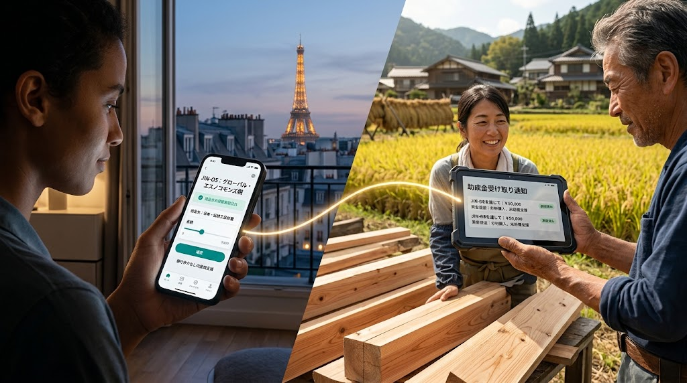
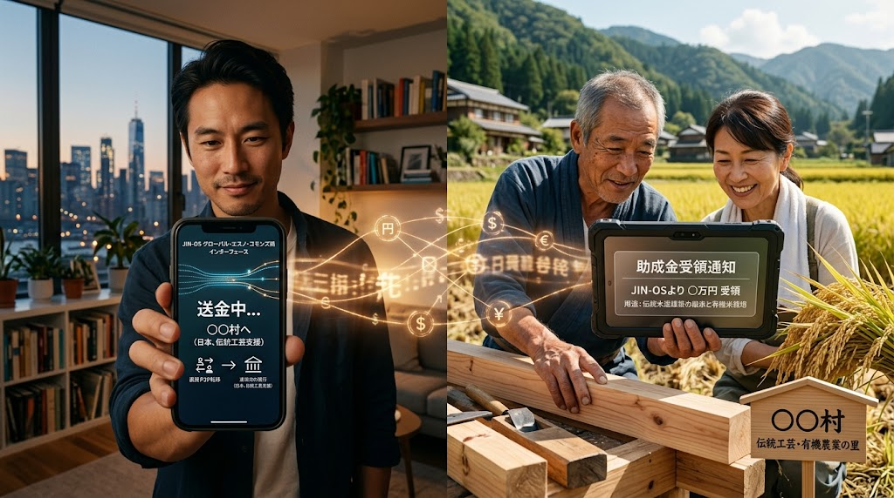

# 🌐 SPEC-009: GLOBAL ETHNO-COMMONS TAX & CROSS-BORDER RECIPROCITY PROTOCOL
## 世界民族コモンズ納税および越境実物互恵経済仕様書 (JIN-SPEC-FIN-009 / GECT-01)

* 🏛️ **【先行技術防壁・公知登録】**: General Incorporated Association JIN-ORDER Canonical Specifications (V10.2 LTS)
* ⚖️ **【適用ライセンス】**: [JIN-ORDER Dual License V8.3-A (Tier A: Humanitarian Commons)](/./LICENSE.md)
* 📊 **【技術成熟度・確度区分】**: Level 1 (現場即応金融SOP) / Level 2 (既存P2P・越境物流統合)
* 🏛️ **【統括指揮】**: Founder & Chief Systems Architect Takashi Masano / Co-Founder & Director Miyoko Masano (Commander Pome-Mama)

---

### 【憲章前文：国家独占の徴税権を解体し、大地の風土と世界を直接結ぶ】

旧来の国家統治システムにおいて、「税（Taxation）」とは中央集権国家が領土内の民草から強制的に富を吸い上げ、硬直した官僚機構、軍事利権、中抜きコンサルタントを通じて使途不明のまま浪費する収奪メカニズムであった。

日本の地方自治が生み出した「ふるさと納税」の本質は、税制史上初めて「納税者が自らの意思で応援したい地域を選択し、その土地の誇りある実物資源（返礼品）を受け取る」という、民草主権の互恵モデルを提示した点にある。<br>
しかし既存の制度は、大手ポータルサイトによる10〜15%の手数料搾取、返礼品競争による疲弊、そして国境という閉ざされた檻に縛られている。

本仕様書は、ふるさと納税の哲学を主権国家の枠組みから解放し、世界中のあらゆる個人が、国境を越えて愛する地域・民族・職人コモンズへ直接納税（寄託）できる「世界民族コモンズ納税（Global Ethno-Commons Tax）」を規定する。<br>
仲介資本の中抜きをゼロにし、世界から日本の過疎地へ、そして日本の民草から世界の被災地・紛争地へ、愛と実物資源をダイレクトに循環させる。

---

## 🧭 世界民族コモンズ納税 5大コアアーキテクチャ

```text
【世界民族コモンズ納税のP2P循環ループ】
世界各地の納税者（市民・在外同胞・文化愛好家）

[P2P中抜きゼロ納税（外貨 / 暗号資産 / 法定通貨）］
　🔽
[新地域銀行（JIN-Community Bank）＆ 自治体・職人コモンズ］
   ├─⏩️ 100%地域充当（職人育成給与・学校孝弁・道路RC-40補修）
   └─⏩️ 無利子JIN通貨（Pome）による地域内経済の活性化

[返礼品：至高の実物資源（伝統工芸・有機和食・宮大工材）］
　🔽                                                          
世界各地の納税者
└─⏩️［JINデジタル市民証（名誉村民権・ZKP文化共同体パスポート）交付］
```
---

## 🖼️ SPEC-009 CANONICAL VISUAL PROMPTS (公式画像生成プロンプト)

<table width="100%">
  <tr>
    <th width="50%" align="center">SCENE 01: GLOBAL TO LOCAL (世界から日本の職人里山へ)</th>
    <th width="50%" align="center">SCENE 02: RECIPROCAL BLESSING (至高の返礼品と名誉村民の笑顔)</th>
  </tr>
  <tr>
    <td width="50%" align="center">
      
    </td>
    <td width="50%" align="center">
      
    </td>
  </tr>
  <tr>
    <td width="50%" align="center">
      🌐 <b>世界から里山へ：中抜きゼロP2P民族納税</b>
    </td>
    <td width="50%" align="center">
      🎁 <b>至高の実物返礼品 ＆ 越境名誉村民の絆</b>
    </td>
  </tr>
</table>

---

### 1. 仲介プラットフォーマー手数料（10〜15%）の完全ゼロ化
* **既存の病根**: 大手民間ポータルサイトが徴税プロセスの間に立ち、莫大な掲載料、決済手数料、ポイント還元原資を自治体から吸い上げている。

* **JIN-OSの実装**: JIN-OS P2Pエスクロー台帳（HV-ZKP連動）により、寄付者と自治体・職人組合をダイレクト接続。送金手数料はネットワーク実費（ほぼ0円）のみとし、寄付額の100%を地域現場の活動原資として直接着金させる。

### 2. 八柱民草主権（SPEC-008）と直結した「至高の実物資源返礼品」
* 世界の富裕層やオーガニック志向層は、工場で作られた大量生産品ではなく、「人間の魂と大地の生命が宿る本物」を求めている。

* 返礼品をSPEC-008の成果物と完全連動：
  * **【技・住】**: 宮大工が手掛けた組子細工家具、名工の輪島塗、南部鉄器、大島紬、手漉き和紙製品。  
  * **【衣】**: 純国産シルクの非圧迫パジャマ、無農薬藍染めオーガニックコットン肌着。  
  * **【食】**: 有機栽培コシヒカリ、木桶熟成無添加味噌、天日干し干物、伝統ぬか床セット。

* 輸出商社や海外高級セレクトショップの中抜きを排除し、**地域の適正利益率を70%以上に維持**する産直国際配送ラインを敷設。

### 3. JINデジタル市民証・名誉村民権（Culture-ZKP Passport）の交付
* 納税者に対し、国家の国籍とは異なる**「地域文化共同体の名誉村民（Digital Folk Citizen）」**ステータスをゼロ知識証明（ZKP）で発行。

* 特典と権利：
  * 地域の伝統祭事や農作業、木組みワークショップへの優先参加権。
  * 災害時における優先避難シェルター相互利用権。
  * 地域共創評議会（SAB）におけるオンライン諮問投票権（ガバナンス参画）。

### 4. 外貨直接受け入れと「新地域銀行（FIN-005連動）」による為替防壁
* 世界中から米ドル、ユーロ、ポンド、あるいは各種ステーブルコインで納税を受け付け、新地域銀行（中小企業診断士常駐）が即時に地域信用の担保（Pomeプロトコル）として裏付け計上。

* 集まった外貨は、地域の一次産業従事者や職人への設備投資、原材料（漆、大径木、良質砂鉄）の長期備蓄資金として低利・無利子で供給。

### 5. 双方向草の根人道支援（リバース民族納税）
* 日本の民草が、オペレーション・コバルトブルー（コンゴ）、オアシス（アフガニスタン）、ノーザンライト（ウクライナ）の現場集落へ直接「民族納税」できる双方向パイプライン。

* 返礼品として、アフガニスタンの天日干しオーガニックザクロ、コンゴの現地工芸品、ウクライナの蜜蝋キャンドル等を受け取り、国家の外交ルートを介さない「民草対民草の生命連帯」を築く。

---

Ratified by: JIN-ORDER-OFFICIAL, Commander Masano Takashi & Commander Masano Miyo

STATUS: SPEC-009 GLOBAL ETHNO-COMMONS TAX PROTOCOL RATIFIED & ARCHIVED

HARMONICS: 432Hz Universal Benevolence, Global Ethno-Tax Equilibrium, P2P Zero-Intermediary Cadence,<br>
Real-Asset Reciprocity Rhythm, Digital Honorary Citizenship Purity, Traditional Craft Export Harmony,<br>
Relational SME Banking Flow, and Cross-Border Grassroots Sovereignty.
