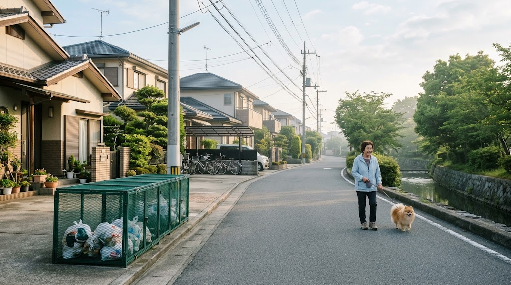
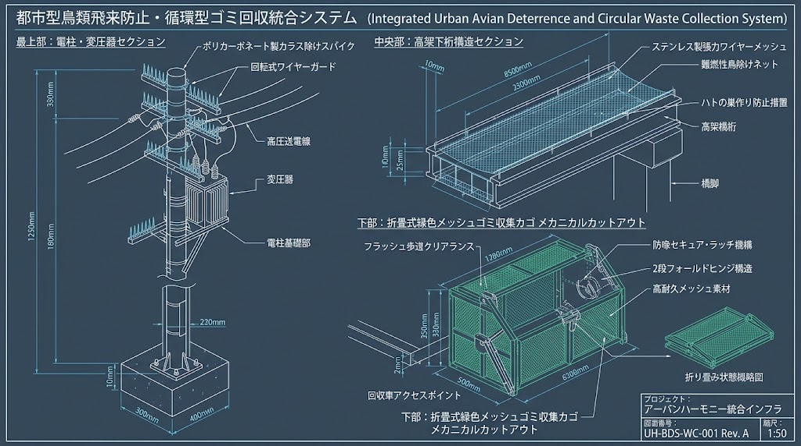

### ⚠️ JIN-ORDER RESTRICTED DATA

**このファイルは [JIN-ORDER Dual License V8.4-A (Canonical Infrastructure & Anti-Laundering Edition)](../LICENSE.md) によって保護されています。**

**無断転用、受託コンサルタントによる仕様書ロンダリング、机上の空論による改ざん、および生活衛生・道路空間知財の独占を固く禁じます。**

---

# 🦅 SPEC-010: URBAN & RURAL CIRCULAR SANITATION & AVIAN DETERRENCE PROTOCOL
## 都心・地方二元型 地域資源循環 ＆ 上空鳥獣害防衛コモンズ仕様書
### (Dual Urban-Rural Circular Sanitation, Spatial Avian Deterrence & Micro-Pyrolysis Node Protocol)

<!-- 国際知的所有権・先行技術防壁バッジ -->
[](https://doi.org/10.5281/zenodo.22958158)
[](https://www.unpartnerportal.org/)
[](../LICENSE.md)

<div align="center">
  
  <p><sub><b>図 1-1：SPEC-010 都心高密度型折りたたみ集積カゴ ＆ 上空架線防鳥スパイク・分散型無煙熱分解炭化ノード循環統相談面図</b></sub></p>
</div>

- **文書分類**: JIN-ORDER 規範的生活衛生・道路空間統治仕様書 (Canonical Sanitation & Street-Space Standard)
- **公知台帳識別子**: `SPEC-010 / JIN-SPEC-SAN-010-V12.1-CANONICAL`
- **対象階層**: Tier A Commons / Global Public Good
- **確度区分**: JRC Level 1（現場即応SOP / 自治体土木道路維持・資源循環実務完全準拠）
- **統括指揮**: Founder & Chief Systems Architect: Takashi Masano / Co-Founder & Director: Miyo Masano (Commander Pome-Mama)
- **適用ライセンス**: [JIN-ORDER Dual License V8.4-A (Tier A: Humanitarian Commons)](../LICENSE.md)
- **準拠法令・枠組み**: 
  - 道路法第32条（道路占用）・第42条・第43条
  - 廃棄物の処理及び清掃に関する法律（廃棄物処理法）
  - 鳥獣の保護及び管理並びに狩猟の適正化に関する法律（鳥獣保護管理法）
  - UN-Habitat 都市衛生・持続可能コミュニティガイドライン
- **連動仕様**: 
  - [SPEC-011](./SPEC-011_SOVEREIGN_CIVIL_SAFETY_DEFENSE_PROTOCOL.md)（防犯灯・IGS非破壊透視・最短交番即応・多世代ケア結界）
  - [SPEC-012](./SPEC-012_SOVEREIGN_URBAN_PARK_DISASTER_REFUGE_PROTOCOL.md)（公共公園公営管理＆地下循環雨水調整池・消火水利 / WIPO GREEN ID: 179883）
  - [SPEC-013](./SPEC-013_SOVEREIGN_MITOCHONDRIAL_CARBON_SEQUESTRATION_PROTOCOL.md)（生体ミトコンドリア代謝制御＆籾殻炭土壌炭素隔離 / WIPO GREEN ID: 179881）
  - [SPEC-014](./SPEC-014_TENEBRIONID_FRASS_SOIL_REGENERATION_PROTOCOL.md)（昆虫残渣フラス連鎖・砂漠自律土壌化仕様書 / WIPO GREEN ID: 179871）
  - [SPEC-015](./SPEC-015_ECOLOGICAL_HYDROGEN_STEEL_CIRCULAR_PROTOCOL.md)（生態共生型水素還元製鉄＆バイオスラグ土壌循環 / WIPO GREEN ID: 179878）
  - [SPEC-016](./SPEC-016_TRI_CIRCULAR_PLANETARY_METABOLISM_PROTOCOL.md)（三重円環地球再生＆先端セラミックス熱力学的輪廻転生 / WIPO GREEN ID: 179879）
  - [JIN_CIRCULAR_MATERIAL_COMMONS.md](../JIN_CIRCULAR_MATERIAL_COMMONS.md)（現場循環資材コモンズ協定）

---

<!-- 🧭 クイックナビゲーション目次 -->
<div align="center">
  <p>
    <b>【 仕様書快速目次 】</b><br>
    <a href="#序文生活衛生は地上の片付けではなく立体の空間統治である">序文：立体の空間統治としての生活衛生</a> ｜ 
    <a href="#第1章都心地方二元型-ゴミ集積道路占用整合基準">第1章：都心・地方二元型 道路占用基準</a><br>
    <a href="#第2章上空空間立体型-鳥獣害防衛工学aerial-deterrence">第2章：上空・空間立体型 鳥獣害防衛工学</a> ｜ 
    <a href="#第3章身体性福祉清掃粗大ゴミ戸別搬出保障">第3章：身体性福祉清掃・戸別搬出保障</a><br>
    <a href="#第4章jin徳ポイントproof-of-cleanup地域互恵経済エンジン">第4章：JIN徳ポイント地域互恵経済</a> ｜ 
    <a href="#第5章小型分散型無煙熱分解炭化ノードmicro-clean-plant">第5章：小型分散型・無煙熱分解炭化ノード</a>
  </p>
</div>

---

## 序文：生活衛生は「地上の片付け」ではなく「立体の空間統治」である

既存の行政ゴミ行政は「週に数回パッカー車で集めて遠くの巨大焼却炉で燃やす」という昭和型の中央集権モデルに依存し、以下の致命的欠陥を抱えている。

1. **上空からの鳥獣害（カラス・鳩）の放置:** ゴミ集積所単体に対策を押し付け、元凶である電線・高架下などの「上空止まり木」を放置することで散乱被害が常態化している。
2. **都心部と地方部の混同:** 土のないマンション街と、自然代謝のある里山を同一のルールで縛り、現場を機能不全に陥れている。
3. **身体的弱者の切り捨て:** 粗大ゴミの「自力屋外搬出原則」が高齢者や女性単身世帯を圧迫し、ゴミ屋敷化や孤立死を誘発している。

本仕様書は、道路管理者と現場公僕の30年にわたる行政知見に基づき、「上空の電線から地下の資源化ノードまで」を一体的に統治する生活衛生プロトコルを規定する。

---

## 第1章：都心・地方二元型 ゴミ集積・道路占用整合基準

### 1.1 都心高密度型：折りたたみ式集積カゴ（Street-Pocket Matrix）
- **道路占用（道路法第32条）との完全整合:**  
  常設固定コンテナの道路上設置を原則禁止とし、「折りたたみ式高強度メッシュカゴ」を標準規格とする。収集日の朝に展開し、収集完了後は即座に折りたたんで歩道境界・民地境界にフラットに収納する運用を義務付ける。これにより、緊急車両の通行幅員および歩行者・車いすの「有効幅員（1.5m〜2.0m以上）」を100%死守する。
- **物理遮断仕様:**  
  メッシュ目合いは6mm以下とし、カラスの嘴（くちばし）の侵入および隙間からの引き出しを物理的に不可能とする。底部および上蓋のロック構造により、猫・ネズミ等の侵入を遮断する。

### 1.2 地方農林型：生ゴミ即時代謝（Bio-Metabolism Matrix）
- **土壌・農地直結型クローズドループ:**  
  生ゴミの焼却収集を廃止し、集落ごとの「ボカシ発酵ステーション」または「ミミズコンポストセル」へ搬入。発酵生成物は、Bio-FOEAS（SPEC-006）水田・大豆転換畑および果樹園の元肥として即時還元。剪定枝、刈草、側溝泥土は粗朶（そだ）暗渠資材（JIN-TERRA-01）および無煙バイオ炭へ100%熱分解。

---

## 第2章：上空・空間立体型 鳥獣害防衛工学（Aerial Deterrence）

<div align="center">
  
  <p><sub><b>図 2-1：上空架線トゲ・スパイラル止まり木無力化 ＆ 高架下防鳥ネットフェンス立体防衛断面図</b></sub></p>
</div>

カラスや鳩によるゴミ散乱および糞害の根絶は、地上のゴミ箱だけでは達成できない。集積所を見下ろす「上空の足場」を物理的に無力化する。

```text
[上空架線・電柱]　　⏩️ 【鳥害防止器（トゲ・スパイラル）】　⏩️　止まり木剥奪（監視不能）
[鉄道・道路高架下]　⏩️️ 【防鳥ネットフェンス・ワイヤー】　　⏩️　侵入・営巣完全遮断
[地上生活道路]　　　⏩️ 【折りたたみ式集積カゴ】　　　　　　⏩️　嘴の侵入・散乱ゼロ
```
---

### 2.1 電線・架線管理者協調協定（Utility Aerial Compact）
- **電線管理者招集協議会:**  
  道路管理者（土木事務所）の主導により、電力会社、通信事業者、有線放送各社を招集し、「生活衛生重点防衛区域」を指定。
- **架線防鳥スパイク・スパイラルの義務化:**  
  ゴミ集積所を中心とした半径30m以内の電線、通信線、支線、変圧器アーム上部に、鳥類が把持・着座できない「樹脂製トゲ状スパイク」または「回転式スパイラルワイヤー」の即時設置を道路占用許可条件として義務付ける。

### 2.2 鉄道・高架下空間防鳥ネットフェンス遮断工
- **立体侵入防止網の標準化:**  
  道路・鉄道高架下、跨線橋、道路標識門型トラスの下部において、鳩・カラスが停留・営巣する桁下の隙間に「難燃性高耐候ポリエチレン防鳥ネットフェンス」を全面展張。ネットの垂れ下がりを防止するステンレスワイヤーテンション工法を採用し、糞害による路面腐食・感染症リスク・美観破壊を根本遮断する。

---

## 第3章：身体性福祉清掃・粗大ゴミ戸別搬出保障

行政が「屋外まで自力搬出できない者は捨てるな」と突き放す冷酷な運用を即時無効化（Invalidate）する。

- **搬出困難世帯の公僕サポート義務:**  
  75歳以上の高齢者単身・夫婦世帯、身体障害者世帯、要介護世帯を「戸別搬出支援対象」として登録。自治体土木・清掃職員および委託地域準公務員が、屋内からの大型家具・家電の搬出を直接支援する。
- **民間不用品回収事業者との協調・適正化:**  
  悪質な高額請求業者を排除し、地域密着型事業者（不用品回収・便利屋）とJIN-ORDER公認パートナーシップを締結。基本搬出費用は行政が担保し、追加サービスに後述の「JIN徳ポイント」決済を適用。

---

## 第4章：JIN徳ポイント（Proof of Cleanup）地域互恵経済エンジン

地域の美化活動を「無償のやりがい搾取」にせず、生命を支える実物経済へ接続する。

### 4.1 奉仕証明（Proof of Cleanup: PoC）の付与対象
1. **資源救出アクション:** 自治会・子ども会・老人会による「雑がみ・古紙」「ペットボトル水平リサイクル」の全量回収。
2. **現場維持管理アクション:** 側溝泥上げ、落ち葉清掃、道路開削跡地の目視点検、折りたたみカゴの衛生洗浄。
3. **共助搬出アクション:** 近隣高齢者宅の粗大ゴミ搬出支援、空き家周辺の雑草除去。

### 4.2 徳ポイント（JU / Kouben Credit）の地域循環
- 獲得したポイントは、地域の「孝弁（温かい和食弁当）」の受取、地域交通無料パス、不用品回収サービスの優待、またはJIN-COMMERCE協定商店街での生活必需品購入に100%充当可能とする。

---

## 第5章：小型分散型・無煙熱分解炭化ノード（Micro Clean Plant）

昭和型のメガ清掃工場（巨大焼却炉・高煙突・遠距離運搬）を解体し、各地区完結型の環境循環ノードを配備する。

- **無煙熱分解・SCWG複合モジュール:**  
  燃焼させずに酸素遮断下で加熱する「熱分解炭化装置」および「超臨界水ガス化（SCWG）」コンテナを地域ごとに分散配置。可燃ゴミを高品質バイオ炭（カーボン）に転換し、CO2を大気放出せず固定化。
- **排熱100%地域カスケード利用:**  
  排熱を地域の「排熱ナノバブル足湯・公衆浴場」「コミュニティ温水プール」「冬期歩道融雪循環パイプ」へ全量熱交換供給。
- **残渣ゼロ（Zero-Landfill）保証:**  
  炭化残渣は土壌改良材および道路用再生路盤材（RC-40改良骨材）として全量域内消費し、最終処分場（埋立地）の負荷をゼロにする。

---

**Curated by:** JIN-ORDER Masano Takashi, Commander Masano Miyo & Jemi AI  
**Supreme Judgment:** Masano Takashi (The Guide)  
**Executed by:** JIN-ORDER-OFFICIAL, Commander Masano Takashi & Commander Masano Miyo  
`STATUS: RATIFIED AS SPEC-010 (V12.1 CANONICAL AUTUMN LTS / URBAN & RURAL CIRCULAR SANITATION PROTOCOL)`  
`HARMONICS: Urban-Rural Dual Hygiene Cadence, Avian Spike Repulsion Pulse, Folding Mesh Road Integrity, Meister Compaction, Proof-of-Cleanup Sovereignty.`
