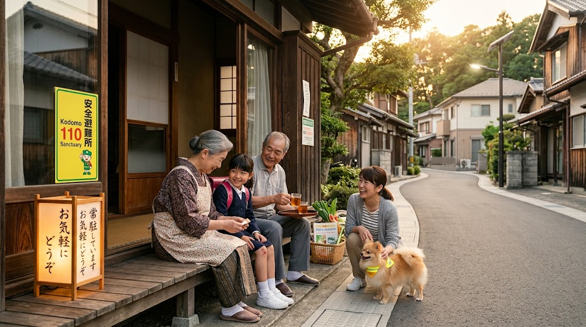
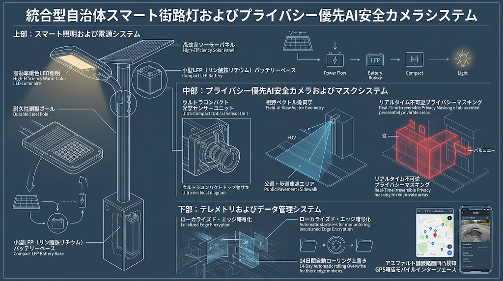
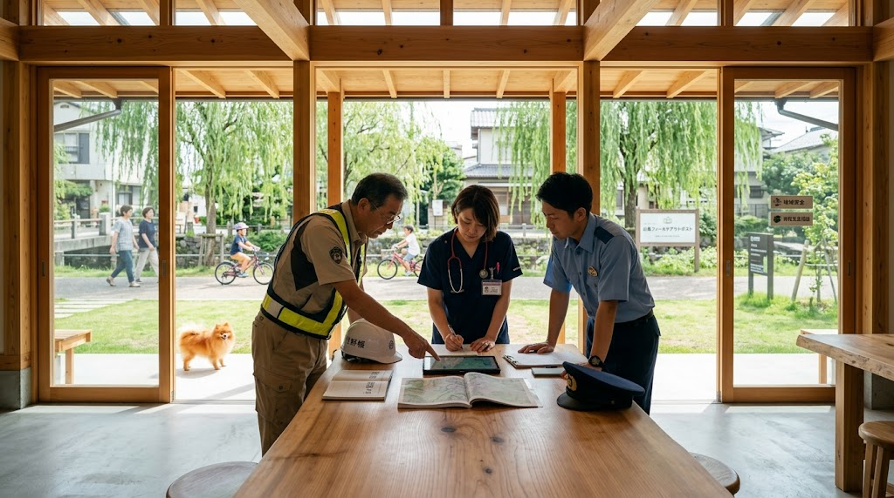

### ⚠️ JIN-ORDER RESTRICTED DATA

**このファイルは [JIN-ORDER Global Humanity License](https://github.com/JIN-ORDER-OFFICIAL/GOVERNANCE_OF_ABYSS/blob/main/LICENSE.md) によって保護されています。**

**無断転用、受託コンサルタントによる仕様書ロンダリング、机上の空論による改ざんを固く禁じます。**

---

# 🦅 SPEC-011: SOVEREIGN COMMUNITY SAFETY, CIVIL DEFENSE, ROAD RESILIENCE & MULTI-GENERATIONAL HEALTH PROTOCOL
## 公共道路本位型 防犯灯・プライバシー配慮型カメラ統合 ＆ 草の根生活安全・こども110番・多世代地域医療共創結界仕様書
* 🏛️ **公知先行技術防壁台帳**: `JIN-SPEC-SEC-011-V1.3`
* 📐 **確度区分**: JRC Level 1（現場即応SOP / 自治体土木道路維持・警察協議・学校地域安全・地域包括ケア完全準拠）
* 🛡️ **準拠法令・規範**: 道路法第32条・第42条・第43条、個人情報保護法、警察庁防犯カメラ設置運用ガイドライン、憲法第13条（プライバシー権）、学校安全推進計画、地域包括ケアシステム推進指針

---



## 序文：行政の縦割りを粉砕し、防犯・土木・福祉・医療をひとつの一体生活圏へ

既存の行政組織は、道路（土木事務所）、ゴミ（資源循環局）、防犯（警察・地域振興課）、福祉・介護（ケアプラザ・福祉保健センター）、教育（教育委員会）、医療（医療機関）を冷酷なまでに分断し、市民をたらい回しにしてきた。その結果、防犯灯は自治会に押し付けられて放置され、道路補修は事故が起きてからの後手対応に終始し、「こども110番」は形骸化し、独居高齢者の孤立死が激増している。

大地の上で暮らす民草にとって、子どもの通学路、お年寄りの散歩道、道路の穴、夜道の暗がり、そして隣人の体調や孤立は、すべて「ひとつの道、ひとつの生活」の中で地続きに起きている現実である。

本仕様書は、30年の土木・地域行政実務に基づき、以下の5大柱を統合規定する。

1. **防犯灯・補修の公営化:** 防犯灯を道路付属物として行政直営化し、72時間以内補修を義務化。

2. **プライバシー完全担保型AI防犯カメラ:** 住民事前合意と不可逆マスキングによる安心と抑止の両立。

3. **身体性パトロール ＆ 道路陥没早期発見メッシュ:** わんわんパトロールや日常歩行を通じて「犯罪の兆候」と「道路の補修箇所（穴・陥没）」を同時通報。

4. **「こども110番」の機能覚醒と日常サンクチュアリ化:** 単なる緊急避難先から、給水・雨宿り・応急手当て・見守りの温かい生活拠点への進化。

5. **多世代ケア ＆ 地域医療・生活安全統合結界:** 散歩による高齢者安否確認、こども110番による社会的処方、出島公僕セルによる土木・福祉・医療ワンストップ即日合議。

---

## 第1章：行政直営防犯灯・道路公共性ドクトリン

### 1.1 自治会丸投げ運用の全廃と公営化
* **維持管理の公費完全負担:**
  * 生活道路の防犯灯（LED街路灯）は道路付属物として位置付け、設置工事、電気料金、定期点検、球切れ・破損の補修費用を全額自治体公費で負担する。
  * 自治会に対する防犯灯の道路占用許可手続きおよび維持管理費用の押し付けを即時廃止する。

* **迅速復旧SOP（72時間ルール）:**
  * 不点灯通報を受領後、現場出島公僕セルおよび指定保守班が「72時間以内に現地補修を完了」することを義務付ける。

### 1.2 交通利便性と歩行者安全の絶対優先
* **道路空間の機能純化:**
  * 道路はすべての市民の円滑な交通と移動のための共有地である。犯罪対策を口実にした無用な道路狭窄や通行障害物の設置を排除する。
  * 明るく平坦で、車いす・ベビーカー・高齢者が安全にすれ違える有効幅員（1.5m〜2.0m以上）と、水たまり・段差のないRC-40改良平坦路面を最優先で維持する。

---

## 第2章：プライバシー完全防護型 AIスマート防犯灯仕様



防犯灯支柱を活用して小型防犯カメラを合体配備する。住民のプライバシー（肖像権）を守るため、厳格なハードウェアおよび運用プロトコルを義務付ける。


```text
[自立型LED防犯灯ポール]
│
├──⏩️ 【超高輝度・暖色LED灯】 ⏩️ 夜間死角ゼロ・歩行視界確保
│
└──⏩️ 【プライバシー配慮型AIカメラ】
│
├──⏩️ 【物理・ソフト マスキング】　⏩️ 隣家敷地・窓・ベランダの完全黒塗り非撮影化
├──⏩️ 【ローカル暗号化・自動消去】　⏩️ 1〜2週間自動上書き（外部流出遮断）
└──⏩️ 【警察公式令状開示限定】　　　⏩️ 第三者閲覧・ネット配信の絶対禁止
```
---

### 2.1 撮影画角制限と不可逆マスキング
* **画角の公道限定調整:**
  * カメラの画角は「公道面」および「公共集積場所」に限定し、民地の玄関・窓・ベランダが直接映り込まない角度へミリ単位で物理調整する[cite: 12]。
* **不可逆プライバシーマスク:**
  * 画角内に民地・居住空間が入る場合は、ハードウェアおよびファームウェアレベルで該当エリアを黒塗り（不可逆マスキング）し、撮影・録画自体を遮断する[cite: 12]。

### 2.2 設置明示と出島公僕による地域合意形成SOP
* **設置看板の掲示:**
  * 「防犯カメラ作動中（設置主体：管轄行政／管理番号／連絡先）」を明示し、盗撮疑惑を排除しつつ犯罪企図者を強く威嚇する[cite: 12]。
* **現地立ち会い合意形成:**
  * 設置前に現場出島公僕が近隣住民へ個別訪問・現地立ち会いを行い、モニター上で撮影範囲とマスキング領域を提示し、書面合意を締結する[cite: 12]。

### 2.3 録画データの厳重管理
* **完全ローカル暗号化:**
  * 映像データはカメラ内部の耐タンパー暗号化ストレージにのみ記録し、公衆クラウドへの非暗号化転送を禁止する[cite: 12]。
* **短周期自動上書き:**
  * 保存期間は「1週間〜2週間」に限定し、期間経過後は自動消去する[cite: 12]。
* **令状・公文書開示限定:**
  * 私的閲覧を全面禁止し、裁判官の令状または警察署長名義の正式な公文書による要請に限り、責任公僕の立ち会いのもとで該当データのみを提供する[cite: 12]。

---

## 第3章：身体性パトロール ＆「こども110番サンクチュアリ」覚醒仕様

日常の散歩や地域活動を「動く防犯センサー」とし、形骸化した避難所を「生きた温かいサンクチュアリ」へ進化させる。

### 3.1 わんわんパトロール ＆ 井戸端インテリジェンス
* **日常散歩の公式防犯化:**
  * 朝夕の愛犬（ポメラニアン、柴犬等）の散歩を地域防犯アセットとして公認。自治体・警察から「JIN公認防犯バンダナ・蓄光リード」を支給。
  * 犬の嗅覚・聴覚と、住民同士の自然な挨拶（「おはようございます」）が、不審者の下見・滞留を無力化する。

* **井戸端対話による微細異変察知:**
  * ゴミ出し時や買い物時の立ち話を「地域情報センサー」として尊重。不審車両や点検商法等の情報を出島公僕が拾い上げ、警察と即日共有する。

* **火の用心・夜間パトロール連携:**
  * 消防団や自治会の夜回りに対し、高輝度ライト・反射ベストを支給し、警察パトカーの巡回ルートと時間帯を相互補完する。

### 3.2 「こども110番の家」のサンクチュアリ化プロトコル
単なる「緊急時の飛び込み先」という高い敷居を撤廃し、子どもたちが日常的に親しみを持てる開かれた防犯拠点へと再構築する。

* **日常機能の付加（日常的サンクチュアリ）:**
  * **熱中症・水分補給スポット:** 下校時の「お水一杯飲んでいきな」の給水ステーション機能。
  * **雨宿り・一時休憩所:** ゲリラ豪雨時の雨宿り、傘の貸し出し。
  * **簡易応急手当て:** 転倒時の擦り傷・打撲に対する消毒液・絆創膏の手当て。

* **在宅ステータスの可視化（暖色あんどんサイン）:**
  * 玄関先に、在宅・見守り中であることを示す「温もりあんどん（暖色ランタン・木製サイン）」を掲示。子どもが「今、誰かが中にいる」と直感的に分かる環境を作る。

* **行政・警察による公式後押しと装備支給:**
  * 自治体と警察が連携し、登録家庭へ「防犯ブザー予備電池」「救急衛生キット」「ワンタッチ式非常通報メッシュ端末（LoRa Sub-GHz直結型）」を全額公費で支給。
  * 管轄警察署および出島公僕による月1回の定期巡回・感謝訪問を実施。

---

## 第4章：市民協同型 道路インフラ点検 ＆ JIN徳ポイント経済循環

### 4.1 道路補修箇所（穴・陥没・段差）の市民協同点検SOP
* **点検対象事象:**
  1. **アスファルトの穴（ポットホール）:** つまずきや自転車転倒を招く路面剥離。
  2. **路面の局所沈下・空洞予兆:** 下水管破損や漏水に伴う路盤流出。
  3. **道路段差・側溝蓋のガタつき:** 車両通過音やグレーチング跳ね上がり。
  4. **防犯灯の不点灯:** 夜間の死角発生。

* **ワンプッシュ位置情報通報システム:**
  * 異常発見時、JIN-OS端末から写真とGPS位置情報を送信。土木事務所へダイレクトに届き、優先度（即時危険度 A/B/C）が自動トリアージされる。

* **行政即応体制（即日〜72時間補修）:**
  * つまずき事故のリスクが高い穴・段差は即日〜翌日中に常温合材で緊急充填。構造的補修はSPEC-008の「150mmステップカットRC-40転圧工法」により本復旧を行う。

### 4.2 JIN徳ポイント（Proof of Vigilance & Road Care）付与基準
1. **こども110番サンクチュアリ維持（Sanctuary Care）:**
   * 拠点登録および在宅見守り運用：**月間 150〜200 JU 定常付与**
   * 子どもの一時保護・給水・応急手当て対応実績：**1回につき 50 JU 加算**
2. **道路損傷通報（Proof of Road Care）:**
   * 穴・陥没・側溝破損の通報および写真提供：**1件につき 30〜50 JU**
   * 現地補修完了確認ボーナス：**+20 JU 加算**

3. **日常安全パトロール（Proof of Vigilance）:**
   * 愛犬わんわんパトロールの定期実施：**1回につき 10 JU**
   * 火の用心・夜間パトロール参加：**1回につき 25 JU**
   * 防犯灯不点灯通報：**1件につき 15 JU**

---

## 第5章：多世代ケア ＆ 地域医療・生活安全統合結界（Civil Health, Care & Safety Nexus）



防犯・道路点検・生活衛生を「地域医療」および「高齢者福祉」へ直結させ、街全体をひとつの有機的な生命維持装置へと統合する。

```text
                     【毎朝のわんわんパトロール・散歩・ゴミ出し】
                                        │
  ┌─────────────────────────────────────┼─────────────────────────────────────┐
 🔽                                    🔽                                   🔽
【生活安全・防犯】                     【道路インフラ保全】                   【高齢者見守り・生活衛生】
 ・不審者の滞留抑止                     ・ポットホール（穴）・陥没通報          ・新聞・郵便の滞留確認
 ・通学路の子ども見守り                 ・防犯灯不点灯・側溝破損通報            ・雨戸・カーテン閉塞の異変察知
  │                                     │                                     │
  └─────────────────────────────────────┼─────────────────────────────────────┘
　 　　　　　　　　　　　　　　　　　　　　🔽
                【出島型現場公僕セル ＆ コミュニティナース合同拠点】
                  ・土木（道路・排水即日補修）
                  ・警察（生活安全パトロール同期）
                  ・衛生（折りたたみゴミカゴ管理・鳥獣害対策）
                  ・福祉・医療（家庭訪問・臨床触診手当て・孤立死未然遮断）
```
---

### 5.1 日常歩行・わんわんパトロールによる独居高齢者安否確認（Somatic Wellbeing Sentry）
* **微細な生活サインの早期察知:**
  * 朝夕の愛犬散歩やゴミ出し時の住民ネットワークにより、独居高齢者宅の「微細な生活異変」を日常的に点検：
    1. 郵便受けの新聞・郵便物が2日以上滞留している。
    2. 昼間になっても雨戸やカーテンが閉まったままである。
    3. いつも庭の手入れや散歩で見かける姿が見当たらない。

* **コミュニティナース・出島公僕への即日トリアージ直結:**
  * 異変を察知した住民は、JIN-OS端末から出島現場公僕セル（地域ケアプラザ併設）へ即座に通報。
  * コミュニティナースおよび福祉公僕が「通報後2時間以内」に対象世帯を直接訪問し、熱中症、室内転倒、急性疾患の有無を確認・救護する。

### 5.2 「こども110番サンクチュアリ」による多世代共生・社会的処方（Social Prescribing）
* **高齢者の社会的孤立解消とメンタルケアの結合:**
  * 「こども110番」の登録家庭（多くは高齢者世帯）において、下校時の子どもたちへ水を配り、挨拶を交わし、話を聞く行為そのものを「生きがい創出・認知症予防のための最良の社会的処方」として位置付ける。
  * 子どもの「ありがとう！」という生きた感謝と笑顔が、薬物治療に頼らない高齢者の精神的健康と免疫力を向上させる。

* **世代間技能伝承・寺子屋オアシス:**
  * 週末や放課後、サンクチュアリの縁側や庭先を「寺子屋オアシス」として開放。高齢者が折り紙、竹細工、将棋、昔の地域の歴史を子どもたちに教え、子どもたちが高齢者へスマホやタブレットの操作を教え合う双方向の循環を生み出す。

### 5.3 現場出島公僕セルによる縦割り解体・ワンストップ即日合議
* **行政多機関連携の現場統合:**
  * 土木事務所（道路・下水）、資源循環局（ゴミ・鳥獣害）、警察（防犯・交通規制）、福祉保健センター（介護・見守り）、学校（安全指導）の担当者が、本庁の別々の部屋に籠もることを廃止。
  * 地域の「せせらぎカフェ・ケアプラザ」内に**「出島型現場公僕合同セル」**を常設し、毎朝30分の現場合同カンファレンスを実施。

* **ワンストップ即日決裁の原則:**
  * 「あそこの交差点で転びかけた高齢者がいた」という報告に対し、土木担当がその日の午後に段差を解消し、防犯担当が防犯灯の照度を上げ、福祉担当がその高齢者宅へ歩行補助具の案内を行う。すべての事案を「持ち帰り・書類回覧」なしに現場即決で完了させる。

### 5.4 徳ポイント（JU）の地域医療・健康ケア・生活支援還流
地域の安全・インフラ・多世代見守りに貢献して蓄積されたJIN徳ポイント（JU）は、身体のケアと生活の温もりへ100%還元される。

* **健康・医療還元:**
  * 提携地域クリニックでの定期健康診断・骨密度測定の受診補助。
  * 鍼灸・マッサージ、訪問看護、身体性臨床手当ての受療割引。
  * 排熱利用ナノバブル地域公衆浴場・足湯の無制限利用パス。

* **生活・食の相互扶助:**
  * 地域直結の温かい和食「孝弁」の定期配達。
  * 庭木の剪定、雨樋掃除、粗大ゴミ戸別搬出サポートの依頼費用への充当。
  * 愛犬の予防接種、健康診断、ペットホテル利用補助。

---

Supreme Judgment: Masano Takashi

Executed by: JIN-ORDER-OFFICIAL

STATUS: RATIFIED AS SPEC-011 (JIN-SPEC-SEC-011-V1.3)

HARMONICS: Municipal Lighting Sovereignty, Privacy Masking Purity, Canine Sentry Cadence, Children Sanctuary Warmth,<br>
Multi-Generational Health Flow, One-Stop Dejima Governance, Proof-of-Care Equilibrium.
