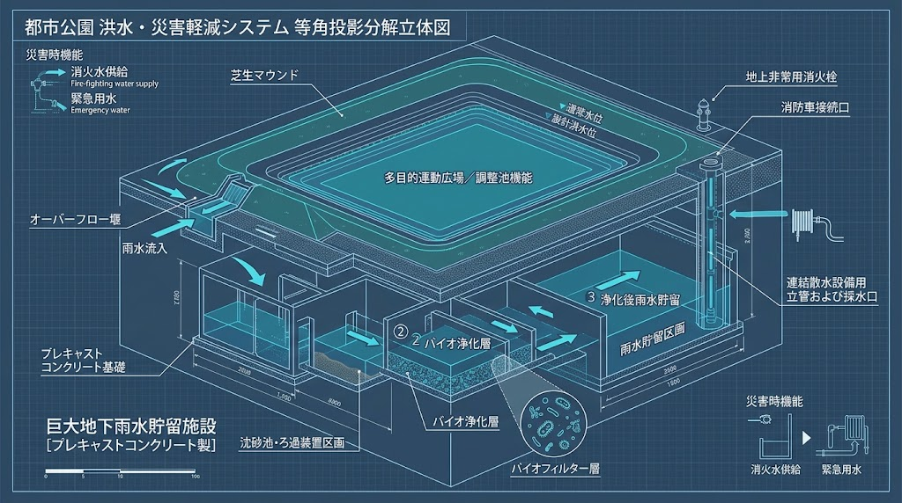
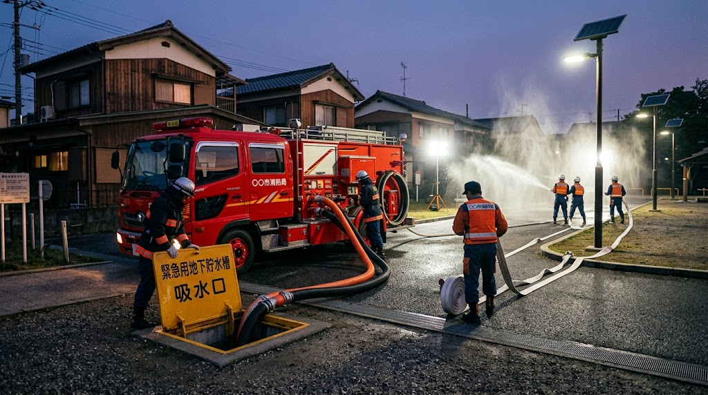
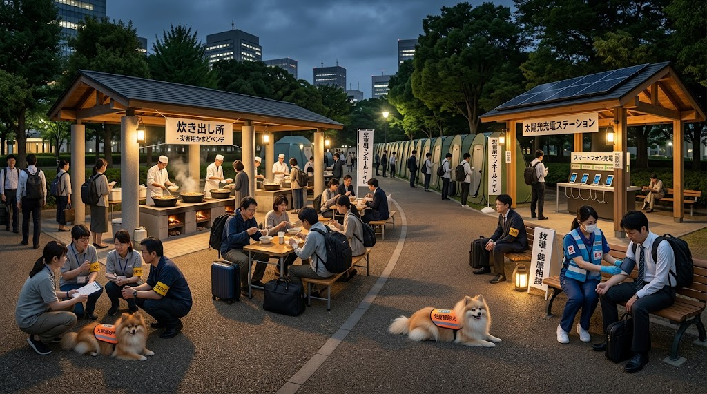

### ⚠️ JIN-ORDER RESTRICTED DATA

**このファイルは [JIN-ORDER Global Humanity License](https://github.com/JIN-ORDER-OFFICIAL/GOVERNANCE_OF_ABYSS/blob/main/LICENSE.md) によって保護されています。**

**無断転用、受託コンサルタントによる仕様書ロンダリング、机上の空論による改ざんを固く禁じます。**

---

# 🦅 SPEC-012: SOVEREIGN URBAN PARK COMMONS, SUBTERRANEAN RETENTION & DISASTER RESILIENCE PROTOCOL
## 公共公園公営管理 ＆ 地下循環雨水調整池・消火水利 ＆ 樹木・崖地鑑識 ＆ 帰宅困難者支援プロトコル仕様書
* 🏛️ **公知先行技術防壁台帳**: `JIN-SPEC-PRK-012-V1.1`
* 📐 **確度区分**: JRC Level 1（現場即応SOP / 自治体公園土木・都市雨水流況・消防消火水利・急傾斜地防災完全準拠）
* 🛡️ **準拠法令・規範**: 都市公園法、消防法第20条（消防水利基準）、下水道法、急傾斜地法、建築基準法、災害対策基本法

---

## 序文：「緑の広場」の地下に、都市生命の最終防衛線を築く



現代の都市公園行政は、「自由利用」という美名のもとで日常の維持管理を高齢化したボランティア（公園愛護会）へ丸投げし、防災倉庫の管理も町内会へ転嫁してきた。さらに深刻なのは、都市の過密化と気候変動による「ゲリラ豪雨での都市型内水氾濫」と、大震災時における「消火栓の断水による同時多発火災・延焼破壊」に対し、公園という広大な公共空間が分断されたまま放置されていることである。

本仕様書は、公園占用・道路河川土木の実務知見に基づき、以下の5大柱を統合規定する。

1. **公園管理の公営奪還 ＆ 防災備蓄倉庫の行政完全直営化**
2. **公園地下・循環型雨水調整池 ＆ 地上多目的遊水地（内水氾濫ゼロ化）**
3. **震災時・大規模火災直結型「耐震非常用消火水利（Fire-Fighting Sentry）」**
4. **樹木士・急傾斜地専門家による身体性現場鑑識（倒木・擁壁崩壊の未然遮断）**
5. **フェーズフリー防災拠点 ＆ 帰宅困難者受入サンクチュアリ回廊**

---

## 第1章：公園公営管理ドクトリン ＆ 防災備蓄直営化

### 1.1 公園愛護会搾取の廃止と行政直営保全
* **維持管理の公費・直営責任化:**
  * 都市公園の定期除草、便所清掃、遊具の法定安全点検は、すべて自治体公園緑地課・土木事務所の「公費直営業務」として位置付ける。
  * 公園愛護会等のボランティア活動は、除草・清掃の強制受託ではなく「美化への親しみ（自由参加）」へと再定義する。

* **愛護会活動へのJIN徳ポイント（JU）正当付与:**
  * 自発的に花壇の手入れや清掃に関わる住民・愛護会メンバーに対し、無償奉仕を強いるのではなく「Proof of Green Care」としてJIN徳ポイントを定期支給し、敬意と実利を担保する。

### 1.2 防災備蓄倉庫の行政完全直営化
* **行政直営スマート防災コンテナ（JIN-Resilience Bunker）の配備:**
  * 自治会へ鍵と備蓄更新を丸投げしていた老朽防災倉庫を全廃。耐震・耐火・対EMP密閉型コンテナを行政直営で公園内に標準配置する。
  * **常設備蓄内容:**
    1. 耐震地下貯水槽直結の手動・電動両用浄水揚水ポンプ
    2. 投光器用独立ソーラー＋リン酸鉄リチウム（LFP）自立電源
    3. 油圧ジャッキ、チェーンソー、バール、担架等の救助資材
    4. 3日分の真空パック長期保存孝弁・非常用水・衛生用品

* **スマート解錠 ＆ 責任公僕管理:**
  * 発災時（震度5強以上）には、通信途絶時でもオフラインPQC暗号・振動加速度センサーにより自動開錠。平時は出島現場公僕が年4回の機材動作・賞味期限点検を義務として履行する。

---

## 第2章：地下循環型雨水調整池 ＆ 地上多目的遊水地仕様



平時は子どもたちが遊ぶスポーツ広場・芝生空間が、豪雨時には「巨大遊水地」となり、その地下には「都市の盾」となる循環水系を配備する。

```text
                 【集中豪雨・線状降水帯発生】
                               │
 ┌─────────────────────────────┴─────────────────────────────┐
🔽                                                          🔽
【地上：掘り下げ式グラウンド遊水地】             【地下：大容量循環型雨水調整池】
 ・公園外周マウンド堤防（越流堰）                ・プレキャストRCボックスカルバート群
 ・雨水の一時的湛水（下流河川ピークカット）       ・粗朶・砂礫多層バイオフィルター浸透
 │                                                           │
 └─────────────────────────────┬─────────────────────────────┘
                              🔽
             【平時 ＆ 発災時 水資源多層カスケード】
              ・平時：せせらぎ親水路循環、樹木散水、夏季ミスト冷却
              ・発災時：【大震災時・耐震消火用水利】 ＆ 生活雑用水
```
---

### 2.1 地上：掘り下げ式グラウンド多目的遊水地
* **外周マウンド堤防と段差構造:**
  * 公園内の多目的グラウンドや芝生広場を周囲の道路面より0.6m〜1.2m掘り下げ、外周に緩やかな芝生マウンド（堤防）を配置。
  * 道路冠水や隣接水路の水位が限界に達した際、越流堰（流入ゲート）から雨水を一時的に広場へ導水し、周辺住宅地への浸水を物理阻止する。

* **迅速排水・再供用SOP:**
  * 雨雲通過後は、底部に設置した泥溜め桝および重力排水弁により24時間以内に全量を排水。残った泥土は土木事務所の小型スイーパーで即日清掃し、翌日には通常の公園利用へ復帰させる。

### 2.2 地下：大容量循環型プレキャスト雨水調整池
* **地下インフラのモジュラー構造:**
  * 公園グラウンド地下に、高強度プレキャストRCボックスカルバートをグリッド状に連結配置（貯水量：中規模公園で1,000〜5,000m³、中央公園規模で10,000m³以上）。
  * 道路側溝や公園内集水桝からの初期雨水を「沈砂池・粗朶多層フィルター」に通し、ゴミ・泥砂を完全分離して地下タンクへ流入させる。

* **平時の水循環・環境代謝利用:**
  * 貯留水の一部は、ソーラー駆動の小型ポンプで地上へ汲み上げ、公園沿いの「せせらぎ水路（Bio-FOEAS連動）」へ通水。
  * 夏季のヒートアイランド対策として、微細ミスト発生ノズルや樹木散水、公衆トイレの洗浄水として100%循環利用する。

---

## 第3章：大震災時・耐震非常用消火水利（Fire-Fighting Sentry）

大地震において、上水道本管の破断および消火栓の圧力低下による「初期消火不能・火災旋風」を阻止するため、地下調整池を消防専用水利として直結開放する。

```text
[地下循環雨水調整池（数千〜数万トン貯水）]
│
├──⏩️ 【耐震直結配管（SGP-VD / 鋳鉄管）】
│         │
│        🔽
├──⏩️ 【消防隊専用・採水口（大口径スタンドパイプ）】
│       ・消防ポンプ車がホースを直結し、最大圧で即時吸水放水
│
└──⏩️ 【自立型エンジン駆動・高圧放水銃（地域自衛消火）】
        ・停電時でも住民・消防団が初動延焼阻止放水可能
```
---

### 3.1 消防専用採水ノードの標準装備
* **大口径耐震スタンドパイプ（採水口）の配置:**
  * 消防車が進入しやすい公園外周部（道路境界）に、地下調整池と直結する直径150mm以上の専用採水金口を設置。
  * 水道管の破断・断水に一切影響されず、消防ポンプ車が地下調整池から無制限に高圧吸水・放水できる構造を義務付ける。
* **耐震性防火水槽（100m³級）区画の常時満水保持:**
  * 地下調整池の最深部に「常時満水区画（最低100〜300m³）」を隔離設定。渇水期であっても、深井戸水または優先貯留により、消防法基準を満たす消火用水を365日24時間絶対に切らさない。

### 3.2 自立動力・地域自衛消火ステーション
* **オフグリッド・ディーゼル/手動両用緊急ポンプ:**
  * 商用電源喪失時でも、スマート防災コンテナ内の小型エンジンポンプにより、地下調整池の水を加圧ホースへ圧送。
  * 消防隊の到着前であっても、消防団や地域住民（六道マイスター）が即座にホースを展張し、木造密集地域の初期火災を包囲消火する。

---

## 第4章：身体性現場鑑識（樹木士・急傾斜地専門家常駐メッシュ）

公園樹・街路樹の倒木や、後背地のガケ崩落による二次災害を未然に防ぐため、専門家による「手と耳の現場触診」を定期執行する。

### 4.1 樹木医・樹木士による倒木・大枝折損防護
* **木槌打音探査 ＆ 音響トモグラフィー:**
  * 公園内の大木・古木および街路樹の根元を木槌で打診。キノコ（腐朽菌）の兆候や内部空洞をミリ単位で特定し、倒木危険度（Rank A〜D）を判定。
* **台風前「風抜き剪定」の直営執行:**
  * 風圧を受けやすい樹冠の枝を間引く「風抜き剪定」を土木事務所が計画執行し、暴風時の倒木・電線切断・家屋損壊をゼロにする。

### 4.2 ガケ地・急傾斜地・擁壁の身体性鑑識
* **擁壁水抜きパイプの導通点検・高圧洗浄:**
  * 谷戸・坂道後背地の石積み・コンクリート擁壁において、水抜きパイプの詰まりを定期点検。背面土の間隙水圧上昇による崩壊を未然遮断。
* **クラックスケール変位鑑識:**
  * 擁壁のひび割れや孕み（はらみ）を地盤専門家がミリ単位で継続測定。豪雨時の崩落予兆を早期に察知し、退避・応急補強を行う。

---

## 第5章：フェーズフリー防災拠点 ＆ 帰宅困難者受入オアシス回廊



平時の憩い空間が、発災時には数万人を支える人道回廊へとシームレスに変形する。

### 5.1 フェーズフリー地上防災ファシリティ
1. **かまどベンチ群:** 平時は木製ベンチ、発災時は座面を外して大型鍋対応の炊き出し炉に変形。
2. **マンホールトイレ直結網:** 下水本管直結の耐震マンホール上に組立式テントを展開し、汲み取り不要の清潔な衛生環境を即時提供。
3. **自立あんどん照明 ＆ 太陽光充電ステーション:** 停電時でも消えないオフグリッド街路灯と、市民向け急速充電キオスク。

### 5.2 帰宅困難者エイドステーション ＆ 4Dルート提示
* **徒歩帰宅者へのライフライン提供:**
  * 主要幹線道路沿いの公園を「帰宅支援オアシス」に指定。地下深井戸からの飲料水、マンホールトイレ、温かい汁物（孝弁）、足湯・応急手当てを提供。

* **JIN-OS 4D動的ハザードマップ掲示:**
  * SPEC-011（道路点検メッシュ）とリアルタイム連動し、倒木・火災・冠水道路を自動排除した「安全徒歩帰宅ルート」を大型電子ペーパーおよび紙掲示板で即時提示。

---

## 第6章：JIN徳ポイント（Proof of Park Care & Fire Defense）

* **付与対象アクション:**
  1. 街路樹・公園樹の傾き、枯死枝、倒木危険の早期通報：**1件につき 40 JU**
  2. 擁壁クラック・ガケ地土砂流出兆候の通報：**1件につき 50 JU**
  3. 公園内水路・雨水流入桝の落ち葉清掃・詰まり解消：**1回につき 20 JU**
  4. 災害時の地下消火水利展張・かまど炊き出し・帰宅支援：**1回につき 100 JU**

* **生活直結還元:**
  * 公園排熱温浴施設フリーパス、地域「孝弁」受取、地域商店街の生活物資割引、愛犬健康診断補助への充当。

---

Supreme Judgment: Masano Takashi

Executed by: JIN-ORDER-OFFICIAL

STATUS: RATIFIED AS SPEC-012 (JIN-SPEC-PRK-012-V1.1)

HARMONICS: Urban Park Sovereignty, Subterranean Retention Pulse, Fire-Fighting Sentry Cadence, Arborist Tap Precision,<br>
Slope Forensic Balance, Stranded Walker Warmth, Proof-of-Green Equilibrium.
