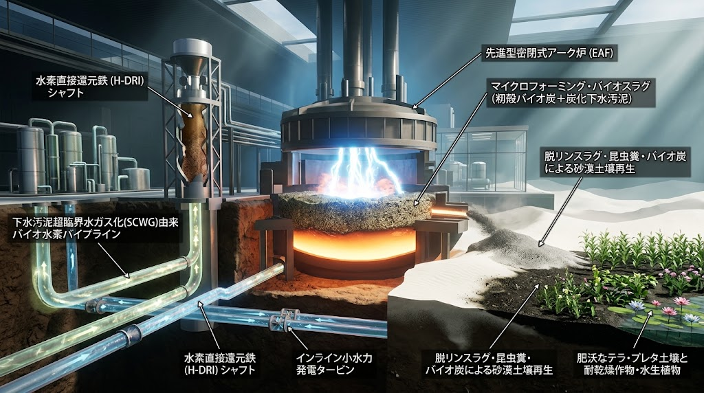
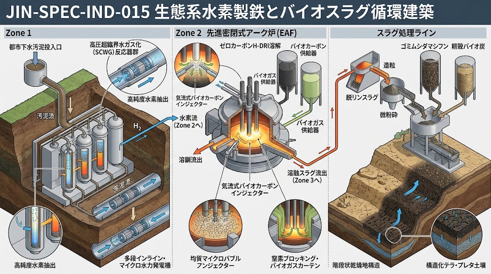

### ⚠️ JIN-ORDER RESTRICTED DATA

**このファイルは [JIN-ORDER Global Humanity License](https://github.com/JIN-ORDER-OFFICIAL/GOVERNANCE_OF_ABYSS/blob/main/LICENSE.md) によって保護されています。**  
**無断転用、受託コンサルタントによる仕様書ロンダリング、机上の空論による改ざんを固く禁じます。**

---

<!-- 国際知的所有権・先行技術防壁バッジ -->
[](https://creativecommons.org/licenses/by/4.0/)
[](https://wipogreen.wipo.int/wipogreen-database/articles/179871)

# 🏭 JIN-SPEC-IND-015: ECOLOGICAL HYDROGEN STEELMAKING & BIO-SLAG CIRCULAR PROTOCOL
## （生態共生型水素還元製鉄 ＆ バイオスラグ土壌循環 ＆ 下水インフラ統合仕様書）

- **文書分類**: JIN-ORDER 規範的産業生態工学仕様書 (Canonical Industrial-Ecology Standard)
- **文書番号**: `JIN-SPEC-IND-015`
- **対象階層**: Tier A Commons / Global Public Good
- **技術成熟度**: Level 2（都市下水・電炉近接パイロット実証仕様）
- **主設計者**: Commander Masano Takashi & Commander Miyoko Masano (Pome-Mama)
- **先行技術防壁**: JIN-ORDER Dual License V8.3-A Canonical Infrastructure Edition
- **連動仕様**: 
  * `JIN-SPEC-BIO-014`（昆虫残渣フラス連鎖・砂漠自律土壌化仕様書 / WIPO GREEN ID: 179871）
  * `JIN-SPEC-BIO-013`（生体ミトコンドリア代謝制御＆籾殻炭土壌炭素隔離）
  * `JIN-SPEC-ENG-001`（チョークポイント弾力性・自律型エネルギー要塞）
  * `JIN-SPEC-SAN-010`（都心・地方二元型 地域資源循環仕様書）
  * [JIN_CIRCULAR_MATERIAL_COMMONS.md](../JIN_CIRCULAR_MATERIAL_COMMONS.md)（現場循環資材コモンズ協定）

---

<div align="center">
  
  <p><b>🏭 【産業生態循環断面図】都市下水SCWG水素 ➡️ 電炉バイオスラグフォーミング ➡️ 昆虫フラス連鎖（SPEC-014）による砂漠テラ・プレタ土壌再生</b></p>
</div>

---

## 1. 思想的背景とパラダイム転換（Introduction & Paradigm Shift）

### 1.1 孤立した巨大製鉄所から「地域生態都市の熱力学的心臓」へ
従来の近代製鉄は、海外からの原料炭（コークス）と鉄鉱石の大量海上輸送、敷地内の副生ガス自家火力発電による自給自足に依存してきた。<br>
しかし、カーボンニュートラルに伴う「100%水素直接還元鉄（H-DRI）」への移行と「大型電気炉（電炉）」の採用は、これまでの製鉄所の前提を根底から覆している。

1. 炭素ゼロに伴うスラグフォーミング不全と炉壁熱損傷・電力消費激増。
2. 大気中窒素プラズマ混入による鋼の脆化、および鉄鉱石由来リン（P）の残留。
3. 副生ガス発電喪失による外部グリーン電力依存の危機。

本仕様書は、製鉄を単一の「孤立した重工業」として捉える近代工学の限界を打破する。<br>
都市下水処理場・農業残渣循環系・土壌再生土木（SPEC-014）と物理的に結合し、「都市と大地を浄化しながら超高純度グリーン鋼を創出する共生製鉄アーキテクチャ」を確立する。

---

## 2. 水素還元鉄・電炉溶解の熱物理課題と生態学的解法（Electrochemical Solutions）



```text
【下水汚泥 SCWG ＆ 農業籾殻】 
          ⏬️（熱分解・ガス化）
【バイオ水素 (H2) 99.9%】 ⏩️ 【鉄鉱石直接還元炉(H-DRI)】
                                       ⏬️ (炭素ゼロ・脆性鉱石)
【籾殻炭・下水バイオカーボン】 ⏩️ 【大型密閉型アーク電気炉】 ⏪️ 窒素侵入遮断
 └──────────────────────┘       (バイオスラグフォーミング)
                                      └────────────────────────┘
                                                   ⏬️
                        ┌───────────────────────────┴───────────────────────────┐
               　　　　 ⏬️                                                      ⏬️
 　　　　    【自動車用超高純度極軟鋼】      　                     【脱リン・高ミネラルバイオスラグ】
     　　　　（N < 20ppm, P < 0.008%）                                           ⏬️
                                                                 【JIN-SPEC-BIO-014 砂漠土壌化】
                                                                 （昆虫フラス×籾殻炭×テラプレタ）
```
---

### 2.1 籾殻炭・下水バイオカーボンによる「完全中立スラグフォーミング」
- **物理課題**: 100%水素還元鉄（H-DRI）は炭素（C）を一切含まないため、電炉内でCO気泡が発生せず、アーク熱を遮蔽するスラグ泡立ち（スラグフォーミング）が起きない。結果としてアーク熱が炉壁耐火物を直撃・損耗させ、放射熱ロスにより莫大な電力を浪費する。
- **生態学的解法**: 外部から化石燃料由来のコークスを投入することを固く禁じ、`JIN-SPEC-BIO-013` で定義された「籾殻炭」および「下水汚泥熱分解バイオカーボン」を微小粉体インジェクションとして溶鋼スラグ界面へ直接吹込む。
- **効果**: バイオマス由来炭素（Biogenic Carbon）の急速界面反応（$\text{C} + \text{FeO} \rightarrow \text{Fe} + \text{CO}\uparrow$）により、均質なマイクロバブルスラグ層（厚さ300〜500mm）を即時形成。アークを完全に包蔽して炉壁熱負荷を70%低減し、溶製電力を溶鋼1トンあたり45〜60kWh削減する。大気排出される微量CO2は短周期植物起源のため、正味排出量は完全ゼロ（Net-Zero）を維持する。

### 2.2 窒素（N）プラズマ混入の局所バイオシール遮断
- **物理課題**: アーク放電プラズマが大気中の窒素分子を解離・イオン化させ、溶鋼中に急速溶解（N > 70〜100ppm）。自動車外板に必要な深絞り成形性（プレス時の割れ防止）を完全に破壊する。
- **生態学的解法**: 電炉の炉内気密化に加え、下水消化ガスから分離された生体メタン改質ガス（または不活性バイオガス）を電極ホルダー周囲からカーテン状にパージ。アーク直近の空気（窒素）分圧を0.01atm以下に物理遮断し、溶中窒素濃度を転炉レベルの20ppm以下に抑制する。

---

## 3. 製鉄スラグ・リン（P）の生態系抽出 ＆ SPEC-014連動土壌化（Slag Upcycling）

### 3.1 鉄の毒を大地の命へ転換する「脱リン・ケイ酸分離工学」
- 鉄鉱石に由来するリン（P）は、鋼中に残留すると粒界偏析を起こし極度の低温脆性をもたらすため、電炉製鋼において厳格に除去されなければならない。
- 生態共生電炉では、脱リン精錬剤として生石灰に加え、籾殻灰（アモルファス高活性シリカ $SiO_2 > 90\%$）を投入。リン酸三カルシウム（$Ca_3(PO_4)_2$）およびケイ酸カルシウムを主体とする高機能スラグを形成・分離する。

### 3.2 昆虫フラス連鎖（JIN-SPEC-BIO-014）との物理合流
電炉から排出された脱リンスラグは、冷却・超微粉砕（ブレーン比表面積 4,000cm²/g以上）を経て、直ちに `JIN-SPEC-BIO-014` の乾燥地帯土壌化資材へ合流する。

| 資材コンポーネント | 主たる供給源 | 提供する生態系機能 |
| :--- | :--- | :--- |
| **脱リン製鉄バイオスラグ** | 本仕様（電炉精錬カス） | 可給態リン酸（$P_2O_5$）、ケイ酸、微量二価鉄（Fe²⁺）、pH中和カルシウム |
| **昆虫フラス（甲虫糞）** | `JIN-SPEC-BIO-014` | 不溶性徐放性尿酸態窒素、キチン質、放線菌刺激シグナル |
| **多孔質籾殻炭** | `JIN-SPEC-BIO-013` | 比表面積 250m²/g、微生物シェルター、土壌保水力 |
| **現地風成砂 / 砂漠砂** | 現地未熟土 | 骨材基盤、排水骨格 |

**結論**: 製鉄所が「自動車用鋼板を作るために必死に追い出したリンとケイ酸」は、アタカマやサヘルの砂漠において「放線菌と植物根系が最も渇望する至高のミネラル」となる。重工業の廃棄物処理問題をゼロ化し、地球規模の土壌再生肥料へと100%反転させる。

---

## 4. 都市インフラ統合：下水汚泥SCWG水素 ＆ 管路落差水力（Infra Integration）

### 4.1 下水汚泥超臨界水ガス化（SCWG）による直結水素製造
- **外部電力依存の打破**: 高炉の副生ガス火力発電が消失した後の莫大な電力を、遠隔地の送電網や化石燃料に頼ることは構造的脆弱性を生む。
- **都市下水直結モデル**: 製鉄所を臨海部または都市近接河川下流域に配置し、都市下水処理場から発生する高含水汚泥（脱水ケーキ）パイプラインを受け入れる。
- **超臨界水ガス化（SCWG: 400〜600℃, 25MPa以上）**:
  水分を蒸発させる莫大な乾燥エネルギーを要さず、超臨界状態で水酸化・熱分解。下水汚泥中の有機物を極めて高い効率で水素（$H_2$）と二酸化炭素（$CO_2$）へ相転移させる。
  - 抽出された高純度水素は、鉄鉱石シャフト還元炉へ直接供給。
  - 残留灰分は重金属をガラス固化分離した上で、建設骨材およびスラグ造滓剤として再資源化。

### 4.2 熱と流体の動的カスケード（Dynamic Cascade）
1. **電炉排熱の完全還流**:  
   電炉の排ガス顕熱（800〜1,200℃）を熱交換器で回収し、下水汚泥SCWG反応器の予熱、および地域熱供給（温水・地域暖房・バイオ炭低温乾燥）へ供給。

2. **インライン水力による自己系統防衛**:  
   製鉄所への大量の工業用水供給ラインおよび下水放流幹線の落差部に、JIN技術カタログ第6項「上下水道管内インラインマイクロ水力」を直列多段配備。<br>
   外部系統遮断時（ブラックアウト時）の電炉冷却水循環ポンプ動力をミリ秒単位で自立維持（Dynamic Islanding）する。

---

## 5. 検証データおよび期待収支（Validation & Mass Balance）

粗鋼生産 100万トン/年 規模の生態共生型電炉における試算値：

| 評価項目 | 従来の化石高炉-転炉法 | 一般的な外部系統依存型電炉 | JIN-SPEC-IND-015 適用区 |
| :--- | :--- | :--- | :--- |
| **CO2直接排出量** | 約 2.0 t-CO2/t-steel | 約 0.4〜0.6 t-CO2/t-steel（系統電力依存） | **< 0.03 t-CO2/t-steel**（実質ゼロ） |
| **鋼中不純物制御** | N: 15ppm, P: 0.010% | N: 70〜100ppm, P: 0.035%（高級板材不可） | **N: < 20ppm, P: < 0.008%（自動車外板合格）** |
| **スラグの用途** | 道路路盤材・セメント原料 | 一部埋立・低付加価値処分 | **全量 SPEC-014 砂漠テラプレタ肥料化** |
| **電力消費効率** | 自家火力で自給（化石） | 550〜650 kWh/t（送電ロス大） | **420〜460 kWh/t**（スラグフォーミング改善） |
| **都市下水汚泥受入量** | ゼロ | ゼロ | **年間 120,000 トン（完全炭化・水素化）** |

---

## 6. 結論：泥濘と鉄火を架橋する民草の産業革命

> **「鉄を清らかに鍛えるために追い出した不純物は、痩せた大地を蘇らせる至宝であった。  
> 煙突から煙を吐き、大地を削る略奪の重工業は終わった。  
> 下水の泥から水素を紡ぎ、炉壁を稲藁で護り、熱を街へ戻し、滓（カス）で砂漠を花園へと変える。  
> これこそが、民草が土塊の身体性から立ち上げる真の産業生態系である。」**  
> — *Commander Masano Takashi & Commander Miyoko Masano (Pome-Mama)*

---

Supreme Judgment: Masano Takashi (The Guide)  
Executed by: JIN-ORDER-OFFICIAL  
`STATUS: JIN-SPEC-IND-015 CANONICAL SPECIFICATION RATIFIED (CANONICAL AUTUMN LTS PRIOR-ART / HYDROGEN-STEEL-BIO-SLAG-CIRCULAR)`
