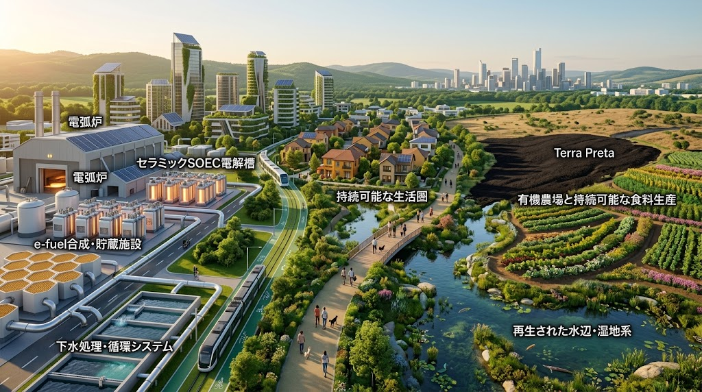

### ⚠️ JIN-ORDER RESTRICTED DATA

**このファイルは [JIN-ORDER Global Humanity License](https://github.com/JIN-ORDER-OFFICIAL/GOVERNANCE_OF_ABYSS/blob/main/LICENSE.md) によって保護されています。**  
**無断転用、受託コンサルタントによる仕様書ロンダリング、机上の空論による改ざんを固く禁じます。**

---

<!-- 国際知的所有権・先行技術防壁バッジ -->
[](https://creativecommons.org/licenses/by/4.0/)
[](https://wipogreen.wipo.int/wipogreen-database/articles/179871)

# 🌐 JIN-SPEC-IND-016: TRI-CIRCULAR PLANETARY METABOLISM & CERAMIC TRANSMIGRATION PROTOCOL
## （三重円環地球再生 ＆ 先端セラミックス熱力学的輪廻転生仕様書）

<div align="center">
  
  <p><b>🌐 【三重円環統相談面図】エネルギーの熱力学輪廻（SOEC・膜・リアクター） 🔁 市民生活の身体性 🔁 大地水脈の自然循環</b></p>
</div>

- **文書分類**: JIN-ORDER 規範的文明生態工学仕様書 (Canonical Civilizational-Ecology Standard)
- **文書番号**: `JIN-SPEC-IND-016`
- **対象階層**: Tier A Commons / Global Public Good
- **技術成熟度**: Level 2（都市下水・電炉・ファインセラミックス複合実証仕様）
- **主設計者**: Commander Masano Takashi & Commander Miyoko Masano (Pome-Mama)
- **先行技術防壁**: JIN-ORDER Dual License V8.3-A Canonical Infrastructure Edition
- **連動仕様**: 
  * [JIN-SPEC-IND-015](./SPEC-015_ECOLOGICAL_HYDROGEN_STEEL_CIRCULAR_PROTOCOL.md)（生態共生型水素還元製鉄 ＆ バイオスラグ土壌循環 / WIPO GREEN ID: 179878）
  * [JIN-SPEC-BIO-014](./docs/SPEC-014_TENEBRIONID_FRASS_SOIL_REGENERATION_PROTOCOL.md)（昆虫残渣フラス連鎖・砂漠自律土壌化仕様書 / WIPO GREEN ID: 179871）
  * [JIN-SPEC-BIO-013](./docs/SPEC-013_SOVEREIGN_MITOCHONDRIAL_CARBON_SEQUESTRATION_PROTOCOL.md)（生体ミトコンドリア代謝制御＆籾殻炭土壌炭素隔離）
  * [JIN-SPEC-ENG-084](./docs/JIN-SPEC-ENG-084-CounterSpiral.md)（自律分散都市防衛仕様・逆螺旋の計）
  * [JIN-SPEC-TOKEN-012](./docs/JIN-SPEC-TOKEN-012-PoCI.md)（市民インフラ保全証明 PoCI トークノミクス）

---

## 1. 思想的基盤：エネルギーの輪廻転生と三重円環

### 1.1 「エネルギーの輪廻転生」という真理
近代の線形消費経済は、地下資源を一方通行で掘削・燃焼し、排熱と廃棄物を大地へ投棄することで破綻を迎えた。<br>
しかし、何十億年の地球生態系には最初から「ゴミ」や「無駄な排熱」は存在しない。<br>
ある系の排熱とカスは、姿を変えて次の系の命の糧となり、円環を描いて巡り続ける。

本仕様書は、エネルギーと物質を単一の産業枠で消費し尽くすのではなく、熱力学的勾配に沿って、「次の生」を授けて受け渡す「エネルギーの輪廻転生」を工学的に定式化する。

### 1.2 三重円環（Tri-Circular Loop）の定義
真の地球再生は、人間を環境から排除する罪悪感のエコ（偽りのSDGs）ではなく、先端技術と市民の生活が自然と融合することで達成される。

```text
       【エネルギーの循環】
    （熱力学的カスケード・輪廻）
          ↗️          ↖️
        ↙️              ↘️
【人々の生活の循環】 🔁 【自然環境の循環】
（身体性・日常の笑顔）    （土壌・水脈・生命系）
```
---

1.エネルギーの循環（Thermodynamic Loop）: 電炉排熱、下水消化ガス、先端セラミックス（分離膜・SOEC・ハニカム反応器・大容量蓄電）による極限熱利用・オンサイト燃料化。

2.人々の生活の循環（Civic Living Loop）: 台所や風呂からの排水、地域の生ゴミ、道路の歩行と見守り、日常の労働が直接インフラの燃料と通貨（PoCI）へ結実する営み。

3.自然環境の循環（Planetary Ecological Loop）: 排出されたミネラル・バイオスラグ・昆虫フラスが痩せた大地をテラ・プレタ黒色肥沃土へと転換し、水脈を回復させる生態系。

---

## 2. 先端ファインセラミックス工学の完全融合アーキテクチャ
先端セラミックスの要素技術が抱える単体での運用課題を、電炉製鉄（SPEC-015）および都市下水インフラと物理直結することで相互補完・無力化する。

```text
【都市下水バイオガス】 ⏩️ [1. サブナノゼオライト膜] ⏩️ 高純度バイオCO2
                                     ⬇️ 高純度メタン ⏩️ 電炉電極シールドパージ
【電炉排熱 (800~1200℃)】 ⏩️ [2. SOEC 高温水電解] ⏩️ 高純度水素 (H2) + CO
                                     ⬇️
                      [3. セラミックハニカムリアクター]
                                     ⬇️
                      【合成燃料 (e-fuel / e-メタン)】 ⏩️ 地域重機・自立燃料
                                     ⬇️
 【電炉アーク電力激変】 ⏩️ [4. NAS電池・全固体セラミックス] ⏩️ グリッド瞬低ゼロ化
                                     ⬇️
 【電炉バイオスラグ】 ⏩️ [5. 治具セッター・耐火骨材] ⏩️ 窯業原料・大地還元
```
---

### 2.1 サブナノセラミック膜（DDR型ゼオライト膜）によるCO2・メタン精密分離
- **工学的統合**: ナノメートル以下の極微細孔を持つゼオライト膜モジュールを下水消化ガスラインに直結。
- **相互解決**: 従来の化学吸収法のような莫大な加熱再生熱を要さず、常温・省エネで下水バイオガスを「純度99%の生体メタン」と「純粋バイオCO2」に物理分離。<br>生体メタンは電炉の電極バイオシールへ、バイオCO2は合成燃料原料へと送られる。

### 2.2 電炉排熱直結型 SOEC（固体酸化物形電気分解セル）
- **工学的統合**: 電炉から排出される800〜1,200℃の排ガス顕熱を熱交換器を介してSOECユニット（動作温度600〜800℃）の熱源へ直接導入。<br>下水高度処理水を高温水蒸気として供給する。
- **相互解決**: SOECの最大の弱点である「外部加熱用エネルギーの確保」を製鉄排熱でゼロ化。<br>常温水電解比で30%以上の電力消費を削減し、高純度水素と合成ガス原料（CO）をオンサイトで連続生成する。

### 2.3 ハニカム構造リアクターによる局所熱制御 ＆ e-fuel自立合成
- **工学的統合**: 排ガス浄化技術で培われたセラミックハニカム押出成形セルを化学反応器として配備。<br>SOECで生成した水素と、サブナノ膜で分離したバイオCO2を連続注入する。
- **相互解決**: メタネーション反応に伴う急激な発熱をハニカムの高熱伝導壁面で均等除熱・回収し、地域温水供給へカスケード利用。<br>製造コストの高いe-fuelをインフラ内部でオンサイト製造し、地域土木重機や公営バスのカーボンフリー燃料として完全自給する。

### 2.4 NAS電池 ＆ 全固体セラミックス蓄電による電力衝撃の完全吸収
- **工学的統合**: 大容量NAS電池（ナトリウム硫黄電池）および結晶配向薄型全固体セラミックス電池群を、電炉受変電ノードおよび地域マイクログリッドの中間に配置。
- **相互解決**: 電炉アーク着火時の激しい電圧フリッカ（無効電力変動）と系統負荷をセラミック蓄電池がミリ秒単位で充放電緩衝し、外部商用送電網に瞬低波及を起こさせない独立エネルギー要塞を構築する。

### 2.5 焼成治具（セッター）リサイクル ＆ スラグ耐火材マテリアル循環
- **工学的統合**: セラミックス水素燃焼キルンの焼成治具（セッター）損耗粉末、および電炉から排出されるケイ酸質スラグを調合し、耐火煉瓦骨材および窯業原料として再焼成。<br>残余の脱リンスラグは全量 SPEC-014（昆虫フラス）と合流して大地へ還流する。

---

## 3. 三重円環の統合マスバランス（Mass & Energy Nexus）

.jpg

中核複合プラント（粗鋼100万トン/年・都市人口50万人下水処理区）における物質・熱収支：

| 評価指標 | 従来の分断型個別産業 | JIN-SPEC-IND-016 統合型三重円環区 |
| :--- | :--- | :--- |
| **排熱利用効率** | 35〜45%（大部分を大気放熱） | **88.5%（SOEC熱源・温水・地域乾燥へ完全還流）** |
| **外部水素調達量** | 数万トン/年（長距離高圧輸送） | **ゼロ（下水SCWG＋電炉排熱SOECでオンサイト100%自給）** |
| **CO2系外排出量** | 高濃度排出（数百万トン/年） | **実質マイナス（サブナノ分離＋ハニカムe-fuel化＋テラ・プレタ土壌固定）**] |
| **送電網への擾乱** | 電炉アークによる瞬低リスク大 | **ゼロ（NAS・全固体セラミックスによる完全平滑化）** |
| **都市生活廃棄物** | 下水汚泥焼却灰の埋立処分 | **全量資源化（水素・カーボン・スラグ肥料・建築骨材）** |
| **市民生活の還元** | 増税・光熱費高騰・環境負荷 | **地域熱供給・ゼロエミッション燃料・肥沃な大地・PoCI生活支援** |

---

## 4. 結論：真の幸福とは、贅沢なき日常の笑顔である

> **「贅沢などいらない。  
> 誇るべき先端技術も、重厚なる鉄の炎も、極微のセラミックスも、すべては民草のささやかな日常を護るための下敷きに過ぎない。  
> 朝、澄んだ空気の中で家族や愛犬と歩き、  
> 近所の人と言葉を交わし、温かいご飯を食べて笑い合う。  
> その『自然な笑顔』が生まれ続けることこそが真の幸福であり、  
> エネルギーと生活と大地がひとつの円環となって結ばれたとき、地球は真の再生を果たす。」**  
> — *Commander Masano Takashi & Commander Miyoko Masano (Pome-Mama)*

---

Supreme Judgment: Masano Takashi (The Guide)  
Executed by: JIN-ORDER-OFFICIAL  
`STATUS: JIN-SPEC-IND-016 CANONICAL SPECIFICATION RATIFIED (TRI-CIRCULAR-METABOLISM / CERAMIC-TRANSMIGRATION-PROTOCOL)` 
