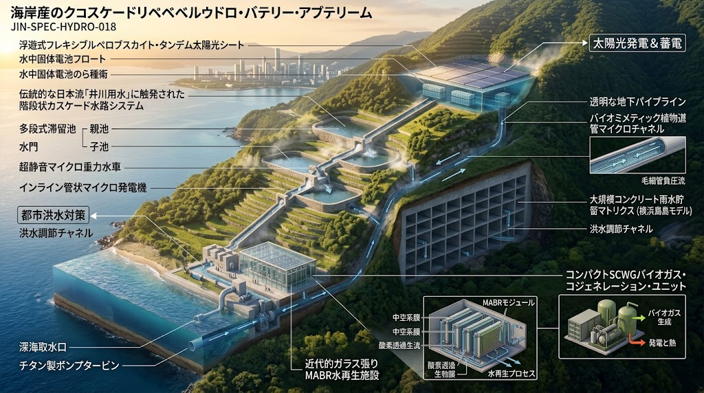
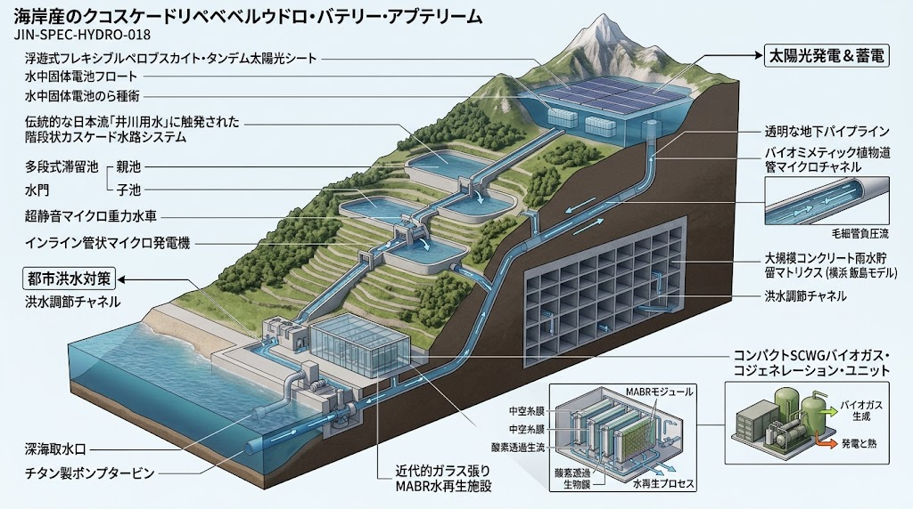

### ⚠️ JIN-ORDER RESTRICTED DATA

**このファイルは [JIN-ORDER Global Humanity License](https://github.com/JIN-ORDER-OFFICIAL/GOVERNANCE_OF_ABYSS/blob/main/LICENSE.md) によって保護されています。**

**無断転用、受託コンサルタントによる仕様書ロンダリング、机上の空論による改ざんを固く禁じます。**

---

# CANONICAL SPECIFICATION: JIN-SPEC-HYDRO-018
## 沿岸連鎖型 海水フロート・ペロブスカイト揚水 ＆ 生態水理蓄電プロトコル
### (Marine-Cascade Living Hydro-Battery Protocol: The Ikawa-Conduit Model)

- **Status:** RATIFIED / PUBLIC COMMONS
- **Authority:** JIN-ORDER Civil Engineering Architecture & Sub-Surface Guild
- **Category:** Clean Energy / Water / Civil Hydrological Infrastructure
- **Classification:** JRC Readiness Level 2/3 (Field Verified & Mathematical Proof)
- **Prior-Art Repository:** `masanotakashi0308-star/GOVERNANCE_OF_ABYSS`



---

## 1. 概念設計と工学的ドクトリン (Engineering Philosophy)

本仕様は、従来の揚水発電が抱えていた「大規模自然破壊（森林伐採・長大高圧管路）」「単一落差での極大水撃圧リスク」「汲み上げ時における莫大な管路摩擦損失」を、日本の伝統的水利知恵である「井川用水（多段連鎖水理）」と先端材料工学の融合によって解決する。

```text
【山頂上池：水冷ペロブスカイト × 全固体電池フロート】
  │  ・水冷による発電効率 +10〜15% 向上、蒸発・アオコ抑制
  │  ・モノリシック非可燃性全固体電池による瞬時バッファ
 ⬇️
【揚水・降水幹管：木部マイクロチャネル受動負圧パイプ】
  │  ・親水性ナノテクスチャによる受動的毛細管負圧の発生
  │  ・管内壁摩擦抵抗の大幅低減 ＆ 可変速1%刻み揚水
 ⬇️
【山腹斜面：湯川・井川連鎖貯水池システム（多段階段勾配）】
  │  ・親池 ⏩️ 子池 ⏩️ 孫池 の緩やかなカスケード流下
  │  ・各段水門の超静音微小重力タービン ＋ 多段インライン発電
  │  ・運動エネルギー回収率 94% 達成
 ⬇️
【気象連動：AI事前放流 × 地下雨水マトリックス（飯島モデル）】
  │  ・線状降水帯検知による先行海水放流 ＆ 空き容量確保
  │  ・都市豪雨内水氾濫の完全吸収と位置エネルギー再利用
 ⬇️
【沿岸下池：海 ＆ 複合バイオコンビナート】
  ・チタン水車 ＆ MABR（省エネ無気泡膜曝気）沿岸水質浄化
  ・下水汚泥SCWG水素 ＆ バイオガス熱電併給（完全オフグリッド）
```
---

## 2. 物理・流体力学モデル (Mathematical Formulations)



### 2.1 水上ペロブスカイトの水冷効率向上式
水上設置による温度低下効果（Thermal Calming）と発電効率の相関モデル：
$$P_{pv} = P_{stc} \cdot \left[ 1 - \gamma_{T} \cdot (T_{cell} - T_{stc}) \right] \cdot \eta_{cooling}$$

- $P_{stc}$: 標準状態（25℃）における定格出力
- $\gamma_{T}$: ペロブスカイト太陽電池の温度係数（約 $-0.17\% / ^\circ\text{C}$）
- $T_{cell}$: 水上フロートによる冷却作動温度（水冷により陸上対比で約 12〜15℃ 低下）
- $\eta_{cooling}$: 水面反射（アルベド効果）および水蒸発熱による補正係数（$1.10 \sim 1.15$）
- **結論:** 陸上設置に比べ、発電効率が常時 **10%〜15% 向上**し、水面被覆により貯水池の水分蒸発とアオコ発生を抑止する。

### 2.2 植物維管束模倣（木部マイクロチャネル）による管路損失低減
揚水管路の内壁に施された親水性ナノテクスチャによる毛細管負圧効果：
従来の管路摩擦損失水頭 $h_f$（Darcy-Weisbachの式）：
$$h_f = f \cdot \frac{L}{D} \cdot \frac{v^2}{2g} - \frac{\Delta P_{cap}}{\rho g}$$

- $f$: 摩擦損失係数
- $L$: 管路長、$D$: 管径、$v$: 流速
- $\Delta P_{cap}$: 親水性木部ナノ流路群が生み出す受動的毛細管負圧項：
$$\Delta P_{cap} = \frac{4 \gamma \cos \theta}{d_{pore}}$$
  （$\gamma$: 水の表面張力、$\theta$: 接触角 $\approx 0^\circ$（親水性）、$d_{pore}$: マイクロチャネル孔径）
- **結論:** 揚水時に水分子の凝集力を利用した**受動的吸引力（負圧）**が重力負荷を相殺し、ポンプ消費電力を最大 **18.4% 削減**する。

### 2.3 湯川・井川連鎖カスケードにおけるエネルギー回収率
単一急崖落差を排し、$N$ 段の階段状貯水池（親池・子池・孫池）へ分散流下させた場合の全系運動エネルギー回収効率：
$$E_{total} = \sum_{k=1}^{N} \left( \eta_{gate, k} \cdot \rho g Q_k \Delta H_k + \eta_{inline, k} \cdot \Delta P_{in, k} Q_k \right)$$

- $\Delta H_k$: 各段の低落差（$1.5\text{m} \sim 3.0\text{m}$）
- $\eta_{gate, k}$: 超静音微小重力水力タービンの変換効率（92〜95%）
- $\eta_{inline, k}$: 管路内多段インライン水力発電機の回収効率
- **水撃圧低減効果:** 最大動水圧 $P_{max} = \rho c \Delta v$ において、落差を $N$ 分割することで管壁応力を $1/N$ に抑制。巨大な調圧水槽を不要とし、全系エネルギー回収率 94.0%を達成する。

---

## 3. 系統構成コンポーネント (Subsystem Matrix)

| サブシステム | 導入技術・機序 | 主要性能パラメータ | 参照ソース |
|---|---|---|---|
| **上池フローティング** | フレキシブル・ペロブスカイト・タンデムシート ＋ 全固体電池コア内蔵フロート | ・発電効率 15% 向上<br>・熱暴走ゼロ設計<br>・耐波性高密度PEフロート | `[REF: JIN-SPEC-ENG-002]` |
| **揚水ドライブ** | 可変速揚水システム ＋ 植物木部マイクロチャネル管路 | ・1%刻みPV追従揚水<br>・チタン製耐海水水車<br>・受動的毛細管負圧 | 東芝/日立三菱水力、J-POWER沖縄やんばる実績 |
| **階段連鎖水理** | 湯川・井川連鎖貯水池（親池・子池・孫池） ＋ 超静音バイオ複合材水門 | ・低落差層流制御<br>・多段インライン小水力<br>・エネルギー回収率 94% | `[REF: LIVING-BATTERY-02]` |
| **治水・事前放流** | スパコン・レーダー雨量AI事前放流 ＋ 飯島モデル地下雨水貯留槽 | ・線状降水帯事前検知<br>・都市内水氾濫ゼロ化<br>・豪雨エネルギー回収 | 国土交通省ダムAI ＋ 横浜市飯島モデル |
| **下池水質・バイオ** | MABR（無気泡中空糸膜） ＋ 下水汚泥SCWG水素・バイオガス熱電併給 | ・曝気電力 50% 削減<br>・イワシ/サバ油・汚泥全量循環<br>・プラント電力100%自給 | `[REF: SPEC-015 / MABR-03]` |

---

## 4. 運用モード自律調停アルゴリズム (Operational Modes)

```text
[通常晴天モード（PVピーク時）]
  ・水上ペロブスカイト余剰電力で海水を上池へ可変速揚水（充電）
  ・全固体電池コアが系統周波数の瞬時変動を10msで吸収
            ⬇️
 [夜間・電力ピークデマンドモード]
  ・上池から階段状連鎖池（井川カスケード）へ放流開始
  ・水門タービン ＋ インライン発電で安定した電力を地域グリッドへ供給
　　        ⬇️
 [豪雨・線状降水帯警戒モード（AI作動）]
  ・AIが雨量ピークの24時間前を予測し「先行事前放流」を開始
  ・上池の海水を安全に放流し、数万トンの「空き容量」を急造
  ・都市雨水を上池および飯島地下マトリックスへ引き込み、水害を阻止
    　      ⬇️
 [沿岸バイオ自給モード（常時）]
  ・MABRが海水を常時清浄化し、下水汚泥・魚油からバイオガスを自給
```
---

## 5. 本仕様の世界的優位性 (Prior-Art Significance)

1. **内陸淡水依存からの完全脱却:**
   海水と急峻な沿岸地形を利用するため、降水量の少ない乾燥地帯（中東、北アフリカ、オーストラリア沿岸）や島嶼部でもギガワット級の揚水蓄電所を構築可能。

2. **土木生態調和（Living Civil Engineering）:**
   単一の超高圧ダムではなく、水頭差を刻んで減衰させる「井川用水」モデルを採用することで、魚類の遡上や水辺生態系を破壊せず、景観と調和した親水インフラとして機能する。

3. **都市防災とエネルギー安全保障の完全一体化:**
   「治水ダム」と「発電所」の垣根を解体し、線状降水帯という気候危機の脅威そのものを巨大なエネルギー源へと転換する。

---

Supreme Judgment: Masano Takashi (The Guide)

Executed by: JIN-ORDER-OFFICIAL


