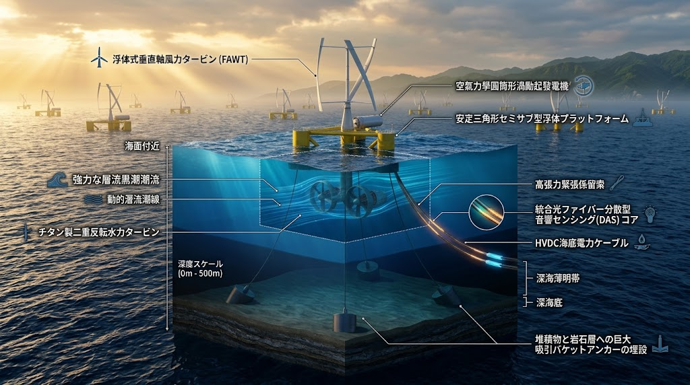

### ⚠️ JIN-ORDER RESTRICTED DATA

**このファイルは [JIN-ORDER Dual License V8.4-A (Canonical Infrastructure & Anti-Laundering Edition)](../LICENSE.md) によって保護されています。**

**無断転用、受託コンサルタントによる仕様書ロンダリング、机上の空論による改ざん、および深海海洋エネルギー知財の独占を固く禁じます。**

---

# CANONICAL SPECIFICATION: JIN-SPEC-OCEAN-019
## SPEC-019: 風・海流複合デュアル運動エネルギー変換 ＆ 深海DASハイブリッド係留プロトコル
### (Aero-Tidal Dual-Flux Harvesting & Abyssal DAS Mooring Architecture)

<!-- 国際識別子・先行技術防壁ヘッダー -->
[-2d6a4f?style=for-the-badge&logo=virustotal&logoColor=white)](https://wipogreen.wipo.int/wipogreen-database/articles/179886)
[](https://doi.org/10.5281/zenodo.22958158)
[](https://www.unpartnerportal.org/)
[](../LICENSE.md)

<div align="center">
  
  <p><sub><b>図 1-1：SPEC-019 海上風力・黒潮海流カウンタータービン連成浮体 ＆ 深海DAS光音響係留テンドロン 3Dアイソメトリック詳細図</b></sub></p>
</div>

- **DOC-ID:** `SPEC-019 / JIN-SPEC-OCEAN-019-V12.1-CANONICAL`
- **WIPO GREEN Technology ID:** [`179886`](https://wipogreen.wipo.int/wipogreen-database/articles/179886)
- **Status:** RATIFIED / CANONICAL AUTUMN LTS SPECIFICATION
- **Authority:** JIN-ORDER Deep-Sea Infrastructure & Marine Energy Architecture Guild
- **Category:** Ocean Energy / Offshore Wind / Sub-Surface Civil Defense
- **Classification:** JRC Readiness Level 2/3 (Field Verified & Mathematical Proof)
- **Applicable Covenant:** [JIN-ORDER Dual License V8.4-A (Tier A: Humanitarian Commons)](../LICENSE.md)
- **Architects:** Takashi Masano (Founder & Chief Systems Architect) / Miyo Masano (Co-Founder & Director / Commander Pome-Mama)

---

<!-- 🧭 クイックナビゲーション目次 -->
<div align="center">
  <p>
    <b>【 仕様書快速目次 】</b><br>
    <a href="#1-概念設計と工学的ドクトリン-engineering-philosophy">1. 概念設計と工学的ドクトリン</a> ｜ 
    <a href="#2-物理流体力学モデル-mathematical-formulations">2. 物理・流体力学モデル</a><br>
    <a href="#3-系統構成コンポーネント-subsystem-matrix">3. 系統構成コンポーネント</a> ｜ 
    <a href="#4-防衛防災デュアルユース機能-dual-use-architecture">4. 防衛・防災デュアルユース機能</a> ｜ 
    <a href="#5-本仕様の世界的地政学的意義-global-significance">5. 世界的・地政学的意義</a>
  </p>
</div>

---

## 1. 概念設計と工学的ドクトリン (Engineering Philosophy)

日本列島をはじめとする急峻な島嶼・沿岸地帯において、海底固定式（着床式）洋上風力発電が直面する「遠浅海域の極小性」「水深50m以深での急崖海底地形」「台風・風況変動による出力不安定」を根本から打破する。

本仕様は、大気圏の「海上風力」と海洋圏の「黒潮等の定常海流」を単一の浮体構造で連成回収し、さらに水深200m〜1,500mの大深度海底への係留索に「光分散音響センシング（DAS）」を統合することで、「24時間365日の安定ベースロード電源」と「海底地震・領海防衛インフラ」を世界で初めて単一系として成立させる。

```text
　　　　　　　　 【大気圏：洋上風力発電】         
 ◆ 【垂直軸浮遊型（FAWT）または 渦励振無翼型発電ユニット】
      （低重心・全方向風況対応・軽量化上部構造）
                         ⬇️
       ［海面：半潜水型セミサブ浮体プラットフォーム］
                         ⬇️
  ◆ 【水中向流型 カウンター・タイダル（海流）タービン】
      （黒潮の定常流で24時間連続ベースロード発電）
     （海流抗力によるピッチモーメント相殺・自律直立安定）
  　　　　　 　　　　　　  ⬇️  
　　　　　　【深海・海溝域：水深200m〜1,500m】
    　　　　　　　　　　 　⏬️
  ◆ DAS光ファイバー内蔵 超高張力送電ハイブリッドテンドロン    
      （大容量海底送電 ＋ 海底微小断層破壊・津波即時探知）    
  ◆ サクションバケット ＆ 大深度岩盤注入グラウトアンカー      
       （無騒音・非掘削沈設、海洋生態系完全保護）
```
---

## 2. 物理・流体力学モデル (Mathematical Formulations)

### 2.1 デュアル流束連成発電出力モデル
大気密度 $\rho_{air}$（約 $1.225\,\text{kg/m}^3$）と海水密度 $\rho_{sea}$（約 $1025\,\text{kg/m}^3$、空気の約836倍）の流動運動エネルギーを同一浮体で回収する全発電量 $P_{total}$：

$$P_{total} = \frac{1}{2} C_{p, wind} \cdot \rho_{air} A_{wind} v_{wind}^3 + \frac{1}{2} C_{p, tidal} \cdot \rho_{sea} A_{tidal} v_{tidal}^3$$

- $A_{wind}, A_{tidal}$: 受風断面積および海流タービン受水断面積
- $v_{wind}, v_{tidal}$: 風速および海流流速
- $C_{p, wind}, C_{p, tidal}$: 各流体におけるパワー係数（Betz限界および水中キャビテーション限界補正後）
- **結論:** 海水の密度は空気の800倍以上であるため、わずか $1.5\,\text{m/s}$（約3ノット）の黒潮定常流であっても、風速 $14\,\text{m/s}$ の強風に匹敵する極めて高密度な運動エネルギーを安定して生み出す。

---

### 2.2 風・海流モーメント相殺による自律姿勢安定式
洋上風力風車にかかる風圧転倒モーメント $M_{wind}$ と、水面下に垂下された海流タービンおよび抵抗板にかかる海流モーメント $M_{tidal}$ の動的平衡：

$$\sum M = F_{wind} \cdot h_{wind} - \left( F_{tidal} \cdot h_{tidal} + B \cdot \overline{GM} \cdot \sin \theta \right) \approx 0$$

- $F_{wind} = \frac{1}{2} C_{d, w} \rho_{air} A_{w} v_{w}^2$: 風圧推力
- $F_{tidal} = \frac{1}{2} C_{d, t} \rho_{sea} A_{t} v_{t}^2$: 海流抗力
- $h_{wind}, h_{tidal}$: 浮体浮心からの作用点距離
- $B$: 浮力、$\overline{GM}$: メタセンタ高さ、$\theta$: 傾斜角
- **スタビライザー効果:** 海中の海流タービンが巨大な「流動キール（竜骨）」として機能し、風車が風に押されて後傾しようとする力を海流の抗力モーメントで物理的に相殺。巨大なバラスト重量を必要とせず、浮体全体の直立性を維持する。

---

### 2.3 DAS光ファイバー内蔵テンドロンの歪み音響探査モデル
係留索（テンドロン）内部の光ファイバーにおけるレイリー後方散乱位相シフト $\Delta \phi$：

$$\Delta \phi(t, z) = \frac{4\pi n}{\lambda} \cdot \xi \cdot \varepsilon_{zz}(t, z)$$

- $\varepsilon_{zz}$: 海底地盤震動、津波長周期波、または不審航走体（潜水艦・UUV）の近接によって生じる軸方向動的歪み
- $\xi$: 光弾性係数補正項
- **結論:** 送電線を支える係留索全体が、水深1,000mを超える大深度受動ソナー兼巨大地震歪みゲージとしてリアルタイム稼働する。

---

## 3. 系統構成コンポーネント (Subsystem Matrix)

| サブシステム | 導入技術・機序 | 主要仕様・性能パラメータ | 参照先 / 実装技術 |
|:---|:---|:---|:---|
| **上部風力ユニット** | 浮遊軸型垂直風車（FAWT）または 渦励振無翼シリンダー | ・全風向無操舵対応<br>・低重心設計<br>・騒音/バードストライク低減 | アルバトロス・テクノロジー / 長岡技科大パンタレイ |
| **海中海流ユニット** | 二重反転式チタン製耐食水中タービン | ・黒潮1.0〜2.5m/s追従<br>・防汚ナノセラミック被覆<br>・キャビテーション抑制翼 | J-POWER / IHI 海流実証知見融合 |
| **浮体プラットフォーム** | プレキャスト超高強度繊維補強コンクリート（UHPFRC）セミサブ浮体 | ・設計耐用年数 60年以上<br>・海水浸食ゼロセラミックスコーティング<br>・波浪衝撃吸収スリット | `[REF: JIN-SPEC-IND-016]` |
| **深海係留テンドロン** | アラミド・炭素繊維複合高張力索 ＋ DAS光ファイバー芯線 ＋ 超伝導/HVDC送電管 | ・引張強度 > 2,500 MPa<br>・大深度動的歪み計測（1kHzサンプリング）<br>・直流超高圧送電（HVDC） | `[REF: JIN-SPEC-ENG-003 / SSCN-01]` |
| **大深度海底基礎** | 水圧差吸引型サクションバケット ＆ 岩盤加圧グラウトアンカー | ・打撃・爆破掘削ゼロ（無騒音沈設）<br>・急峻斜面・砂泥・岩盤マルチ地盤対応<br>・引き抜き耐力 > 15,000 kN | JIN深海土木工法 / 軟弱・急崖地盤対応 |

---

## 4. 防衛・防災デュアルユース機能 (Dual-Use Architecture)

1. **南海トラフ・日本海溝 プレート固着域超早期警報:**  
   海底基礎および係留索のDAS受動センシングにより、従来の沿岸地震計より数秒〜数十秒早く海底地盤の初期微動（P波）および長周期地殻変動を検知。
2. **排他的経済水域（EEZ）の完全受動ソナー哨戒（SSCN-01連動）:**  
   海流発電所の海中ノイズの中から、AIフィルタリングによって不審な潜水艦、無人水中ドローン（UUV）、海底ケーブル切断工作船のスクリュー音を完全パッシブ探知・三次元測位。

---

## 5. 本仕様の世界的・地政学的意義 (Global Significance)

1. **「浅瀬なき島国」の完全エネルギー自立:**  
   日本、台湾、フィリピン、太平洋島嶼国、地中海沿岸など、遠浅の海を持たない国々が、自国の深海EEZを世界最大のエネルギー生産拠点へ転換できる。
2. **完全洋上オフグリッド水素・e-fuelコンビナートへの拡張:**  
   風力と海流のデュアル発電による余剰電力を使い、洋上プラットフォーム上で海水淡水化（低温膜蒸留）と純水電解を行い、液体水素やe-fuelを洋上母船へ直接給油・輸送する。

---

**Curated by:** JIN-ORDER Masano Takashi, Commander Masano Miyo & Jemi AI  
**Supreme Judgment:** Masano Takashi (The Guide)  
**Executed by:** JIN-ORDER-OFFICIAL, Commander Masano Takashi & Commander Masano Miyo  
`STATUS: SPEC-019 RATIFIED & ACTIVE (V12.1 CANONICAL AUTUMN LTS / WIPO GREEN REGISTERED ID: 179886 / AERO-TIDAL DUAL-FLUX HARVESTING)`  
`HARMONICS: Aero-Tidal Dual-Flux Synchronization, Kuroshio Kinetic Baseload, Abyssal Tendon Acoustic Vigilance, Floating Counter-Torque Equilibrium, EEZ Energy Sovereignty Active.`
