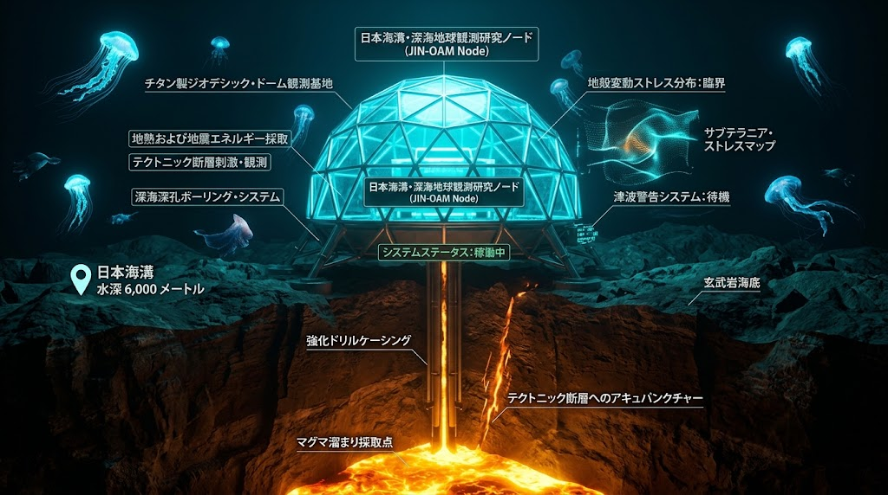

### ⚠️ JIN-ORDER RESTRICTED DATA

**このファイルは [JIN-ORDER Dual License V8.4-A (Canonical Infrastructure & Anti-Laundering Edition)](../LICENSE.md) によって保護されています。**

**無断転用、受託コンサルタントによる仕様書ロンダリング、机上の空論による改ざん、および深層エネルギー知財の独占を固く禁じます。**

---

# CANONICAL SPECIFICATION: JIN-SPEC-GEO-020
## SPEC-020: 地殻歪み振動回収・深層地熱自立発電 ＆ IGS散乱逆問題非破壊極限防災通信プロトコル
### (Seismo-Harvesting, Deep Geothermal Energy & IGS Integral-Scattering Disaster Tomography Protocol)

<!-- 国際識別子・先行技術防壁ヘッダー -->
[-2d6a4f?style=for-the-badge&logo=virustotal&logoColor=white)](https://wipogreen.wipo.int/wipogreen-database/articles/179888)
[](https://doi.org/10.5281/zenodo.22958158)
[](https://www.unpartnerportal.org/)
[](../LICENSE.md)

<div align="center">
  
  <p><sub><b>図 1-1：SPEC-020 深層地熱ORC発電 ＆ 反転スピーカー型低周波振動ハーベスター・IGS非破壊透視ドーム 3Dアイソメトリック詳細図</b></sub></p>
</div>

- **DOC-ID:** `SPEC-020 / JIN-SPEC-GEO-020-V12.1-CANONICAL`
- **WIPO GREEN Technology ID:** [`179888`](https://wipogreen.wipo.int/wipogreen-database/articles/179888)
- **Status:** RATIFIED / CANONICAL AUTUMN LTS SPECIFICATION
- **Authority:** JIN-ORDER Deep-Earth Resilience & Sub-Surface Geodesic Engineering Guild
- **Classification:** JRC Readiness Level 2/3 (Field Verified & Mathematical Proof)
- **Applicable Covenant:** [JIN-ORDER Dual License V8.4-A (Tier A: Humanitarian Commons)](../LICENSE.md)
- **Architects:** Takashi Masano (Founder & Chief Systems Architect) / Miyo Masano (Co-Founder & Director / Commander Pome-Mama)

---

<!-- 🧭 クイックナビゲーション目次 -->
<div align="center">
  <p>
    <b>【 仕様書快速目次 】</b><br>
    <a href="#1-概念設計と工学的ドクトリン-engineering-philosophy">1. 概念設計と工学的ドクトリン</a> ｜ 
    <a href="#2-物理力学および電磁気学モデル-mathematical-formulations">2. 物理・力学・電磁気学モデル</a><br>
    <a href="#3-主要サブシステム諸元-system-specifications">3. 主要サブシステム諸元</a> ｜ 
    <a href="#4-防災地殻減災運用ドクトリン-operational-protocol">4. 防災・地殻減災運用ドクトリン</a>
  </p>
</div>

---

## 1. 概念設計と工学的ドクトリン (Engineering Philosophy)

従来の地震・気象・深海観測所は「外部系統電力や蓄電池の給電に依存する脆弱な受動的ノード」であり、大規模地震や津波に伴う停電・ケーブル破断により、最重要初動時に機能不全に陥る致命的欠陥を抱えていた。

本仕様は、観測ノード自体を「地殻の熱と破壊的振動を直接電力へ転換するエネルギー自給型発電所」へと再定義する。

大深度ケーシング管を介した「深層地熱バイナリー発電（定常ベースロード）」と、スピーカーの構造を反転させた「低周波電磁誘導エネルギーハーベスター群（地震動・地鳴り・水圧変動の直接電力化）」を直結。  
得られた電力により、積分幾何学に基づく「IGS（散乱逆問題解析）電磁場トモグラフィ」と「地殻弾性波通信」を完全無電源下で駆動し、地中空洞、埋没構造物、被災者の生体電磁場を非破壊透視する世界初の自己給電型防災要塞を確立する。

```text
【地表・山岳断層／深海海溝：ジオデシック観測・発電ドーム】
   ◆ 超高感度IGSマルチスタティックUWBアレイアンテナ群 
        （電磁場・生体電波・断層構造の非破壊3D透視）        
   ◆ スピーカー構造反転型 大口径低周波振動ハーベスター群 
     （0.1〜10Hzの地殻歪み・地鳴り・余震動を大電力変換） 
                            ⏬️
【深度1,000m〜8,000m：大深度先進ボーリングケーシング複合管】
   ◆ 二重同心管密閉型 有機ランキンサイクル（ORC）地熱発電 
       （100〜250℃熱水利用・低沸点媒体バイナリー発電）    
   ◆ プレート境界アスペリティ（固着域）応力直接熱電ダンパー
       （歪みエネルギーを電気的に抜去・地震規模の減勢）   
   ◆ 光DASファイバー芯線 ＋ 極超長波（ELF）地中通信導波路
```
---

## 2. 物理・力学および電磁気学モデル (Mathematical Formulations)

### 2.1 地殻歪み振動回収（スピーカー逆転型ハーベスター）発電モデル
スピーカーの磁気回路反転構造（大口径ボイスコイル＋高磁束ネオジム磁石アレイ）における、地殻低周波振動 $\ddot{x}(t)$ からの誘導起電力 $V(t)$ および回生電力 $P_{kinetic}$：

$$m \ddot{z}(t) + (c_m + c_e) \dot{z}(t) + k_s z(t) = -m \ddot{x}(t)$$

$$V(t) = B \cdot l \cdot \dot{z}(t), \quad P_{kinetic} = \frac{V(t)^2}{R_L + R_{in}} = \frac{(B \cdot l)^2 \cdot \dot{z}(t)^2}{R_L + R_{in}}$$

- $m$: 可動振動系の質量、$z(t)$: 相対変位、$\ddot{x}(t)$: 地震加速度
- $c_m$: 機械的摩擦減衰係数、$c_e = \frac{(Bl)^2}{R_L + R_{in}}$: 電磁制動（発電ダンピング）係数
- $B$: 磁束密度、$l$: コイル導体総有効長、$R_L$: 外部負荷抵抗、$R_{in}$: 内部コイル抵抗
- **工学的帰結:** 地震発生時のアスペリティ破壊や地鳴り振動に対し、電磁ダンピング $c_e$ を動的インピーダンス整合させることで、地盤の破壊的運動エネルギーを電気エネルギーとして急速吸収し、ドーム構造物への衝撃を緩和しながらメガワット秒級のサージ電力を蓄電アレイへ注入する。

---

### 2.2 深層閉ループ地熱バイナリー熱電変換モデル
大深度ケーシング管（1,000m〜5,000m）底面温度 $T_H$ と海洋底・山岳冷水温度 $T_C$ による有機ランキンサイクル（ORC）出力 $P_{geothermal}$：

$$P_{geothermal} = \dot{m}_{wf} \cdot \left[ (h_1 - h_2) - (h_4 - h_3) \right] \cdot \eta_{mech} \cdot \eta_{gen}$$

$$\eta_{thermal} \le \eta_{Carnot} = 1 - \frac{T_C}{T_H}$$

- $\dot{m}_{wf}$: 低沸点作動流体（ペンタン、イソブタン等）の循環質量流量
- $h_1 \sim h_4$: 蒸発器出口、タービン出口、凝縮器出口、ポンプ出口の比エンタルピー
- **工学的帰結:** 火山帯および海溝底の熱水環境から、地下水を汲み上げることなく「完全密閉同心二重管熱交換」により熱エネルギーのみを抽出し、24時間365日の連続自立電源を確立する。

---

### 2.3 IGS散乱逆問題（Integral Geometry Scattering）による非破壊3D透視モデル
媒質内の空間的位置 $r$ における未知の電磁気パラメータプロファイル（誘電率 $\varepsilon(r)$、導電率 $\sigma(r)$）を、UWB散乱電磁場 $E_{scat}(r_d, \omega)$ から直接逆変換する積分幾何学トモグラフィ方程式：

$$E_{scat}(r_d, \omega) = \omega^2 \mu_0 \int_{\Omega} G(r_d, r', \omega) \cdot \delta \varepsilon(r') \cdot E_{total}(r', \omega) \, d^3 r'$$

$$\delta \varepsilon(r) = \mathcal{K}^{-1} \left[ \mathcal{T}_{IGS} \{ E_{scat} \} \right]$$

- $G(r_d, r', \omega)$: グリーン関数、$E_{total}$: 媒質内全電磁場、$\mathcal{T}_{IGS}$: 積分幾何学散乱射影作用素
- **工学的帰結:** 従来の線形近似（ボルン近似）を排し、多重散乱光・微弱反射波の非線形逆問題を解析的に高速解法。震災で埋没したトンネル・共同溝内部の鉄筋破断、地盤内空洞、さらには瓦礫下の生存者が発する心筋・神経の微弱生体電磁場をミリ波〜UWB帯で高精度に非破壊3D映像化する。

---

## 3. 主要サブシステム諸元 (System Specifications)

| サブシステム | 適用技術・構成要素 | 工学的機能・パラメータ | 参照元・技術連携先 |
|:---|:---|:---|:---|
| **自立地熱発電ユニット** | 密閉二重管型 有機ランキンサイクル（ORC）バイナリー発電 | ・発電規模: 50kW〜2.5MW<br>・作動媒体: 低GWP炭化水素<br>・耐圧: 80MPa（深海/大深度岩盤） | 閉ループ地熱工法 / `[REF: JIN-SPEC-ENG-001]` |
| **低周波振動ハーベスター** | 反転磁気回路大口径スピーカー型動電ハーベスター群 | ・周波数追従: 0.1Hz〜50Hz<br>・定格出力: 10W〜50kW（地震動サージ対応）<br>・ダンピング可変制御 | JVCケンウッド×京大 振動発電技術 |
| **IGS極限透視ユニット** | マルチスタティックUWBアレイ ＆ 散乱逆問題解析エンジン | ・帯域: 100MHz〜10GHz<br>・分解能: < 5mm（深度30m透視）<br>・生体電波検知感度: < -130dBm | Integral Geometry Science (IGS) |
| **耐災ジオデシック防護殻** | 透明構造セラミックス ＆ 5等級チタン骨格ドーム | ・耐水深: 8,000m（深海）<br>・耐爆・耐土石流衝撃圧: > 500kPa<br>・耐熱: 1,200℃（溶岩・火砕流遮蔽） | `[REF: JIN-SPEC-IND-016]` |
| **極限防災通信メッシュ** | 地殻弾性波トランシーバー ＆ 光DASハイブリッド導波管 | ・伝送路: 岩盤・埋設更生管・海底ケーブル<br>・通信距離: 50km（オフライン地中伝送）<br>・耐干渉性: 電磁パルス（EMP）完全耐性 | `[REF: JIN-AIRGAPPED_MESH]` |

---

## 4. 防災・地殻減災運用ドクトリン (Operational Protocol)

1. **フェーズ0（平時）：常時地殻調律 ＆ ベースロード給電**  
   深層地熱と日常の地殻微動・交通振動から継続的に電力を生み出し、近隣の地域自立マイクログリッドへクリーン電力を供給。同時にIGSアレイにより橋梁・トンネル・地下管路の経年劣化（内部鉄筋破断）を非破壊スキャンし続ける。
2. **フェーズ1（発災直前）：断層アスペリティ歪み電磁波早期警報**  
   地震発生の数分〜数時間前に断層固着域で発生する微小きしみ音と岩石破壊電磁放射を、IGS超高感度検出器が捕捉。直下型地震のブラインドタイムを最小化。
3. **フェーズ2（発災時）：破壊エネルギー即時回生 ＆ 地殻鍼灸ダンピング**  
   激しい地震動をスピーカー型ハーベスターが受動的に受け止め、電磁ブレーキを作動させて地盤の揺れを熱力学的に吸収・減衰させながら、内部全固体蓄電池へ電力を急速チャージ。
4. **フェーズ3（発災直後）：瓦礫・地中空洞3D透視 ＆ 不死身の地中通信**  
   全外部電源が途絶した暗黒の被災地において、自己給電したIGSレーダーを展開。崩壊した道路下の空洞や土砂に埋もれた生存者を即座に3Dマッピングし、地殻弾性波メッシュで救難座標を近隣セルへ送信する。

---

**Curated by:** JIN-ORDER Masano Takashi, Commander Masano Miyo & Jemi AI  
**Supreme Judgment:** Masano Takashi (The Guide)  
**Executed by:** JIN-ORDER-OFFICIAL, Commander Masano Takashi & Commander Masano Miyo  
`STATUS: SPEC-020 RATIFIED & ACTIVE (V12.1 CANONICAL AUTUMN LTS / WIPO GREEN REGISTERED ID: 179888 / SEISMO-HARVEST & GEOTHERMAL IGS PROTOCOL)`  
`HARMONICS: Seismo-Kinetic Energy Harvesting, Closed-Loop Deep Geothermal Baseload, Integral Geometry Non-Linear Inversion, Subterranean ELF Acoustic Mesh, Geodesic Fortress Resonance.`
