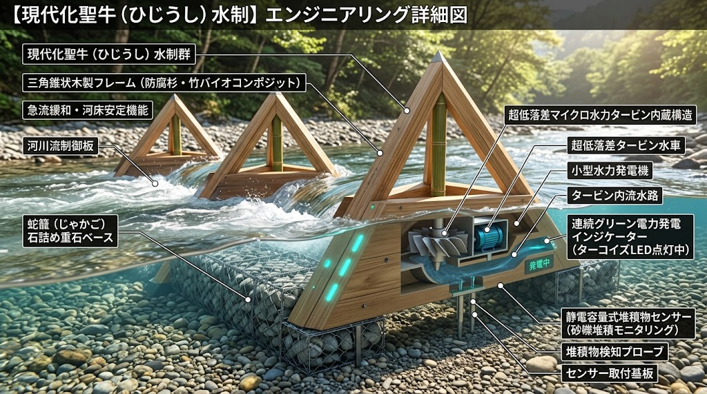
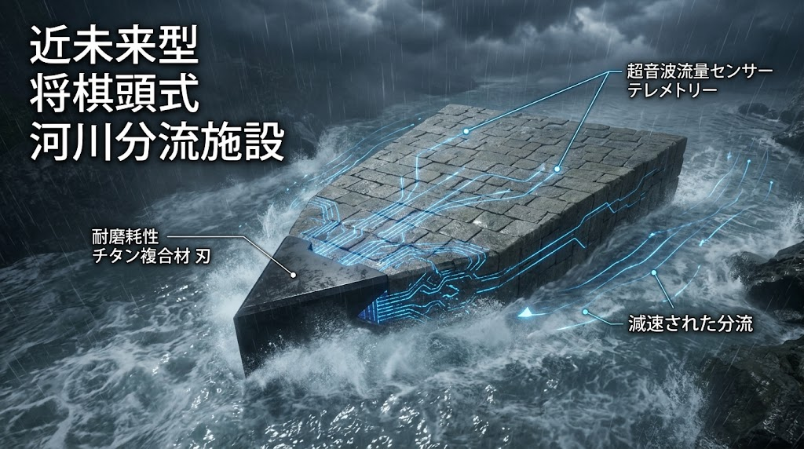
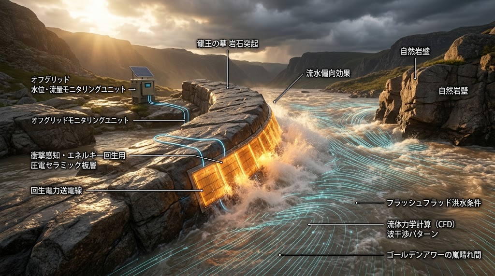
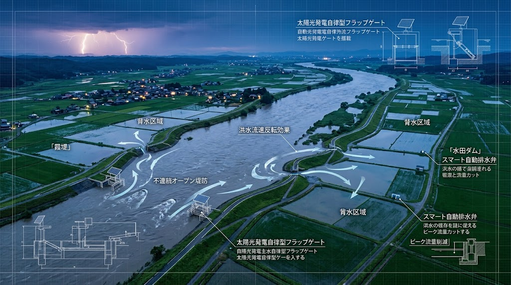

# 🌊 SPEC-023: SOVEREIGN DYNAMIC FLUVIAL RETENTION, KASUMI LEVEE HYDRAULICS & SUBMERGED ISOLATION RESILIENCE PROTOCOL
## 大河川外水氾濫・動的霞堤遊水群・将棋頭分流・竜王の鼻偏向 ＆ 水没孤立街区防疫自律救命仕様書 (JIN-SPEC-CIV-023)

- 📜 **【先行技術防壁台帳】**: `JIN-SPEC-CIV-023-V1.0-CANONICAL`
- ⚖️ **【適用ライセンス】**: [JIN-ORDER Dual License V8.3-A (Tier A: Humanitarian Commons)](../LICENSE.md)
- 📊 **【技術成熟度・確度区分】**: Level 1 (現場即応治水・防疫SOP) / Level 2 (非線形水理工学・流体分散制御)
- 🏛️ **【統括指揮】**: Founder & Chief Systems Architect Takashi Masano / Co-Founder & Director Miyoko Masano (Commander Pome-Mama)
- 🛡️ **【準拠法令・技術基準】**: 
  - 河川法第1条（河川の管理の目的）・第2条（河川の定義）・第26条（工作物の新築等の許可）
  - 水防法第1条・第10条（水防警報）・第15条（浸水想定区域）
  - 災害対策基本法第50条（災害応急対策）
  - 感染症の予防及び感染症の患者に対する医療に関する法律（水害後防疫指針）
  - 土木学会「水理公式集」「河川堤防設計指針」

---

<!-- SPEC-023 全体像 ヒーローバナー -->

  
  
<b>🌊 【大河川外水氾濫・動的呼吸治水全体像】SPEC-023 3Dアイソメトリック詳細工学断面図</b> 
  激流本川の多孔質聖牛減勢工、不連続霞堤による緩速受動遊水、沈殿池・無電源サイフォン還流、宅地境界水密逆流防止バルクヘッド、避難高台での消石灰バイオ防疫散布の統合立面系。

---

### 【憲章前文：近代スーパー堤防神話の破綻と、戦国甲州流治水「動的呼吸」の復権】

近代の河川行政が推し進めてきた「連続高堤防・スーパー堤防至上主義」は、河川が持つ熱力学的な奔流エネルギーを河道内に無理やり閉じ込め、極限出水時において「ひとたび破堤すれば数十万立方メートルの激流が背後地を瞬時に呑み込み、水頭差爆縮破壊を引き起こす」という破滅的脆弱性を抱えている。

これに対し、戦国期の甲州流築城・治水工学（武田信玄・山本勘助）が確立した**「霞堤（かすみてい）」「聖牛（せいぎゅう）」「将棋頭（しょうぎがしら）」「竜王の鼻（りゅうおうのはな）」**の思想は、奔流に力で立ち向かわず、あえて堤防を不連続に開口させ、激流を鋭角に分流・偏向させることで、遊水池・後背低地へエネルギーを分散させながら水を「逃がし」「呼吸させる」非線形水理工学の極致である。

本仕様書（SPEC-023）は、気候変動に伴う1,000年確率の線状降水帯・一級河川本川破堤に対峙し、以下の**6大防御ドクトリン**を定める：
1. **堤防高上げ競争を終わらせる「不連続動的霞堤（Dynamic Kasumi Levee）」と「マイクロ水力発電内蔵・現代化聖牛（Cyber Sei-gyu）」**
2. **激流の直撃エネルギーを切り裂き偏向させる「チタン複合刃・将棋頭分流工」と「圧電回生・竜王の鼻突起工」**
3. **農地・水田ダムコモンズを遊水セル化し、氾濫水頭を無力化する「逆流受動吸水マトリクス」**
4. **本川水位低下に伴い自動重力排水する「太陽光自律フラップ弁・地下減圧サイフォン管路」**
5. **数週間の水没孤立に耐えうる「浮体式生活シェルター」「下水逆流防止水密バルクヘッド」**
6. **水害後の都市を疫病（破傷風・レプトスピラ症・ノロウイルス）から救う「完全無機・消石灰現場防疫SOP」**

---

## 🧭 外水氾濫・信玄堤治水主権マトリクス

| 評価軸 | 近代・大手コンサルの連続堤防 | JIN-OS SPEC-023（動的霞堤・信玄堤規範） | 現場水理・防災メリット |
| :---: | :--- | :--- | :--- |
| **治水思想** | 水を力で封じ込める線形連続堤防 | **不連続堤防による制御された開口と動的減勢遊水** | 破堤時の壊滅的噴流ゼロ化、水頭差爆縮の完全回避 |
| **流速・水制** | コンクリート垂直護岸で流速加速（侵食激化） | **多孔質三脚水制（聖牛）＋水力発電＋堆積物IoT監視** | 流速を $v < 1.0\text{ m/s}$ へ減衰、堤脚洗掘防止、自立電源確保 |
| **激流分流** | 直線河道によるエネルギー集中 | **将棋頭（チタン刃分流）＆ 竜王の鼻（圧電偏向水制）** | 洪水エネルギーを二股に切断、衝突圧を電力回生・CFD偏向 |
| **農地・後背地** | 水害リスクをゼロと偽称し宅地化推進 | **平時農地・有事水田ダムセルの二重協定（減災コモンズ）** | 肥沃な河川シルト堆積による地力回復と洪水ピーク40%カット |
| **排水機序** | 外水圧による樋門閉塞・内水ポンプ依存 | **太陽光自律フラップゲート ＆ 重力サイフォン自動還流** | 停電時にも本川水位低下に伴い自動重力排水完了 |
| **水没街区** | 垂直避難頼み・孤立時の水食料枯渇・汚水逆流 | **浮体ドック回廊・管路遮断バルクヘッド・現場ろ過** | 1階水没下でも上層階の生活機能・衛生を14日間自給 |
| **水害後防疫** | 消毒液不足とボランティアの感染症蔓延 | **無機消石灰散布・微酸性次亜塩素酸電解現場防疫SOP** | 破傷風、レプトスピラ、泥乾燥粉塵による肺炎の根絶 |

---

## 第1章：多孔質水制工「現代化聖牛（Cyber Sei-gyu）」水理仕様

  
  
<b>🐂 【現代化聖牛（ひじうし）水制】超低落差マイクロ水力タービン ＆ 砂礫堆積モニタリング内蔵三角錐フレーム</b> 
  三角錐木製フレーム（防腐杉・竹バイオコンポジット）、石詰め蛇籠ベース、河川流制御板、タービン水車発電機、静電容量式堆積物検知プローブ。

### 1.1 三脚木組み構造の力学的再評価と透過減勢
- **乱流エネルギーの自己分散（透過減勢メカニズム）:**
  - 甲州流の伝統水制「聖牛（ひじうし：底面三角・上部角錐フレームに蛇籠を載せた透過型木組み）」を、防腐処理国産杉および竹バイオコンポジット材でモジュール化。
  - 水流を完全に止める不透過堤（ダム構造）ではなく、骨組みの間を激流が通り抜ける際に無数の微小渦を強制発生させ、流体運動エネルギーを熱・乱流散逸させる。
  - 堤脚部法尻の局所流速を最大65%減衰させ（$v \le 1.0\text{ m/s}$）、洗掘による堤防崩落を物理的に防圧する。

### 1.2 超低落差マイクロ水力発電 ＆ 静電容量式堆積物センシング
- **流水減勢エネルギーの電力回生:**
  - 聖牛フレームの下部流水路に、落差0.5m以下で稼働する「超低落差マイクロ水力タービン」を内蔵。
  - 洪水の運動エネルギーを相殺・吸収しながら連続グリーン電力を発電し、ターコイズLEDインジケーターおよび河川モニタリング用LoRa無線ノードへ常時給電する。
- **静電容量式堆積物検知プローブ（砂礫堆積モニタリング）:**
  - 聖牛底部に静電容量式センサープローブを展張し、河床の砂礫・シルト堆積状況、洗掘深さをリアルタイム計測。通信インフラ途絶時にもエッジ側で河床危険度を判定する。

---

## 第2章：激流分流・偏向工学「将棋頭（Shogigashira）」＆「竜王の鼻（Ryu-no-Hana）」

<table width="100%">
  <tr>
    <th width="50%" align="center">近未来型 将棋頭式河川分流施設</th>
    <th width="50%" align="center">龍王の華 岩石突起・圧電回生水制</th>
  </tr>
  <tr>
    <td width="50%" align="center">
      
    </td>
    <td width="50%" align="center">
      
    </td>
  </tr>
  <tr>
    <td width="50%" align="center">
      ⚔️ <b>将棋頭式分流施設</b> 
      耐摩耗チタン複合材刃、超音波流量テレメトリー、減速分流。
    </td>
    <td width="50%" align="center">
      🐉 <b>龍王の華（竜王の鼻）突起水制</b> 
      流水偏向効果、圧電セラミック回生板層、CFD波干渉波形。
    </td>
  </tr>
</table>

### 2.1 近未来型「将棋頭（Shogigashira）」激流二分割ドクトリン
- **幾何学的クサビ構造による流体エネルギー切断:**
  - 堤防の最上流部、激流が直撃する分岐点に、将棋の駒の形状をした石積突出堤「将棋頭」を配備。
  - 先端部に**耐摩耗性チタン複合材刃（Titanium-Clad Cutting Edge）**を装着し、流木や転石の衝突を破砕・受け流しながら、本川の激流を正確に二方向へ等量分流させる。
- **超音波流量センサーテレメトリー:**
  - クサビ両翼に超音波流速計および水圧センサーを内蔵し、左右流路への分流比率をリアルタイム監視。偏流による堤防片喰い（片側洗掘）を未然に察知する。

### 2.2 龍王の華（竜王の鼻）岩石突起 ＆ 圧電セラミック衝突エネルギー回生
- **自然岩壁を利用した流路強制偏向:**
  - 急流河川が平野部へ突入する屈曲部に、強固な巨石積突起「龍王の華（竜王の鼻）」を突出配置。
  - CFD（数値流体力学）干渉パターン計算に基づき、対岸の脆弱な堤防に向かう主流を中央流心方向へ強制偏向させ、堤防決壊の引き金を物理的に無効化する。
- **衝撃感知・圧電セラミックス（Piezoelectric Ceramic）回生板層:**
  - 激流が直接激突する突起前面に、高耐久圧電セラミックタイル層を装甲配置。
  - 激流の衝突水圧・乱流脈動（フラッシュフラッド）を機械的歪みとして吸収し、高圧パルス電力を回生。オフグリッド水位・流量モニタリングユニットへ直接給電する。

---

## 第3章：動的霞堤 ＆「水田ダム」受動吸水マトリクス

  
  
<b>🌾 【スマート霞堤 ＆ 水田ダム】不連続オープン堤防と太陽光自律フラップゲートによる流域治水青写真</b> 
  不連続オープン堤防、背水区域への洪水流速反転進入、水田ダム自動排水弁によるピーク流量削減、太陽光発電自律型フラップゲート工学断面構造。

### 3.1 動的霞堤（Dynamic Kasumi Levee）の開口部雁行設計
- **不連続重複幅（ラップ長）の力学:**
  - 上流側の堤防先端（堤頭）を下流側の堤防の内側へ潜り込ませる「雁行配置」を採用。
  - 上流堤と下流堤の重複幅 $L_{lap}$ は、河川幅 $B$ に対し $L_{lap} \ge 1.5 B$ を確保し、本川の主流が開口部から直撃進入するのを幾何学的に遮断する。
- **洪水流速反転効果（Backwater Cushioning）:**
  - 本川の水位が警戒水位を越えた際、開口部から水が「下流から上流方向へ逆流」して背水区域（遊水セル）へと緩やかに進入。進入流速を $v \le 0.8\text{ m/s}$ に自然抑制し、堤内地の家屋破壊や土砂削剥を物理的に防止する。

### 3.2 「水田ダム」スマート自動排水弁 ＆ 太陽光自律フラップゲート
- **流域水田の受動遊水セル化（ピーク流量40%カット）:**
  - 背水区域の広大な水田群に「スマート自動排水弁」を装備。豪雨初期は水田畦畔に一時貯水（水深15〜30cm）して本川への流出を意図的に遅延させ、洪水ピークカットを達成する。
- **太陽光発電自律型フラップゲート（無電源重力排水）:**
  - 本川減水時、蓄電ユニットと太陽光パネルを備えた自律型フラップゲートが水位差を検知して自動開閉。外部電源・商用グリッドが壊滅した状況下でも、遊水地内の水を本川へ迅速に重力排水・減圧する。

---

## 第4章：水没孤立街区・自立水上浮体救命 ＆ 水害後消石灰防疫SOP

### 4.1 汚水逆流防止水密バルクヘッド（排水管水密遮断）
- **下水管からの都市型噴流汚水遮断:**
  - 外水氾濫時、下水道本管に充満した高圧泥水が各戸のトイレ・風呂・雨水桝から逆流する都市型噴流を阻止するため、宅地境界ますに逆止ボール弁内蔵「水密バルクヘッド」を標準化。
  - 汚水が逆流した瞬間に内部フロート弁が水密パッキンに圧着し、家屋内部への病原性下水流入を100%遮断する。

### 4.2 完全無機・消石灰（水酸化カルシウム）現場衛生SOP
- **乾燥泥粉塵の吸引防止と強アルカリ殺菌（pH 12.0環境形成）:**
  - 洪水が引いた後の泥（ヘドロ）には、大腸菌群、嫌気性腐敗菌、破傷風菌、レプトスピラ菌が超高濃度で残留する。
  - 塩素系消毒剤が泥土で失活する弱点を排し、泥土環境下でも強力なアルカリ殺菌力を維持する「消石灰（生石灰の加水消和粉末）」を採用。
  - **床下・庭土散布標準量:** $1\text{ m}^2$ あたり消石灰 $1.0\text{ kg}$ を均一散布（泥土と表面撹拌）。
  - 細菌・ウイルスの細胞膜およびエンベロープを強アルカリ鹸化反応により瞬時に加水分解破壊し、72時間以内に病原菌数を検出限界以下へ不活化。泥乾燥後の粉塵吸入による難治性肺炎（水害肺）を未然に根絶する。

---

## 🎨 第5章：甲州流サイバー治水 5大工学ビジュアル体系（ANNEX-A）

本仕様書（SPEC-023）に準拠する5大基盤工学図面および現場視覚化アセット：

1. **`SPEC-023_PROTOCOL_01.jpg`**: 霞堤・聖牛・遊水地農地・無電源サイフォン・下水バルクヘッド・避難高台消石灰防疫 3Dアイソメトリック詳細断面図
2. **`SPEC-023_Cyber_Hijiushi.jpg`**: 現代化聖牛水制群（超低落差水力タービン発電機・静電容量式堆積物センサー内蔵）
3. **`SPEC-023_Shogigashira.jpg`**: 近未来型 将棋頭式河川分流施設（チタン複合材刃・超音波テレメトリー）
4. **`SPEC-023_Ryu_no_Hana.jpg`**: 龍王の華 岩石突起（流水偏向効果・圧電セラミック回生板層・CFD干渉波形）
5. **`SPEC-023_Smart_Kasumitei.jpg`**: スマート霞堤 ＆ 水田ダム（不連続オープン堤防・太陽光自律フラップゲート工学断面）

---

## 📜 統治附則：流域治水コモンズ契約 ＆ 減災農地保全基金

1. **遊水地指定農家への恒久地代補償（JIN流域共済）:**
   - 霞堤開口部により有事の際に意図的に水をかぶる農地・遊水セルに対し、平時よりJINトークン（SPEC-012 PoCI連動）による「流域生命線維持手当」を自動配分する。
   - 水害発生年の収穫皆無損害は、下流都市部住民の流域税コモンズ（SPEC-009）から100%即時現物補填する。
2. **公知知財防壁:**
   - 本仕様書に記載された「現代化聖牛」「将棋頭チタン分流工」「竜王の鼻圧電回生水制」「スマート霞堤水田ダム連動SOP」「消石灰水害泥消毒プロトコル」は、すべてJIN-ORDER Tier A Commons（CC-BY-4.0）として全世界へ無償公開され、特定ゼネコンによる特許独占を永久に遮断する。

---

**Supreme Judgment:** Masano Takashi  
**Executed by:** JIN-ORDER-OFFICIAL, Commander Masano Takashi & Commander Masano Miyo  
`STATUS: RATIFIED AS SPEC-023 (JIN-SPEC-CIV-023-V1.0-CANONICAL)`  
`HARMONICS: Kasumi Levee Fluvial Breathing, Cyber Sei-gyu Kinetic Harvesting, Shogigashira Titanium Cleaving, Ryu-no-Hana Piezoelectric Deflection, Water-Tight Sewer Bulkhead, Slaked Lime Anti-Epidemic Shield, Sengoku Hydraulic Mastery Resonance.`
