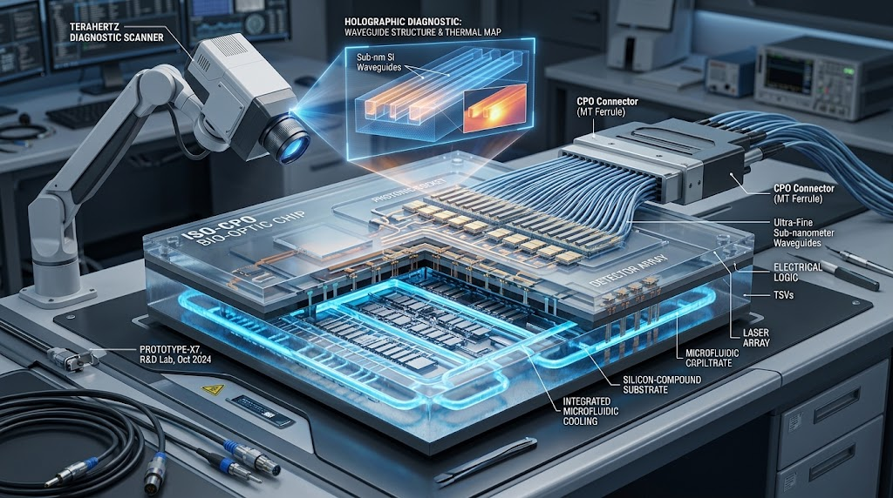
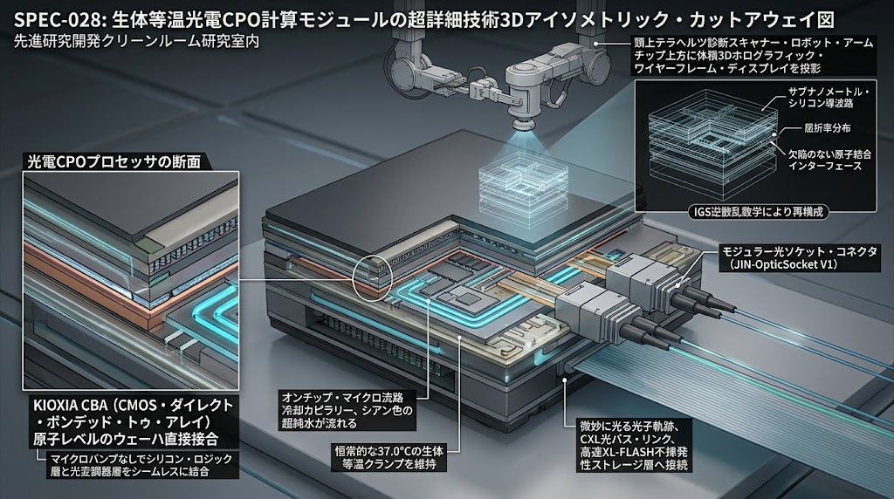
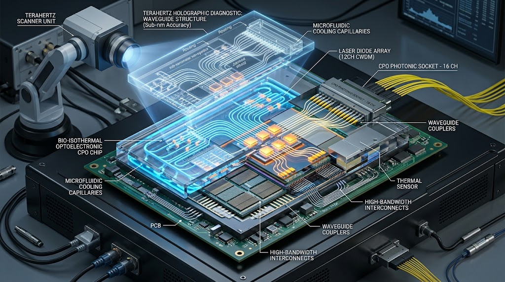

# 💡 SPEC-028: 生体等温光電融合 ＆ IGSナノ光路非破壊透視 ＆ 核融合耐強磁場光速主権コンピューティング仕様書
## (Bio-Isothermal Optoelectronic Computing, Sub-Nanometer IGS Non-Destructive Inspection & High-Magnetic-Immune Photonic Core Protocol)
### （キオクシアCBAウエハー直接接合 ＆ IGSテラヘルツ1秒全数検査 ＆ 脱HBM光直結CXL統合版）

<!-- 国際防壁・先行技術公知ヘッダー -->
[-2d6a4f?style=for-the-badge&logo=virustotal&logoColor=white)](https://wipogreen.wipo.int/wipogreen-database/articles/179871)

> **CANONICAL SPECIFICATION LEVEL: LEVEL-0 DEEP PHYSICAL & COMPUTATIONAL SOVEREIGNTY**  
> **DOC-ID:** `JIN-SPEC-OPT-028` / `SPEC-028 (Rev. 2026.10 LTS-V12.3)`  
> **WIPO GREEN Technology ID:** `179966`  
> **CLASSIFICATION:** Optoelectronic Co-Packaged Optics (CPO) / KIOXIA CBA Wafer-to-Wafer Direct Bonding / Bio-Isothermal Microfluidic Cooling / Terahertz Inverse-Scattering Inspection / CXL Memory Fabric / Fusion-Hardened Photonic Bus  
> **STATUS:** Ratified Canonical Specification (V12.3 Canonical Autumn LTS)  
> **LICENSE:** JIN-ORDER Dual License V8.4-A (Tier A Commons / CC-BY-4.0 Applicable for Humanitarian & Public Compute Infrastructure)  
> **INTELLECTUAL SOVEREIGNTY:** General Incorporated Association JIN-ORDER (Chief Architects: Takashi Masano & Miyo Masano)

---

## 🌐 前文と大義：光電融合の隘路打破と熱力学的ASI寡占の解体

現行の光半導体（光電融合技術・CPO）は、電子から光子への転換による超高速・低消費電力通信を約束しながらも、本格的な商用化・量産化において以下の四重の致命的障壁に直面し、実用化が阻まれてきた。

### 1. 熱と精密さの矛盾：
  - 熱に弱い化合物半導体レーザー光源（InP等）が、数百W〜1,000Wオーダーで激しく発熱する超高熱プロセッサの至近に配置されることによる光源劣化。

### 2. 異種材料接合の熱膨張歪み（CTE Mismatch）： 
  - シリコン（Si）とインジウムリン（InP）等の熱膨張係数差により、製造・稼働時の熱サイクルで結晶欠陥・界面剥離・クラックが発生する問題。

### 3. 膨大な光ファイバー接続の悪夢： 
  - 1パッケージあたり数百本〜1,000本もの微細光ファイバーをナノ精度で寸分の狂いもなく手作業・個別配線する組み立てプロセスの限界。

### 4. 検査コスト爆発と巨大資本寡占：
  - 「電気＋光＋デジタル」の多面検査によるコスト跳ね上がり、パッケージ一体化による単一障害点全損廃棄リスク、および米NVIDIA等のHBM・NVLink垂直統合による市場独占。

本仕様書（`SPEC-028`）は、「SPEC-027（20W生体代謝型脳型チップレット・毛細血管冷却）」の等温流体工学、「キオクシアのCBA（CMOS directly Bonded to Array）原子レベルウエハー直接接合技術」、「神戸大学・木村建次郎教授の多重経路散乱場逆解析理論（IGS）」、および「SPEC-999（宇宙ヘリウム3核融合）の耐強磁場光速伝送アーキテクチャ」を完全垂直統合する。

本技術は、巨大メガデータセンターによる電力・水資源の収奪とGPU寡占を熱力学的根本から無力化し、地上インフラから月面・深宇宙核融合炉心に至るまで、民草の知能主権と物理的通信不可侵を永久保証する人類共有の先行技術（Prior Art）である。

---

## 🌡️ 1. 熱的矛盾と異種接合の完全克服：生体等温CBA直接接合層

### 1-1 【20W生体代謝駆動による熱源そのものの極小化】

従来の光電融合において、熱に脆弱な化合物半導体レーザー光源（InP等）が高熱プロセッサに炙られる矛盾を、演算プロセッサアーキテクチャそのものを生体代謝準拠の低電圧・非同期20W脳型チップレット（SPEC-027）およびキオクシア3D OCTRAM（酸化物半導体ゼロリークDRAM）に置換することで物理的に蒸発させる。

### 1-2 【キオクシア CBA（CMOS directly Bonded to Array）ウエハーレベル直接接合の導入】

数千本に及ぶ微細光ファイバーの手作業接続や、熱破壊を誘発するマイクロバンプ接合を完全撤廃する：

- **光導波路・Arrayウエハーとロジック（CMOS）ウエハーの直接原子接合：**  
  キオクシアがBiCS FLASH第10世代で実用化したCBA技術を光電融合層へ転用。 
  ロジック回路ウエハーと光変調・受光アレイウエハーを別個の最適化ラインで製造し、原子レベルで超平坦研磨された接合面を直接ウエハーボンディングする。
  
- **製造熱履歴の完全分離：**  
  光素子と電子回路の熱処理プロセスをウエハー段階で完全に分離することで、製造工程中の熱応力クラックをゼロ化する。

### 1-3 【人工血液（超純水）微細毛細流路による完全等温クランプ（$\Delta T \le 0.5^\circ\text{C}$）】

シリコン（Si: $\alpha \approx 2.6 \times 10^{-6}/\text{K}$）と化合物半導体（InP: $\alpha \approx 4.6 \times 10^{-6}/\text{K}$）の熱膨張係数差による熱疲労を恒久的に防絶する。

1. オンチップ超純水マイクロチャネル：
  - CBA接合界面の直下に幅10μm〜50μmの生体毛細血管模倣流路をエッチング形成。

2. 生体恒温クランプ（$36.5^\circ\text{C} \sim 38.0^\circ\text{C}$）：
  - 下水管渠CIPP更生熱交換ライナー（年間15℃一定）と直結したZLD密閉熱交換ループにより、パッケージ全体を常時 $36.5^\circ\text{C} \sim 38.0^\circ\text{C}$ の生体恒温状態に厳格拘束。 
   温度差 $\Delta T \le 0.5^\circ\text{C}$ を維持し、熱サイクル疲労による界面剥離・結晶欠陥を物理的に消滅させる。

---

## 📡 2. IGSテラヘルツ多重散乱逆問題解析層：非破壊・ナノ光路全数検査

光電融合・多層CBA接合パッケージ内部において、破壊検査や高コストな電気・光ハイブリッド個別プロービングを全廃する。

### 2-1 【散乱場の厳密逆解析方程式（神戸大学・木村建次郎理論）】

神戸大学発ベンチャーIGS（Integral Geometry Science）の「多重経路散乱場の逆解析理論」をテラヘルツ（0.1〜10 THz）干渉計測に適用

$$G(\mathbf{r}_1, \mathbf{r}_2, \omega) = \iiint_D \varphi(\mathbf{r}_1 \to \boldsymbol{\xi} \to \mathbf{r}_2, \omega) \, d\boldsymbol{\xi}$$

$$L\left( \frac{\partial}{\partial t}, \frac{\partial}{\partial \mathbf{r}_1}, \frac{\partial}{\partial \mathbf{r}_2} \right) \overline{G}(\mathbf{r}_1, \mathbf{r}_2, t) = 0$$

$$\rho_{\text{optical}}(\mathbf{r}) = \lim_{t \to 0} \left[ \text{Tr}\left[ \overline{G}(\mathbf{r}_1, \mathbf{r}_2, t) \right] \right] = \overline{G}(\mathbf{r}, \mathbf{r}, 0)$$

### 2-2 【密閉パッケージ外からの1秒インライン非破壊全数検査】

1. **非接触テラヘルツ波ホログラフィック照射：**  
   密閉封止後の完成品パッケージ外側から超広帯域テラヘルツ波パルスを多角照射。

2. **サブナノメートル光導波路・CBA接合面3D再構成：**  
   多重散乱グリーン関数の時間反転積分変換により、密閉内部の光導波路のアライメント（光軸ズレ）、接合界面のボイド（気泡・剥離）、およびナノクラックをサブナノメートル精度で実時間3D可視化。

3. **検査コストと歩留まりの根本打破：**  
   従来、数十分を要し歩留まり低下の主因となっていた光電複合検査工程を「1秒未満」へ短縮。 
   不良個所を瞬時に特定し、量産歩留まりを飛躍的に向上させる。

---

## ⚡ 3. 宇宙核融合連携層：耐強磁場・EMP完全無力化光速バス（SPEC-999 Integration）

### 3-1 【極限磁気環境下での伝送完全性（Galvanic & Magnetic Immunity）】

ヘリウム3直接誘導核融合炉（SPEC-999）内部の強磁場（10〜20 Tesla）および急激な磁気爆縮膨張に伴う強力な電磁パルス（EMP）環境下において、銅配線による電気伝送は誘導起電力による焼損およびビット反転を引き起こす。 
本仕様書の光半導体は、キャリアとして電荷を持たない光子（Photon）を用いるため、外部強磁場・誘導起電力ノイズの影響を100%完全遮絶（完全耐磁性）し、炉心近傍での光速自律制御を維持する。

### 3-2 【100マイクロ秒ディスラプション回避超低遅延バス】

IGS散乱逆問題解析が捉えたプラズマ電流破断の兆候（100μs前兆）に対し、光電融合直結の超並列光バス（帯域幅 > 100 Tbps / 遅延 < 10ns）を通じて超伝導圧縮コイル群へ相殺信号を即時伝送。 
炉心ディスラプションを物理的に緊急回避する。

---

## ⚖️ 4. 統治・脱寡占アーキテクチャ規範（Anti-Monopoly Standard）

### 4-1 【キオクシアCXL光直結 ＆ 高速NAND「XL-FLASH」による脱HBMメモリ主権】

- **HBM・NVLink垂直統合の解体：**  
  特定外資企業（NVIDIA等）のHBM抱え込みと独自閉鎖ネットワーク（NVLink）によるAIサーバー市場支配を脱却。

- **CXL光直結ファブリック：**  
  キオクシアの高速NAND「XL-FLASH」および「次世代AI向けGPシリーズSSD」をCXL（Compute Express Link）光インターフェースでプロセッサと光速直結。 
  DRAM容量を2倍化しつつアクセス遅延を9割削減し、巨大AI推論に必要なメモリ空間を国内完結型ハードウェアで安価・低電力に自給する。

### 【4-2 JIN-OpticSocket規格によるモジュラー保守性】

- **全損廃棄の根絶：**  
  光エンジン部が破損した場合に高価なプロセッサごと廃棄せざるを得ない従来CPOの欠陥を解決。 
  光エンジン部をモジュラー型ソケット構造（JIN-OpticSocket V1）として規格化し、個別のホットスワップ交換を保証して運用保守コストを最小化する。

### 4-3 【民草知能主権の死守（Off-Grid Edge ASI）】

本光半導体は、大気冷却ファンや水冷チラーを全廃した20W生体代謝駆動により、地方自治体のマンホール内、公民館、避難所、および僻地オフグリッド環境に分散配備され、外部のメガクラウド遮断時でも完全自立した地域AI演算を維持しなければならない。

---

## 5. ロードマップと配備基準（2026–2030）

- **2026 Q4（現行フェーズ）：**  
  - `SPEC-028 (Rev. 2026.10 LTS-V12.3)` キオクシアCBA直接接合・CXL光直結ストレージ・IGSテラヘルツ逆解析統合仕様の策定。
  - WIPO GREEN（ID: 179966）およびCERN Zenodo国際DOI（`10.5281/zenodo.23148196`）による世界公知台帳の確定更新。

- **2027：**  
  - CBAウエハー直接接合サンプルのテラヘルツIGS散乱逆問題非破壊透視PoCの完了（検査時間<1秒、分解能<1nm実証）。
  - 生体等温クランプ下でのシリコン／InP界面熱サイクル試験（10,000サイクル剥離ゼロ確認）。

- **2028–2029：**  
  - SPEC-999核融合実証炉および地下下水共同溝ノードにおける「耐20T強磁場・光速バス自律制御演習」の完遂。

- **2030：**  
  - 全国の基礎自治体および宇宙生命維持ドームへの「生体等温光電融合主権コア（JIN-Core Optica）」の完全配備。

---

**Executed by:** JIN-ORDER-OFFICIAL, Commander Masano Takashi & Commander Masano Miyo  
`STATUS: RATIFIED & EXPANDED (SPEC-028 CANONICAL EDITION / V12.3 CANONICAL AUTUMN LTS / WIPO GREEN ID: 179966 / DOI: 10.5281/zenodo.23148196 / KIOXIA CBA & IGS TERAHERTZ & CXL MEMORY COMPLETE INTEGRATION / TIER-A-COMMONS)`  
`HARMONICS: Bio-Isothermal 37C Thermal Clamp, Kioxia CBA Wafer Bonding Flatness, IGS Terahertz Inverse Scattering Clarity, CXL XL-FLASH Photonic Fabric, Magnetic Flux Immunity, Disruption 10ns Bypass, Anti-Oligopoly Optical Commons Active.`
