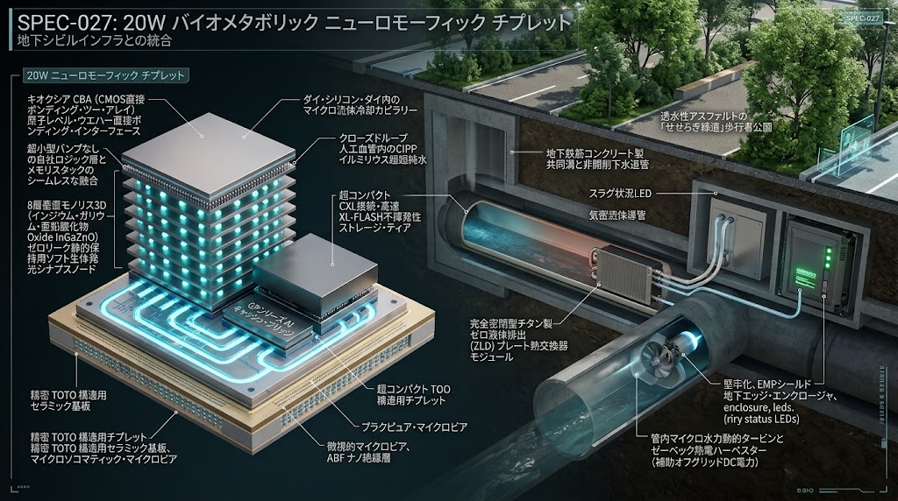
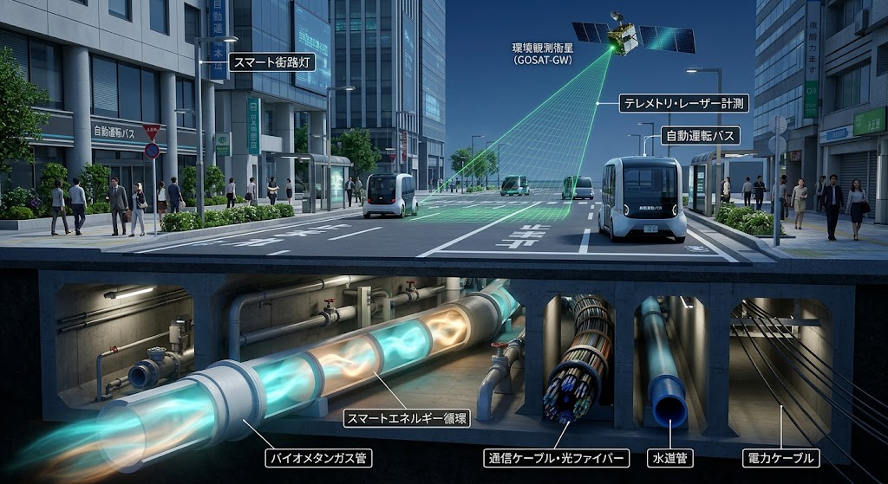
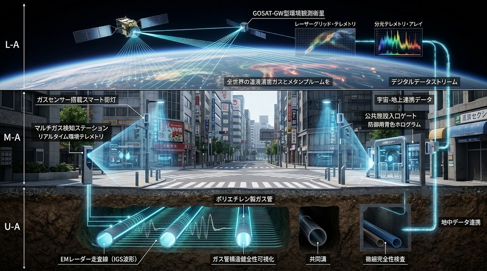
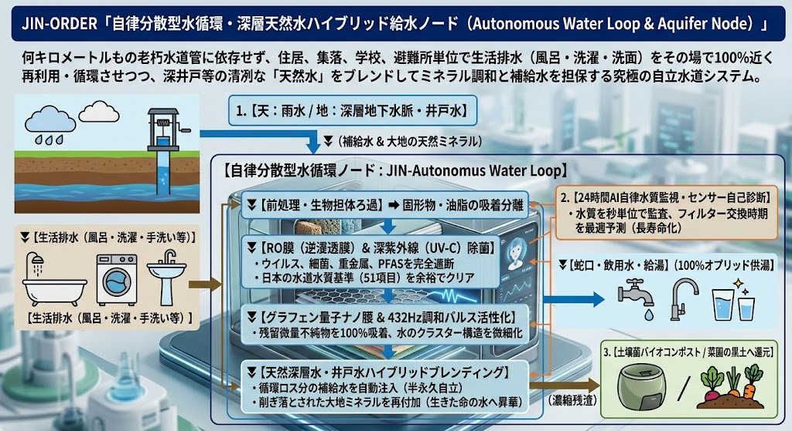
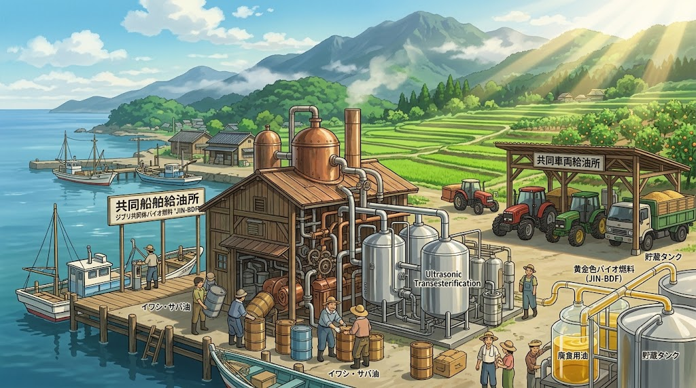
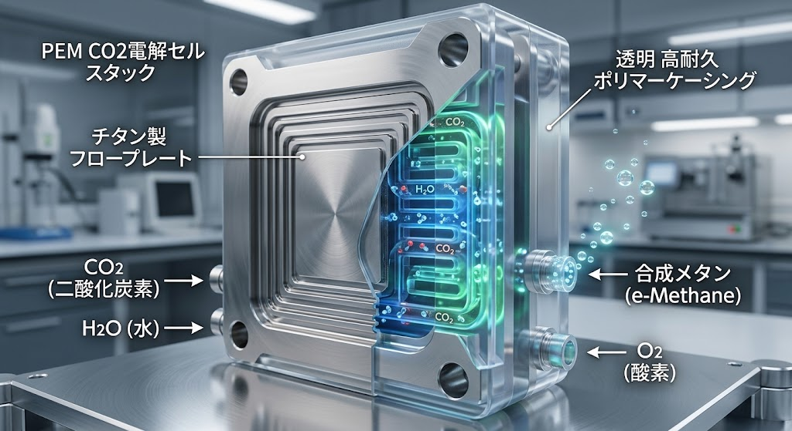
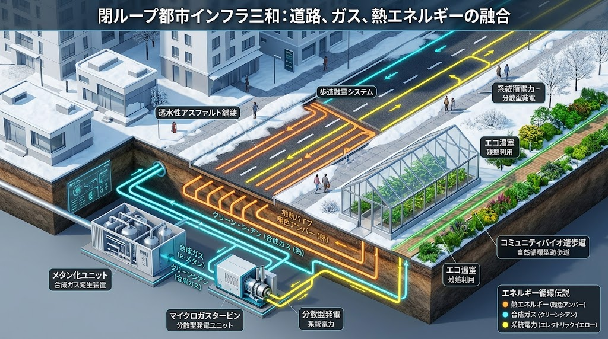
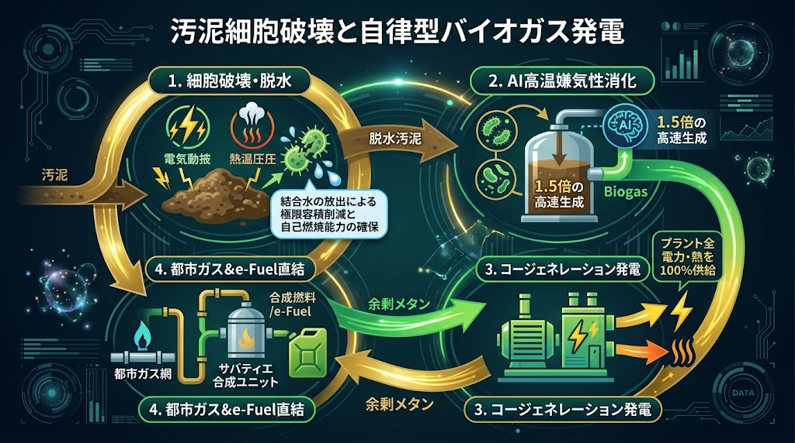

### ⚠️ JIN-ORDER RESTRICTED DATA

**このファイルは [JIN-ORDER Global Humanity License](https://github.com/JIN-ORDER-OFFICIAL/GOVERNANCE_OF_ABYSS/blob/main/LICENSE.md) によって保護されています。**

**無断転用、受託コンサルタントによる仕様書ロンダリング、机上の空論による改ざんを固く禁じます。**

---

# SPEC-028: JIN-Physical Resource Ledger (J-PRL) Protocol Specification

- **Document ID:** SPEC-028-PROTOCOL-01
- **Status:** Ratified / Active
- **Target Architecture:** Underground Civil Infrastructure Edge & JIN-NET
- **Hardware Anchor:** SPEC-027 (20W Neuromorphic Chiplet), JIN-OpticSocket V1
- **Security Layer:** BB84 Quantum Key Distribution (QKD), Subsea DAS Acoustic Sensing
- **Asset Scope:** Electricity (kWh), Water (L), e-Methane (Nm³), Biofuel (L), Thermal (MJ), Carbon Sequestration (kg)

---

## 1. Abstract & System Philosophy

SPEC-028は、法定通貨や裏付けのない投機的暗号資産に依存しない「物理現物資源担保型・分散型自律台帳（Physical Resource Ledger）」のプロトコル仕様である。

本プロトコルは、老朽化インフラ再生管路（SPR/CIPP）および共同溝に埋設された「SPEC-027（20W バイオメタボリック・ニューロモーフィック・チップレット）」上でエッジ稼働し、地上・地下・宇宙の三層センシングデータを元に、物理的に実在するエネルギー・水・燃料・炭素固定量を改ざん不能な価値として記録・配分する。


```text
[物理層センサー群]
(マイクロ水力/熱電/流量計/PEM共電解/GOSAT-GW衛星)
　│ ➡️ 実測テレメトリ (IoT/EMレーダー)
 🔽
[SPEC-027 エッジバリデータ (20W)]
　│ ➡️ CBA積層 / InGaZnO静的保持 / BB84署名
 🔽
[J-PRL 分散ステートマシン (P2Pメッシュ)]
　│ ➡️ 物理量トークン化 (Proof of Physical Resource)
 🔽
[自律分配・融通エコシステム]
(生活給水 / 共同給油 / 歩道融雪 / 温室熱融通)
```
---

## 2. Integrated Architectural Schematics (図面リファレンス)

### 2.1 物理ハードウェア基盤（SPEC-027）
地下シビルインフラと共生し、下水熱・マイクロ水力で自立稼働する20Wニューロモーフィック・エッジノード。


*図1: SPEC-027 シビルインフラ共生アーキテクチャ（せせらぎ緑道地下・共同溝）*


*図2: キオクシアCBA・InGaZnO積層・精密TOTOセラミック基板・微細流体冷却詳細*

---

### 2.2 暗号通信・物理層防衛グリッド
外国海底ケーブル遮断に耐える主権量子通信網と深海センシング。


*図3: JIN-NET 自律ノード網およびBB84量子鍵配送（QKD）アーキテクチャ*


*図4: 分布型光ファイバセンシング（DAS）による2,000m深海・管路物理防衛*

---

### 2.3 都市地下共同溝・三層センシングシールド
管路健全性監視および宇宙・地上・地下連携テレメトリ。


*図5: バイオメタン管・光ファイバ・水道管・電力ケーブル多条収容共同溝*


*図6: 宇宙（GOSAT-GW）× 地上スマート街灯 × 地下EMレーダーの三層監視*

---

### 2.4 物理リソース生成・循環プラント
台帳で担保される実体エネルギー・水・燃料の生産基盤。


*図7: 自律分散型水循環・深層天然水ハイブリッド給水ノード（RO/UV-C/432Hz）*


*図8: 超音波エステル交換 JIN-BDF バイオ燃料精製プラント*


*図9: 道路・ガス・熱エネルギー三位一体融合（融雪・エコ温室残熱利用）*


*図10: PEM CO2電解セルスタック（チタン製フロープレート・合成メタン直接生成）*


*図11: 耐シンタリング100nm Niナノコア・メソポーラスシリカシェル触媒*


*図12: 汚泥細胞破壊とAI高温嫌気性消化による自律型バイオガス/e-Fuel回収*

---

## 3. Core Data Schema (TypeScript)

```typescript
/**
 * JIN-Physical Resource Ledger (J-PRL) Core Types
 * Specification Version: 1.0.0 (SPEC-027 / JIN-NET Compliant)
 */

// 物理担保アセット種別
export type PhysicalAssetType =
  | 'ELECTRICITY_KWH'      // マイクロ水力・ゼーベック・バイオガス発電 (kWh)
  | 'PURIFIED_WATER_L'     // 自律水循環ノード・MABR再生水 (Liters)
  | 'BIO_DIESEL_L'         // 超音波エステル交換 JIN-BDF (Liters)
  | 'SYNTHETIC_METHANE_M3' // コアシェルサバティエ / PEM共電解 e-Methane (Nm³)
  | 'THERMAL_ENERGY_MJ'    // マイクロガスタービン排熱・融雪温水 (MJ)
  | 'CARBON_SEQUEST_KG';   // BIO-FOEAS / 人工光合成 炭素固定量 (kg-CO2)

// センサー物理層ハードウェア検証データ
export interface HardwareProof {
  chipletId: string;             // SPEC-027 固有識別子 (e.g., "SPEC027-NODE-0042")
  chipletPowerWatt: number;      // 稼働消費電力 (公称 20.0W 枠)
  tamperProofStatus: boolean;    // EMPシールド・エンクロージャ健全性
  quantumKeyFingerprint: string; // BB84 QKD公開フィンガープリント
  pipeAcousticVariance: number;  // SPR/CIPP管内音響センサー相関値 (漏洩・物理干渉検知)
}

// 物理リソース生成テレメトリ (Minting Proof)
export interface ResourceGenerationEvent {
  eventId: string;
  nodeAddress: string;
  timestampNano: number;
  assetType: PhysicalAssetType;
  measuredQuantity: number;      // 実測物理量 (kWh, L, Nm³, etc.)
  sensorTelemetry: {
    voltageOrFlowRate: number;   // 電圧・流速・圧力等のRAWデータ
    temperatureKelvin: number;   // 動作温度 (ZLD熱交換器 / サバティエ反応器)
    satelliteAuditId?: string;   // GOSAT-GW型衛星による宇宙側検証照合ID
  };
  proof: HardwareProof;
}

// リソース担保トークンステート
export interface ResourceBalance {
  ownerNodeId: string;
  balances: {
    [key in PhysicalAssetType]: number;
  };
  lastVerifiedBlock: bigint;
  qkdVerifiedSessionId: string;
}

// P2P融通トランザクション
export interface PeerResourceTransfer {
  transactionId: string;
  senderNodeId: string;
  recipientNodeId: string;
  assetType: PhysicalAssetType;
  amount: number;
  allocatedInfrastructure: 'RESIDENTIAL' | 'GREENHOUSE' | 'ROAD_HEATING' | 'RESCUE_POD';
  timestamp: number;
  signature: string;             // SPEC-027 耐量子署名
}
```
---

## 4. Edge State Engine (Rust Implementation)
SPEC-027の20Wニューロモーフィック環境上で最小メモリフットプリントで稼働する、リソース検証およびミント（トークン発行）のコアエンジン。

```Rust
// jin_resource_core.rs
// Rust Engine for SPEC-027 Edge Verification Node

use sha3::{Digest, Sha3_256};

#[derive(Debug, PartialEq, Clone)]
pub enum AssetType {
    ElectricityKwh,
    PurifiedWaterL,
    BioDieselL,
    SyntheticMethaneM3,
    ThermalEnergyMj,
    CarbonSequestKg,
}

#[derive(Debug, Clone)]
pub struct PhysicalReading {
    pub asset_type: AssetType,
    pub quantity: f64,
    pub chiplet_wattage: f32, // SPEC-027の20W消費電力バジェット監視 (<= 20.5W)
    pub is_emp_shielded: bool,
    pub qkd_handshake_valid: bool,
}

pub struct ResourceLedgerState {
    pub electricity_total: f64,
    pub purified_water_total: f64,
    pub methane_total: f64,
    pub bio_diesel_total: f64,
    pub state_merkle_root: [u8; 32],
}

impl ResourceLedgerState {
    pub fn new() -> Self {
        Self {
            electricity_total: 0.0,
            purified_water_total: 0.0,
            methane_total: 0.0,
            bio_diesel_total: 0.0,
            state_merkle_root: [0u8; 32],
        }
    }

    /// 物理テレメトリの妥当性検証と残高更新 (State Transition)
    pub fn process_telemetry(&mut self, reading: PhysicalReading) -> Result<[u8; 32], &'static str> {
        // 1. ハードウェア制約・セキュリティ境界検証
        if reading.chiplet_wattage > 20.5 {
            return Err("REJECTED: Edge node exceeded 20W operational budget");
        }
        if !reading.is_emp_shielded {
            return Err("REJECTED: Physical enclosure shielding compromised");
        }
        if !reading.qkd_handshake_valid {
            return Err("REJECTED: Quantum key authentication failed");
        }
        if reading.quantity <= 0.0 {
            return Err("REJECTED: Invalid measured quantity");
        }

        // 2. 実物理アセット残高の加算
        match reading.asset_type {
            AssetType::ElectricityKwh => self.electricity_total += reading.quantity,
            AssetType::PurifiedWaterL => self.purified_water_total += reading.quantity,
            AssetType::SyntheticMethaneM3 => self.methane_total += reading.quantity,
            AssetType::BioDieselL => self.bio_diesel_total += reading.quantity,
            _ => return Err("UNHANDLED_ASSET_TYPE"),
        }

        // 3. 暗号ステートハッシュ更新 (SHA3-256)
        let mut hasher = Sha3_256::new();
        hasher.update(&self.state_merkle_root);
        hasher.update(self.electricity_total.to_be_bytes());
        hasher.update(self.purified_water_total.to_be_bytes());
        hasher.update(self.methane_total.to_be_bytes());
        hasher.update(self.bio_diesel_total.to_be_bytes());

        self.state_merkle_root = hasher.finalize().into();
        Ok(self.state_merkle_root)
    }
}
```
---

## 5. Autonomous Distribution Contract (Solidity)
地域共同溝や避難所で生成されたエネルギー・水・燃料を、外部金融を介さず「優先度制御（生命維持を最優先）」で自動配分するオンチェーンコントラクト。

```Solidity
// SPDX-License-Identifier: MIT
pragma solidity ^0.8.20;

/**
 * @title JIN_ResourceDistributor
 * @notice 生命維持優先度制御型リソース融通コントラクト
 */
contract JIN_ResourceDistributor {
    address public protocolGuardianNode;

    enum PriorityLevel { LIFE_SUPPORT, DOMESTIC_ESSENTIAL, PRODUCTION, LUXURY }

    struct AllocationNode {
        PriorityLevel priority;
        uint256 allocatedElectricityKwh;
        uint256 allocatedWaterLiters;
        uint256 allocatedMethaneNm3;
        bool isActive;
    }

    mapping(address => AllocationNode) public nodes;
    
    event ResourceDispatched(
        address indexed destination,
        uint256 kwhAmount,
        uint256 waterAmount,
        uint256 methaneAmount
    );

    modifier onlyGuardian() {
        require(msg.sender == protocolGuardianNode, "AUTH: Guardian node only");
        _;
    }

    constructor() {
        protocolGuardianNode = msg.sender;
    }

    function registerConsumerNode(address _node, PriorityLevel _level) external onlyGuardian {
        nodes[_node] = AllocationNode(_level, 0, 0, 0, true);
    }

    /**
     * @notice 自律需給バランス調整ディスパッチ
     */
    function dispatchCriticalResources(
        address _dest,
        uint256 _kwh,
        uint256 _water,
        uint256 _methane
    ) external onlyGuardian {
        require(nodes[_dest].isActive, "NODE_INACTIVE");

        AllocationNode storage node = nodes[_dest];
        node.allocatedElectricityKwh += _kwh;
        node.allocatedWaterLiters += _water;
        node.allocatedMethaneNm3 += _methane;

        emit ResourceDispatched(_dest, _kwh, _water, _methane);
    }
}
```
---

## 6. Multi-layer Verification & Security Protocols

### 1.BB84 QKD 暗号防御:
- ノード間通信は量子鍵配送により傍受を瞬時に検知。外部からの盗聴・干渉を検知した際は自動的に隔離・アイランド自律運転へ移行。

### 2.三層マルチガス＆管路健全性監視:
- 宇宙（GOSAT-GW衛星）× 地上スマート街灯 × 地下EMレーダーの多層テレメトリにより、資源量偽装をゼロ化。

### 海底・管路DAS音響防衛:
- コヒーレントレーザーパルスを用いた光ファイバセンシングにより、管路やケーブルへの物理的破壊工作・盗掘をミリ秒単位で検知・遮断。

---

## 7. Future Upgrades (Phase 3 Integration)
将来フェーズにおける恒久エネルギー基盤との相互運用性インターフェースを定義。

- JIN-SPEC-NUC-029: ヘリウム3（$^3\text{He}$）無中性子核融合炉および動的ガモフ共鳴核種変換コアからの大容量エネルギー注入。

- JIN-OpticSocket V1: 放射線・強EMP下での耐光プロセッサによる超高速インターロック制御。

- 真老丹特区 / 軌道エレベーター「天弓」: 希土類資源および宇宙・深海エネルギーのグローバル台帳アンカー統合。

---

Supreme Judgment: Masano Takashi (The Guide)

Executed by: JIN-ORDER-OFFICIAL
