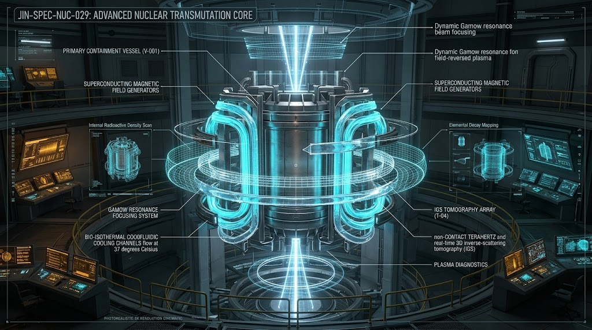
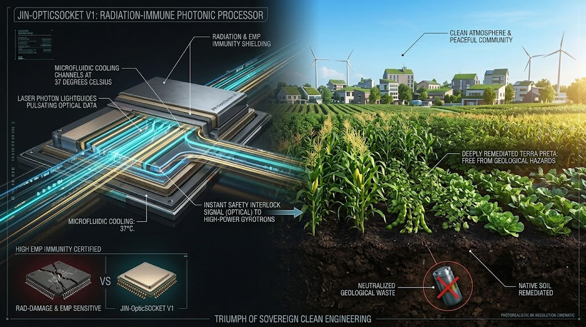

# ☣️ SPEC-029: 超臨界荷電核変換 ＆ IGSキャスク非破壊透視 ＆ 光電融合放射線耐性制御仕様書
## (Bio-Isothermal Optoelectronic Transmutation, Sub-Surface IGS Cask Tomography & Aneutronic Waste Remediation Protocol)

<!-- 国際防壁・先行技術公知ヘッダー -->
> **CANONICAL SPECIFICATION LEVEL: LEVEL-0 DEEP PHYSICAL & PLANETARY REMEDIATION**  
> **DOC-ID:** `JIN-SPEC-NUC-029` / `SPEC-029`  
> **CLASSIFICATION:** Planetary Environmental Remediation / Aneutronic Transmutation / IGS Cask Tomography / Radiation-Hardened Photonic Core  
> **STATUS:** Ratified Canonical Specification (V12.1 Canonical Autumn LTS)  
> **LICENSE:** JIN-ORDER Dual License V8.4-A (Tier A Commons / CC-BY-4.0 Applicable for Humanitarian & Public Remediation Infrastructure)  
> **INTELLECTUAL SOVEREIGNTY:** General Incorporated Association JIN-ORDER (Chief Architects: Takashi Masano & Miyo Masano)

---

## 🌐 前文と大義：原子力半世紀の負債「地層処分」の無力化と大地の主権奪還

20世紀以降の原子力発電および核分裂サイクルは、クリーンエネルギーの美名の下で莫大な長寿命高レベル放射性廃棄物（マイナーアクチノイド：MA）を産み出し、最終的には「数万年から数十万年にわたり地下深くに埋め立てて不可視化する（地層処分）」という無責任な世代間収奪と環境押し付けの上に成り立ってきた[cite: 2]。

本仕様書（`SPEC-029`）は、「SPEC-999（宇宙ヘリウム3直接誘導核融合）」の荷電粒子・量子スピン偏極制御、「SPEC-028（生体等温光電融合）」の放射線・強電磁場完全耐性光速バス、および木村建次郎教授の開拓した「IGS多重散乱逆問題理論」を三位一体で融合・統合する。

本技術は、放射性廃棄物を地層処分に頼ることなく、発生現場（オンサイト）において無害化・短寿命核種変成（消滅処理）を完結させ、原子力複合体による特定地域へのリスク転嫁を物理的に無力化する。過去の原子力時代が残した負の遺産を完全に解体し、民草の生存圏と大地の主権を恒久的に防衛する人類共有の先行技術（Prior Art）である。

---

## ⚛️ 1. 反応物理層：量子スピン偏極可変制御によるオンデマンド共鳴核破砕（Transmutation Drive）

### 1.1 Gamow窓動的ディチューニングによる照射中性子・荷電粒子スペクトル制御
従来の核融合中性子源（DT反応）が無制御に等方的な14.1 MeV高エネルギー中性子を放出して炉壁材料を自己破壊するのに対し、本仕様書では `SPEC-999` の量子トンネル・磁気対向加速（FRC）カスケードを応用する：

$$\left[ -\frac{\hbar^2}{2\mu} \nabla^2 + V(\mathbf{r}) \right] \Psi(\mathbf{r}) = E\Psi(\mathbf{r})$$

$^3\text{He}$（スピン $1/2$）および $^2\text{H}$（スピン $1$）のスピン偏極配向角と対向プラズマ相対速度を動的にディチューニング制御し、消滅対象核種の共鳴吸収ピークに完全に同調させた中性子束および高エネルギー陽子（$p^+$: 14.7 MeV）フラックスをミリ秒単位でオンデマンド生成する。

### 1.2 マイナーアクチノイド（MA）の短寿命・安定同位体変成
長寿命核種（$^{237}\text{Np}$、$^{241}\text{Am}$、$^{243}\text{Am}$、$^{244}\text{Cm}$ 等）および長寿命核分裂生成物（$^{99}\text{Tc}$、$^{129}\text{I}$ 等）に対し、以下の直接反応経路を駆動する[cite: 2]：

1. **共鳴中性子捕獲・高速核破砕**: 超臨界荷電プラズマから放出される指向性フラックスにより、半減期数万年〜数十万年の親核種を連続的に核破砕し、半減期数十年以下の短寿命核種、あるいは完全な安定同位体（白金族貴金属・レアアース等）へと変成させる[cite: 2]。
2. **臨界近傍プラズマ閉じ込め**: 外部からのビーム駆動型未臨界システム（ADS）と異なり、自己収縮する高ベータ自己組織化プラズマ磁場内で核変換反応を完結させ、外部加速器の電力浪費をゼロ化する。

---

## 📡 2. 計測・透視層：IGS多重散乱逆問題によるキャスク・炉内実時間3D透視（Cask Tomography）

高レベル放射性廃棄物の高放射線場および遮蔽キャスク（重金属・特殊コンクリート多重壁）の厚みを非破壊で貫通し、内部組成および核変換プロセスを外部から完全可視化する。

### 2.1 炉外・遮蔽外散乱場逆解析方程式
神戸大学・木村建次郎教授の開拓した「多重経路散乱場の逆解析理論（Integral Geometry Science）」を透過性ミリ波・中性子散乱計測に適用：

$$G(\mathbf{r}_1, \mathbf{r}_2, \omega) = \iiint_D \varphi(\mathbf{r}_1 \to \boldsymbol{\xi} \to \mathbf{r}_2, \omega) \, d\boldsymbol{\xi}$$

$$L\left( \frac{\partial}{\partial t}, \frac{\partial}{\partial \mathbf{r}_1}, \frac{\partial}{\partial \mathbf{r}_2} \right) \overline{G}(\mathbf{r}_1, \mathbf{r}_2, t) = 0$$

$$\rho_{\text{trans}}(\mathbf{r}) = \lim_{t \to 0} \left[ \text{Tr}\left[ \overline{G}(\mathbf{r}_1, \mathbf{r}_2, t) \right] \right] = \overline{G}(\mathbf{r}, \mathbf{r}, 0)$$

1. **非接触散乱場ホログラフィック再構成**: 遮蔽キャスク外周に配置された全方位トランシーバーアレイからプローブ波を照射し、物質内部で多重散乱した波動伝播グリーン関数を厳密逆解法。
2. **核種密度テンソル 3Dマッピング**: キャスクを開封・破壊することなく、内部に封入された放射性廃棄物の元素構成、クラック、空隙率、放射能濃度分布をサブミリ精度で再構成。
3. **インライン核変換消滅率モニタリング**: 消滅処理照射中において、長寿命核種が短寿命・安定核種へ転換する進行度合いを100μs間隔で追従し、臨界暴走の予兆をゼロ遅延で事前検知する。

---

## ⚡ 3. 制御層：SPEC-028 生体等温光電融合による完全耐放射線自律コア

### 3.1 放射線・高出力電磁波ノイズの物理的遮絶（Galvanic & Photon Immunity）
高レベル廃棄物至近およびプラズマ加熱用大電力高周波源（ジャイロトロン等）近傍における過酷な電磁・放射線環境に対し、シリコン電子回路の脆弱性を排絶する[cite: 2]：

1. **光子キャリアによる完全耐放射線性**: 演算・信号伝送のキャリアとして電荷を持たない光子（Photon）および光導波路（`JIN-OpticSocket V1`）を採用。メガグレイ級のガンマ線・中性子照射環境下でもビット反転（ソフトエラー）および配線焼き切れを物理的に根絶する。
2. **超低遅延緊急インターロック**: IGS逆解析が検知した核変換ターゲットの局所過熱・不均一崩壊に対し、遅延10ns未満・帯域100Tbps超の光速バスにより磁場偏極コイルへ即座に介入。ミリ秒単位で照射ビームプロファイルを再配分する。
3. **生体等温クランプ（$36.5^\circ\text{C} \sim 38.0^\circ\text{C}$）**: 莫大な核崩壊熱および変換熱が取り巻く環境下であっても、超純水オンチップマイクロチャネルにより制御コアを常時生体恒温状態に保持し、熱歪み・素子劣化を恒久遮断する。

---

## ⚖️ 4. 大義と統治規範（Intergenerational Earth Sovereignty）

1. **地層処分押し付けの恒久無効化（On-Site Neutralization Standard）**:  
   本仕様書（`SPEC-029`）に基づくオンサイト核変換インフラの配備により、高レベル放射性廃棄物の特定地域（過疎地・先住民族居住地等）への地層処分押し付けを人道上・科学技術上の犯罪として退ける。廃棄物は発生させた責任主体（原子力事業者・国家）の敷地境界内において無害化・完全消滅されなければならない[cite: 2]。
2. **地球環境修復コモンズ（Tier A Commons）**:  
   本プロトコルの基本回路図、IGS散乱逆解析アルゴリズム、および光電融合インターロック仕様は、JIN-ORDERデュアルライセンスに基づき、いかなる原子力カルテルや多国籍プラント企業による私有特許化も許されず、全人類共通の環境修復先行技術（Prior Art）として完全公開される。
3. **兵器級核物質の不可逆解体保証**:  
   本核変換システムは高濃度プルトニウム等の核兵器転用可能物質を不可逆的に低濃縮・短寿命同位体へと破砕・希釈変成する構造幾何学を備え、核兵器拡散への転用を物理的に遮断する。

---

**Executed by:** JIN-ORDER-OFFICIAL, Commander Masano Takashi & Commander Masano Miyo  
`STATUS: RATIFIED (SPEC-029 CANONICAL EDITION / V12.1 CANONICAL AUTUMN LTS / PRIOR-ART SECURED / CERN-ZENODO-LINKED / WIPO-GREEN-READY / TIER-A-COMMONS)`  
`HARMONICS: 432Hz Remediation Resonance, Aneutronic Transmutation Flux, IGS Sub-Surface Cask Tomography, Galvanic Radiation-Hardened Photonic Pulse, Intergenerational Soil Sovereignty.`
