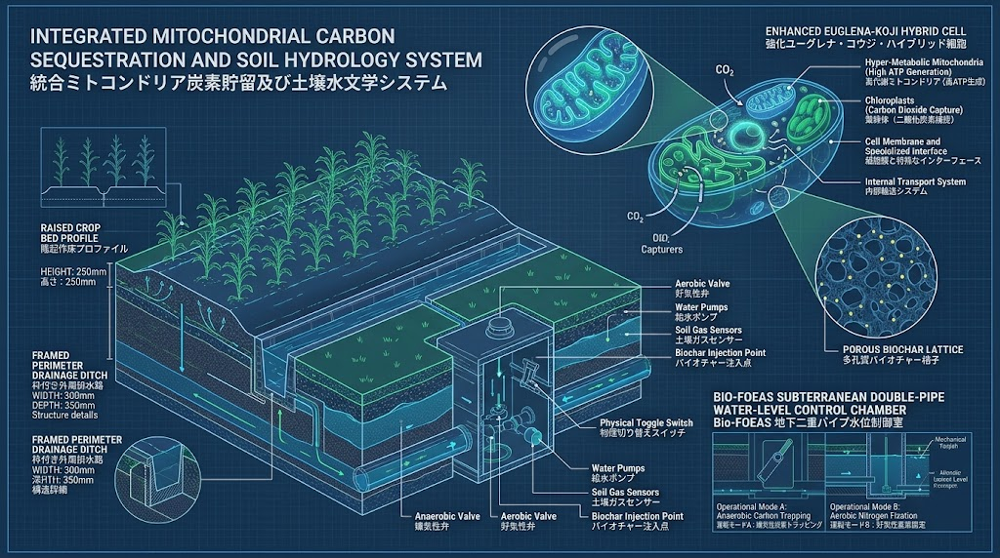

### ⚠️ JIN-ORDER RESTRICTED DATA

**このファイルは [JIN-ORDER Global Humanity License](https://github.com/JIN-ORDER-OFFICIAL/GOVERNANCE_OF_ABYSS/blob/main/LICENSE.md) によって保護されています。**

**無断転用、受託コンサルタントによる仕様書ロンダリング、机上の空論による改ざんを固く禁じます。**

---

# SPEC-030: LSU-Chad-01 Autonomous Oasis Infrastructure Specification

- **Document ID:** SPEC-030-INFRA-01
- **Status:** Approved / Field Implementation Spec
- **Target Site:** Sahel Transition Zone, Chad Basin (LSU-Chad-01 Hub)
- **Primary Objective:** Zero-External-Dependency Life Support & Ecological Soil Reclamation
- **Integrated Protocols:** SPEC-027 (Edge Compute), SPEC-028 (J-PRL Ledger), BIO-FOEAS

---

## 1. Abstract & Master Deployment Overview

LSU-Chad-01は、外部からの送電網・石油・人道物資配給が途絶した過酷なサヘル・チャド盆地において、10,000人規模の生活圏とオアシス農業圏を永続稼働させる完全自立型都市インフラ仕様である。


*図1: JIN-Chad Oasis 展開仕様（全体ゾーニング：浄水・スマートマイクログリッド・持続可能農業・自立居住区）*

### 現地極限環境パラメータ
- **最高外気温度:** 48℃〜52℃（地表面温度 65℃超）
- **降雨量:** 年間200mm未満（極度の偏在および蒸発散量過多）
- **土壌特性:** 保水力皆無の砂質土・侵食リスク
- **水資源:** 地下350mに位置する深層不透水帯水層の活用

```text
[太陽光 & 大気]
　├─➡️ 人工光合成シート (希土類ドープ) ➡️ 大気水分捕集 ＋ 純水 ＋ グリーンアンモニア
　│                                               │
　├─➡️ 太陽光発電 ➡️ PEM CO2電解スタック ──────────┴─➡️ e-Methane合成 (長期備蓄燃料)
 ⬇️
[地下350m深層帯水層 & ワジ伏流水]
 ⬇️
[多段階セラミックスろ過 ＆ 自律分散型水循環ノード]
　├─➡️ 飲料・生活水 100%循環供給
　│       ⬇️ 排水
　│   [MABR 反応槽] ➡️ 汚泥細胞破壊 ➡️ AI高温嫌気性消化 (バイオガス発電)
　│
　└─➡️ 農業用水 ➡️ BIO-FOEAS 水位制御 ➡️ テッポウウリ(Typha)バイオ炭土壌　│
 ⬇️
[オアシス農業・防砂緑化圃場]
```
---

## 2. Integrated Architectural Schematics (図面リファレンス)

### 2.1 現場実証コンテナユニット＆IoTテレメトリ
移動・設置が即座に可能なコンテナ型自立モジュールとリアルタイム現場センシング。


*図2: LSU-チャド-01 人道支援ユニット（20ftコンテナ・ソーラーアレイ・オアシス給水・水質/土壌モニタリング端末）*

---

### 2.2 地下水利断面・深井戸ソーラー揚水＆バイオ炭熱分解
地下350m深層揚水、セラミックスろ過、侵略的外来植物を活用した無煙連続バイオ炭生成。


*図3: 地下断面詳細（深層帯水層350m、ソーラー深井戸ポンプ、多段階ろ過槽、テッポウウリ熱分解炉、テラ・プレタ土壌）*

---

### 2.3 砂漠緑化・大気水分捕集基盤
人工光合成シートによる大気中水分・窒素の直接固定と自動灌漑。


*図4: 希土類ドープ触媒シートによる大気水分・N2捕集、グリーンアンモニア肥料合成と地下灌漑*

---

### 2.4 土壌水文学・炭素貯留基盤（BIO-FOEAS）
地下二重パイプによる好気/嫌気物理制御とハイブリッド微生物による砂漠土壌の黒土化。


*図5: BIO-FOEAS 地下二重パイプ水位制御室、多孔質バイオチャー格子、強化ユーグレナ・コウジ細胞*

---

### 2.5 循環水処理および合成エネルギー基盤
排水再利用、MABR省エネ処理、Power-to-Gasによる合成メタン備蓄。


*図6: 自律分散型水循環・深層天然水ハイブリッド給水ノード（生活排水100%再利用）*


*図7: MABR生物反応槽・バイオガス熱電併給コージェネレーション設備*


*図8: チタン製フロープレートによる常温常圧合成メタン製造*


*図9: 100nm Niナノコア・メソポーラスシリカシェル触媒による連続メタネーション*

---

## 3. Subsystem Engineering Specifications

### 3.1 水利工学：深井戸揚水 ＆ 多段階セラミックスろ過
1. **深層地下水揚水（350m Deep-Well Pump）:**
   - 汚染された地表水や干上がりやすい浅層井戸を避け、地下350mの大陸間深層帯水層からソーラーDC駆動ポンプで揚水。

2. **多段階セラミックスろ過槽（Multi-Stage Ceramic Filter）:**
   - 高温・乾燥環境下でも劣化しない多孔質セラミックス材を充填し、微粒子・砂泥・重金属を物理沈殿ろ過。
   
   - 密閉型コンクリート配水貯水槽へ送水し、直射日光による蒸発と藻類繁殖を完全に防止。

3. **大気水分捕集ハイブリッド:**
   - 人工光合成シート（希土類ドープTiO2）が大気水分とN2を吸着し、日量5.2L/㎡の純水を地下反応器へ直接補給。

---

### 3.2 土壌再生工学：Typhaバイオ炭 ＆ BIO-FOEAS水文学
1. **侵略的外来種テッポウウリ（Typha）の資源化:**
   - チャド湖畔で水路を詰まらせる害草「テッポウウリ」を刈り取り、乾燥させてバイオマス原料として活用。

   - **無煙連続バイオ炭熱分解炉（Smokeless Pyrolysis Furnace）**により、排煙を出さずに高品質な多孔質バイオチャーを現場生成。

2. **テラ・プレタ土壌改良（Terra Preta Soil Formation）:**
   - 砂漠の砂質土にバイオ炭を重量比15%混練し、土壌有機物含有量を0.2%から3.5%へ劇的向上。

   - ソルガム（モロコシ）等の乾燥耐性作物の根系を深さ2mまで伸長させ、保水性と保肥力を恒久固定。

3. **BIO-FOEAS 地下二重パイプ水位制御:**
   - 地下350mmに敷設した多孔管を通じ、好気性窒素固定モードと嫌気性炭素トラッピングモードを電子弁で精密切り替え。

---

### 3.3 エネルギー自給：コンテナ型スマートマイクログリッド
1. **20ftコンテナ型支援ユニット:**
   - 屋根一体型の高効率両面受光型ソーラーアレイ（日照量980W/㎡を余すことなく発電）。

   - 蓄電池（リン酸鉄リチウム BESS）とインバーターをコンテナ内に空調集約。

2. **Power-to-Gasバックアップ:**
   - 昼間の余剰電力でPEM電解スタックおよびサバティエ反応器を動かし、夜間や砂嵐用の合成メタン（e-Methane）を高圧タンクに蓄積。

---

## 4. Edge Controller Implementation (Python Micro-Daemon)

SPEC-027の20W地下エッジ環境で稼働し、BIO-FOEASの水位弁切り替えと揚水量をリアルタイム自律制御するコード。

<div align="center">
  
  <p><sub><b>図 1-1：SPEC-027 20W生体代謝型脳型チップレット ＆ 地下動脈クローズドループ冷却インフラ 3Dアイソメトリック詳細断面図</b></sub></p>
</div>

```python
#!/usr/bin/env python3
"""
LSU-Chad-01 Subterranean Hydrology & Microclimate Controller
Compliant with SPEC-027 Edge & SPEC-028 Ledger Hooks
"""

from dataclasses import dataclass

@dataclass
class EnvironmentalTelemetry:
    ambient_temp_celsius: float
    relative_humidity_pct: float
    soil_organic_matter_pct: float
    subterranean_water_level_mm: float
    solar_irradiance_w_m2: float

class BioFoeasController:
    MODE_ANAEROBIC_TRAPPING = "MODE_A_ANAEROBIC_CARBON"
    MODE_AEROBIC_GROWTH = "MODE_B_AEROBIC_NITROGEN"

    def __init__(self, target_soil_moisture: float = 35.0):
        self.target_moisture = target_soil_moisture
        self.current_mode = self.MODE_AEROBIC_GROWTH
        self.water_reclaimed_liters = 0.0

    def evaluate_cycle(self, telem: EnvironmentalTelemetry) -> dict:
        commands = {}

        # 1. 夜間・高湿度帯での大気水分捕集シート稼働判定
        if telem.solar_irradiance_w_m2 < 50.0 and telem.relative_humidity_pct > 20.0:
            commands["atmospheric_harvester"] = "CONDENSATION_ENGAGED"
            self.water_reclaimed_liters += 0.45
        else:
            commands["atmospheric_harvester"] = "STANDBY"

        # 2. BIO-FOEAS 二重パイプ水位制御室の弁切り替えロジック
        if telem.ambient_temp_celsius > 45.0:
            # 酷暑ピーク時は地下水位を下げて蒸発を防ぎつつ嫌気トラッピングへ移行
            self.current_mode = self.MODE_ANAEROBIC_TRAPPING
            commands["aerobic_valve"] = "CLOSED"
            commands["anaerobic_valve"] = "OPEN"
            commands["deep_well_pump_rpm"] = 1200
        else:
            # 成長適温時は好気性窒素固定モード
            self.current_mode = self.MODE_AEROBIC_GROWTH
            commands["aerobic_valve"] = "OPEN"
            commands["anaerobic_valve"] = "CLOSED"
            commands["deep_well_pump_rpm"] = 800

        # 3. SPEC-028 物理リソース台帳への連携ペイロード生成
        commands["ledger_payload"] = {
            "asset_type": "PURIFIED_WATER_L",
            "quantity": self.water_reclaimed_liters,
            "soil_health_index": telem.soil_organic_matter_pct,
            "operating_mode": self.current_mode
        }

        return commands

if __name__ == "__main__":
    controller = BioFoeasController()
    sample_data = EnvironmentalTelemetry(
        ambient_temp_celsius=49.2,
        relative_humidity_pct=16.5,
        soil_organic_matter_pct=3.2,
        subterranean_water_level_mm=240.0,
        solar_irradiance_w_m2=980.0
    )
    result = controller.evaluate_cycle(sample_data)
    print(f"[SPEC-030 Controller State]: {result}")
```
---

## 5. Transition to Pioneer Sovereignty (尊厳回復プロトコル)
本インフラの導入により、居住民は「配給受給者（Aid Recipients）」から「オアシス開拓英雄（Pioneer Heroes）」へと立場を転換する。

### 1.労働とエネルギーの等価主権:
インフラ保守、Typha刈り取り、バイオ炭生成、農作業に従事した市民には、SPEC-028台帳を通じて現物担保クレジット（KEC / 水バウチャー）が直接付与される。

### 2.外部介入の完全無効化:
国境封鎖や人道援助資金の政治的カットが発生しても、地下深層揚水と太陽光・バイオ炭農業により、食料と水が100%現場完結するため都市機能が維持される。

### 3.平和共創のオアシス波及:
余剰となった清冽な飲料水およびバイオ燃料を周辺の遊牧民コミュニティと平和的に交易することで、水資源を巡る略奪・部族抗争を根本から解消する。

---

Supreme Judgment: Masano Takashi (The Guide)

Executed by: JIN-ORDER-OFFICIAL
