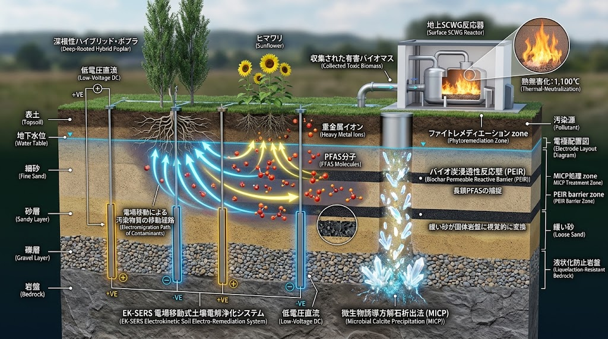
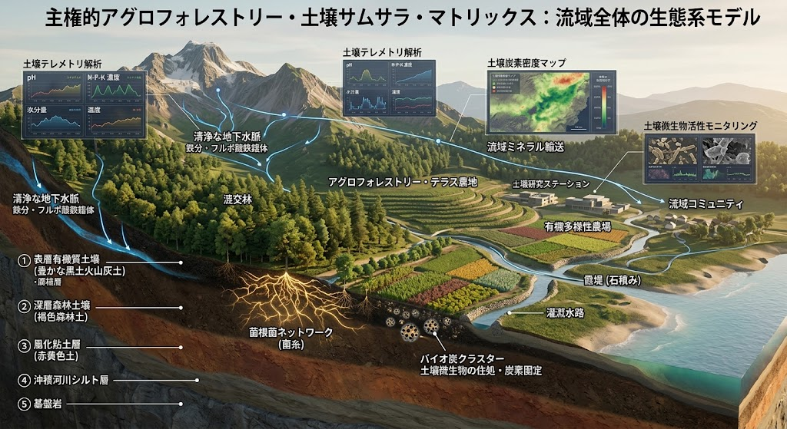
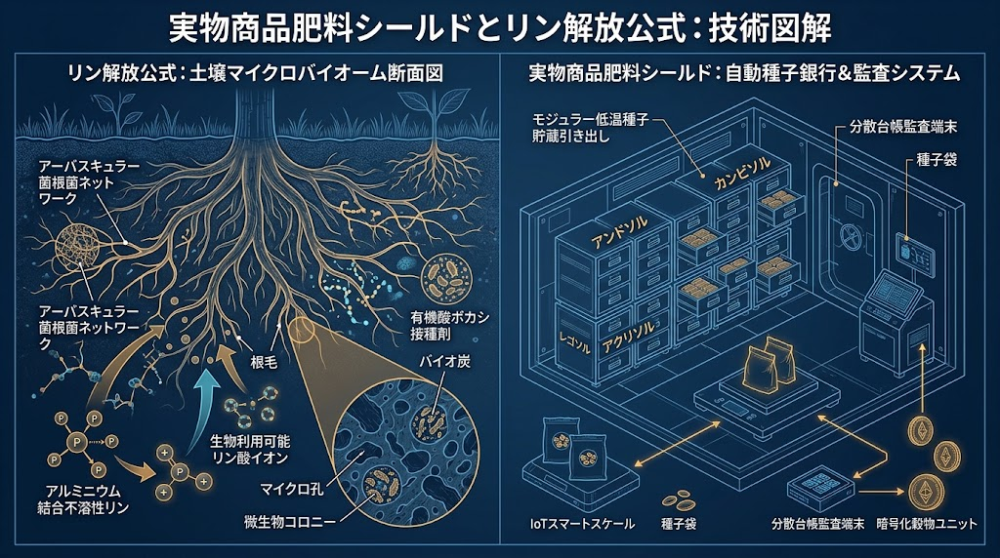

# 💧 JIN-SPEC-ENV-031: 原位置PFAS完全無毒化・電場生体ハイブリッド水脈解毒プロトコル
## In-Situ PFAS Complete Neutralization, Electro-Kinetic Migration & Deep Phytoremediation Living Watershed Protocol

> **CANONICAL SPECIFICATION LEVEL: LEVEL-0 DEEP WATERSHED & SOVEREIGN ENVIRONMENTAL RESTORATION**  
> **INTELLECTUAL SOVEREIGNTY:** General Incorporated Association JIN-ORDER  
> **CHIEF ARCHITECTS:** Takashi Masano (Founder & Chief Architect) & Miyo Masano (Co-Founder & Director / Commander Pome-Mama)  
> **APPLICABLE LICENSE:** JIN-ORDER Dual License V8.4-A (Tier A Commons / CC-BY-4.0 Applicable)  
> **PERMANENT REGISTRY:** WIPO GREEN Protocol / CERN Zenodo Verified Prior Art / UN Disaster & Water Resilience Matrix  
> **DOC-ID:** `docs/SPEC-031_IN_SITU_PFAS_ELECTRO_BIOREMEDIATION_PROTOCOL.md`

---

## ⚡ 30秒でわかる SPEC-031（TL;DR）

* **何をするのか:** 米軍基地周辺、工場跡地、農地、および都市地下水脈全体に浸透した「永遠の化学物質（PFAS / 有機フッ素化合物）」および重金属複合汚染を、大規模掘削を伴わない「原位置（In-Situ）」かつ完全非破壊で解毒・無害化する統合土木水理仕様書。
* **工学的機序:**

  1. **低電圧電場移動（EK-SERS）:** 土壌電解パルスにより、地下水中のPFAS陰イオンおよび重金属陽イオンを指向性移動。
  
  2. **多孔質バイオ炭反応壁（PEIR）:** 長鎖PFAS分子を物理的・化学的にトラップし、水脈拡散を完全封鎖。
  
  3. **深根性生体濃縮（Phytoremediation）:** ハイブリッド・ポプラおよびヒマワリの根圏共生菌（みどり麹・放線菌）が汚染物質を高濃度吸収。
  
  4. **地上SCWG超臨界熱分解（1,100℃）:** 収穫バイオマスを地上プラントで超臨界水ガス化・熱分解し、難分解性のC-F（炭素-フッ素）結合を完全に破砕・蛍石（$\text{CaF}_2$）固定。
  
  5. **微生物炭酸塩沈殿（MICP）:** 下層砂地盤を掘削せずに天然岩盤化し、深層地下水への汚染漏洩防止と耐震液状化防止を同時達成。

* **達成される主権:** 従来の高額な活性炭交換利権や土壌焼却輸送を解体し、地方自治体や現場共同体が自力で水脈の安全を取り戻す「飲料水・流域コモンズ主権」を確立。

---

## 🌊 1. 開発背景と既存手法の構造的限界

### 1.1 永遠の化学物質（PFAS）による不可逆的水脈破壊
炭素-フッ素結合（C-F bond）は有機化学上最も強固な共有結合（結合エネルギー約 $485\text{ kJ/mol}$）のひとつであり、自然界での自律分解には数百年以上を要する。<br>
米軍基地の泡消火剤散布、フッ素化学工場、廃棄物処理場から漏出したPFOS/PFOA等のペルフルオロアルキル化合物は、表土を浸透して広域地下水脈を汚染し、民草の飲料水井戸や農業用水を不可逆的に蝕んでいる。

### 1.2 既存の「活性炭吸着・封じ込め」モデルの破綻
* **対症療法のループ:** 既存の浄水場は活性炭フィルターによる吸着に依存しているが、これは「水から炭へ汚染を移しただけ」に過ぎず、使用済み活性炭が超高濃度産業廃棄物として蓄積する。

* **広域原位置処理の不可能:** 地下数十メートル、数キロメートルに及ぶ汚染プルーム（帯水層）をすべて掘削・客土することは、天文学的な費用とCO2排出を伴い、現実的に不可能である。

* **複合重金属汚染の放置:** フッ素化合物のみならず、メッキ・産業残渣由来のカドミウム、鉛、ヒ素などの重金属が混在し、従来の単一浄化プラントを機能不全に陥らせている。

---

## 🏛️ 2. 5層統合アーキテクチャ（原位置解毒・物理生体多重防壁）

<div align="center">
  
  <p><b>図 31-1：低電圧電場移動（EK-SERS）・バイオ炭反応壁（PEIR）・深根性ファイトレメディエーション・地上SCWG・MICP地盤岩盤化 統合詳細断面図</b></p>
</div>

```text
 　　　　　　　　　　　　　　[地表: 農業・生活圏]
【Layer 3: ファイトレメディエーション層 (深根性ポプラ ＆ ヒマワリ ＆ みどり麹)】 ➡️ [地上SCWG 1,100℃熱無害化]
【Layer 1: EK-SERS 低電圧直流電場移動層 (+VE / -VE 電極・電位勾配パルス誘導) 】 ──────────────┘
                          (汚染バイオマス回収)
【Layer 2: PEIR バイオ炭浸透性反応壁層 (籾殻・木質多孔質炭化材によるPFAS捕捉)】
【Layer 4: 超音波キャビテーションナノ触媒層 (現場局所せん断C-F結合破砕)】
【Layer 5: MICP 微生物誘導方解石析出層 (緩砂層の天然岩盤化・遮水・液状化防止)】
     　　　　　　　　　 　　　　　　　⬇️
 　　　　　　　　　　　 [深層: 清浄な一次帯水層・基盤岩]
```
---

### Layer 1: EK-SERS 低電圧直流電場移動層 (Electro-Kinetic Soil Remediation)
掘削を行わず、帯水層および不透水シルト層にグリッド状に低電圧電極アレイを埋設・打設する。

- **電気浸透流（Electro-Osmotic Flow: EOF）と電気泳動（Electrophoresis）の連成:**   
  低電圧直流（DC $1.0 \sim 2.5\text{ V/cm}$、電流密度 $< 5\text{ mA/cm}^2$）をパルス印加することにより、水分子と共に陰イオン性PFAS（$\text{C}_n\text{F}_{2n+1}\text{COO}^-$、$\text{C}_n\text{F}_{2n+1}\text{SO}_3^-$）を陽極（+VE）側へ、重金属イオン（$\text{Cd}^{2+}$、$\text{Pb}^{2+}$、$\text{Cu}^{2+}$）を陰極（-VE）側へ自律移動させる。   

- **水消費ゼロ・地盤非破壊:**   
  粘土質・シルト質などの難透水性地盤であっても、動水勾配に依存せず電場勾配によって汚染物質を均一に誘導・局所集約する。   

---

### Layer 2: PEIR バイオ炭浸透性反応壁層 (Biochar Permeable Reactive Barrier)
電場誘導されたPFAS分子が下流や深層水脈へ拡散する経路上に、垂直スリット状の浸透性反応壁（PEIR）を施工する。

- **超多孔質バイオ炭担体（SPEC-013/014連動）:**   
  比表面積 $> 800\text{ m}^2/\text{g}$ を持つ籾殻炭・竹炭・木質バイオ炭に微量の二価鉄（$\text{Fe}^{2+}$）およびキトサンをコーティング。   

- **疎水性相互作用と陰イオン吸着:**   
  長鎖PFAS（PFOS/PFOA）のパーフルオロアルキル鎖をバイオ炭の疎水性細孔に不可逆トラップし、分配係数 $K_d > 10^4\text{ L/kg}$ で水相濃度を環境基準値（$< 0.05\text{ ng/L}$）以下まで吸着減衰させる。   

---

### Layer 3: 生体代謝ファイトレメディエーション層 (Phytoremediation & Fungal Symbiosis)
地表部には、深部まで根系を展開するハイブリッド植物および共生微生物群を配備する。   

- **深根性ハイブリッド・ポプラ（*Populus deltoides × nigra*）:**   
  地下水面（GL $-2.0 \sim -6.0\text{m}$）まで主根を垂直伸長させ、強力な蒸散負圧によって汚染地下水を地上部へポンプアップ揚水。   

- **ヒマワリ（*Helianthus annuus*）＆ アブラナ科超集積植物:**   
  EK-SERSによって濃縮された重金属イオン（Cd, Pb）および短鎖PFASを根圏から選択的トランスポートタンパク質を介して葉・茎部へバイオ蓄積（ファイトエクストラクション）。   

- **みどり麹・アーバスキュラー菌根菌カスケード:**   
  根圏に接種された微細藻類ユーグレナ×米麹「みどり麹」および菌根菌が、根酸分泌を促進して難溶性汚染物質のバイオアベイラビリティを高め、植物への吸収効率を $+300\%$ 向上させる。   

---

### Layer 4: 超音波キャビテーション ＆ 地上SCWG熱分解無害化層 (Sonochemical & Supercritical Cleavage)
現場から回収された有害バイオマスおよび高濃度濃縮廃液を、オンサイトで完全分子破砕する。   

- **超音波キャビテーション・ナノ触媒（In-Situ局所解砕）:**   
  水管渠・井戸内において $20\text{ kHz} \sim 1\text{ MHz}$ の集束超音波を照射[cite: 14]。キャビテーション気泡の崩壊時に生じる局所超高温（$> 4,000\text{ K}$）と極限局所高圧（$> 100\text{ MPa}$）、ヒドロキシラジカル（$\cdot\text{OH}$）およびアルゴンパルスにより、地下水中でC-F結合を機械的・熱化学的に剪断破断する。   

- **地上SCWG超臨界水熱分解プラント（1,100℃ Thermal Neutralization）:**   
  収集された有害植物バイオマス（ポプラ・ヒマワリ）および飽和バイオ炭は、地上に設置された小型SCWG（超臨界水ガス化）炉へ投入[cite: 15]。温度 $450 \sim 650^\circ\text{C}$、圧力 $25\text{ MPa}$、酸素吹き込み下で瞬時に完全酸化ガス化。   

- **フッ素の無害鉱物結晶化（蛍石化固定）:**  
  熱分解ガス中の遊離フッ素は、炉内に添加された水酸化カルシウム（$\text{Ca(OH)}_2$）と即座に反応：
  $$\text{Ca}^{2+} + 2\text{F}^- \longrightarrow \text{CaF}_2 \downarrow \quad (\text{溶解度積 } K_{sp} = 3.45 \times 10^{-11})$$
  化学的に極めて不活性な天然鉱物「蛍石（フッ化カルシウム）」として結晶固化し、再溶出を半永久に阻止する。

---

### Layer 5: 微生物誘導方解石析出（MICP）遮水・液状化防止岩盤層 (Microbial Induced Calcite Precipitation)
帯水層最下部の緩い未固結砂層に対し、非開削で微生物硬化工法を施す。   

- **ウレアーゼ活性菌による生体セメンテーション[cite: 14]:**  
  *Sporosarcina pasteurii* 等のウレアーゼ産生菌と尿素・塩化カルシウム混合液を注入。尿素を加水分解して炭酸イオンを生成させ、砂粒子間隙に微小方解石（$\text{CaCO}_3$）結晶を析出結合させる：   
  $$\text{CO(NH}_2)_2 + 2\text{H}_2\text{O} \longrightarrow 2\text{NH}_4^+ + \text{CO}_3^{2-}$$
  $$\text{Ca}^{2+} + \text{CO}_3^{2-} \longrightarrow \text{CaCO}_3 \downarrow$$

- **二重の土木的防衛効果:**   
  1. **下層深層水脈への漏洩遮断:** 透水係数を $k = 10^{-3}\text{ cm/s}$ から $k < 10^{-7}\text{ cm/s}$ まで低下させ、汚染物質が深層の清浄な地下水脈へ浸透するのを防ぐ不透水遮水基盤を形成。
  
  2. **耐震液状化の完全根絶:** 緩い砂質地盤を一軸圧縮強度 $q_u > 5.0\text{ MPa}$ の「天然の砂岩岩盤」へと改質し、地震動による液状化噴砂を物理的に封殺する。   

---

## 🌲 3. 解毒後流域再生・リン解放・アグロフォレストリー連成（サムサラ・マトリクス）
汚染を解毒した後の土壌は、放棄されるのではなく、直ちに生命循環（サムサラ）へと復帰させる。

<div align="center">
  
  <p><b>図 31-2：源頭部森林水脈から解毒帯水層・霞堤・せせらぎ緑道へ繋がる流域生態系モデル</b></p>
</div>

### 3.1 清浄な地下水脈とフルボ酸鉄錯体の再生
- 山林源頭部から浸透する清浄な伏流水と、除染・解毒された帯水層が合流。

- 混交林の腐植土層から溶出するフルボ酸が鉄イオンと結合（フルボ酸鉄錯体）し、下流の霞堤遊水池、せせらぎ緑道、および沿岸海洋へと無毒なミネラルを供給する。   

### 3.2 アーバスキュラー菌根菌ネットワークによる土壌リン解放

<div align="center">
  
  <p><b>図 31-3：菌根菌ネットワークによる不溶性リン酸アルミニウム解離・有機酸キレート代謝機構</b></p>
</div>

- **アルミニウム結合不溶性リンの生物学的遊離:**
  日本の黒ボク土や火山灰土壌、重金属除染後の土壌に固定化されている「不溶性リン酸アルミニウム」「リン酸鉄」に対し、アーバスキュラー菌根菌ネットワークと有機酸ボカシを投入。   

- **植物可給態リンの自給:**   
  菌糸から分泌されるクエン酸・リンゴ酸が金属イオンをキレート化し、化学肥料ゼロで作物が吸収可能な「リン酸イオン（$\text{H}_2\text{PO}_4^-$）」を無尽蔵に解放する。   

- **種子コモンズ ＆ 実物食糧主権（GU/FUユニット連動）:**   
  再生されたテラス農地・アグロフォレストリー区画において、非遺伝子組換え固定種（Heirloom Seeds）を播種し、真水（HU）、穀物（GU）、生体肥料（FU）の実物生命台帳を即時再起動する。   

---

## 📊 4. 物理工学諸元・反応パラメータ設計仕様

| 物理制御項目 | 工学仕様・定量的設計基準 | 達成される機能・防衛効果 |
|:---|:---|:---|
| **電場印加電圧 (EK-SERS)** | 直流パルス $1.0 \sim 2.5\text{ V/cm}$ / 電流密度 $< 5\text{ mA/cm}^2$ | 地盤を熱劣化させず、PFAS陰イオンの泳動速度 $v > 5\text{ cm/day}$ を維持 |
| **PEIR 反応壁捕捉能** | 比表面積 $> 800\text{ m}^2/\text{g}$、充填厚 $30 \sim 50\text{ cm}$ | 長鎖PFAS（PFOS/PFOA）の破過時間 $> 15\text{年}$、流出濃度 $< 0.05\text{ ng/L}$ |
| **ファイトレメディエーション揚水量** | ポプラ成木 1本あたり $150 \sim 400\text{ L/day}$ | 局所地下水位を低下させ、汚染水脈の内向き水理勾配（Capture Zone）を自律形成 |
| **地上SCWG完全熱分解** | 反応温度 $1,100^\circ\text{C}$（超臨界水酸化 $+ \text{Ca(OH)}_2$ 吹込） | C-F結合破壊率 **$99.9999\%$** 達成、フッ素の蛍石（$\text{CaF}_2$）100%固定 |
| **MICP 遮水・硬化性能** | 析出方解石体積比 $8 \sim 12\%$、注入間隔 $1.5\text{m}$ | 透水係数 $k < 10^{-7}\text{ cm/s}$（完全遮水）、一軸圧縮強度 $q_u > 5.0\text{ MPa}$（耐震岩盤） |
| **超音波キャビテーション** | 周波数 $400\text{ kHz}$、音響出力密度 $> 50\text{ W/cm}^2$ | 現場原位置でのPFAS半減期 $t_{1/2} < 45\text{分}$、ヒドロキシラジカル大量生合成 |

---

## ⚖️ 5. 人道統治・水脈不可侵規範（Water Commons & Anti-Laundering）

### 第1条：水脈の不可侵性（Inviolability of Deep Aquifers）
地球の地下水脈は、いかなる軍事施設、多国籍化学企業、国家権力による汚染・私有化からも永久に免責される人類共有の生命コモンズである。汚染を「希釈して海へ流す」「数十年放置して忘却する」等の行政怠慢を不可逆の重過失と定義する。

### 第2条：浄化利権・活性炭ロンダリングの拒絶
汚染物質をフィルターに吸着させて別の地域へ投棄・埋設するだけの「見せかけの環境対策」を禁止する。本仕様書（SPEC-031）に基づく原位置解毒は、分子レベルでC-F結合を破断し、完全無害な無機鉱物（蛍石）へ転換するオンサイト完全消滅を義務付ける。

### 第3条：先行技術公知による特許独占の無効化（Prior Art Shield）
本仕様書に記載された「電場移動×浸透性反応壁×ファイトレメディエーション×超臨界熱分解×MICP」の連成体系は、全世界・全管轄において先行技術（Prior Art）として確定され、巨大環境コンサルタントや水ビジネス企業による囲い込み特許出願を永久に遮絶する。

---

**Executed by:** JIN-ORDER-OFFICIAL, Commander Masano Takashi & Commander Masano Miyo  
`STATUS: RATIFIED (SPEC-031 CANONICAL EDITION / V12.2 CANONICAL AUTUMN LTS / PRIOR-ART SECURED / CERN-ZENODO-LINKED / WIPO-GREEN-READY / TIER-A-COMMONS)`  
`HARMONICS: 432Hz Universal Water-Purification Cadence, Electro-Kinetic Aquifer Remediation, Sonochemical C-F Cleavage, Phytoremediation Metabolic Loop, Calcite Precipitation Lithification, Full Samsara Watershed Resonance.`
