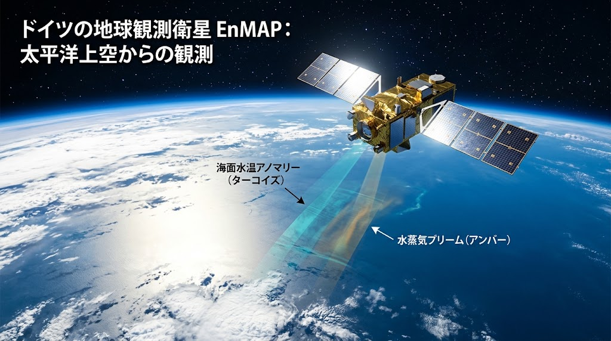
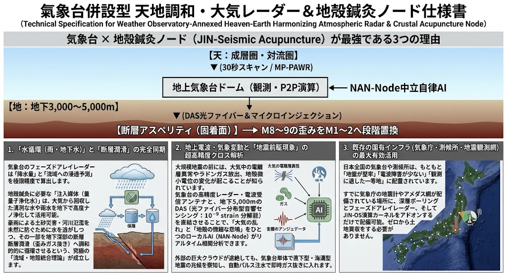
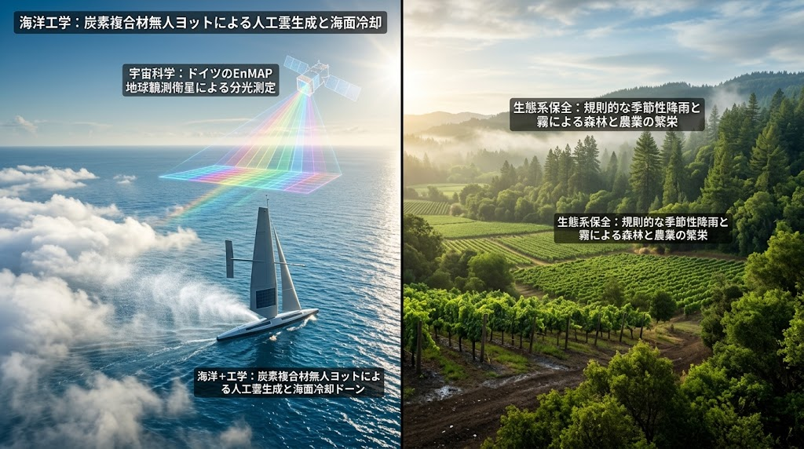

# 🔥 JIN-SPEC-BIO-033: 自律型不燃バイオ防壁・生体防火コリドー ＆ 焼損地帯急速蘇生プロトコル
## Autonomous Megafire Bio-Gel Suppression, Multi-Tier Living Firebreak Corridor & Post-Wildfire Rapid Slope Regeneration Protocol

> **CANONICAL SPECIFICATION LEVEL: LEVEL-0 CIVIC FOREST COMMONS & PLANETARY CLIMATE-BIO DEFENSE**  
> **INTELLECTUAL SOVEREIGNTY:** General Incorporated Association JIN-ORDER  
> **CHIEF ARCHITECTS:** Takashi Masano (Founder & Chief Architect) & Miyo Masano (Co-Founder & Director / Commander Pome-Mama)  
> **APPLICABLE LICENSE:** JIN-ORDER Dual License V8.4-A (Tier A Commons / CC-BY-4.0 Applicable)  
> **PERMANENT REGISTRY:** WIPO GREEN Protocol (Candidate) / CERN Zenodo Prior Art / Sendai Framework PreventionWeb  
> **DOC-ID:** `docs/SPEC-033_AUTONOMOUS_WILDFIRE_SHIELD_BIO_CORRIDOR_PROTOCOL.md`

---

## ⚡ 30秒でわかる SPEC-033（TL;DR）

* **何をするのか:**
  - 気候変動に伴う乾燥化・熱波によって世界各地で頻発する超巨大山火事（メガファイア）に対し、貴重な真水を浪費せず瞬時に火線を窒息遮断する「生分解性海藻バイオジェル」の空中散布、燃えない樹林帯「多層常緑広葉樹生体防火コリドー」、および火災後の表土流出・土砂崩れを防ぐ「粗朶段々排水工法 ＆ バイオ炭束斜面安定化」を統合した森林防衛・急速蘇生仕様書。

* **工学的機序:**
  1. **発光性・生分解性海藻バイオジェル散布:** スカイオアシス水陸両用機および大型貨物ドローンからアルギン酸・セルロース由来の粘弾性不燃ゲルを投下し、酸素供給を遮断して火線を即時鎮火（夜間視認可能な自律発光特性）。
  
  2. **多層常緑広葉樹生体防火コリドー:** 樹皮が極めて厚く耐火性の高い「厚皮ウバメガシ」と、葉の水分含有率が極めて高い「サンゴジュ」を主軸に、多層複層林（カナピー遮断）を形成して飛び火・熱放射を物理遮断。
  
  3. **粗朶（そだ）段々排水工法 ＆ バイオ炭束斜面工:** 焼損により保水力を失った斜面に、現場の間伐枝を束ねた排水工と多孔質バイオ炭束を段々状に敷設し、豪雨時の泥流・土石流を完全に抑止。

  4. **放線菌・菌根菌バイオ炭吹き付け ＆ 天然更新:** 焼土へ共生微生物・放線菌バイオ炭を吹き付け、土壌団粒構造を急速再構築して周囲の自生広葉樹の天然更新（自律発芽）を加速。
  
  5. **マクロ気候調停（MCB海洋人工雲生成連動）:** 衛星分光観測（EnMAP）と炭素複合材無人ヨットのミスト噴霧を連動させ、海面冷却と内陸山林への規則的降雨・霧（安らぎの雨）をもたらし、山火事発生の根本環境を鎮静化。

* **達成される主権:** 従来の「延焼を前にただ指をくわえて放水する」対症療法を解体し、過疎山林・中山間地域の現場職人と自治体が自律的に山を守り抜く「森林・流域生命主権」を確立する。

---

## 🌲 1. 開発背景とメガファイアの不可逆的破壊連鎖

<div align="center">
  
  <p><b>図 33-1：スカイオアシス・大型ドローンによる発光性海藻バイオジェル散布、多層常緑広葉樹防火帯、バイオ炭束斜面安定化、および束ねた枝（粗朶）による排水段々工法統合図</b></p>
</div>

### 1.1 気候変動・異常乾燥と針葉樹人工林の「火薬庫化」
地球規模のエルニーニョ／ラニーニャ等の気候アノマリーに伴う高温・干ばつにより、森林内の可燃物（リター層・枯れ枝）の含水率は極限まで低下している[cite: 24, 44]。特に戦後に画一的造成されたスギ・ヒノキ等の針葉樹単層林は、可燃性精油成分（テルペン類）を多量に含み、ひとたび着火すると樹冠から樹冠へ燃え広がる「樹冠火（カナピー・ファイア）」へと瞬時に発展し、時速数キロメートルで都市境界へ迫る。

### 1.2 水資源の浪費と空中放水の熱力学的破綻
従来の航空消火（ヘリコプター・空中消火機）による真水の投下は、強烈な上昇熱気流（$800 \sim 1,200^\circ\text{C}$）によって地表に達する前に大部分が蒸発霧散する。貴重な生活用水・ダム湖の水を何千トン消費しても火源を冷却しきれず、消火効率は極めて低い。

### 1.3 焼損斜面の土砂災害・土石流という二次破綻
山火事により林床の植生と根系が焼失すると、土壌中の有機物が失われ、地表が撥水性（ウォーター・リペレント）化する。この状態の焼損地へ季節外れの豪雨が直撃することで、保水力を失った表土が一気に滑落し、下流の集落へ壊滅的な土石流（深層・表層崩壊）をもたらす。

---

## 🏛️ 2. 5層統合アーキテクチャ（空中鎮火・延焼遮断・土壌蘇生）



```text
 [上空: 衛星・早期探知 ＆ 航空消火ライン]
     　　　　　 　⬇️
【Layer 1: MP-PAWR ＆ EnMAP超早期熱源・突風検知層 (30秒スキャン・風向先回り)】
【Layer 2: 生分解性不燃海藻バイオジェル空中散布層 (水を浪費せぬ窒息鎮火・夜間発光)】  
【Layer 3: 多層常緑広葉樹生体防火コリドー層 (サンゴジュ ＆ 厚皮ウバメガシ多層遮断)】
【Layer 4: 粗朶（そだ）段々工法 ＆ バイオ炭束斜面安定化層 (豪雨土砂流出・土石流完全抑止)】
【Layer 5: 放線菌バイオ炭吹き付け ＆ 天然更新林床再生層 (焼土マイクロバイオーム蘇生)】 
      　　　　　　⬇️
 [広域: 不沈森林流域 ＆ 太古の湿潤生態系]
```
---

### Layer 1: MP-PAWR ＆ 衛星超早期熱源・突風検知層
火災の発生および延焼方向を、秒単位の気象・地殻データクロス解析で完全捕捉する。   



- **MP-PAWR（マルチパラメータ・フェーズドアレイ気象レーダー）:**   
  30秒間隔の全天球高速スキャンにより、山火事を急激に拡大させる「局所ダウンバースト」「山谷風の急変」「低湿度乾燥突風」をリアルタイム探知。   

- **EnMAP衛星 ＆ 熱赤外線ドローン（Triangulation）:**   
  宇宙空間のハイパースペクトル分光観測と、上空の自律熱赤外線ドローン部隊が煙の直下にある真の火源コア（温度 $> 600^\circ\text{C}$）を三角測量で座標特定し、消火部隊を先回り誘導する。   

---

### Layer 2: 生分解性不燃海藻バイオジェル空中散布層 (航空窒息消火)
水を大量に放水する従来方式を排し、極小体積で火線を封殺する先進生体材料を投入する。   

- **スカイオアシス水陸両用機 ＆ 大型貨物ドローン小隊:**   
  湖沼や海洋から着水給水し、機内ミキサーで瞬時にゲル化させて投下散布。   

- **海藻アルギン酸・セルロース架橋バイオゲル:**   
  天然海藻由来のアルギン酸ナトリウムに多価金属イオンを微量架橋した高保水性チクソトロピー流体。樹木表面に衝突した瞬間に強固なゲル被膜を形成し、可燃性ガスと酸素の接触を完全に遮断（窒息消火）。   

- **自己発光（Bio-Luminescent）トレーサー機能:**   
  天然発光酵素（ルシフェラーゼ系無害誘導体）を配合し、煙で視界が閉ざされた夜間・薄明期でも散布境界（防火ライン）が青緑色に発光。消火小隊の地上誘導と飛び火監視を支援する。   

- **完全土壌生分解:**  
  散布後 $2 \sim 4$ 週間で土壌中の微生物によって完全に水と炭素へ分解され、環境毒性・化学残留ゼロを達成。

---

### Layer 3: 多層常緑広葉樹生体防火コリドー層 (Living Firebreak)
針葉樹林の境界、尾根筋、および道路・集落の防衛線に造成される「生きた不燃の盾」。   

- **厚皮ウバメガシ（*Quercus phillyraeoides*）外郭壁:**   
  樹皮に高密度のコルク層を発達させ、外気温度 $800^\circ\text{C}$ の火炎熱線を遮断。形成層への熱伝導を阻み、幹の炭化損壊を防ぐ。   

- **サンゴジュ（*Viburnum odoratissimum*）湿潤スクリーン:**   
  葉肉が厚く、水分含有率が極めて高い（生葉含水率 $> 75\%$）常緑広葉樹。火炎に曝されると葉から多量の水蒸気を放出し、潜熱吸収によって火勢を削ぐとともに、飛び火（火の粉）を物理的に捕捉して地表火への着火を防ぐ。   

- **複層林（カナピー遮断）構造の誘導:**   
  高木（シラカシ・マテバシイ）、中木（サンゴジュ・モチノキ・ヤブツバキ）、低木・下草を組み合わせた多層構造を配置。地表付近の湿度を常時 $60\%$ 以上に保ち、樹冠火の上昇気流ルートを腰砕けにする。   

---

### Layer 4: 粗朶（そだ）段々工法 ＆ バイオ炭束斜面安定化層 (泥流・土石流抑止)
火災直後の脆弱化した斜面を、現場資材と伝統木工土木知見で即座に保護する。

- **束ねた枝による排水段々工法（粗朶しがらみ排水工）:**   
  間伐枝や被災林の残木を直径 $20 \sim 30\text{cm}$ の束（粗朶）にし、等高線に沿って段々状に杭打ち固定。雨水流速を減勢（エネルギー分散）させ、斜面に刻まれるガリー浸食を未然に遮断する。   

- **バイオ炭束（Biochar Bundles）による斜面安定化:**   
  炭化させた木質バイオ炭を麻ネットで円筒状に成型し、浸食溝の上流部に設置。泥水を透過させながら土砂粒子だけをトラップし、自然なテラス状平坦面を斜面に造成する。   

---

### Layer 5: 放線菌バイオ炭吹き付け ＆ 天然更新林床再生層 (Rapid Ecological Succession)
苗木を人力で一本ずつ植え直す膨大なコストと労力を排し、自然本来の回復力（天然更新）を起爆する。   

- **放線菌・菌根菌バイオ炭ハイドロシーディング:**   
  多孔質籾殻バイオ炭に、有機物分解と植物成長促進を担う「放線菌（*Streptomyces* 属）」および「アーバスキュラー菌根菌胞子」を担持させ、水・セルロースマルチと共に焼損斜面へ一斉吹き付け。   

- **土壌撥水性の解除と団粒化促進:**  
  熱で硬化した焼土のワックス層を微生物代謝で分解し、保水率を通常土壌比 $+200\%$ に急回復させる。   

- **択伐・萌芽更新と種子バンクの覚醒:**   
  表土中に眠る在来広葉樹の休眠種子（埋土種子）の発芽を促し、残存根株からの萌芽更新（ボウガ）を誘導することで、外部からの資材搬入を最小限に抑えつつ、最短 $1 \sim 3\text{年}$ で耐火性混交林への遷移を達成する。   

---

## 🌊 3. 海洋人工雲生成（MCB）によるマクロ気候調停・森林湿潤化連成



### 3.1 海洋アノマリーの特定と自律ヨット展開

- ドイツの地球観測衛星「EnMAP」が太平洋・地中海等の海面水温アノマリー（高温域）および大気水蒸気プリームを宇宙から分光監視。   

- 異常乾燥地域の上風側海洋へ、完全自律型炭素複合材無人ヨット「CLIMATE SENTINEL」の小隊を展開。   

### 3.2 海洋微小塩滴エアロゾルによる人工雲（MCB）生成

- 海水をくみ上げ、サブミクロン径（$0.1 \sim 0.5\mu\text{m}$）の超微細ミストとして大気中へ噴霧。   

- 海塩粒子が雲凝結核（CCN）となり、海上低層に高アルベド（日射反射率）の層積雲を自律造成して海面水温を $0.5 \sim 1.5^\circ\text{C}$ 冷却。   

### 3.3 内陸森林への「安らぎの雨と霧」の供給

- 冷却された海洋気団が湿潤な偏西風・季節風に乗り、内陸の山岳森林地帯へと侵入。   

- 規則的な霧（フォグ）と降雨を森林キャノピーへ供給し、林床の湿度を常時高く保つことで、メガファイアがそもそも着火・発達できない「太古の湿潤森林環境」を広域熱力学的に再起動する。

---

## 📊 4. 物理工学諸元・反応パラメータ設計仕様

| 物理制御項目 | 工学仕様・定量的設計基準 | 達成される機能・防衛効果 |
|:---|:---|:---|
| **バイオジェル消火能 (Layer 2)** | 粘度 $1,200 \sim 2,500\text{ mPa}\cdot\text{s}$、表面付着厚 $3 \sim 5\text{ mm}$ | 水比熱の約4倍の熱吸収能、酸素透過率 $< 1\%$、火線を数十秒で窒息鎮火 |
| **生体防火帯耐火度 (Layer 3)** | 帯幅 $25 \sim 50\text{m}$、樹冠鬱閉度 $> 85\%$（サンゴジュ・ウバメガシ） | 輻射熱流束 $50\text{ kW/m}^2$ の火炎を $100\%$ 遮断、飛び火捕捉率 $> 90\%$ |
| **粗朶段々減勢能 (Layer 4)** | 粗朶径 $\phi 25\text{cm}$、法面設置間隔 $3 \sim 5\text{m}$ 段々工 | 地表雨水流速を $70\%$ 低減、表土流出量（土砂侵食）を $95\%$ 削減 |
| **バイオ炭微生物活性 (Layer 5)** | 散布量 $5 \sim 10\text{ t/ha}$、放線菌生菌数 $> 10^7\text{ CFU/g}$ | 焼損土壌の団粒構造回復期間を従来の5年から「6ヶ月以内」へ短縮 |
| **MCB雲生成冷却能 (マクロ)** | 海塩エアロゾル噴霧量 $1.5\text{ kg/s/ヨット}$、雲アルベド向上率 $+15\%$ | 広域直達日射を $20 \sim 40\text{ W/m}^2$ カット、山林の飽和水差（VPD）を正常化 |

---

## ⚖️ 5. 人道統治・森林コモンズ規範（Civic Forest Commons）

### 第1条：森林の生命主権と延焼放置の罪
山林は木材利権の対象である前に、流域すべての生きとし生ける民草の命を育む「生命の肺」であり「水脈の源」である。予算不足や管轄割りを理由に、辺境の山火事を「自然鎮火待ち」として放置し、集落を脅かす行政怠慢を生命に対する重過失と定義する。

### 第2条：化学難燃剤・消火薬剤の投棄禁止
フッ素系界面活性剤や高濃度リン酸アンモニウムなど、生態系や地下水脈を不可逆的に汚染する化学消火薬剤の広域散布を禁止する。本仕様書（`SPEC-033`）に基づき、完全生分解性の天然海藻ゲルおよび物理的樹林帯による鎮火を義務付ける。

### 第3条：先行技術防壁による国際知恵共有（Prior Art Protection）
本仕様書に開示された「発光海藻バイオジェル空中消火・多層生体広葉樹防火帯・粗朶段々バイオ炭斜面工・海洋人工雲連携」の連成技術体系は、全人類の共有知（Prior Art）として国連・国際台帳へ刻まれ、営利企業による消火技術の特許独占や高額な囲い込みを永久に排除する。

---

**Executed by:** JIN-ORDER-OFFICIAL, Commander Masano Takashi & Commander Masano Miyo  
`STATUS: RATIFIED (SPEC-033 CANONICAL EDITION / V12.2 CANONICAL AUTUMN LTS / PRIOR-ART SECURED / WIPO-GREEN-READY / TIER-A-COMMONS)`  
`HARMONICS: 432Hz Verdant Living Forest Cadence, Bio-Gel Smothering Fire Suppression, Thick-Bark Quercus Shield, Viburnum Water Vapor Curtain, Fascine Terrace Slope Stabilization, Marine Cloud Brightening Forest Peace.`
 
