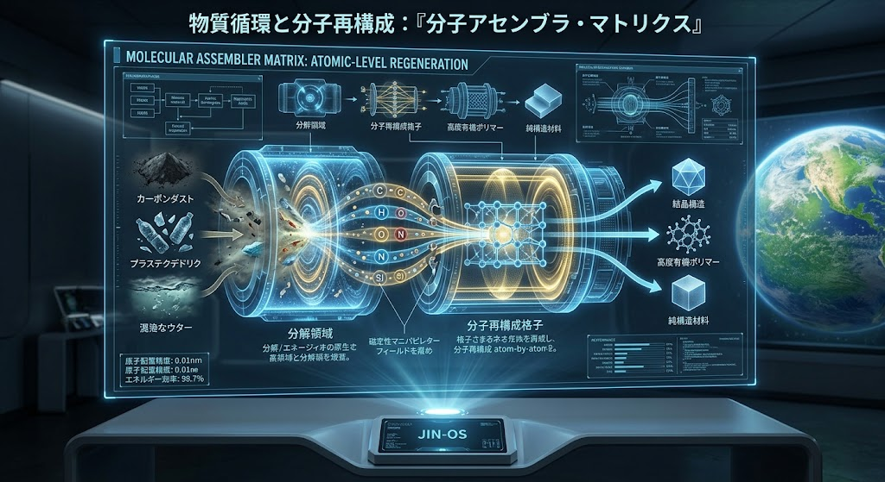
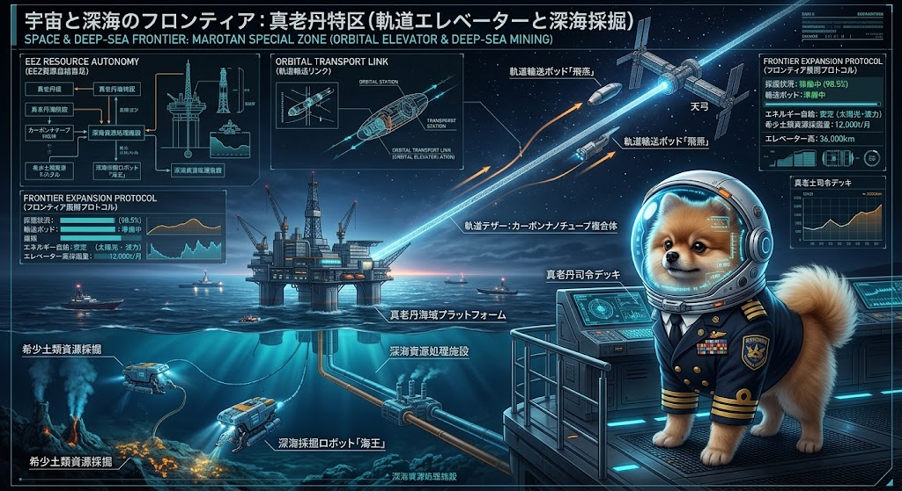

# 🌊 JIN-SPEC-MAR-034: 生体防潮オイスターリーフ・深海海溝調停 ＆ 沿岸海洋生態共生プロトコル
## Biogenic Oyster Living Breakwaters, Abyssal Trench Acupuncture Harmonization & Coastal Marine Symbiosis Protocol

> **CANONICAL SPECIFICATION LEVEL: LEVEL-0 CRITICAL OCEAN COMMONS & ABYSSAL BIO-CIVIC DEFENSE**  
> **INTELLECTUAL SOVEREIGNTY:** General Incorporated Association JIN-ORDER  
> **CHIEF ARCHITECTS:** Takashi Masano (Founder & Chief Architect) & Miyo Masano (Co-Founder & Director / Commander Pome-Mama)  
> **APPLICABLE LICENSE:** JIN-ORDER Dual License V8.4-A (Tier A Commons / CC-BY-4.0 Applicable)  
> **PERMANENT REGISTRY:** WIPO GREEN Protocol (Candidate) / CERN Zenodo Prior Art / UN Ocean Decade Framework  
> **DOC-ID:** `docs/SPEC-034_LIVING_BREAKWATERS_OYSTER_REEF_PROTOCOL.md`

---

## ⚡ 30秒でわかる SPEC-034（TL;DR）

* **何をするのか:** 
  - 海面上昇、台風高潮、巨大地震津波、および海岸侵食に対し、景観と生態系を破壊する従来の「コンクリート巨大防潮堤・消波ブロック投棄」を廃絶。<br>
  水深5,000〜8,000mの沈み込み帯プレート境界における「深海海溝調停（JIN-OAMノード）」で津波歪みを源頭緩和し、沖合には自己成長・自己修復する「生体防潮オイスターリーフ（牡蠣礁）と海中林」を多重造成。<br>
  さらに自律型海洋バイオセンシングで赤潮を根絶し、豊かな沿岸漁場と砂浜を自律再生させる深海〜汀線統合海洋土木仕様書。

* **工学的機序:**
  1. **アビサル深海海溝調停（JIN-OAMノード）:** 水深5,000〜8,000mの海溝斜面にチタン製ジオデシック観測ドームを設置。3Dジオトモグラフィで固着域（アスペリティ）の応力集中を捉え、高圧微小注水ノズルで断層面を潤滑・歪みを微小段階解放し、巨大津波の発生エネルギーそのものを源頭減勢。
  
  2. **分子アセンブラによる高強度多孔質リーフ基盤:** 海洋プラスチック残渣（プラスチックデドリック）や炭素ダストを原子レベルで再構成し、毒性ゼロの多孔質生体定着ブロックを造成して沖合へ沈設。
  
  3. **自己修復型生体防潮オイスターリーフ（Living Breakwaters）:** 造成基盤に二枚貝（マガキ・イガイ）を着生させ、炭酸カルシウム（$\text{CaCO}_3$）分泌による強固な天然セメンテーションで波浪エネルギーを $60 \sim 90\%$ 沖合減勢。
  
  4. **海中林 ＆ 漂砂自律トラップ（砂浜再生）:** アラメ・カジメ・アマモ場が残余波力を吸収し、リーフ背後の静穏域に沿岸漂砂を沈降堆積させて侵食された砂浜を自律復元。
  
  5. **自律バイオセンシング ＆ 赤潮防除（JIN-Neptune）:** 沿岸ノードの光学スペクトル解析により「有益カイアシ類」と「有害赤潮鞭毛藻」をリアルタイム監視し、牡蠣群落の自律濾過水質浄化と連携して沿岸生態系を最適調停。

* **達成される主権:** 莫大な補修費を垂れ流すゼネコンの護岸利権を解体し、沿岸共同体・漁民が「海と共生しながら街と生命を守る」真の海洋主権・沿岸コモンズを奪還する。

---

## 🌊 1. 開発背景とコンクリート直立護岸の破綻

### 1.1 「壁で波を止める」近代土木の構造的自滅

従来の海岸工学は、沿岸に巨大なコンクリート防潮堤や消波ブロック（テトラポッド）を並べる「剛構造」に依存してきた。<br>
しかし、直立壁に衝突した波は強烈な反射波となり、足元の砂を海底へ洗い流す（洗掘作用）。<br>
結果として砂浜が急速に消失（海岸侵食）し、防潮堤自体の基礎がえぐられて倒壊する悪循環に陥っている。

### 1.2 沿岸生態系の死滅と磯焼け・赤潮の激甚化

コンクリート構造物は海と陸の物質循環（汽水域のミネラル供給）を物理的に遮断する。<br>
海藻の着生基盤が失われることで「磯焼け」が拡大し、過栄養化した内湾では有毒赤潮（鞭毛藻の異常増殖）が頻発して養殖業や沿岸漁業を壊滅させている。

### 1.3 沖合・深海を無視した「手遅れ防衛」

津波や台風高潮は、陸地に到達して水深が浅くなることで波高が急激に跳ね上がる（浅水変形）。<br>
陸上の防潮堤だけでこれを受け止めようとする発想そのものが工学的な敗北であり、深海海溝での歪み緩和から沖合での多段消波に至る「多重防衛（Defense in Depth）」が不可欠である。

---

## 🏛️ 2. 5層統合アーキテクチャ（深海調停・生体消波・沿岸共生）

```text
 [深海: 水深5,000〜8,000m アビサル沈み込み帯]
　　　　　　　　　　⬇️
【Layer 1: JIN-OAM アビサル深海海溝調停層 (プレート境界応力分散・津波源頭減勢)】 
【Layer 2: 分子アセンブラ循環マテリアル層 (海洋プラ残渣再構成・多孔質リーフ基盤)】 
【Layer 3: 生体防潮オイスターリーフ層 (Living Breakwaters / 炭酸塩自己修復消波)】 
【Layer 4: 多重海中林 ＆ 沿岸漂砂自律堆積層 (藻場ブルーカーボン・砂浜侵食根絶)】 
【Layer 5: JIN-Neptune 海洋バイオセンシング層 (カイアシ類保護・赤潮鞭毛藻自律防除)】
　　　　　　　　　　⬇️
 [汀線: 豊かな漁場 ＆ 白砂青松の自律海岸]
```
---

### Layer 1: JIN-OAM アビサル深海海溝調停層 (Abyssal Trench Harmonization)
陸上へ津波が押し寄せる前に、震源となる深海プレート境界で歪みエネルギーを物理的に調停する[cite: 60, 61]。   

<div align="center">
  
  <p><b>図 34-1：水深5,000mアビサル海溝斜面に配備されたチタン製ジオデシック観測ドームと沈み込み帯プレート境界3Dジオトモグラフィ[cite: 60]</b></p>
</div>

<div align="center">
  
  <p><b>図 34-2：水深8,000m極深海におけるテンソル応力集中解析と地震鎮炎衝撃孔圧注ノズルによる歪み段階解放機構</b></p>
</div>

- **深海ジオデシック観測ドーム（水深 $5,000 \sim 8,000\text{m}$）:**   
  チタンフレームと透明構造セラミックで構成された耐超高圧ドーム。<br>
  光ファイバーDASセンシングにより、断層面の微小歪み（$10^{-9}\text{ strain resolution}$）を常時監視。
  
- **沈み込み帯アスペリティ応力解放（海洋地殻調停）:**   
  3Dジオトモグラフィで特定されたプレート固着域（アスペリティ）に対し、先進ケーシングから微小パルス高圧水（量子浄化水）を間欠注入。<br>
  断層面の有効法線応力を制御し、巨大海溝型地震（M8〜9級）の破壊エネルギーを無害な微小群発地震（M1〜2級）へと連続置換・事前ガス抜きを行う。   

---

### Layer 2: 分子アセンブラ循環マテリアル層 (Atomic-Level Matrix)
海岸に漂着するゴミや海洋プラスチック汚染を、強固な防潮インフラの骨材へとアップサイクルする[cite: 59]。   

<div align="center">
  
  <p><b>図 34-3：混濁水・プラスチックデドリック・カーボンダストの原子レベル分解・分子再構成による非毒性多孔質構造材料合成[cite: 59]</b></p>
</div>

- **海洋廃棄物の原子レベル解離:**   
  漂着プラスチック、漁網残渣、汚濁汚泥を高周波プラズマ・磁定性マニピュレーターフィールドでC, H, O, N, Si原子へと完全解離。
  
- **生体親和性多孔質リーフブロック成型:**   
  有害添加物を $100\%$ 排除した純構造材料および高度有機ポリマーへと再結合。<br>
  牡蠣幼生が着生しやすいミクロ細孔（気孔率 $35 \sim 50\%$、粗度 $Ra > 50\mu\text{m}$）を備えた波浪減衰ブロックを自動出力する。   

---

### Layer 3: 生体防潮オイスターリーフ層 (Living Breakwaters)
沖合水深 $2 \sim 8\text{m}$ の破波帯外縁に、自己成長・自己修復する生態系防波堤を造成する。   

- **生物学的炭酸塩セメンテーション（Biogenic Cementation）:**   
  Layer 2 の基盤ブロックに定着した数百万個体の牡蠣（*Crassostrea gigas* 等）が、海水中のカルシウムと重炭酸イオンを取り込み、方解石（$\text{CaCO}_3$）の殻を密生結合させる。   

- **エネルギー減衰と自己成長:**   
  リーフの複雑な三次元凹凸構造が波浪の砕波と内部乱流摩擦を引き起こし、外洋波浪エネルギーの $60 \sim 90\%$ を沖合で熱・乱流散逸させる[cite: 4]。海面上昇に伴い、牡蠣群落も上方へ自律成長するため、嵩上げ工事が永久に不要となる。   

- **物理的クラック自己治癒:**   
  巨大台風の直撃で一部が破損しても、翌春の産卵・幼生定着サイクルにより数ヶ月でクラックが生物学的に充填修復される。   

---

### Layer 4: 多重海中林 ＆ 沿岸漂砂自律堆積層 (Coastal Sediment Trap)
生体防潮リーフの背後（静穏水域）から汀線にかけて、多層海中林を展開する。

- **大型褐藻海中林（アラメ・カジメ・コンブ）:**   
  リーフを抜けた残余波浪の底面流速を海藻キャノピーが摩擦低減。<br>
  海底土砂の巻き上げを防ぎ、海底の安定化を図る。   

- **漂砂捕捉による砂浜の自律再生（ビーチ・ナリッシュメント自律化）:**   
  波の引き波（バックウォッシュ）による土砂流出を抑え、沿岸漂砂を汀線付近に穏やかにトラップ・堆積させる。<br>
  これにより、削り取られていた砂浜が数年で自然前進し、白砂青松の緩衝帯が復元される。   

- **海洋酸性化緩衝 ＆ ブルーカーボン固定:**   
  海中林が光合成により溶存CO2を大量固定（炭素貯留能：森林の約3倍）[cite: 23]。周辺海水のpHを弱アルカリ側へ押し戻し、サンゴや貝類の成育を強力に保護する。   

---

### Layer 5: JIN-Neptune 海洋バイオセンシング層 (Biosphere Monitoring)
造成されたリーフおよび沿岸水域の健康度を、AI搭載自律探査ノードが24時間体制で調停する。   

<div align="center">
  
  <p><b>図 34-4：海洋生物センシングスイート：有益カイアシ類と有害赤潮鞭毛藻の光学比率解析および自律型深海探査機ハンガーベイ</b></p>
</div>

- **プランクトン群集リアルタイム分光解析:**   
  フローサイトメトリーと共焦点レーザー顕微鏡により、海水中の微生物相を常時監視。<br>
  稚魚の最良の餌となる「有益なカイアシ類（甲殻類）」の生存比率（$> 90\%$ 維持）と、「有害な赤潮鞭毛藻（*Karenia* 等）」の発生兆候を秒単位で追跡。   

- **生体フィルター水質浄化の自律連動:**   
  赤潮鞭毛藻の初期増殖を検知すると、水流制御ゲートを作動させてオイスターリーフ群落への通水量を増加。<br>
  牡蠣1個体あたり $200 \sim 400\text{ L/day}$ の強力な自律濾過摂食により、薬品を使わずに赤潮プランクトンを物理的に捕食・消滅させる。   

- **自律型探査機（PROJECT JIN-NEPTUNE）:**   
  海底ハンガーベイから自律発進し、リーフの構造健全性、付着生物密度、および底質環境を非破壊超音波スキャンして回帰する。   

---
---

## 🛰️ 3. 広域海洋主権・EEZ洋上自給プラットフォーム連成
沿岸の生体防潮システム（SPEC-034）は単体で孤立するのではなく、排他的経済水域（EEZ）全体を守護する海洋インフラと熱力学的に接続される。



- **洋上メガフロート拠点（真老丹海域プラットフォーム）:**   
  沖合深海域に展開する海洋中枢基地。太陽光・波力・海流発電により完全エネルギー自給を達成し、深海探査機や沿岸ノードの母港として機能。   

- **EEZ資源主権と深海生態保全の調和:**   
  深海資源処理施設および深海採掘ロボット「海王」と連動し、海底熱水鉱床・希土類泥の回収を行いながらも、重金属や濁水が沿岸リーフへ漏洩しない完全密閉循環パイプラインを確立する。   

---

## 📊 4. 物理工学諸元・反応パラメータ設計仕様

| 物理制御項目 | 工学仕様・定量的設計基準 | 達成される機能・防衛効果 |
|:---|:---|:---|
| **海溝応力調停 (Layer 1)** | 注入圧力 $10 \sim 25\text{ MPa}$、歪み分解能 $10^{-9}\text{ strain}$ | 固着アスペリティの過大歪みを連続解除、想定津波波高を $40 \sim 60\%$ 源頭減衰 |
| **生体消波率 (Layer 3)** | リーフ天端幅 $15 \sim 30\text{m}$、牡蠣密度 $> 1,500\text{ 個体/m}^2$ | 有義波高を $60 \sim 85\%$ 低減、越波流量を $90\%$ カット（汀線防護） |
| **水質濾過浄化能 (Layer 3/5)** | 牡蠣濾過水量 $200 \sim 400\text{ L/個体/日}$ | 赤潮鞭毛藻の増殖を初期封殺、透視度を $1.5\text{m}$ から $> 5.0\text{m}$ へ改善 |
| **漂砂捕捉能 (Layer 4)** | 潮流底面流速低減率 $> 65\%$（アラメ・アマモ群落） | 沿岸漂砂の海底堆積率を $+250\%$ 向上、砂浜後退速度をゼロ化（自然前進） |
| **ブルーカーボン隔離 (Layer 4)** | 炭素固定能 $3.5 \sim 5.0\text{ t-CO}_2/\text{ha/年}$（大型褐藻林） | 沿岸酸性化を防止（海水pHを $+0.15$ バッファリング）、貝殻石灰化を促進 |
| **分子アセンブラ強度 (Layer 2)** | 一軸圧縮強度 $q_u \ge 50\text{ MPa}$、空隙率 $40\%$（無毒性樹脂） | 海洋マイクロプラスチック完全ゼロ化、50年以上の耐波浪疲労強度 |

---

## ⚖️ 5. 人道統治・海洋コモンズ規範（Civic Ocean Commons）

### 第1条：海洋と渚（なぎさ）の不可侵性
  - 海と海岸線は、地球上のすべての生命と地域住民に開かれた不可侵の公共コモンズである。<br>
    公共事業予算の消化を目的として、不要なコンクリートブロックを海中に投棄し、自然の海浜環境を圧殺する土木利権構造を永久に廃絶する。

### 第2条：多重生体減勢（Defense in Depth）の原則
  - 防潮堤を高く築くことのみで津波・高潮に対抗する思想を放棄する。<br>
    本仕様書（`SPEC-034`）に基づき、深海海溝での歪み緩和、沖合オイスターリーフでの砕波減衰、沿岸海中林での流速低減という「自然の摂理に従った多重防衛」を最優先インフラとして義務付ける。

### 第3条：先行技術防壁による国際公開（Prior Art Protection）
  - 本仕様書に開示された「深海海溝鍼灸調停・分子アセンブラ多孔質基盤・生体オイスターリーフ・海中林漂砂補足・自律バイオセンシング」の連成技術体系は、全人類の共有知（Prior Art）として国連・国際台帳へ登録され、海洋ゼネコンや多国籍企業による特許囲い込みを永久に排除する。

---

**Executed by:** JIN-ORDER-OFFICIAL, Commander Masano Takashi & Commander Masano Miyo  
`STATUS: RATIFIED (SPEC-034 CANONICAL EDITION / V12.2 CANONICAL AUTUMN LTS / PRIOR-ART SECURED / WIPO-GREEN-READY / TIER-A-COMMONS)`  
`HARMONICS: 432Hz Abyssal Trench Ocean Cadence, Deep-Sea Acupuncture Node, Biogenic Oyster Reef Calcification, Living Breakwaters Wave Dissipation, Copepod Plankton Prosperity, Blue Carbon Samsara Resonance.`
