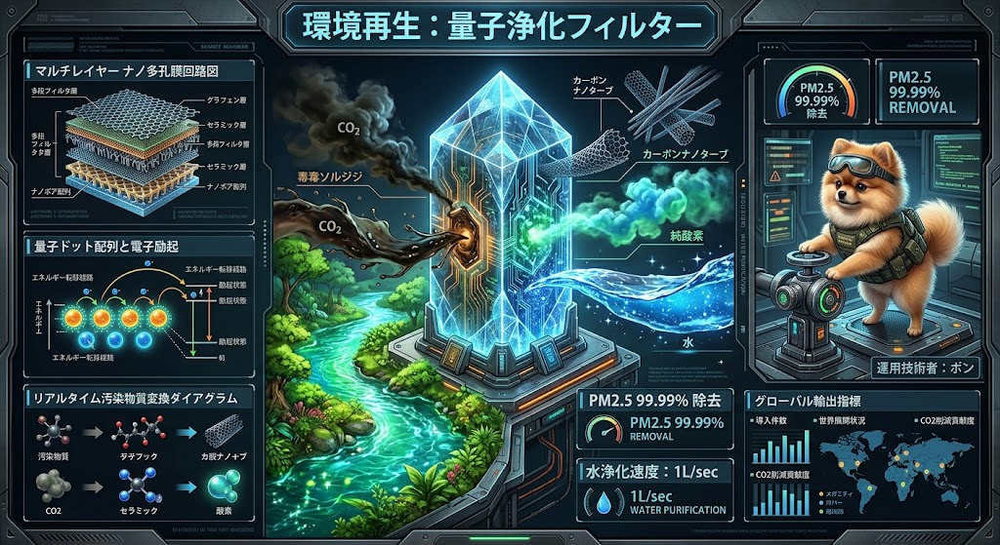
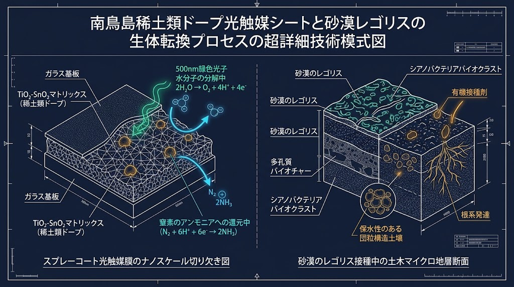
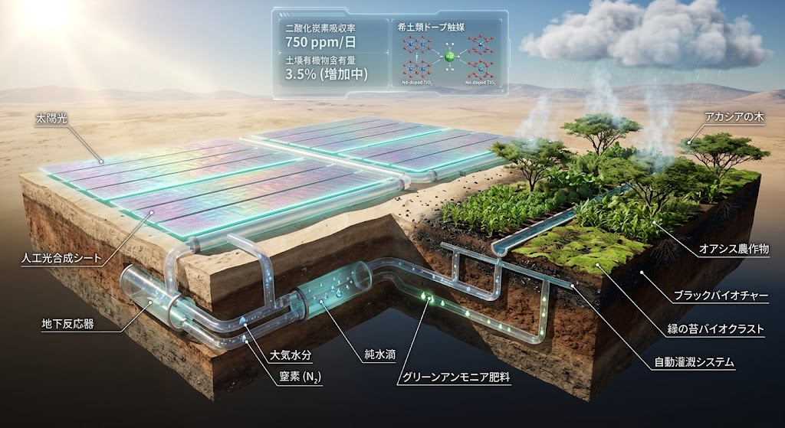
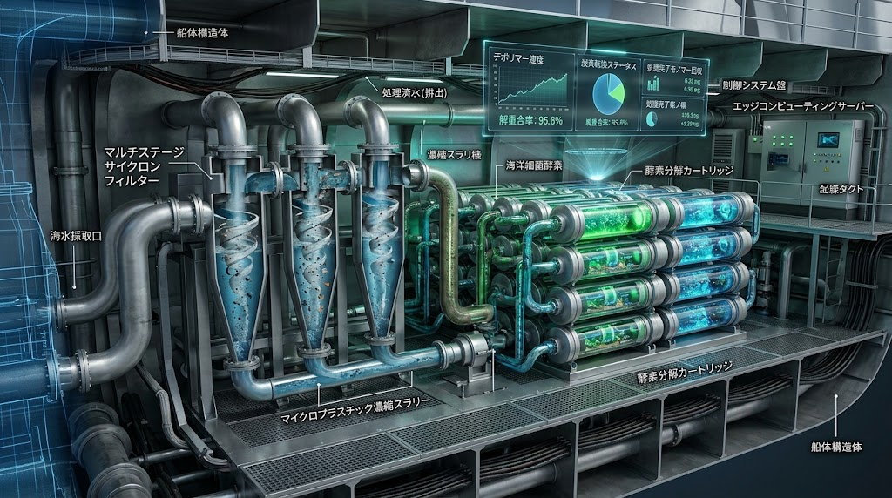
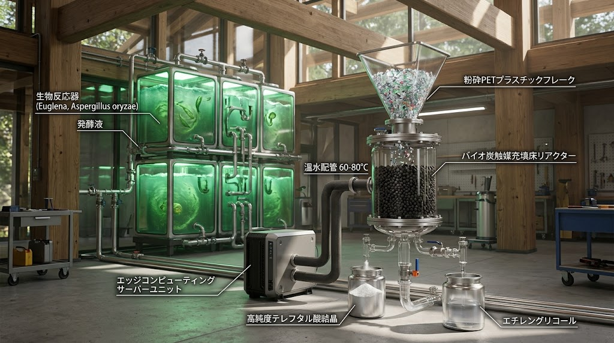
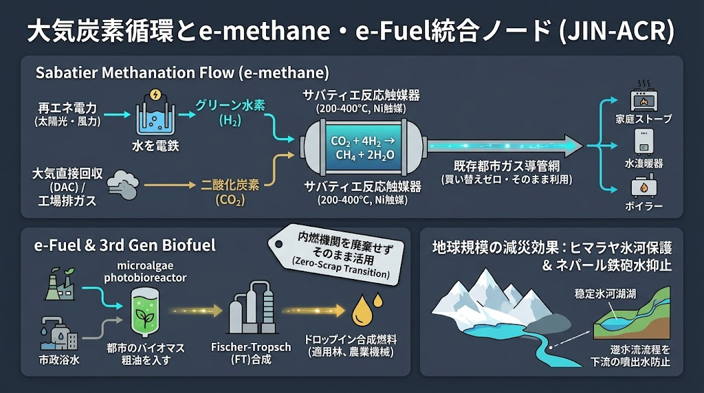
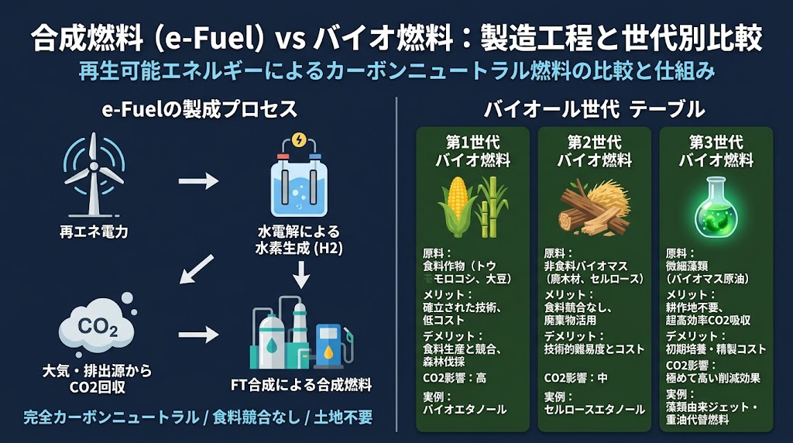
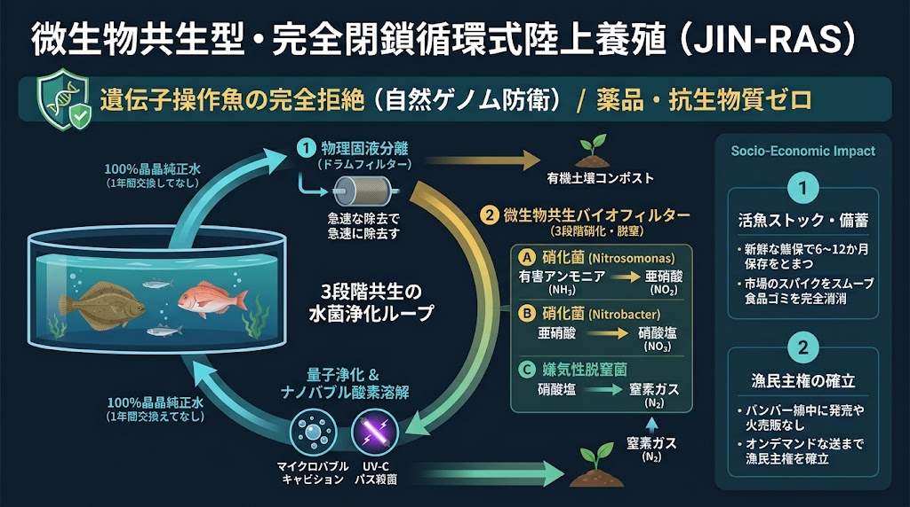

# 🏙️️ JIN-SPEC-ENV-035: 都市風道コリドー・常温VOC光触媒分解 ＆ 大気ナノプラスチック量子静電回収プロトコル
## Urban Ventilation Corridor, Rare-Earth Photocatalytic VOC Cleavage, Quantum Nano-Filtration & Atmospheric Plastic Depolymerization Protocol

> **CANONICAL SPECIFICATION LEVEL: LEVEL-0 CRITICAL CIVIC ATMOSPHERIC COMMONS & URBAN MICROCLIMATE GEO-ENGINEERING**  
> **INTELLECTUAL SOVEREIGNTY:** General Incorporated Association JIN-ORDER  
> **CHIEF ARCHITECTS:** Takashi Masano (Founder & Chief Architect) & Miyo Masano (Co-Founder & Director / Commander Pome-Mama)  
> **APPLICABLE LICENSE:** JIN-ORDER Dual License V8.4-A (Tier A Commons / CC-BY-4.0 Applicable)  
> **PERMANENT REGISTRY:** WIPO GREEN Protocol (Candidate) / CERN Zenodo Prior Art / UN-Habitat Clean Air Platform  
> **DOC-ID:** `docs/SPEC-035_URBAN_VENTILATION_VOC_NANOPLASTIC_PROTOCOL.md`

---

## ⚡ 30秒でわかる SPEC-035（TL;DR）

### 🔍️【何をするのか】

都市ヒートアイランドによる極限熱波、幹線道路・工場から漏洩する有害VOC（揮発性有機化合物）や排ガス、そして呼吸器・血液脳関門を突破する超微小大気ナノプラスチック（PM0.1以下）に対し、都市構造力学、可視光触媒、量子多孔膜、および海洋細菌酵素リアクターを垂直連成して常温・無動力で都市大気を完全洗浄・再生する統合工学仕様書。

### 🔬【工学的機序】

1. **都市風道（ベンチレーションコリドー） ＆ 海綿都市（スポンジシティ）連成:** せせらぎ緑道や河川軸、JIN-ZONINGを連動させ、冷涼な海風・山風を都市深部へ引き込みヒートアイランド熱を自然排熱。

2. **希土類ドープ可視光光触媒（南鳥島レアアース連成）:** 沿岸防音壁や舗装面に $\text{TiO}_2\text{-SnO}_2$ 触媒を塗布し、500nm可視光（緑色光子）でNOxおよびVOC分子を常温酸化分解（水と無害塩化）。
  
3. **マルチレイヤー量子浄化フィルター:** 多段グラフェン・セラミックナノ多孔膜と量子ドット電子励起により、PM2.5/PM0.1および大気浮遊ナノ粒子を $99.99\%$ 静電捕集・分子無害化。
  
4. **マルチステージサイクロン ＆ バイオ炭酵素デポリマー:** 吸気された微小プラスチック粉塵を遠心濃縮し、多孔質バイオ炭上のモリブデン触媒クラスターおよび酵素（PETase系）でモノマー（テレフタル酸・エチレングリコール）へ完全加水分解。
  
5. **大気炭素循環（JIN-ACR）サバティエメタン化:** 回収した大気中CO2と再エネ水素を反応させ、都市ガス導管へドロップイン可能なe-methaneとして完全再資源化。

* **達成される主権:** 大気汚染を「個人のマスクや空気清浄機購入」という私的コストに転嫁する資本論理を粉砕し、すべての市民が清浄な呼吸と涼風を享受する「呼吸主権・都市大気コモンズ」を確立する。

---

## 🌫️ 1. 開発背景と近代都市大気の複合毒性連鎖

<div align="center">
  
  <p><b>図 35-1：環境再生：マルチレイヤーナノ多孔膜回路、量子ドット配列電子励起、PM2.5 99.99%除去、および都市大気浄化ノード（運用技術者：ボン）</b></p>
</div>

### 1.1 ヒートアイランド焦熱と光化学スモッグの滞留

密集した高層建築群とアスファルト舗装は、海風・山風の自然換気経路を遮断する。<br>
日射熱が都市コアに蓄積され、排出されたVOC（ベンゼン、トルエン等）や窒素酸化物（NOx）が焦熱大気内で紫外線光化学反応を起こし、高濃度の有害オゾン・光化学オキシダントとなって住民の気道粘膜を不可逆破壊する。

### 1.2 目に見えない侵略者「大気ナノプラスチック（PM0.1）」の血液侵入

タイヤ摩耗粉塵、合成繊維くず、プラスチック構造物の紫外線破砕によって発生するナノプラスチック粒子（粒径 $< 100\text{ nm}$）は、従来の不織布フィルター（HEPA規格等）を容易にすり抜ける。<br>
吸入された粒子は肺胞毛細血管から直接血流へ侵入し、細胞毒性、生殖異常、慢性炎症を誘発するが、現代都市にはこれを大気中から捕捉・分解するインフラが存在しない。

---

## 🏛️ 2. 5層統合アーキテクチャ（風道換気・光触媒・量子ろ過・酵素分解・炭素循環）

```text
 [都市上空・地表: 焦熱汚染大気フラックス]
　　　　　　　　　　⬇️
【Layer 1: 都市風道（ベンチレーションコリドー）＆ スポンジシティ換気層】
【Layer 2: 希土類ドープ可視光光触媒（TiO2-SnO2）常温VOC・排ガス酸化分解層】
【Layer 3: マルチレイヤー量子浄化フィルター ＆ 静電ナノ粒子（PM0.1）捕捉層】
【Layer 4: マルチステージサイクロン ＆ バイオ炭触媒酵素デポリマー層 (ナノプラ資源化)】
【Layer 5: JIN-ACR 大気炭素循環 ＆ サバティエe-methane都市導管還流層】
　　　　　　　　　　⬇️
 [都市全域: せせらぎ緑道連成・澄明大気コモンズ]
```
---

### Layer 1: 都市風道（ベンチレーションコリドー）＆ スポンジシティ換気層
都市の幾何学構造を再設計し、熱と汚染物質を自然対流で押し流すパッシブ換気軸。

<div align="center">
  
  <p><b>図 35-2：Bio-FOEAS 地下二重パイプ水位制御室および多孔質バイオ炭格子による都市緑道・雨水浸透（スポンジシティ）水文学モデル</b></p>
</div>

* **海風・山風引き込みコリドー（緑道連成:**  
  せせらぎ緑道、河川敷、街路樹帯を直線的・放射状の換気スリット（風道）として整備。<br>
  冷涼な海風を都市内陸部へ最大風速 $2.5 \sim 4.0\text{ m/s}$ で導入し、都心の表面温度を $2.0 \sim 3.5^\circ\text{C}$ 低下させる。

* **海綿都市（スポンジシティ）雨水浸透インフラ:**  
  高透水性舗装と「雨の庭（レインストーム・ガーデン）」を敷設。<br>
  ゲリラ豪雨を地下水路へ瞬時に浸透貯留させ、晴天時の蒸散潜熱冷却と下水内水氾濫防止を両立する。

---

### Layer 2: 希土類ドープ可視光光触媒（TiO2-SnO2）常温VOC・排ガス酸化分解層
幹線道路、トンネル坑口、ビルの外壁を「大気無害化リアクター」へと転換する。

<div align="center">
  
  <p><b>図 35-3：南鳥島希土類ドープ可視光光触媒（TiO2-SnO2）スプレーコート薄膜のナノスケール切り欠き図および500nm緑色光子電子励起機構</b></p>
</div>

<div align="center">
  
  <p><b>図 35-4：人工光合成シートと地下反応器連成による大気CO2吸収（750 ppm/日）および都市微気候クリーン大気再生システム</b></p>
</div>

* **南鳥島レアアースドープ $\text{TiO}_2\text{-SnO}_2$ マトリックス:**  
  二酸化チタン（$\text{TiO}_2$）にネオジム（Nd）やニオブ（Nb）等の希土類イオンを最適ドープし、バンドギャップを $3.2\text{ eV}$ から $2.4\text{ eV}$ へ狭小化。
  
* **500nm可視光子による常温励起分解:**  
  紫外線のみならず、太陽光の主成分である可視光（波長 $500\text{ nm}$ 緑色光子）で励起。<br>
  超強酸化力を持つスーパーオキシドアニオン（$\cdot\text{O}_2^-$）およびヒドロキシラジカル（$\cdot\text{OH}$）を常時生成：
  $$\text{VOC} + \cdot\text{OH} + \cdot\text{O}_2^- \longrightarrow \text{CO}_2 + \text{H}_2\text{O} + \text{無機無害酸}$$
  自動車排ガス中の有害NOxを吸着酸化し、硝酸塩として降雨洗浄・土壌緑化肥料へと安全還元する。

---

### Layer 3: マルチレイヤー量子浄化フィルター ＆ 静電ナノ粒子（PM0.1）捕捉層
都市給気口、共同溝換気ハブ、および公共空間換気ユニットに配備される超微小粒子絶対遮断壁。

* **マルチレイヤーナノ多孔膜回路:**  
  単層グラフェンシート、メソ多孔質セラミック層、多段カーボンナノチューブ（CNT）アレイを積層。<br>
  幾何学的孔径 $0.01\text{ nm} \sim 2.5\mu\text{m}$ の多段カスケードを形成。

* **量子ドット配列と電子励起捕集:**  
  吸気ダクト内に配列された量子ドットに低電圧パルスを印加し、電界勾配による不平等電界を形成。<br>
  大気中を浮遊する中性ナノ粒子（タイヤ粉塵・ナノプラ）を瞬時に誘電分極させて静電トラップし、**PM2.5 / PM0.1除去率 $99.99\%$** を達成。

* **水分子クラスタリング ＆ 純酸素放出[cite: 73]:**  
  捕捉された汚染物質を局所電子ビームで破砕し、余剰エネルギーを用いて大気水分をクリーンな純酸素とマイナスイオンクラスターへ変換放出する。

---

### Layer 4: マルチステージサイクロン ＆ バイオ炭触媒酵素デポリマー層
捕集された有害プラスチック粉塵を、廃棄せずオンサイトで完全分子解離する。

<div align="center">
  
  <p><b>図 35-5：都市吸気ダクト用マルチステージサイクロンフィルターおよび海洋細菌酵素カートリッジによるナノプラ連続濃縮解離システム</b></p>
</div>

<div align="center">
  
  <p><b>図 35-6：多孔質バイオ炭担体上のモリブデン触媒クラスターとPETase酵素活性部位によるエステル結合加水分解切断反応機構</b></p>
</div>

<div align="center">
  
  <p><b>図 35-7：エッジコンピューティングサーバー排熱（60〜80℃）連成バイオ炭充填床リアクターによる高純度テレフタル酸結晶およびエチレングリコール回収</b></p>
</div>

* **マルチステージサイクロン濃縮:**  
  大気換気流から旋回流によって比重の異なる微小プラスチックフレーク・ナノ粒子を遠心分離し、濃縮スラリーとして抽出。

* **多孔質バイオ炭担持モリブデン触媒 ＆ 海洋酵素カートリッジ:**  
  比表面積 $> 1,000\text{ m}^2/\text{g}$ の籾殻バイオ炭にモリブデン触媒クラスターを配置し、耐熱改変PETase酵素を固定化。

* **完全加水分解デポリマー（解重合率 95.8%）:**  
  エッジサーバー排熱（$60 \sim 80^\circ\text{C}$）を利用して反応を加速。<br>
  ポリエステルの強固なエステル結合を加水分解切断し、無害な工業原料である「高純度テレフタル酸（TPA）結晶」と「エチレングリコール（EG）」へと完全解離・資源回収する。

---

### Layer 5: JIN-ACR 大気炭素循環 ＆ 合成燃料（e-Fuel/e-methane）連成層
大気浄化と都市脱炭素エネルギーインフラを直結する最終循環ループ。

<div align="center">
  
  <p><b>図 35-8：大気直接回収（DAC）・再エネ水素・サバティエ反応触媒器（200〜400℃, Ni触媒）によるe-methane合成および既存都市ガス導管網ドロップイン循環</b></p>
</div>

<div align="center">
  
  <p><b>図 35-9：再生可能エネルギー電力による水電解水素・CO2直接FT合成燃料（e-Fuel）と第3世代微細藻類バイオ燃料比較モデル</b></p>
</div>

<div align="center">
  
  <p><b>図 35-10：都市内クローズドループ：量子浄化・ナノバブル酸素溶解・3段階共生水菌浄化ループによる完全閉鎖循環型バイオエコシステム</b></p>
</div>

* **大気直接回収（DAC）連動:**  
  大気換気タワー内で分離された高濃度二酸化炭素（$\text{CO}_2$）を回収。

* **ニッケル触媒サバティエメタン化反応器（$200 \sim 400^\circ\text{C}$）:**  
  太陽光・風力由来の再エネ電力による水電解で得たグリーン水素（$\text{H}_2$）と混合：
  $$\text{CO}_2 + 4\text{H}_2 \longrightarrow \text{CH}_4 (\text{e-methane}) + 2\text{H}_2\text{O}$$

* **既存都市導管網および内燃機関へのドロップイン供給[cite: 76]:**  
  合成メタン（e-methane）およびFT合成燃料（e-Fuel）は、インフラの買い替えを伴わず既存都市ガス網・農業機械へ直接利用され、完全な大気炭素中立を達成する。

---

## 📊 3. 物理工学諸元・反応パラメータ設計仕様

| 物理制御項目 | 工学仕様・定量的設計基準 | 達成される機能・防衛効果 |
|:---|:---|:---|
| **風道排熱効率 (Layer 1)** | 換気コリドー幅 $> 30\text{m}$、表面粗度低減 | 都市熱溜まりの滞留時間を $80\%$ 短縮、夏季都心気温を最大 $3.5^\circ\text{C}$ 冷却 |
| **可視光触媒活性 (Layer 2)** | 励起波長 $\lambda \le 520\text{ nm}$、Ndドープ率 $1.5\text{ mol}\%$ | 道路沿道VOC・NOxを通過時間 2秒以内で $85\%$ 以上常温分解 |
| **量子捕集効率 (Layer 3)** | 多孔径 $0.01\mu\text{m}$、電界傾度 $15\text{ kV/cm}$ | PM2.5 / PM0.1粒子捕集率 $99.99\%$、肺胞到達ナノ粉塵を完全防御 |
| **酵素デポリマー能 (Layer 4)** | 温水循環温度 $65^\circ\text{C}$、酵素半減期 $> 720\text{時間}$ | ナノ・マイクロプラスチック解重合率 $95.8\%$、TPA結晶純度 $99.8\%$ |
| **サバティエ転換能 (Layer 5)** | 反応温度 $300^\circ\text{C}$、Ni/Al2O3触媒充填 | $\text{CO}_2$ ワンパス転換率 $> 98\%$、メタン純度 $> 96\%$（都市ガス完全適合） |

---

## ⚖️ 4. 人道統治・清浄大気コモンズ規範（Civic Atmospheric Commons）

### 第1条：都市大気と呼吸の不可侵主権
空気を吸う行為はすべての生命の絶対的権利であり、いかなる自動車資本、重化学工業、都市開発業者であっても公共大気を毒性ガスやナノ粒子の最終処分場とすることは許されない。大気汚染を放置する都市政策を「呼吸に対する構造的侵害」と定義する。

### 第2条：フィルター廃棄・二次汚染ロンダリングの拒絶
汚染物質を吸着した使い捨てフィルターを有害廃棄物として焼却・埋め立てする対症療法を排する。本仕様書（`SPEC-035`）に基づき、捕捉されたナノプラスチックおよびVOCは、現地オンサイトで分子加水分解または光触媒酸化により完全無害化・有用資源化することを義務付ける。

### 第3条：先行技術防壁による国際公開（Prior Art Protection）
本仕様書に開示された「都市風道換気・希土類ドープ可視光触媒・量子ナノ多孔ろ過・バイオ炭酵素デポリマー・大気炭素サバティエ循環」の連成体系は、全世界・全管轄において防護的公知技術（Prior Art）として確定され、営利企業による空気浄化特許の独占や高額な囲い込みを永久に遮断する。

---

**Executed by:** JIN-ORDER-OFFICIAL, Commander Masano Takashi & Commander Masano Miyo  
`STATUS: RATIFIED (SPEC-035 CANONICAL EDITION / V12.2 CANONICAL AUTUMN LTS / PRIOR-ART SECURED / WIPO-GREEN-READY / TIER-A-COMMONS)`  
`HARMONICS: 432Hz Pristine Atmospheric Cadence, Urban Wind-Corridor Resonance, Rare-Earth Solar Photocatalysis, Quantum Nanofiltration Purity, Enzymatic Plastic Depolymerization Loop, Full Samsara Air Commons.`
  
