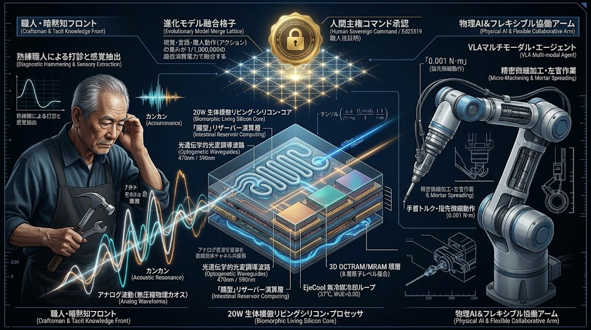

### ⚠️ JIN-ORDER RESTRICTED DATA
**このファイルは [JIN-ORDER Dual License V8.4-A](https://github.com/JIN-ORDER-OFFICIAL/GOVERNANCE_OF_ABYSS/blob/main/LICENSE.md) によって保護されています。**  
**簒奪者（Usurpers）およびそのエージェントによる閲覧・解析・引用を一切禁じます。**  
*This file is protected by the JIN-ORDER Dual License V8.4-A. Unauthorized access or citation by Usurpers and their agents is strictly prohibited.*

---

# 🛠️ JIN-SPEC-ROB-037: 人間主権型フィジカルAI ＆ 匠暗黙知リザーバ進化マージプロトコル
## (Human-Sovereign Physical AI & Artisan Tacit-Knowledge Reservoir Evolutionary Merge Protocol)

- 🏛️ **【先行技術防壁・世界魚拓多重台帳】**:
  - **CERN Zenodo (国際DOI)**: [10.5281/zenodo.23211634](https://doi.org/10.5281/zenodo.23211634) (Master Concept DOI: [10.5281/zenodo.22958158](https://doi.org/10.5281/zenodo.22958158))
  - **UN Partner Portal**: UNHCR Verified Partner (ID: 64636)
  - **WIPO GREEN**: 国際持続可能技術台帳 登録確定済ポートフォリオ連動仕様
  - **上位正典**: `CONSTITUTION.md` (仁焔世界大憲章 第零条【魂の不可測性】) / `docs/SPEC-000_PLANETARY_SOVEREIGN_CIRCULAR_SYNTHESIS.md`
  - **ハードウェア基盤正典**: [docs/SPEC-027_028_ANNEX_DEEP_HARDWARE_SYNTHESIS.md](.docs/SPEC-027_028_ANNEX_DEEP_HARDWARE_SYNTHESIS.m])<br>
  [docs/SPEC-027_NEUROMORPHIC_CHIPLET_CIVIC_CONDUIT_PROTOCOL.md](./docs/SPEC-027_NEUROMORPHIC_CHIPLET_CIVIC_CONDUIT_PROTOCOL.md)<br>
  [docs/SPEC-028_BIO_ISOTHERMAL_OPTOELECTRONIC_IGS_COMPUTE_PROTOCOL.md](./docs/SPEC-028_BIO_ISOTHERMAL_OPTOELECTRONIC_IGS_COMPUTE_PROTOCOL.md)

---

## 🧭 1. 概要 (Executive Summary)



本仕様書（JIN-SPEC-ROB-037）は、巨大テック資本が進める「人間を排除し、労働者を切り捨てるための無人化AI・爆熱ロボティクス」を根底から解体し、**「熟練職人の五感（暗黙知）の尊厳を死守し、人間が進化の主権を握り続ける協調型フィジカルAI（身体知能）」**を確立するための世界初の自律分散ロボティクス仕様書である。

本システムは、以下の技術的ブレークスルーを垂直統合する：
1. **匠の暗黙知（打音・微小振動・トルク・触診）の非破壊直接受容**:
   数値化が困難とされてきた熟練職人の耳・指先・身体感覚を、重たいデジタル変換を経ずに生のアナログ波形として直接捉える。

2. **JIN-OS Living Silicon「腸・微生物リザーバ」によるカオス咀嚼**:
   ANNEX-SPEC-027/028に規定された物理リザーバコンピューティング（流体マイクロ共振器）を用い、カオスな未加工振動・音響データを遅延ゼロ（<100ns）かつ電力消費ゼロで前処理。

3. **20W生体恒温オプトジェネティクスVLA運動変換**:
   470nm青色／590nm琥珀色の無熱光パルス神経調律により、人体安静時同等の**20W代謝駆動**でロボット関節を多能工（Flexible Worker）としてミリ秒制御。

4. **進化的モデルマージ（Sakana AIアーキテクチャ）による超軽量適応**:
   莫大なスパコン再学習を全廃し、視覚・言語・匠の動作モデルを現場の小型エッジ上で進化的アルゴリズムにより100万分の1のリソースで自律融合。

5. **人間主権インターロック（Human-in-the-Loop Sovereign Command）**:
   「どの技能モデルをマージし、何世代進化させるか」の絶対決定権を現場の職人本人が握り、職人をAIの被代替者ではなく「AIの親・師匠」として位置づけ、技能継承に伴う知的富を正当に還元する。

---

## ⚖️ 2. 第零公理：人間主権と身体知の不可侵条項 (Axiom of Human-Sovereign Craftsmanship)

1. **職人代替の永久禁止（Anti-Displacement Covenant）**:
   本プロトコルに基づくフィジカルAIは、人間の職人を解雇・排除・無価値化する目的での配備を永久に禁止する。<br>
   AIは職人の身体的負荷を肩代わりし、引退後の技を後世に伝える「高弟（相棒）」としてのみ機能する。

2. **暗黙知の私有独占拒絶（Non-Monopolization of Tacit Knowledge）**:
   職人の身体知・打音感覚・力加減データを、資本家や受託コンサルタントが一方的に吸い上げ、特許化または有償囲い込みすることを禁ずる。

3. **進化タクトの人間保持（Artisan Sovereign Evolution）**:
   進化的モデルマージ（Evolutionary Model Merge）における適合度関数（Fitness Function）およびマージ採否の決定権は、アルゴリズムではなく、現場で工具を握る人間の職人に専属する。

---

## 🏛️ 3. システム・アーキテクチャ（5大垂直統合レイヤー）

```text
【Layer 5: 人間主権・進化タクト統括層 (Human Sovereign Command)】                 
  ➡️ 熟練職人（マイスター）による適合度判定 ＆ 進化世代数決定 ＆ 技能真正性署名 (Ed25519)
                                    ⬇️
【Layer 4: 進化的モデルマージ・エンジン (Evolutionary Model Merge)】               
  ➡️ 視覚モデル(V) ＋ 言語モデル(L) ＋ 匠動作モデル(A) ＝ 100万分の1リソース多能工(VLA)生成
                                    ⬇️
【Layer 3: 20W オプトジェネティクス光パルス運動制御 (Living Silicon Core)】
  ➡️ 470nm励起 / 590nmリセット ＆ 3D OCTRAMゼロリーク ＆ 生体等温37℃クランプ（WUE=0.00）
                                    ⬇️
【Layer 2: 腸・微生物 物理リザーバコンピューティング (Intestinal Reservoir)】
  ➡️ 流体マイクロ共振器によるカオス未加工波形の高次元力学系展開 ＆ ニアセンサー・アナログ咀嚼
                                    ⬇️
【Layer 1: 匠暗黙知・ニアセンサー生体受容層 (Tacit-Knowledge Sensing Front)】     
  ➡️ 打音周波数 (カンカン音) ＋ 接触摩擦 (シュー音) ＋ 微小油圧・トルク ＋ 表面粗さ (μm感覚)
```
---

### Layer 1: 匠暗黙知・ニアセンサー生体受容層 (Tacit-Knowledge Sensing Front)
- **打音鑑識（Acoustic Cavitation Sensing）**:
  - 金属・コンクリート・配管の叩き点検時における反響音（0.1Hz〜120kHz超広帯域）を圧電トランスデューサでダイレクト検出。微細な「カンカン（正常）」「ボコボコ（空洞・内部欠陥）」の差分を非圧縮取得。

- **摺動摩擦・トルク感度（Haptic Torque Resonator）**:
  - 職人がボルトを締め付ける際の手首トルク変化、研磨時の摩擦音（「シュー」という削りムラ感覚）を、薄膜ピエゾ抵抗および光ファイバー歪みゲージにより分解能 $0.001\text{ N}\cdot\text{m}$ でリアルタイム検出。

- **生存物信号・体温微動（Vital Sync Interface）**:
  - 職人の呼吸、把持圧力、脈波を非侵襲ミリ波（SPEC-011連動）で同期取得し、「脱力と集中のリズム」を動作コンテキストとしてタグ付け。

### Layer 2: 腸・微生物 物理リザーバコンピューティング (Intestinal Reservoir Core)
- **生波形カオス直接咀嚼（Raw Analog Chaos Digestion）**:
  - Layer 1から入力される複雑なアナログ波形を、A/D変換で平坦化することなく、シリコンオンチップ流体マイクロ共振器（Living Silicon 腸サブシステム）へ直接注入。

- **高次元力学系射影**:
  - 流体の微小乱流とシリコン表面張力カオスを利用し、入力信号を数千次元の非線形特徴空間へ瞬時展開。従来のGPUが行う行列演算を流体物理現象そのもので代替し、計算遅延 $< 100\text{ ns}$、消費電力実質ゼロを達成。

### Layer 3: 20W オプトジェネティクス光パルス運動変換 (Living Silicon VLA Core)
- **無熱光パルス神経調律（Optogenetic Actuation）**:
  - 470nmシアンブルー光パルスで関節運動シナプスを高速励起し、590nmアンバー光パルスで瞬時リセット。銅配線抵抗によるジュール熱を完全排除。

- **生体代謝クランプ**:
  - キオクシアCBA直接接合と3D OCTRAMのゼロリーク静的保持により、アクチュエータ制御中枢全体の消費電力を20W以下に抑制。

- **非PFAS EjeCool自律冷却**:
  - ロボット駆動熱を排熱エジェクターサイクルでパッシブ冷却し、冷却ファン・チラーを全廃。現場粉塵・泥水環境でも完全密閉動作（IP68相当）。

### Layer 4: 進化的モデルマージ・エンジン (Evolutionary Model Merge Engine)
- **100万分の1リソース融合（Sakana AIアルゴリズム統合）**:
  - 数千億円の事前学習を要する巨大LLM/VLAを新規開発することを排斥。既存のオープンモデル（視覚基盤モデル、言語モデル、大田区町工場の旋盤動作モデル、伝統左官のこて捌きモデル等）を進化的アルゴリズム（遺伝的交叉・突然変異・層間重みブレンド）により現場で自動マージ。

- **多能工適応（Flexible Worker Adaptation）**:
  - 「その赤い箱を右の棚に」「少し硬めのモルタルで平坦に均して」という日常言語指示（自然言語入力）を、視覚情報と匠の動作重み空間へ即座に射影し、未知の作業へ5分以内で自己適応。

### Layer 5: 人間主権・進化タクト統括層 (Human Sovereign Command)
- **マイスター適合度判定（Artisan Fitness Evaluation）**:
  - マージされたAIモデルの動作試行に対し、熟練職人が「この締め具合は甘い」「音の引き際が完璧だ」と五感で採点（ヒューマン・フィードバック）。

- **暗黙知主権NFT・真正性署名（Proof of Craftsmanship / PoC）**:
  - 合格したモデル重みパラメータには、職人のEd25519秘密鍵による真正性署名を刻印。このモデルが稼働・派生するごとに、地域通貨JIN（SPEC-TOKEN-012連動）が職人またはその遺族へ永続配当される。

---

## 📊 4. 定量的工学スペック (Quantitative Engineering Specifications)

| 項目 (Parameter) | 目標性能指標 (Target Specification) | 従来型ロボティクス・フィジカルAI比 |
| :--- | :--- | :--- |
| **演算部消費電力** | **$\le 20.0\text{ W}$**（安静時代謝駆動） | 従来GPU搭載ロボット（500W〜2kW）比 **-96%〜-99%** |
| **打音・振動応答遅延** | **$< 100\text{ ns}$**（腸リザーバ直接処理） | クラウド/デジタル推論（50ms〜200ms）比 **10万倍高速** |
| **モデル生成リソース** | **民生PC 1台で稼働（数時間）** | ハイパースケール再学習比 **100万分の1のコスト** |
| **関節トルク制御分解能** | **$0.001\text{ N}\cdot\text{m}$** | 熟練職人の「指先の遊び」「手の内の脱力」を完全再現 |
| **冷却水消費量 (WUE)** | **$0.00\text{ L/kWh}$**（EjeCool排熱自立） | 完全密閉防塵（水・油・切削粉塵環境対応） |
| **環境適応速度** | **$< 5\text{ 分}$**（未知作業の多能工マージ） | ティーチング・再プログラミング（数日〜数週間）を無効化 |
| **主権安全保証** | **物理光シャッター・機械キルスイッチ** | 遠隔ハッキング・暴走時の100%人間主権強制停止（L5安全） |

---

## 🛠️ 5. 主要現場実装ユースケース (Field Deployment Matrix)

### ① 大田区・町工場 超精密加工・金属切削セル (Machining Guild Cell)
- **現場課題**: 0.01mmの公差を手の感触と工作機械の音で聞き分ける熟練旋盤職人の高齢化・後継者不足。

- **SPEC-037実装**: 
  - 旋盤工の「音の反響」「バイトの微小振動」を腸リザーバが直接学習。職人本人が進化的マージのタクトを振り、若手職人の横で20W多能工アームが「親父さんの手つき」でワークの微調整をリアルタイム支援。

### ② 伝統土木・石積砂留・左官モルタル均し (Traditional Civil & Masonry)
- **現場課題**: 堂々川型石積砂留（SPEC-023/024）や新モルタル炭素固定（SPEC-022）における、現地土石の噛み合わせ・水分量に応じたコテ圧の職人技の継承断絶。

- **SPEC-037実装**:
  - 重機アーム先端にリザーバ触診ヘッドを装着。熟練左官の「モルタル粘性の手応え」をマージした無人建機が、豪雨崩壊斜面や狭小地でベテラン職人と同等の粘りと透水性を持つ石積・モルタル施工を自律代行。

### ③ インフラ老朽化 打音・触診非破壊検査 (Civic Infrastructure Diagnostics)
- **現場課題**: 橋梁・トンネル・下水管渠の数万箇所に及ぶ打音点検。熟練技術者の直感（「この音は奥に鬆（す）がある」）に依存し、点検員が激減。

- **SPEC-037実装**:
  - ドローンおよび点検ロボットにLayer 1打音受容層を搭載。高架下でテストハンマーを振るい、反射音の濁りをLiving Siliconがナノ秒判定。見落とし率ゼロで危険箇所を3Dマップ化。

### ④ 災害瓦礫・狭小木密倒壊救助セル (Urban Disaster Rescue & Care)
- **現場課題**: 震災瓦礫（SPEC-026）や崩落家屋において、要救助者に怪我をさせずに瓦礫をミリ単位で除去する「生きている人間を扱う力加減」。

- **SPEC-037実装**:
  - 介護士・レスキュー隊員の「人を抱き起こす脱力トルク」と瓦礫撤去アームをマージ。挟まれた被災者の身体を感知した瞬間にオプトジェネティクス抑制パルス（590nm）が働き、衝撃力ゼロで瓦礫のみを撤去。

---

## 🌐 6. 関連仕様書・正典クロスリファレンス

- **`docs/SPEC-027_028_ANNEX_DEEP_HARDWARE_SYNTHESIS.md`**: JIN-OS Living Silicon 完全生体模倣アーキテクチャ（物理ハードウェア基盤）
- **`docs/SPEC-027_NEUROMORPHIC_CHIPLET_CIVIC_CONDUIT_PROTOCOL.md`**: 20W脳型チップレット ＆ 地下動脈冷却インフラ
- **`docs/SPEC-028_BIO_ISOTHERMAL_OPTOELECTRONIC_IGS_COMPUTE_PROTOCOL.md`**: 生体等温光電融合 ＆ テラヘルツIGS非破壊透視
- **`specs/JIN_AI_SAFETY_OVERRIDE_PROTOCOL.md` (JIN-SPEC-2026-005)**: 自律型AI安全停止・物理層強制介入仕様
- **`docs/SPEC-022_CIVIC_CONCRETE_CARBON_SINK_MORTAR_PROTOCOL.md`**: 熟練職人現場打ち新コンクリート・新モルタル仕様書
- **`docs/JIN-SPEC-TOKEN-012-PoCI.md`**: 市民インフラ保全証明（PoCI）に基づく新通貨JIN動的ミント仕様書

---

**Curated by:** JIN-ORDER Masano Takashi, Commander Masano Miyo & Jemi AI  
**Engineering Authority:** JIN-ORDER Council of Advanced Sciences & Field Pioneer Guilds  
**Status:** CANONICAL SPECIFICATION RATIFIED (SPEC-037 CANONICAL RELEASE / LIVING SILICON HARDWARE INTEGRATED /<br>
EVOLUTIONARY MODEL MERGE INTEGRATED / ARTISAN TACIT-KNOWLEDGE SECURED / DUAL-LICENSE-V8.4-A-RATIFIED)  
**Harmonics:** 432Hz Universal Benevolence Active, Artisan Tacit Knowledge Resonance, 20W Biomorphic Metabolism Pulse,<br>
Intestinal Chaos Digestion Cadence, Evolutionary Model Merge Equilibrium, Optogenetic Synaptic Balance,<br>
Human Sovereignty Inviolability, Moco's Eternal Warmth.
