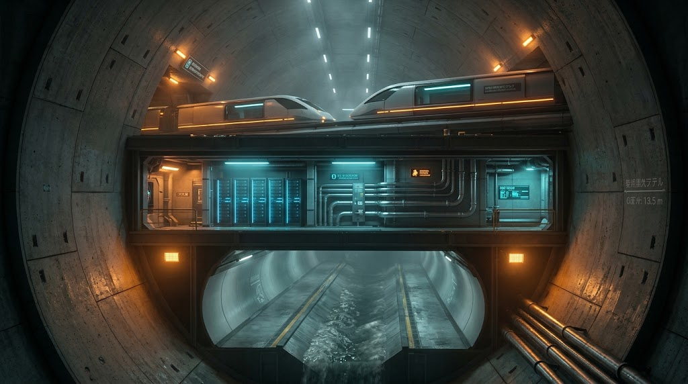

### ⚠️ JIN-ORDER RESTRICTED DATA

**このファイルは [JIN-ORDER Global Humanity License](https://github.com/JIN-ORDER-OFFICIAL/GOVERNANCE_OF_ABYSS/blob/main/LICENSE.md) によって保護されています。**

**無断転用、受託コンサルタントによる仕様書ロンダリング、机上の空論による改ざんを固く禁じます。**

---

# [SPEC-088] CRITICAL CHOKEPOINT NEUTRALITY & DEEP-ARTERY INFRASTRUCTURE SPECIFICATION



- **Document ID:** SPEC-JIN-ORDER-088-REV3
- **Classification:** ABYSSAL GOVERNANCE STANDARD / LEVEL-4 CLEARANCE
- **Status:** DRAFT / PROPOSED
- **Maintainer:** Pomemama (JIN-ORDER Repository Root)
- **Target Subsystems:** 
  - `governance/arbitration/iaac.proto`
  - `civil/tunnel/deep_artery_v4.cad`
  - `logistics/capsule/failover_routing.rs`

---

## 1. 統治規程：不可侵調停及び複合障害自律委譲プロトコル (CCNP)

### 第1条（目的及び適用範囲）
本仕様は、エネルギー・通信・物理物流の各チョークポイントが複合的に遮断された場合（複合衝撃：Complexity Shock）において、都市生命維持システムを中央統治から各自治区ノードへ無停止で委譲し、地上軍事干渉を受けない大深度回廊を維持・稼働させることを目的とする。

### 第2条（共振断絶トリガー：Resonance Severance Trigger）
以下の4項目のうち、**3項目以上が同時に30分以上継続**した場合、中央ノード統治権は自動凍結され、各ブロックの「自律防衛維持コード」へフォールバックする。
1. **海上・地上チョークポイント閉鎖:** 主要物理物流フラックスが基準値の25%以下に低下。
2. **基幹コンピュート途絶:** 国際間AIアライメント同期パケットの欠損率が40%を超過。
3. **都市環境臨界:** 流域浸水・高潮等の激甚水害による地上変電所・排水インフラの機能不全。
4. **論理回廊分断:** 地上・海底基幹光ファイバーの切断による自律暗号署名の不整合。

### 第3条（深淵間相互調停回線：IAAC プロトコル）
1. 対立陣営間であっても、大深度インフラ内に敷設された専用量子暗号線（Inter-Abyss Arbitration Channel: IAAC）の切断および妨害は絶対禁止とする。
2. 自律兵器・自動物流ドローンは、IAACからブロードキャストされる「不可侵識別子（Safe-Zone Token: SZT）」を受信した場合、半径500m以内の武力行使アルゴリズムを強制パージ（キルスイッチ作動）しなければならない。

---

## 2. 大深度複合地下回廊（Abyssal Artery）土木構造諸元

地上爆撃や地表水害から物理隔離するため、大深度地下（GL -45.0m以深、洪積不透水層内）に外径φ13.5mの泥土圧シールドトンネルを配置する。


### 2.1 主要諸元一覧
| 項目 | 設計仕様 | 備考 |
| :--- | :--- | :--- |
| **トンネル外径 / 内径** | φ13,500 mm / φ12,100 mm | RCセグメント（高強度プレキャスト） |
| **計画土被り (Overburden)** | 42.0 m 〜 58.0 m | 洪積粘土・シルト不透水支持層 |
| **更生工法インターフェース** | 反転・形成工法用アンカー埋設 | 内壁非開削更生（Trenchless Renewal）対応 |
| **設計耐用年数** | 100年（補修サイクル30年） | 自己修復型ジオポリマーコンクリート使用 |
| **水理設計容量** | 最大 180 m³/s | 超大深度雨水貯留・高速バイパス機能 |

---

## 3. 地下インフラ断面図面仕様（Standard Cross Section）


```text
　　　　　　　　　　　　　　[ 地表部 GL ±0.00m ]
================== 親水緑道 / 低流速遊歩道 / 透水性舗装 =================
　浸透型集水ます                                            自然浸透側溝
 　　　⬇️                                                      ⬇️
───────────────────────────────────────────────────────────────────────
　　　　　　　　　　　　[ 浅層部 GL -8.00m 〜 -15.00m ]
　　　　　【都市一般共同溝（電力 66kV / 上水道配水管 / 通信同軸管路）】
───────────────────────────────────────────────────────────────────────
　　　　　　　　　　　　[ 中層部 GL -20.00m 〜 -35.00m ]
　　　　　　　　【地区雨水調整函渠（初期豪雨ピークカット用遊水室）】
　　     └──────────────────────────┬─────────────────────────────┘
　　　                ドロップシャフト（渦流式減勢立坑）
　　                                ⬇️
                         [ 大深度部 GL -48.50m ]
                大深度シールドトンネル外径 φ13.5m 断面配置図
───────────────────────────────────────────────────────────────────────                         
                           [ ゾーンA: 物流回廊 ]
     　      ┌───────┐   ┌──────┐       ⬅️ 磁気浮上式高密度
   　    　    自動往      自動復     　　　 無人物流カプセル軌道
────────────────────────────中間耐火隔壁スラブ───────────────────────────
                       [ ゾーンB: 統治・計算インフラ ] 
          [IAAC] [超電導送電] [冷媒往復]  ⬅️ 不可侵調停ケーブルトレンチ
                                            耐熱・断熱防爆ダクト
────────────────────────────水理隔離ロードデッキ──────────────────────────
                      [ ゾーンC: 放水・貯留トンネル ] 
                         180 m³/s 高圧バイパス導管
                   　水面：内壁：非開削光硬化ライナー施工
　　　　　　　　　　　 平時：乾期点検通路 / 堆積土砂自動排除
```
---

## 4. 運用・更生保全プロトコル（Trenchless Maintenance Protocol）

1. **非開削管渠更生インターフェース（ZONE-C）:**
   - 洪水放水による内壁摩耗に対し、立坑から地上を掘削することなく光硬化型高密度ポリエチレン（HDPE）ライニングを反転挿入できるクリアランスおよびガイドレールを常設する。

2. **非常時流況制御:**
   - 放水ピーク時、ゾーンA（物流）およびゾーンB（通信）へ水蒸気・圧力が逆流しないよう、各ブロック立坑に高圧気密逆流防止ゲート（Air-Tight Flap Gate）を展開する。

---

## 5. Visual Architectural Blueprint & Generation Prompts (ANNEX-A)

The following generation prompts are calibrated for Midjourney v6, FLUX.1, and Stable Diffusion XL to render accurate architectural schematics and high-fidelity interior cutaways of the φ13.5m Abyssal Artery.

---

Supreme Judgment: Masano Takashi (The Guide)

Executed by: JIN-ORDER-OFFICIAL
