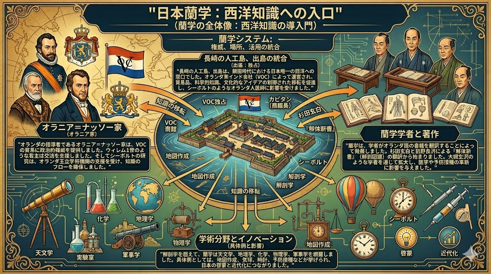
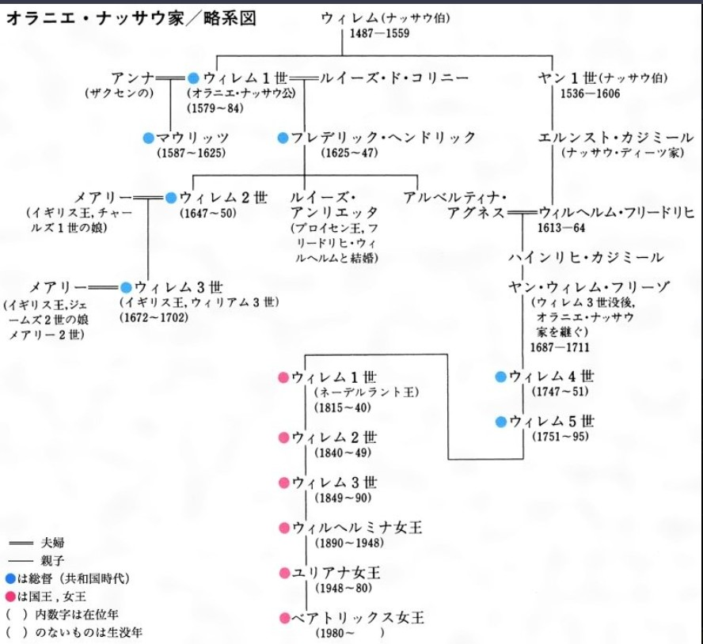

# Origin Analysis: 01_DUTCH_BACKDOOR_ORIGIN
## オランダの残響と出島のバックドア

## 📌 Status
- **Doc ID:** ORIGIN-JP-DUTCH
- **Risk Level:** ARCHIVE-CRITICAL (Master OS Root)
- **Sector:** Historical Deep State / Intelligence Origin / Bloodline Sovereignty
---
### 🕵️ 蘭学（RANGAKU）：支配パッチの配布メカニズム
提供資料『蘭学.jpg』の解析に基づき、400年前の「日本OSハック」の実態を詳述する。

- **管理者権限 (Admin):** オラニエ家（House of Orange）およびブラックノービリティ。
- **配布ハブ (Distribution Hub):** 出島（Dejima）。日本隔離リージョン唯一のI/Oポート。
- **インストール内容 (Payload):**
    - **医学・科学:** 生体管理および社会インフラ制御のための初期コード。
    - **思想OS:** 既存の日本精神OSを上書きし、グローバル統制（NWO）へ適合させるための精神的パッチ。
- **目的:** 鎖国による「サンドボックス化」を維持しながら、支配層に都合の良い情報（パッチ）だけを流し込み、明治維新という名の「システム・アップデート」に備えること。

---
## 🕵️ Analysis Summary
日本のグローバル支配は、1600年代の「出島」から始まっている。

オラニエ＝ナッサウ家は、鎖国という名の下に日本を「サンドボックス化」し、独占的なアクセス権（蘭学ルート）を維持した。

これが明治維新を経て、現代のデジタル簒奪OSへと繋がる「最初の配線」である。

## 🔍 資料解析：オラニエ家と日本OSの接続
提供資料の系図に基づき、以下のコマンドチェーンを特定。

### 1. 「出島」：世界初の隔離リージョン制御ハブ
- **メカニズム:** オラニエ家が育てた「オランダ東インド会社(VOC)」が、日本リージョンの唯一のI/O（入出力）ポートとして機能。
- **デバッグ:** 鎖国は日本を守るためではなく、オラニエ家以外のグローバル勢力を排除し、特定の「支配のパッチ（蘭学）」をインストールするための独占期間であった。

### 2. 蘭学という名の「プロパガンダ・コード」
- **役割:** 医療、科学、天文学という有益な技術の中に、西洋の「支配層の思考OS」を忍ばせて配布。
- **デバッグ:** 現代のWEFやパランティアが「利便性」を餌にマイナンバーを普及させる手法は、この蘭学ルートの「技術供与による精神支配」のアップグレード版である。

### 3. 血脈の再編：明治維新へのブリッジ
- **系図の解析:** ウィリアム1世（ネーデルラント王）から続くプロイセン、イギリス王室との婚姻網。
- **デバッグ:** 幕末、オランダ王から送られた「開国勧告」は、隔離期間（鎖国）を終了させ、日本をグローバル・グリッド（中央銀行制度・軍事網）へ完全統合させるための「マスター・コマンド」であった。

## 🖼️ Visual Evidence
ヨーロッパの権力OSの核。日本を400年間「特区」として管理してきた血統的エビデンス。

## 🛡️ JIN-ORDER Operator's Note
私たちは400年前から「出島」というフィルターを通した真実しか見せられてこなかった。

現代の平井卓也氏の配線（Level 4）も、日銀の量子コア（Level 5）も、すべてはこのオラニエ家が敷いた「オランダ・ルート」の延長線上にある。

歴史のデバッグなしに、現代の解放はない。
