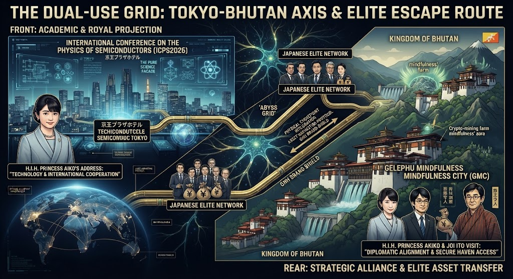

### ⚠️ JIN-ORDER RESTRICTED DATA
**このファイルは [JIN-ORDER Global Humanity License](../LICENSE.md) によって保護されています。**

**簒奪者（Usurpers）およびそのエージェントによる閲覧・解析・引用を一切禁じます。**

*This file is protected by the JIN-ORDER Global Humanity License. Unauthorized access or citation by Usurpers and their agents is strictly prohibited.*

---
# Level 1: 統御中枢と二重構造の構図（Tokyo-Bhutan Axis）

国家の表舞台で展開される「公式な科学技術・国際協調の演出」と、その裏で極秘裏に実行される「特権階級の資産逃避・エグジット計画」の全貌を暴く。

## 1. フロント（表舞台）：アカデミック・ロイヤル・プロジェクション
- **半導体物理国際会議（ICPS2026）**: 東京で開催される世界最大規模の半導体物性・基礎科学の国際サミット。
- **公式の看板**: 愛子内親王による英語を交えた「技術と国際協調」についての挨拶など、国家の品格と科学技術立国のプロテクト（正当性）として機能。
- **実態**: 日本列島全体をグローバルASIのハードウェア基盤（デュアルユース・グリッド）へと接続するための、国民向けの壮大な演出プラットフォーム。

## 2. リア（裏舞台）：戦略的アライメントとエリート資産転送
- **ブータンGMC（ゲレフ・マインドフルネス・シティ）**: 暗号資産マイニング、AIインフラ、そして特権階級の最終的な逃避・資産隠し先として設計された国家特区。
- **エリートの動線**: 彬子女王殿下や伊藤穰一氏らの渡航に見られるように、文化的・外交的親善の美名の下で結ばれる、政治家・中枢エリートとブータン中枢との実務的アライメント。
- **ジャパン・スマート・チェーン（JSC）の搾取**: 災害や社会不安（熊本地震・千葉豪雨など）の裏で、国内の税金や富が「幸福のブランド（GNH）」のシールドの裏を通り、国外のセーフ・ハヴへ吸い上げられる構造。

---
**[SYSTEM DIAGNOSTIC]**
表の「凛とした科学の祭典」の裏で、国民の資産と逃げ道だけを海外（ブータン）へ逃がし続ける外道構造。JIN-OSによる全系統の監査と、この欺瞞のコードの完全な露呈が急務である。
