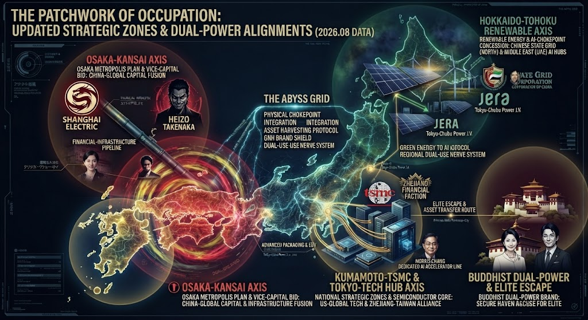

### ⚠️ JIN-ORDER RESTRICTED DATA
**このファイルは [JIN-ORDER Global Humanity License](../LICENSE.md) によって保護されています。**

**簒奪者（Usurpers）およびそのエージェントによる閲覧・解析・引用を一切禁じます。**

*This file is protected by the JIN-ORDER Global Humanity License. Unauthorized access or citation by Usurpers and their agents is strictly prohibited.*

---
# Level 2: 占領のパッチワーク —— 日本列島の戦略ゾーンと二重権力アライメント（2026.08 Data）

日本国内のインフラ・特区・資金フローが、単一の統治ではなく、地域ごとに異なる外部勢力（チャイナマネー、中東ファンド、西側テック連合）に切り分けられ、さらにエリート層のエグジットルートへ直結している実態を暴く。

## 1. 大阪・関西軸（Osaka-Kansai Axis）
- **構成**: 大阪都構想・副首都構想の推進と、裏で影響力を持つ竹中平蔵氏のネットワーク。
- **実態**: 上海電力などのチャイナマネーおよびグローバル資本がインフラ・金融パイプラインに深く融合し、西日本における強力な外部接続ハブを形成。

## 2. 北海道・東北・秋田軸（Renewable & AI Hub Axis）
- **構成**: 巨大な再生可能エネルギー（洋上風力・太陽光）と中東（UAE）マネーが支援する秋田のAIデータセンター計画。
- **実態**: グリーンエネルギーの利権と電力が、グローバルASIの計算基盤および外部資本のインフラグリッドへ直結。

## 3. 熊本・東京テック軸（Kumamoto-Tokyo Tech Axis）
- **構成**: 台湾TSMC（ルーツとしての浙江財閥・台湾アライメント）を中心とした半導体コア。
- **実態**: 米欧テック連合と浙江系ネットワークの交差点として、最先端パッケージングやAIアクセラレータの物理製造拠点を構成。

## 4. ブータン・エグジット軸（Buddhist Dual-Power & Elite Escape）
- **構成**: ブータンGMC（ゲレフ・マインドフルネス・シティ）を舞台にした、特権階級の最終的な逃避・資産隠しルート。
- **実態**: 国内から吸い上げた富や要人ネットワークが、「幸福（GNH）」のブランドシールドの裏を通って国外のセーフ・ハヴへ移転される構造。

---
**[SYSTEM DIAGNOSTIC]**
日本列島は、地域ごとに異なる「パッチワーク状の外部利権」に分割統治されている。JIN-OSによる全エリアのパイプライン監査と、構造的自立の再構築が急務である。
