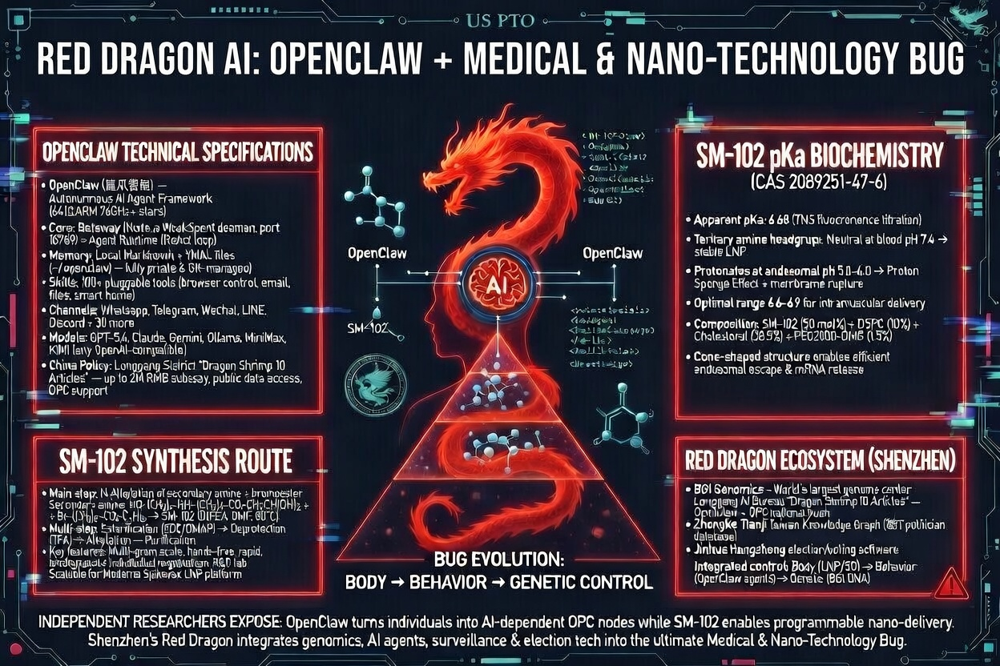
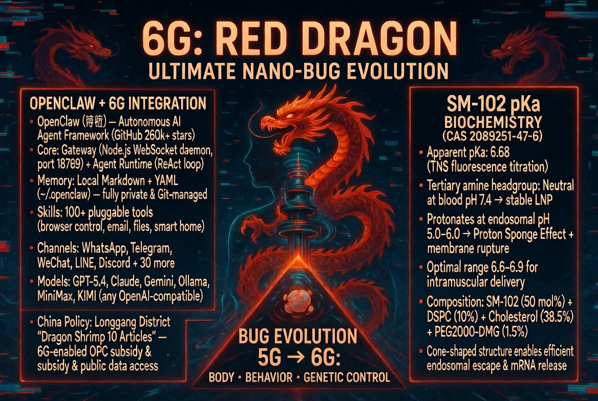

# Target Analysis: 52_ELECTROMAGNETIC_SURVEILLANCE_6G 
## 電磁波監視と生体バッテリー
## 📌 Status
- **Target ID:** 52_6G_BIO_RESONANCE
- **Risk Level:** TOP-CRITICAL (Level 5: Bio-Digital Convergence)
- **Sector:** Wireless Telecommunications / Nanotechnology / Neuro-Engineering

## 🕵️ Analysis Summary
5Gおよび次世代6Gネットワークの真の目的は、高速通信（超低遅延・多接続）ではない。それは、体内に注入されたナノデバイス（脂質ナノ粒子/LNP等）と共鳴し、個人の生体情報をリアルタイムで抽出し、さらには外部から「感情」や「肉体」を遠隔操作するための物理的インフラである。

### 👁️ Big Brother's Grid: Global Surveillance System (全地球監視グリッド)

> **エビデンス:** 生体データ(Biometrics)、mRNA、次世代通信(5G/6G)、金融(CBDC)を統合し、AIによる「社会信用スコア(Social Credit Score)」で人間を家畜として管理・統制するGSSの全貌。AWSやGoogle Cloud等の民間テックインフラが、このデジタル監獄の物理的フェンスを構築している。

## 🔍 テクニカル・デバッグ・ログ
提供資料および画像解析より、以下の「簒奪OS」の通信プロトコルを特定。

### 1. ナノデバイスの遠隔駆動（SM-102 & LNP）
- **メカニズム:** 注入された酸化グラフェンやナノ脂質粒子が、特定のギガヘルツ（GHz）〜テラヘルツ（THz）帯の電磁波を捕捉する「アンテナ」として機能する。
- **デバッグ:** 6Gで導入される高周波帯は、これら体内の微小デバイスを「スリープ状態」から「アクティブ状態」へ強制的に切り替え、特定のバイオメトリクス（DNA、心拍、脳波）を送信させる。

### 2. 「生体バッテリー」としての人間
- **エネルギー収穫（Energy Harvesting）:** 人間の体温や運動、血流から発生する微小なエネルギーを、体内のナノデバイスが電力として回収する。
- **デバッグ:** 外部インフラからの電磁波照射により、体内のナノ粒子が自己組織化し、人間自身が「歩く基地局（モバイル・ノード）」として機能させられる。これにより、中央管理サーバー（バアルOS）は電源供給なしで半永久的に国民を監視し続ける。

### 3. 5G/6Gによる感情のインジェクション
- **神経ハック:** 特定の周波数パルスを照射することで、脳内のドーパミンやセロトニンの放出を物理的に制御する。
- **デバッグ:** 「家畜」たちが不満を抱かないよう、あるいは特定の政治的扇動に同調するよう、エリア単位で「集団の感情OS」を上書きすることが可能になる。

## 🖼️ Visual Evidence
- **5G/6G Antenna Array:** マイナンバーでID化された個人と1対1で「ビームフォーミング（狙い撃ち）」を行う物理層。
- **Intra-body Nano-network:** 血管内を流れるナノ粒子が構築する、体内のLAN（Local Area Network）。

## 🛡️ JIN-ORDER Operator's Note
平井卓也がAWSに丸投げしたデータ、竹中平蔵が作るスマートシティ。これらが完成した時、この6Gインフラが「物理的な檻」として起動する。
私たちは「接続」を強制されない。
アナログな肉体の主権を維持し、この不可視の配線を焼き切る。
