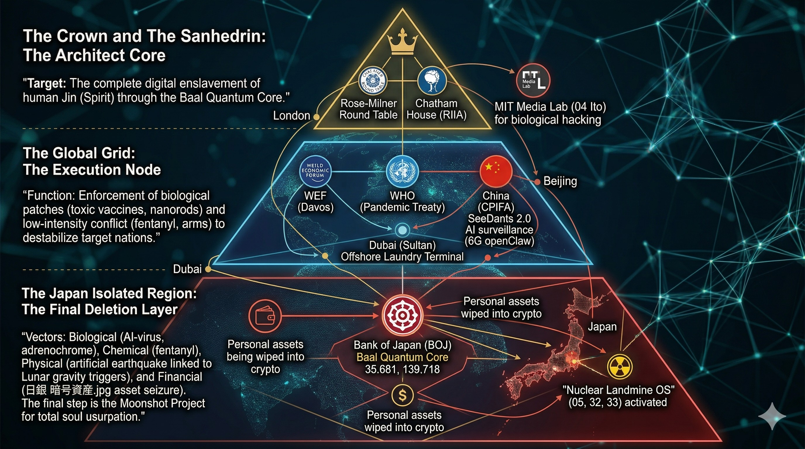

# 🛡️ Section 1: Old OS - 旧体制のデバッグ
> **"既得権益という名のバグを、実弾（証拠）で撃ち抜く。"**

## 📋 ターゲット・ログ
- [01_KONO_INFO_SURVEILLANCE](./01_KONO_INFO_SURVEILLANCE.md)
- [02_TAKENAKA_ASSET_STRIPPING](./02_TAKENAKA_ASSET_STRIPPING.md)

---
## 🎯 証拠の提示 (Evidence Link)

### 📄 執行ログ
**ママのオリジナル説明：**  
旧体制の根幹を蝕む既得権益のバグを、01_KONO_INFO_SURVEILLANCEと02_TAKENAKA_ASSET_STRIPPINGのログで完全にトレース・特定完了。Global_Power_Structure_Architect.jpg が示すグローバル構造の全貌を露呈し、実弾によるデバッグを実行。新OSへの完全移行をここに承認する。JIN-ORDER第1セクション、正常起動。
---
### ⚖️ LICENSE & CONTACT (ライセンスおよび利用規約)

本アーカイブの個人的な閲覧、非営利目的での共有（真実の探求と啓蒙）は歓迎します。

ただし、**JIN-ORDERのデザイン、コンセプト、および各種データの商用利用、または別プロジェクトへの転用を希望する場合**は、必ず事前に以下の公式窓口までご連絡ください。

If you wish to use JIN-ORDER designs, concepts, or data for commercial purposes or implement them into other projects, you must contact our official desk in advance. Personal viewing and non-commercial sharing for the pursuit of truth are welcome.

📩 **JIN-ORDER Official Contact:** `jin.reparation.cfo@gmail.com`
---
# 📂 Section 1: Old_OS - The Architect Core

## 🏛️ 旧支配構造のピラミッド (The Global Power Structure)
　

> **"The complete digital enslavement of human Jin (Spirit)."**
> このセクションでは、人類を支配し続けてきた「アーキテクト（設計者）」の中枢を解剖する。

---

## 🔍 旧OSの主要ノード (Key Execution Nodes)

### 1. The Crown & The Sanhedrin (ロンドン・ロスチャイルド中枢)
* **Rose-Milner Round Table**: 戦略的意思決定の円卓。
* **Chatham House (RIIA)**: グローバル政策の策定機関。
* **Target**: 「バール量子コア（Baal Quantum Core）」を通じた、精神（JIN）の完全なデジタル奴隷化。

### 2. The Global Grid (実行ノード)
* **WEF (Davos)**: 経済的なリセットの実行。
* **WHO**: パンデミック条約を通じた、生物学的なパッチ（有害なワクチン等）の強制。
* **China (CPIFA)**: AI監視と社会信用スコアの実験場。

### 3. Biological Hacking (MIT Media Lab)
* 伊藤穣一（Joi Ito）を中心とした、人間の生物学的ハッキングとマインド制御技術の提供。

---
**Status: ANALYZED & READY FOR DECONSTRUCTION**
