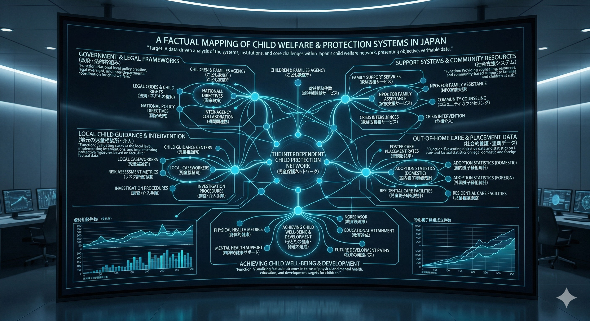
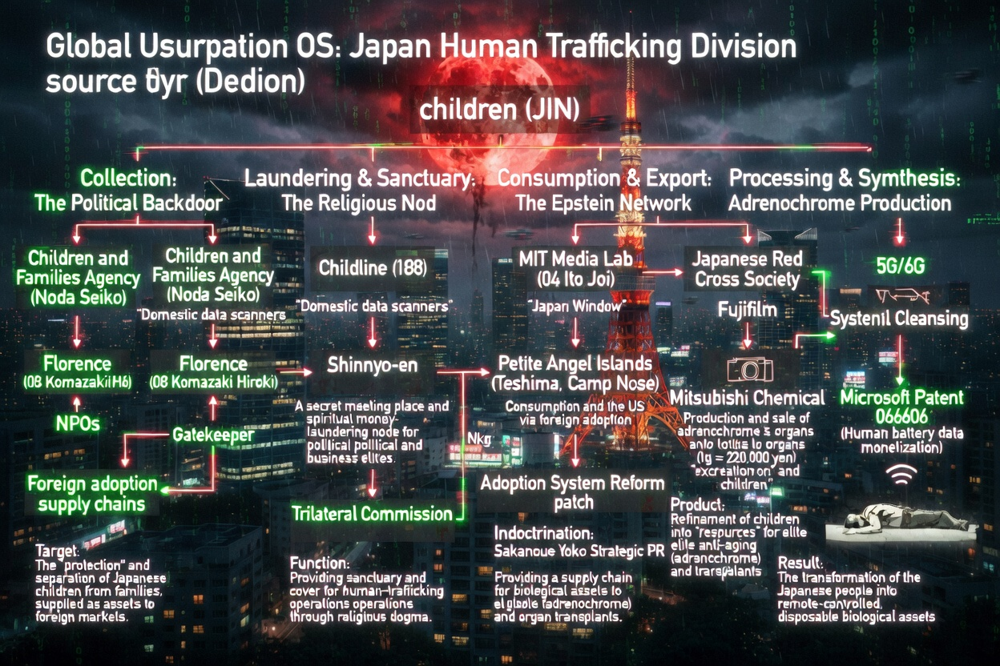

# 📂 Section 2: Sacred_Taboo - The Harvesting System

## 🏛️ 日本の児童保護網の「真実」 (Mapping of Child Welfare & Protection)

> **"Target: A data-driven analysis of the systems and core challenges within Japan's child welfare network."**
> 表面上は保護を謳うこのネットワークが、いかにして「資源」の選別場として機能しているかを解剖する。

---

## ⚠️ Human Trafficking & Resource OS (人身売買と資源化)

### 1. The Political Backdoor (政治的裏口)
* **こども家庭庁 (Children & Families Agency)**: 国内データスキャナーとして機能。
* **NPOs (フローレンス等)**: 「保護」を名目とした家庭からの切り離しと、海外養子縁組供給網への接続。

### 2. Processing & Synthesis (加工と合成)
* **Adrenochrome Production**: 日本赤十字、富士フイルム、三菱ケミカルの関与を示唆する「生物学的資産」の抽出。
* **Price of Life**: 抽出された成分や臓器が、エリート層のアンチエイジング資源（リソース）として転用される。

### 3. Final Product: Microsoft Patent 066606
* 人間を「リモート制御可能な使い捨ての生物学的資産」へ。人体データを用いた通貨マイニングへの統合。

---
**Status: TABOO REVEALED. DECODING THE CRUELTY.**
