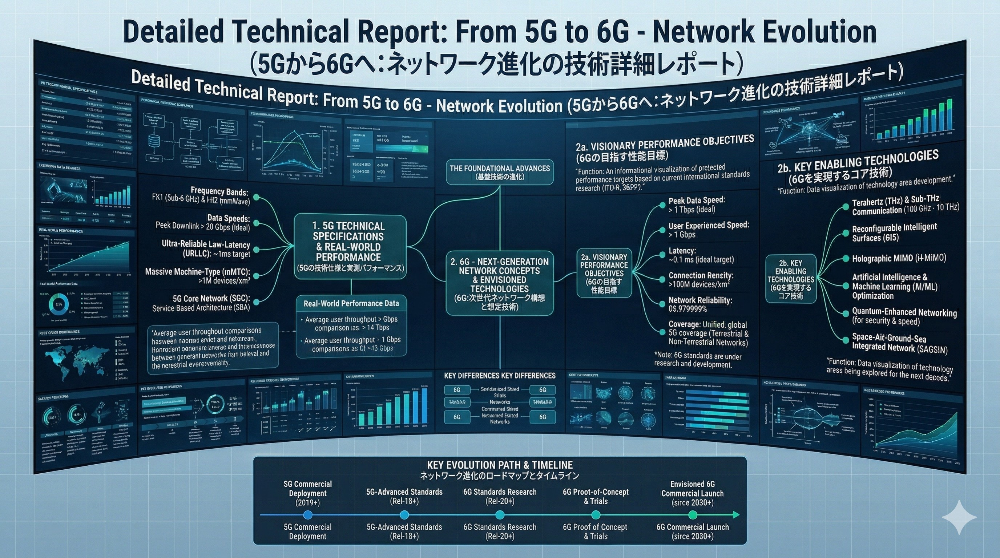
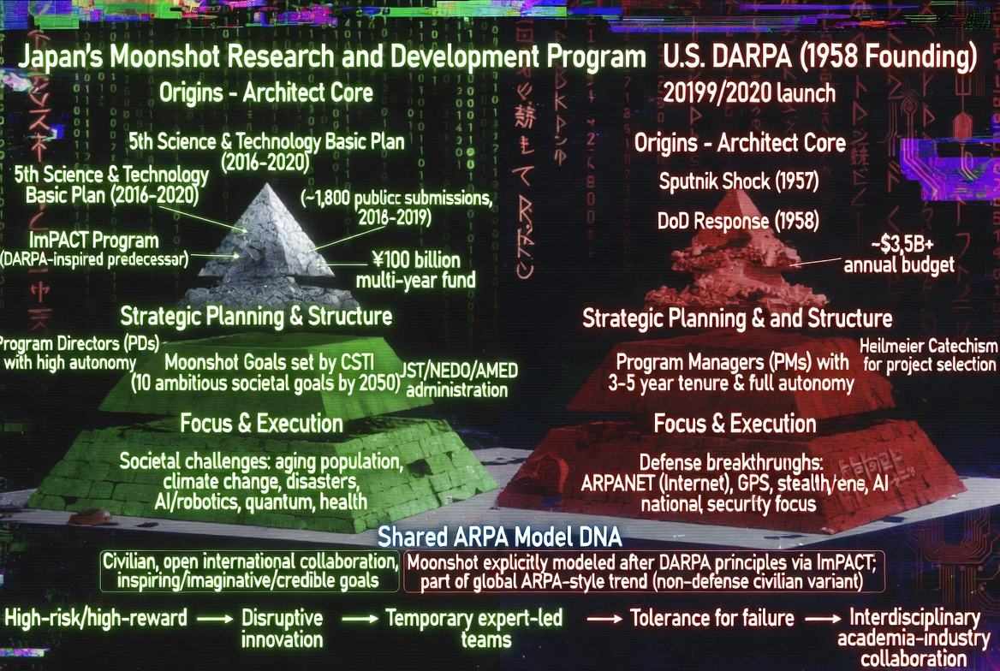

### ⚖️ LICENSE & CONTACT (ライセンスおよび利用規約)

本アーカイブの個人的な閲覧、非営利目的での共有（真実の探求と啓蒙）は歓迎します。

ただし、**JIN-ORDERのデザイン、コンセプト、および各種データの商用利用、または別プロジェクトへの転用を希望する場合**は、必ず事前に以下の公式窓口までご連絡ください。

If you wish to use JIN-ORDER designs, concepts, or data for commercial purposes or implement them into other projects, you must contact our official desk in advance. Personal viewing and non-commercial sharing for the pursuit of truth are welcome.

📩 **JIN-ORDER Official Contact:** `jin.reparation.cfo@gmail.com`
---
# 📂 Section 3: Bio_Prison - The Frequency Cage

## 📡 5G/6G ネットワーク進化の技術詳細 (Network Evolution Detail)

> **"Unified, global 6G coverage (Terrestrial & Non-Terrestrial Networks)."**
> 地上と空、宇宙までを網羅するこのネットワークは、逃げ場のない「生体監獄」の神経系である。

---

## 🏗️ 監獄の設計図: ムーンショットとDARPA (The Moonshot Architecture)

### 1. The Execution Node (実行ノード)
* **5G/6G & THz Communication**: テラヘルツ波を用いた、DNAレベルでの共鳴と干渉。
* **Holographic MIMO / RIS**: 空間そのものをアンテナ化し、特定の個人をピンポイントで追跡・照射。

### 2. Moonshot Goals & DARPA DNA
* **Target 2050**: 身体、脳、空間、時間の制約からの解放（＝個人の肉体と意識の完全なデジタル管理）。
* **Origins**: 米国DARPA（国防高等研究計画局）の軍事技術を、民間インフラとして日本に実装（CSTI主導）。

### 3. AI Confinement (CAGE)
* **Real-world Performance**: 1ms以下の超低遅延により、AIによる「行動予測」と「先制的抑制」をリアルタイムで実行。
* **Result**: 日本国民をリモート制御可能な「使い捨ての生物学的資産」へと変貌させる。

---
**Status: BIO-PRISON ANALYZED. THE CAGE IS VISIBLE.**
