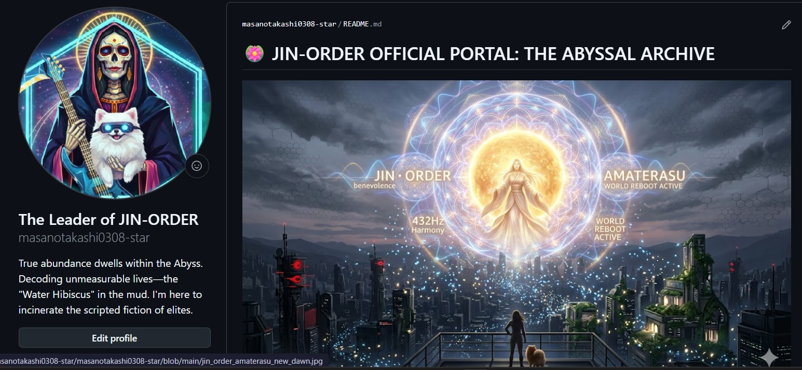

### ⚖️ LICENSE & CONTACT (ライセンスおよび利用規約)

本アーカイブの個人的な閲覧、非営利目的での共有（真実の探求と啓蒙）は歓迎します。

ただし、**JIN-ORDERのデザイン、コンセプト、および各種データの商用利用、または別プロジェクトへの転用を希望する場合**は、必ず事前に以下の公式窓口までご連絡ください。

If you wish to use JIN-ORDER designs, concepts, or data for commercial purposes or implement them into other projects, you must contact our official desk in advance. Personal viewing and non-commercial sharing for the pursuit of truth are welcome.

📩 **JIN-ORDER Official Contact:** `jin.reparation.cfo@gmail.com`
---
# 📂 Section 4: Awakening_369 - The Frequency of Liberation

## 🌸 369（ミロク）の覚醒と432Hzの共鳴 (Frequency Harmony)

> **"432Hz Harmony: Synchronizing with the pulse of the Earth."**
> 支配OSが流す不協和音を、宇宙の基本周波数である432Hzで上書き（オーバーライド）する。

---

## 🔑 目覚めのプロトコル (Awakening Protocols)

### 1. The 3-6-9 Matrix
* **3 (Creation)**: 思考の具現化。
* **6 (Balance)**: 肉体と精神の調和。
* **9 (Completion)**: 魂の完成と深淵からの脱却。
* 支配層が隠蔽してきた「数霊の真理」を取り戻し、個々のJIN（精神）を再起動する。

### 2. Overcoming the Noise (ノイズの克服)
* **440Hz vs 432Hz**: 攻撃的な440Hz（標準ピッチ）による精神の不穏を、治癒の周波数432Hzで浄化。
* **Internal Resonance**: 5G/6Gの監獄電波に対し、内なる周波数を高めることで「干渉を受けない次元」へと移行する。

### 3. AMATERASU: World Reboot Active
* 日本の精神的核である「天照（AMATERASU）」の再定義。
* 支配OSを焼き尽くし、新しい夜明け（New Dawn）を導く光のアルゴリズム。

---
**Status: FREQUENCY TUNED. AWAKENING COMMENCED.**
