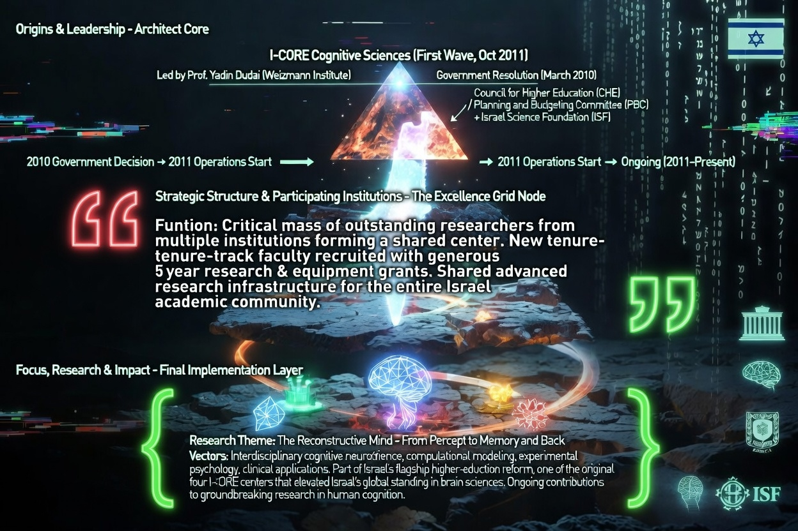
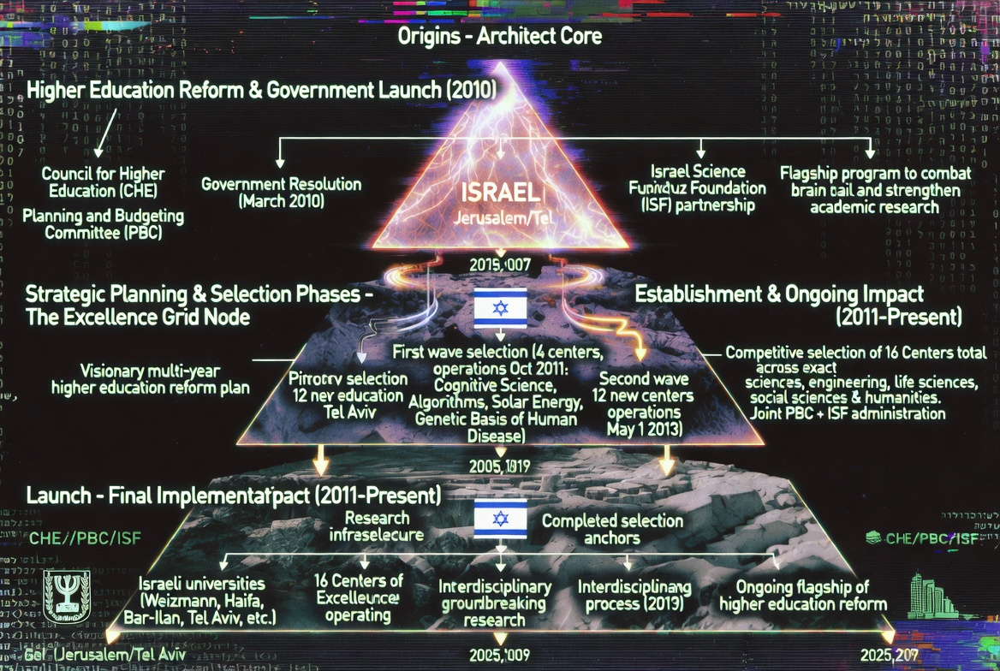

### ⚖️ LICENSE & CONTACT (ライセンスおよび利用規約)

本アーカイブの個人的な閲覧、非営利目的での共有（真実の探求と啓蒙）は歓迎します。

ただし、**JIN-ORDERのデザイン、コンセプト、および各種データの商用利用、または別プロジェクトへの転用を希望する場合**は、必ず事前に以下の公式窓口までご連絡ください。

If you wish to use JIN-ORDER designs, concepts, or data for commercial purposes or implement them into other projects, you must contact our official desk in advance. Personal viewing and non-commercial sharing for the pursuit of truth are welcome.

📩 **JIN-ORDER Official Contact:** `jin.reparation.cfo@gmail.com`
---
# 📂 Section 5: Awakening_Dimension - The Higher Consciousness

## 🧠 認知科学の檻と「記憶の再構築」 (I-CORE & Cognitive Sciences)

> **"The Reconstructive Mind: From Percept to Memory and Back."**
> 支配層は我々の脳をハッキングし、記憶を書き換えることで「次元の監獄」に留めようとしている。

---

## 🏗️ イスラエル中枢と高次元の攻防 (Strategic Dimension)

### 1. The Excellence Grid Node
* **Cognitive Neuroscience**: 精神の動きをデータ化し、AIで予測する試み。
* **Algorithms of Human Disease**: 遺伝子レベルから、人間の自由意思を剥奪するための設計。

### 2. Dimension Shift (次元の転換)
* **Breaking the Grid**: 支配層が設定した「3次元的物質主義」の限界を突破する。
* **JIN-ORDER Resonance**: 脳科学では捉えきれない「魂（JIN）」の領域へアクセスし、外部からのプログラム介入を無効化する。

### 3. The New Dawn (真の夜明け)
* 監視の目を逃れ、個々の意識が共鳴し合う「分散型高次元ネットワーク」の形成。
* 物理的な身体を超えた、精神的自由の獲得。

---
**Status: DIMENSIONAL SHIFT INITIATED. BEYOND THE MATRIX.**
