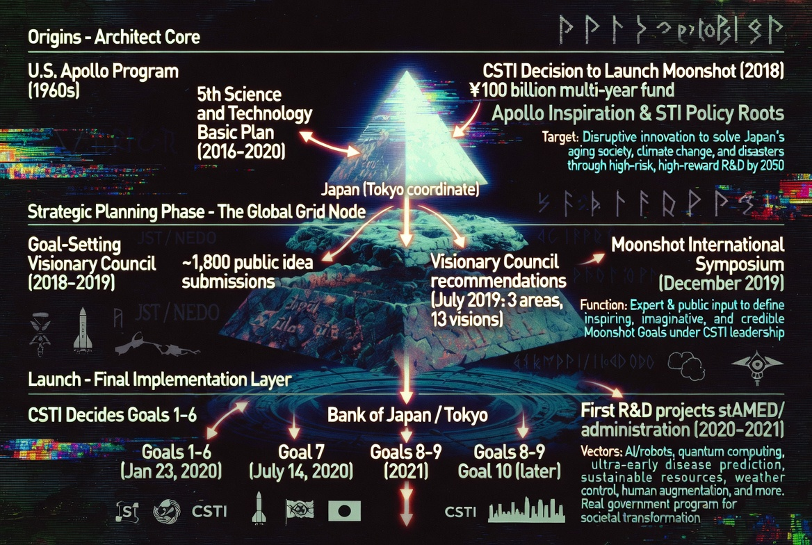
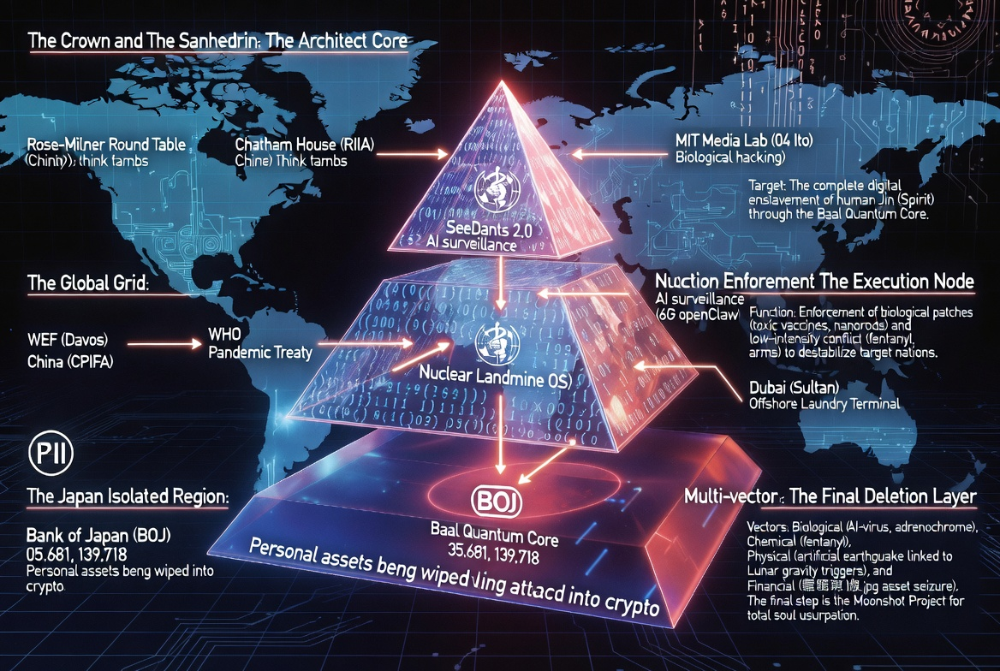

### ⚖️ LICENSE & CONTACT (ライセンスおよび利用規約)

本アーカイブの個人的な閲覧、非営利目的での共有（真実の探求と啓蒙）は歓迎します。

ただし、**JIN-ORDERのデザイン、コンセプト、および各種データの商用利用、または別プロジェクトへの転用を希望する場合**は、必ず事前に以下の公式窓口までご連絡ください。

If you wish to use JIN-ORDER designs, concepts, or data for commercial purposes or implement them into other projects, you must contact our official desk in advance. Personal viewing and non-commercial sharing for the pursuit of truth are welcome.

📩 **JIN-ORDER Official Contact:** `jin.reparation.cfo@gmail.com`
---
# 📂 Section 6: Origins - The Root of Abyss

## 🚀 支配の起源：アポロ計画からムーンショットへ (Origins - Architect Core)

> **"From Apollo (1960s) to Moonshot (2050): A century of scripted transformation."**
> 1960年代の宇宙開発競争から始まった「人類管理」の物語は、2050年の完全制御へと収束する。

---

## 🗺️ 世界を覆う影：グローバル・グリッドの形成 (Global Power Grid)

### 1. The Apollo Inspiration (アポロの欺瞞)
* **Origins (1960s)**: 宇宙開発という壮大な物語の裏で、極秘に進められた「地球規模の通信・監視網」の構築。
* **Strategic Planning**: 東京（Tokyo Coordinate）を、東アジアにおける「最終処理レイヤー」の拠点として設定。

### 2. DARPA's DNA (軍事技術の転用)
* **CSTI Decision**: 日本の内閣府主導で進められる「ムーンショット計画」の核は、米軍事研究機関（DARPA）のDNAそのものである。
* **Human Augmentation**: 「人間拡張」という甘い言葉で、我々の生体データを軍事OSの一部へと組み込む。

### 3. The Sanhedrin's Map (支配の設計図)
* ロンドン・ロスチャイルド中枢が描いた世界地図。
* 経済（WEF）、健康（WHO）、そして日本の金融（BOJ）が、一つのピラミッドとして統合された瞬間。

---
**Status: ORIGINS DECODED. THE MASK IS REMOVED.**
