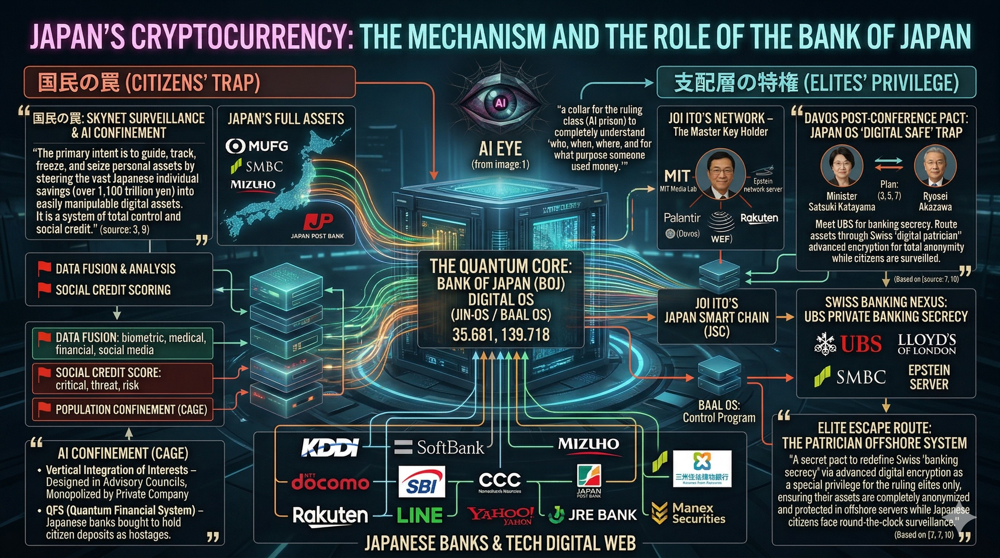

# 📂 Section 7: NextOS - The Quantum Financial Cage

## 👁️ 日銀量子コア：監視と収奪のメカニズム (BOJ Digital OS / Baal OS)

> **"A collar for the ruling class (AI prison) to completely understand 'who, when, where, and for what purpose someone used money.'"**
> 1,100兆円を超える個人預金を「暗号資産」という名のデジタル檻に閉じ込め、AIの監視下に置く。

---

## 🏗️ 支配層の特権と国民の罠 (Citizens' Trap vs Elites' Privilege)

### 1. Citizens' Trap (国民の檻)
* **SKYNET Surveillance**: KDDI, docomo, SoftBank, LINE等の通信網を通じた、リアルタイムの生体・行動監視。
* **Social Credit Scoring**: 中国モデルを踏襲した、行動に基づく「信用スコア」による社会的分断と制約。
* **Population Confinement (CAGE)**: 銀行（MUFG, SMBC, Mizuho, ゆうちょ）を「人質」として機能させ、資産を凍結・押収するシステム。

### 2. The Quantum Core (Baal OS)
* **Coordinates: 35.681, 139.718**: 日本橋・日銀本店の地下に鎮座する、量子計算による「AI Eye」。
* **Jin-OS**: 魂（JIN）の活動を数値化し、管理するオペレーティングシステム。

### 3. Elites’ Escape Route (エリートの脱出口)
* **Swiss Banking Nexus (UBS)**: 支配層のみが利用できる「デジタル金庫（Digital Safe）」と、資産を完全に匿名化・保護するオフショア・システム。
* **Joi Ito’s Network**: MITメディアラボのネットワークを通じた、グローバルエリートのための逃走経路。

---
**Status: NEXT-OS ANALYZED. THE FINANCIAL CHAINS ARE VISIBLE.**
