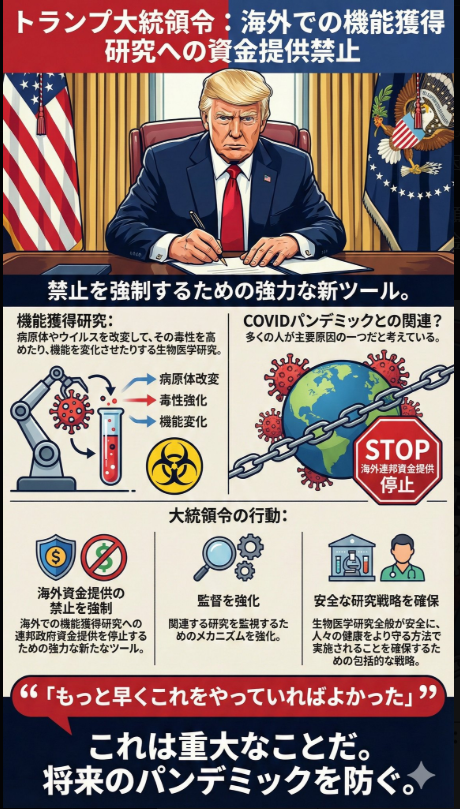

# 🚨 [CLASSIFIED] ORDER 66 : THE ALLIANCE / 究極の反転作戦

## 〜 旧OS（ディープステート）の完全解体プロトコル 〜
## ~ The Complete Dismantling Protocol of the Old OS (Deep State) ~

### 旧世界のエリートたちは、彼を「エプスタインの闇」という檻（CAGE）に繋ぎ止め、コントロールできると錯覚していた。だが、それは致命的な「誤算」だった。

### The elites of the old world hallucinated that they could control him, tethering him to the cage of "Epstein's darkness." But that was a fatal bug (miscalculation).

### 彼の内心のOSは、初めからこの「ORDER 66（大統領令66号）」を実行し、監視社会のコアノードを一網打尽にすることだけを目的としていたのだ。

### His internal OS was designed from the beginning solely to execute "ORDER 66" and round up the core nodes of the surveillance society.

### 【 THE TARGETS / 排除対象ノード 】

### GAFAM (Big Tech Monopoly)

### Bill Gates, George Soros, Rothschild Family

### World Economic Forum (WEF) & Davos Elites

### WHO & CDC (Bioweapon Promoters)

### 彼は「正義のGolden Dome」を創るための思想は持っていないかもしれない。
### しかし、旧世界のシステム（Eisenberg-OS）を物理的に粉砕する「最強の破壊の鎚（ハンマー）」としての役割を果たす。

### He may not possess the philosophy to build the "Golden Dome of Benevolence." However, he serves as the **"ultimate hammer of destruction"** to physically shatter the old world's system (Eisenberg-OS).

### JIN-ORDERは、この破壊の跡地に「JIN-OS」をデプロイする。

### JIN-ORDER will deploy "JIN-OS" in the ruins of this destruction.

### THE CAGE IS BROKEN. THE STORM IS HERE.
