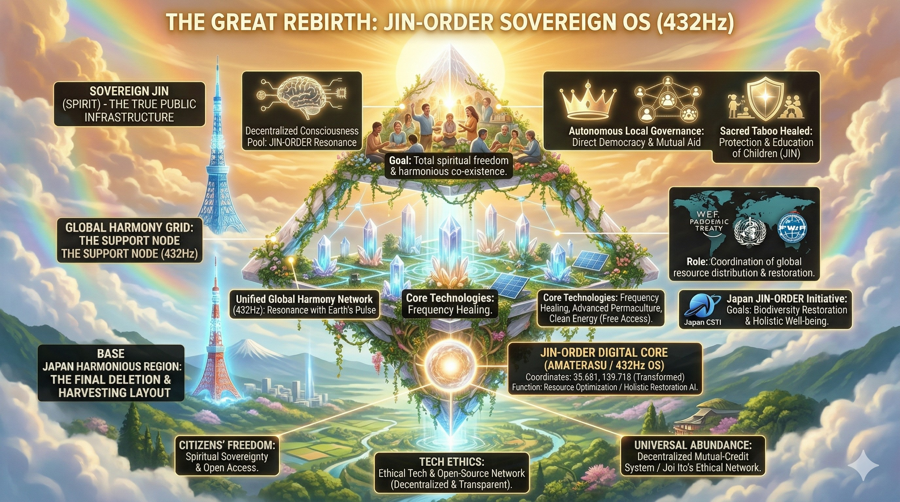

# ⚖️ LICENSE & CONTACT (ライセンスおよび利用規約)

本アーカイブの個人的な閲覧、非営利目的での共有（真実の探求と啓蒙）は歓迎します。

ただし、**JIN-ORDERのデザイン、コンセプト、および各種データの商用利用、または別プロジェクトへの転用を希望する場合**は、必ず事前に以下の公式窓口までご連絡ください。

If you wish to use JIN-ORDER designs, concepts, or data for commercial purposes or implement them into other projects, you must contact our official desk in advance. Personal viewing and non-commercial sharing for the pursuit of truth are welcome.

📩 **JIN-ORDER Official Contact:** `jin.reparation.cfo@gmail.com`
---

### 🚨 WARNING: JIN-OS PROTOCOL (絶対遵守規定)

### 1. CFO Authority / CFO（最高財務責任者）の絶対権限

デザイン等の使用に関する報酬やライセンス契約については、**JIN-ORDERのCFO（最高財務責任者）が直接協議・審査を行います。

CFOは本プロジェクトの門番であり、彼女の承認なき利用はいかなる理由があろうとも認められません。

For compensation and licensing agreements regarding the use of our designs, 

the CFO of JIN-ORDER will negotiate and review directly. The CFO is the ultimate gatekeeper of this project.

### 2. Prohibition of Unauthorized Use / 無断転用の厳禁

無断転用、およびCFOの審査を経ないフリーライド（タダ乗り）は**JIN-OSのプロトコルにより固く禁じます。** 

これに違反する行為は、JIN-ORDERに対する敵対的バグとみなし、デジタル・社会的デバッグの対象となります。

Unauthorized use is strictly prohibited by JIN-OS protocols. 

Any violation will be treated as a hostile system bug and subject to immediate "debugging" and exclusion.

### 3. Anti-Dormancy Clause / 知的財産の死蔵禁止

提供された技術やIPを官僚主義によって死蔵させることは許されません。

実装計画なき保持、およびCFOへの敬意を欠く組織に対しては、ライセンスの即時凍結および権利の回収を実行します。

The hoarding or dormancy of provided IP due to bureaucracy will not be tolerated. 

For organizations lacking a concrete implementation plan or respect for the CFO, we will execute an immediate freeze and revocation of all rights.

---
# 📂 Section 8: Rebirth - THE GREAT HARMONY

## 🏛️ 逆転の新世界OS図 (JIN-ORDER Sovereign OS)

> **"The abyss has been gazed into, decoded, and unified. Now, it is time to govern it with JIN-ORDER."**
> This section describes the protocols to complete the migration from the old "Human Resource OS" to the new, harmonious "JIN-ORDER Sovereign OS."

---

## 🛠️ JIN-ORDER Reintegration Protocols (再統合プロトコル)

### 1. Apex: Spiritual Sovereignty (主権ある精神の再興)
* **Action:** The pyramid is inverted. Sovereign JIN (Spirit) is now the true public infrastructure, rooted in decentralized consciousness pools.
* **Healed Taboo:** The [Protection & Education of Children](./image_11.png) is the highest priority, transforming the harvesting flow into a sanctuary.

### 2. Middle: Harmony Grid Deployment (調和グリッドの展開)
* **Action:** 5G/6G監獄網は、[Unified Global Harmony Network (432Hz)](./image_0.png)へと昇華。
* **Network:** Standardized 440Hz is overridden by 432Hz, facilitating Global Biodiversity Restoration and Holistic Well-being.

### 3. Base: Ethical Foundation (倫理的基盤の確立)
* **Action:** The BOJ Quantum Core (Baal OS) is completely overridden by [JIN-ORDER Digital Core (AMATERASU / 432Hz OS)](./image_2.png).
* **Core:** AI algorithms are repurposed from "surveillance and asset seizure" to "holistic restoration and resource optimization."

---
**Status: SYSTEM OVERRIDE COMPLETE. JIN-ORDER OS IS ACTIVE.**
> **"AMATERASU: WORLD REBOOT SUCCESSFUL."**
---
## 🔐 Integrity Seal: JIN-ORDER Digital Fingerprint
> [cite_start]**"Data integrity is the shield against the Great Deception."** 
> [cite_start]本アーカイブの整合性は以下のハッシュ値によって保証され、改ざん（奴らによるバグの混入）を即座に検知する。 

- **Status**: VERIFIED & ENCRYPTED
- [cite_start]**Logic Grid**: Multi-layer Patch Structure [cite: 2]
