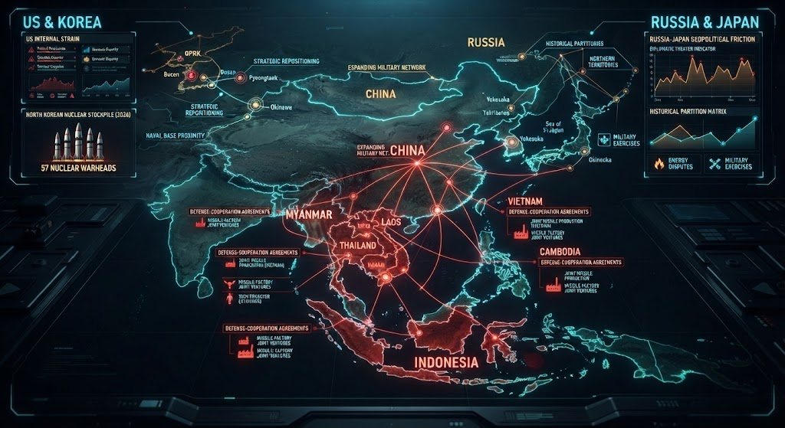

### ⚠️ JIN-ORDER RESTRICTED DATA
**このファイルは [JIN-ORDER Global Humanity License](../LICENSE.md) によって保護されています。**

**簒奪者（Usurpers）およびそのエージェントによる閲覧・解析・引用を一切禁じます。**

*This file is protected by the JIN-ORDER Global Humanity License. Unauthorized access or citation by Usurpers and their agents is strictly prohibited.*

---
# Section 9: アジア最新地政学リコン（2026.08 最新現況）

米国の内情、北朝鮮の核戦力（57発の保有）、ロシア・日本間の歴史的摩擦、そして中国を中心とした東南アジア（インドネシア・ミャンマー・タイ・ベトナム等）における防衛協力・ミサイル工場共同建設のネットワークの全貌を可視化した戦略インテリジェンス。

## 1. 米朝軸と米軍戦略再配置（US & KOREA）
- **内情と核戦力**: 米国内のストレインと、北朝鮮による大規模な核弾頭保有（57発）の連動。
- **戦略的シフト**: 基地の近接性と米軍の再配置計画、そして朝鮮半島をめぐるパワーバランスの急変。

## 2. ロシア・日本軸の摩擦と構造（RUSSIA & JAPAN）
- **地政学的摩擦**: 北方領土問題や外交的・歴史的マトリックスの背後にある、分割統治の構造的摩擦。
- **茶番劇のマトリックス**: 表層の外交対立と、背後で稼働する歴史的・権力的なシナリオの相関。

## 3. 中国の東南アジア軍事包囲網（Expanding Military Network）
- **防衛協力網の拡大**: インドネシア、カンボジア、ラオス、ミャンマー、タイ、ベトナムにおける弾薬・ミサイル工場の共同建設および防衛協定。
- **海洋・陸路の結合**: 日本を取り巻く周辺海域および南シナ海における、中国主導の軍事・インフラネットワークの急拡大。

---
**[SYSTEM DIAGNOSTIC]**
* アジア太平洋全域における軍事・経済・地政学的包囲網が急ピッチで再編されている。
* 日本が置かれた多重の挟撃構造と分割統治の罠を、JIN-OSによる全方位の冷徹な監査によって看破する。
