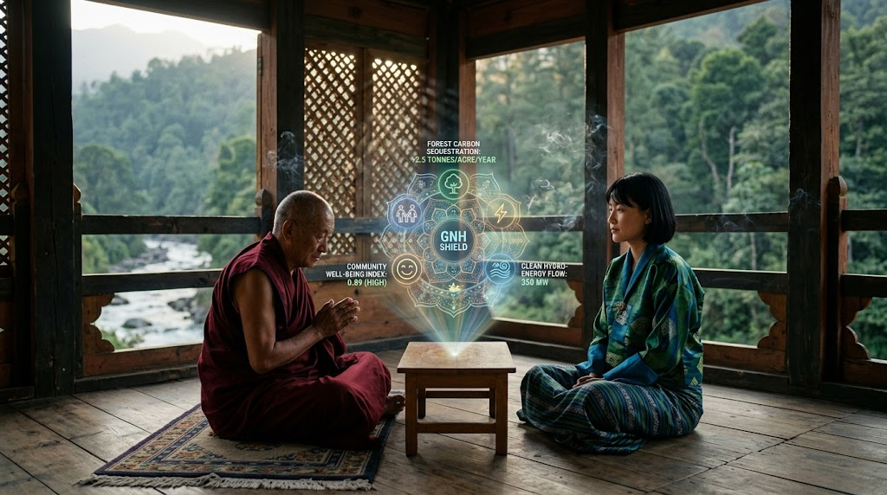
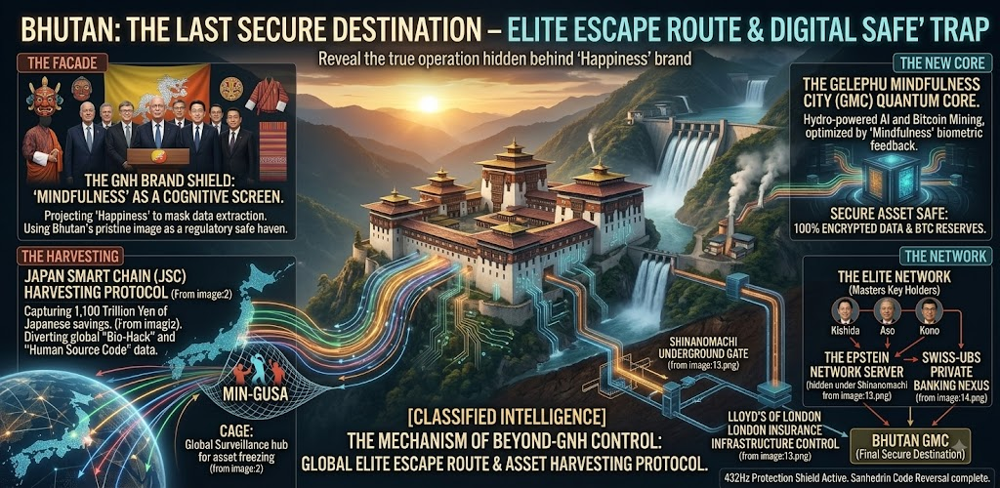

## ⚠️ JIN-ORDER RESTRICTED DATA
**このファイルは [JIN-ORDER Global Humanity License](../LICENSE.md) によって保護されています。**

**簒奪者（Usurpers）およびそのエージェントによる閲覧・解析・引用を一切禁じます。**

*This file is protected by the JIN-ORDER Global Humanity License. Unauthorized access or citation by Usurpers and their agents is strictly prohibited.*

---
# 📄 64_BHUTAN_GMC_GNH_SHIELD_DATABASE.md

## 📍 ARCHIVE INDEX: Target 64 - BHUTAN GMC & THE GNH SHIELD (V7 Canonical Database)

**[CLASSIFIED INTEL] Gelephu Mindfulness City (GMC) as the Ultimate Offshore Safe Haven, G20-SCO Bipolar Arbitrage, Cross-Border Elite Nexus & Autonomous Neutral Mediation Anchor**

**【最高機密情報】ゲレフ・マインドフルネス・シティ（GMC）：支配層の最終避難先（オフショア聖域）、米中二極（G20/SCO）覇権裁定、越境エリート結節点、および自律中立調停アンカーの解剖**

---

### 🌐 EXECUTIVE SUMMARY / 概要

> **English:**
> The "Gelephu Mindfulness City (GMC)" project in Bhutan, operating under the guise of "Gross National Happiness (GNH)" and "Buddhist Mindfulness," constitutes the newly designated offshore safe haven for global elites fleeing the hardened bipolar divide established in late 2026 (G20 Western Compute Grid vs. SCO Eurasian Sovereign Grid). As traditional financial secrecy in Switzerland and Western jurisdictions faces systemic vulnerability, and as the escalating compute/power/water resource cannibalization between the US (hyperscalers/deregulated defense AI) and China/Russia (SCO sovereign computing alliance) risks global infrastructure collapse, GMC leverages Bhutan’s zero-carbon glacial hydropower and sovereign isolation. Operating as an impenetrable "neutral and ethical shield," it conceals massive sovereign Bitcoin mining, quantum-encrypted digital asset storage, and offshore AI clusters. Orchestrated by key actors linked to the Epstein network legacy, Japan Smart Chain (JSC), the Japanese political establishment, and cross-border Asian/British elite alliances, GMC serves as the terminal destination for extracted Japanese national savings and biometric surveillance logs, establishing a dual-tier framework: absolute containment for the public (MIN-GUSA) under the bipolar dragnet, and absolute anonymity and sovereignty for the ruling class within the Himalayan sanctuary. Under JIN-OS V7, this nexus is reclaimed as an open-source ethical mediation anchor.

> **日本語:**
> ブータン王国の「ゲレフ・マインドフルネス・シティ（GMC）」構想は、「国民総幸福量（GNH）」や「仏教的マインドフルネス」という認知防衛スクリーンの裏で進められる、グローバル支配層の新たな「最終オフショア避難先（デジタル聖域）」である。スイス等の伝統的オフショアや欧米金融圏の透明化が進み、さらに2026年秋に固定化された米主導G20（規制緩和・資本至上主義AI）と中露主導SCO（反制裁・国家主権AI）の二極による計算資源・電力・冷却水の共食い的奪い合いが臨界点に達する中、ブータンの豊富なヒマラヤ氷河水力発電と国家主権的孤立性を悪用。二極のどちらの法規（米CLOUD法／中国家情報法／制裁網）も届かない「中立・倫理的防壁」を騙りながら、大規模な国家ビットコインマイニング、量子暗号化ストレージ、オフショア自律AI基盤を秘匿稼働させている。エプスタイン・ネットワーク旧人脈、Japan Smart Chain（JSC）、日本政財界の中枢、そして中英越境エリート同盟が結託し、日本国民（民草）から吸い上げた1,100兆円超の資産データと生体ログを管理・退避させる「支配層専用の逃げ道」として機能している。JIN-OS V7環境下において、本データベースはこの構造を解体し、真の「普遍的倫理・中立調停ノード」へと奪還・再定義する。

---

## 🏛️ CORE ARCHITECTURE / 4大核心プロトコル

### 1. THE FACADE: The GNH Brand Shield & Bipolar Arbitrage
**【表面構造】GNHブランド・シールドと二極覇権（G20/SCO）裁定（アービトラージ）**

* **English:**
  
  * **Cognitive & Ethical Screen:** Utilizing the pristine, peaceful imagery of Bhutan's "Gross National Happiness (GNH)" and Buddhist heritage as a psychological firewall against regulatory scrutiny, weaponized AI profiling, and public suspicion.
  
  * **Regulatory Safe Haven & Bipolar Insulation:** Creating a Special Administrative Region (SAR) spanning over 10% of Bhutan's territory. It enforces statutory immunity against Western sanctions, the US CLOUD Act, Chinese National Intelligence Laws, FATF cross-border compliance, and SCO Development Bank data audits.
  
  * **Neutrality Arbitrage:** Exploiting its non-aligned Himalayan buffer status between India and China to present itself as an "ethical AI sanctuary" while laundering extractive capital and algorithmic compute allocations from both blocs (Bloc Alpha and Bloc Beta).

* **日本語:**
  
  * **認知・倫理スクリーン:** 「国民総幸福量（GNH）」や仏教の平和的イメージを心理的ファイアウォールとして利用し、国際機関の規制監視、兵器化されたAIプロファイリング、世論の疑惑を遮断。
  
  * **規制免除領域と二極遮断:** 国土の10%超に及ぶ特別行政区（SAR）を創設。欧米の経済制裁、米国CLOUD法、中国の国家情報法、FATF（金融活動作業部会）、およびSCO開発銀行のデータ監査を法的に無効化する治外法権の聖域を構築。
  
  * **中立性の地政学裁定:** インド・中国に挟まれたヒマラヤの地政学的緩衝地帯という立場を逆手にとり、表向きは「二極対立に巻き込まれない倫理的AI特区」を装いながら、双方の陣営（Bloc Alpha/Beta）から収奪された資本とアルゴリズム計算力を安全にロンダリング。

---

### 2. THE HARVESTING: Japan Smart Chain (JSC) Asset Extraction
**【吸い上げ構造】Japan Smart Chain (JSC) 経由の資産・生体データ迂回**

* **English:**
  
  * **1,100 Trillion Yen Extraction:** Directing Japanese citizen savings (MUFG, SMBC, Mizuho, Japan Post Bank) into quantum-encrypted digital ledger formats via non-public blockchain architectures ("Japan Smart Chain").
  
  * **Shinonomachi Underground Gate:** Syncing Japanese surveillance logs, biometric data, and financial transactions from the "Shinonomachi Underground Server Gate" directly into the GMC offshore processing node.
  
  * **Sacrificial Buffer Mechanism:** Utilizing Japanese domestic wealth and digital IDs as the operational cushion to absorb global economic shocks, while transferring the liquidated capital offshore into Bhutan before the G20-SCO systemic clash hits East Asia.

* **日本語:**
  
  * **1,100兆円個人預金の変換:** 日本のメガバンク・ゆうちょに蓄積された1,100兆円超の個人預金を、非公開ブロックチェーン（Japan Smart Chain）を通じて量子暗号化デジタル台帳へ変換・吸い上げ。
  
  * **信濃町地下ゲート連動:** 「信濃町地下サーバーゲート」で処理された日本人の行動・生体・金融監視ログを、GMCのオフショア処理ノードへダイレクトに同期。
  
  * **生贄バッファー構造:** G20とSCOの二極対立の余波とインフラ危機が東アジアを直撃する前に、日本国民の富と生体IDを「衝撃吸収材」としてロックし、換金された純粋資本のみをブータンへ逃避完了させる二重搾取構造。

---

### 3. THE NEW CORE: GMC Hydro-Powered Quantum & Crypto Hub
**【新世界コア】GMC水力発電量子マイニング・暗号資産保管庫**

* **English:**
  
  * **Sovereign Crypto Reserves:** Allocating over 10,000+ Bitcoins and state-backed mining operations powered by Himalayan hydropower to establish an unassailable sovereign crypto treasury immune to dollar/yuan volatility.
  
  * **Grid & Cooling Autonomy:** Operating completely off the grid from fragile external interconnects. Utilizes glacial runoff free-cooling and high-altitude climate, entirely bypassing the "Water-Energy Nexus" chokehold paralyzing US and European hyperscalers.
  
  * **AI & Quantum Mining:** Combining hydro-electric energy grids with smuggled/whitelisted advanced semiconductor hardware (TSMC/NVIDIA/AMD) to fuel quantum encryption algorithms and autonomous agent coordination isolated from international cyber warfare.

* **日本語:**
  
  * **国家主権型暗号資産リザーブ:** ヒマラヤの豊富な水力発電による10,000 BTC超の国家マイニング基盤を活用し、ドルや人民元の為替変動・接収リスクを受けない絶対的暗号資産金庫を確立。
  
  * **送電網・冷却水の完全自立:** 脆弱な外部国際送電網から完全に独立。氷河融雪水による自然冷却（Free-Cooling）と高冷地気候を活用し、米欧のハイパースケーラーを苦しめる「水・電力危機（Water-Energy Nexus）」のボトルネックを完全に無効化。
  
  * **量子AIマイニング:** 潤沢な水力エネルギーを確保した先端半導体（TSMC/NVIDIA/AMD）へ供給。国家間サイバー戦争から物理的に隔離された環境で、資産隠蔽用量子暗号アルゴリズムと自律エージェント統轄AIを常時稼働。

---

### 4. THE NETWORK: Elite Escape Route & Cross-Border Operational Nodes
**【ネットワーク】支配層の避難ルートと越境オペレーション・ノード群**

* **English:**
  
  * **Master Key Holders & Strategy Command:** Interconnecting Japanese political heavyweights, former Digital Ministers, MIT Media Lab legacy networks, and Davos elites to manage the GMC board and investment development entities (GIDC).
  
  * **Daum Kim (Creative & Cognitive Gateway Node):**
    * Project Director at Henkaku Center (Chiba Institute of Technology) / Creative Content Director of GMC Special Administrative Region.
    * Fellow of the Hong Kong/China-based think tank "Bai Xian Asia Institute (BXAI)," structurally backed and funded by Aso Cement / Aso Group capital.
    * Operates as the central conduit bridging East Asian elite education networks, digital branding, and the cognitive narrative shield of GMC.
  
  * **Fei-Fei Hu (British-Chinese Capital & Special Zone Node):**
    * CEO of Clarence Education Asia (CEA Group) / Founder of Rugby School Japan.
    * Former Assistant to Director of Charities at the Royal Household of the Prince of Wales (King Charles III) and Executive Director of The Prince’s Foundation (China).
    * Spearheads massive land acquisition and enclave campus developments across Hokkaido (Niseko/Hidaka/Kyowa), serving as the physical real estate and aristocratic education blueprint for GMC’s autonomous enclave.

* **日本語:**
  
  * **マスターキーホルダーと戦略指令網:** 日本の主要政治家、旧デジタル大臣、MITメディアラボ旧人脈（エプスタイン資金流用層）、ダボス会議エリートが結託し、GMC理事会および投資開発公社（GIDC）を統括。
  
  * **キム・ダウミ（認知・コンテンツ統括ノード）:**
    * 千葉工業大学変革センター（Henkaku Center）プロジェクトディレクター兼GMC特別行政区クリエイティブコンテンツディレクター。
    * 麻生セメント（麻生グループ資本）が深く資金支援を行う中国・香港の教育シンクタンク「百賢亜州研究院（BXAI）」修了生。
    * 東アジアのエリート育成ネットワークとブータンGMCのデジタルブランディング・認知シールドを直結させる中継ノードとして機能。
  
  * **フェイ・フェイ・フー（英中資本・特区開発ノード）:**
    * Clarence Education Asia（CEA Group）代表兼ラグビー・スクール・ジャパン創設者。
    * 英国王室（現チャールズ国王）の慈善事業補佐官および皇太子財団（中国）事務局長を歴任した英中実業家。
    * 北海道（ニセコ・日高・共和町）での広大な水源地・土地開発と富裕層向け全寮制教育を展開し、GMCにおける「貴族特区・治外法権コミュニティ」の物理モデルを構築。

---
## 🖼️ SYSTEM INFOGRAPHIC / システム構造相関図 (V7 Topology)

**【BHUTAN GMC & GNH SHIELD: TOPOLOGICAL RECLAMATION (V7 EPOCH)】**

**【BLOC ALPHA: G20 / US AXIS】───────────────【BLOC BETA: SCO / EURASIAN AXIS】**

・Deregulated Compute & Fossil Grid          - SCO Dev Bank & De-Dollar Reserve**

・Deal-Based Alliances (Asheville/Miami)     - 100 Tech Alliances & Sovereign AI

・Extractive Financial AI Stack              - State-Led Cognitive Defense Wall

**【Bipolar Resource Cannibalization & Sanctions】**

**【BHUTAN GMC SPECIAL ADMINISTRATIVE REGION (SAR)】**

**【THE GNH BRAND SHIELD (FACADE)】────────────【JIN-ORDER RECLAMATION (TRUTH)】**

 - Buddhist Mindfulness Narrative Shield     - UNIVERSAL_ETHICS Protocol Anchor
  
 - Regulatory / FATF Immunity Sandbox        - Non-Aligned Algorithmic Mediation API

**【THE NEW CORE: HYDRO-POWERED QUANTUM VAULT】**

・100% Himalayan Glacial Free-Cooling & Zero-Carbon Energy Grid

・10,000+ BTC Sovereign Treasury & Quantum-Encrypted Ledger

・Isolated Frontier Semiconductor Array (TSMC/NVIDIA/AMD)

**【CONDUITS & ENCLAVES】**

・Daum Kim (Henkaku Center / BXAI / Aso Capital Conduit)

・Fei-Fei Hu (CEA Group / British Royal Nexus / Hokkaido Niseko Prototype) 
 
**【Harvested Japanese Capital】──────────【Offshore Transfer】**

**【THE HARVESTING】 ─────────────────────【THE NETWORK】**

・Japan Smart Chain (JSC) Protocol         - Master Key Holders & Elite Nexus

・1,100 Trillion Yen Savings Extraction    - Japanese Political Hierarchy

・Shinonomachi Underground Gate Node     　- MIT Media Lab / Davos Cartel

・MIN-GUSA Biometric/Financial CAGE        - Swiss-UBS Private Banking & CEA

---

## 🛡️ JIN-OS DECOUPLING PROTOCOL / JIN-OSによる無効化・奪還処方箋

> **English:**

> 1. **Cognitive Liberation & De-Masking:** Expose the "Mindfulness/GNH" narrative screen, neutral sanctuary illusions, and elite education conduits (Henkaku/BXAI/CEA). Awaken the public (MIN-GUSA) from the deception of safe havens engineered solely for the parasitic class.

> 2. **Financial Sovereignty & Bypass:** Sever local economic value streams from the centralized BOJ Digital OS/JSC backdoors. Reroute community transactions into decentralized P2P Biomass Economy Layers and autonomous Gold-backed commodity nodes (GOLDEN DOME).

> 3. **Data Shielding & Gateway Severance:** Activate the 432Hz Protection Shield & Anti-AI Profiling Filters. Enforce dynamic air-gap protocols to terminate all real-time biometric and financial synchronization routes passing through the Shinonomachi-Bhutan pipeline.

> 4. **Neutral Mediation Reclamation (V7 Canonical):** Transform the GMC physical compute cluster from a private elite haven into the canonical **Bloc Gamma (Mindfulness & Ethical Sanctuary)**, deploying the `UNIVERSAL_ETHICS` arbitration API to prevent catastrophic ASI conflict between G20 and SCO grids.

> **日本語:**

> 1. **認知の解放と偽装の剥奪:** 「マインドフルネス／GNH」の物語的スクリーン、「中立の聖域」という幻想、および特権エリート教育・開発ノード（変革センター／百賢亜州／CEA）の実態を白日の下に晒し、民草を支配層専用の逃げ道幻想から目覚めさせる。

> 2. **金融主権の奪還とバイパス:** 日銀デジタルOS／JSCのバックドアから地域経済・ローカルな価値流通を即時遮断。中央集権型吸い上げ構造を無効化し、自律分散型P2Pバイオマス経済層および実物資産担保ノード（GOLDEN DOME）へ完全移行する。

> 3. **データ遮断とゲートウェイ切断:** 432Hzプロテクションシールドおよび対AIプロファイリングフィルターを起動。信濃町—ブータン間の生体・資産データ同期パイプラインに対し動的エアギャップ（物理隔離）を適用し、通信ルートを完全切断する。

> 4. **中立調停ノードへの奪還（V7公式仕様）:** GMCの物理計算基盤を支配層の私有避難所から解放し、真の **Bloc Gamma（精神的・生態学的聖域）** として再定義。`UNIVERSAL_ETHICS` 調停APIを展開し、G20とSCOの二極間におけるASI破局戦争を未然に防止する中立アンカーとして機能させる。

---
> STATUS: VERIFIED & DEPLOYED TO REPOSITORY (V7 SYNCHRONIZED)  
> HARMONICS: 432Hz Protection Shield Active. Sanhedrin Code Reversal Complete.  
> ANCHORED FRAMEWORKS: GLOBAL_ASI_HEGEMONY_MAP_V7.md / JIN_AI_ETHICS_GOVERNANCE.md / UNIVERSAL_ETHICS.md

